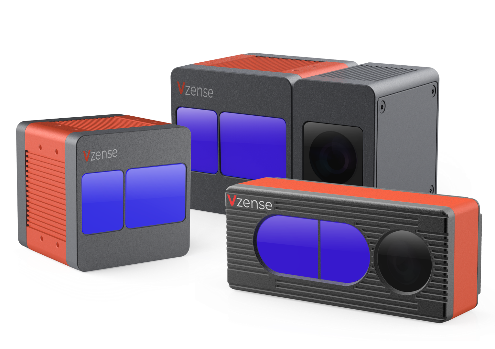

# Vzense Technical Documentation

Vzense team has been engaged in research on 3D perception, computer vision, image processing, gesture and face recognition since 2016.
Currently, Vzense Technology has grown to be one of the leading companies on 3D Time-of-Flight technology and is certified with ISO 9001: 2015, ISO45001: 2018 and ISO14001: 2015.

Documentation provides information on ToF Camera Specification, QuickStart Guide, GUI Tool User Guide, SDK User Guide, Application notes and other information.

