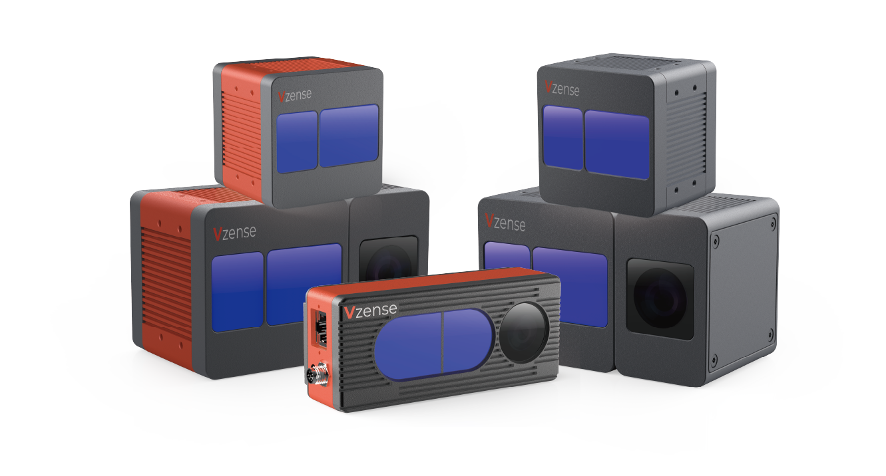

# 关于我们

维感科技自 2016 年开始从事三维图像，计算机视觉，图像处理，传感器融合，手势和面部识别等研究，并将 ToF(Time-of-Flight)感知技术的应用与解决方案定制化确定为公司的长期发展方向。经过 6 年 ToF 技术经验积累，维感科技不仅提供高性价比的标准产品，还提供包括硬件、软件、算法、光学在内的全面定制化服务。

## 联系我们<!-- {docsify-ignore} -->

- 维感科技（青岛）崂山区松岭路 393 号 3 号楼 3303
- 公司邮箱： <info@vzense.com>
- 联系电话: +86 189-5426-5263
- 官网: [zh.vzense.com](zh.vzense.com)
- 添加客服微信
  
