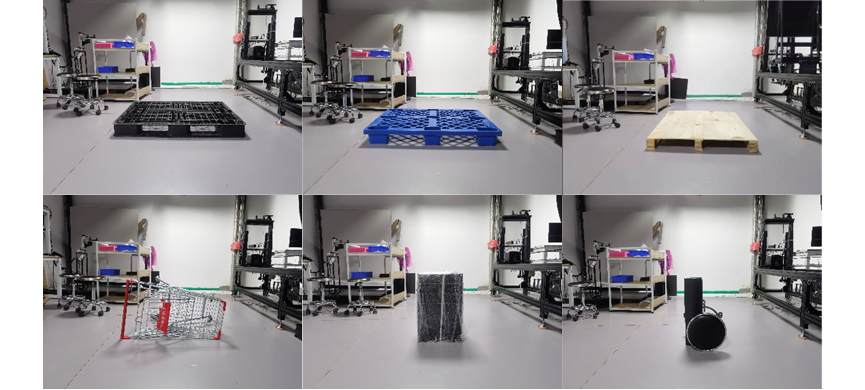

# 2.2. AGV scene Testing Data

## 2.2.1. Introduction

3D ToF technology is used in various AGV/AMR and low-speed unmanned driving fields. Multi-sensor fusion can not only provide a comprehensive obstacle avoidance solution for unmanned driving, improve the safety factor of the system, but also better perceive the environment, identify target objects, and automatically plan driving routes. The 3D ToF camera has the characteristics of high cost performance, good real-time performance, low requirements on system computing power, and is suitable for scene capture in motion.

Applied to the automatic identification of unmanned forklift pallets, the 3D ToF camera can collect pallet images and combine corresponding image processing algorithms to identify forklift cargo pallets, obtain its position and attitude coordinates, and intelligently adjust the direction of fork entry, so as to realize unmanned Intelligent pallet handling, to solve the problem of large offset angle of unmanned forklift docking pallet position.

Applied to AGV obstacle avoidance, 3D ToF camera is based on the principle of its area array detection, providing a short-distance (<6m) large-angle obstacle avoidance solution for mobile robots and low-speed unmanned vehicles.

## 2.2.2. Test Condition

**Target**: Black pallet, blue pallet, wooden pallet, shopping cart, box covered with film, black cylinder (refer to figure 1)

**Camera positioning**: The camera is fixed with a 215mm high bracket and placed on the ground (refer to figure 2)

**Camera setting**: Shoot black objects set exposure time to 4ms, low confidence threshold (refer to figure 3), camera warmed up for 20 minutes.

Shoot other objects use default setting (refer to Figure 4), camera warmed up for 20 minutes.

**Imaging environment**: 22℃ room temperature, 200Lux room light on during testing.

**Setting for shooting black objects**: The default exposure time of DS series cameras is 1ms, and the exposure time can be increased by lowering the Frame rate in ScepterGUITool. Set the Frame rate to 5 frames, and adjust the Exposure Time to 4ms.

**Low Confidence Threshold**: The reflectivity of black objects is low, which will cause the signal-to-noise ratio to be too low to measure the object distance. To improve this situation, the ConfidenceFilter is usually reduced to 2 or 5 when shooting black objects.

**Target**:

**Camera Positioning**:

**Setting for Shooting Black Objects**:

**Default Setting**:

## 2.2.3. Testing Data

**Saved images and data**：Depth, IR, PointCloud, RGB

**Ambient Light**: room light from ceiling, ~200Lux

**Camera position**: 215mm from the ground

**Distance**: 1m, 2m, 3m

### 2.2.3.1. Black pallet

View point cloud online:

DS_1m away Black pallet：<https://skfb.ly/oCEZM>​

DS_2m away Black pallet：<https://skfb.ly/oCEZQ>​

DS_3m away Black pallet：<https://skfb.ly/oCEZR>​

### 2.2.3.2. Blue pallet

View point cloud online:

DS_1m away Blue pallet：<https://skfb.ly/oCFny>​

DS_2m away Blue pallet：<https://skfb.ly/oCFnA>​

DS_3m away Blue pallet：<https://skfb.ly/oCFnE>​

### 2.2.3.3. Wooden pallet

View point cloud online:

DS_1m away Wooden pallet：<https://skfb.ly/oCMTu>​

DS_2m away Wooden pallet：<https://skfb.ly/oCMTC>​

DS_3m away Wooden pallet：<https://skfb.ly/oCMTL>​

### 2.2.3.4. Shopping cart

View point cloud online:

DS_1m away Shopping cart：<https://skfb.ly/oCFnQ>​

DS_2m away Shopping cart：<https://skfb.ly/oCFor>​

DS_3m away Shopping cart：<https://skfb.ly/oCFon>​

### 2.2.3.5. Box covered with film

View point cloud online:

DS_1m away Box covered with film：<https://skfb.ly/oCFoW>​

DS_2m away Box covered with film：<https://skfb.ly/oCFsP>​

DS_3m away Box covered with film：<https://skfb.ly/oCFt6>​

### 2.2.3.6. Black cylinder

View point cloud online:

DS_1m away Black cylinder：<https://skfb.ly/oCFtt>​

DS_2m away Black cylinder：<https://skfb.ly/oCFtx>​

DS_3m away Black cylinder：<https://skfb.ly/oCFtA>

