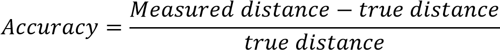
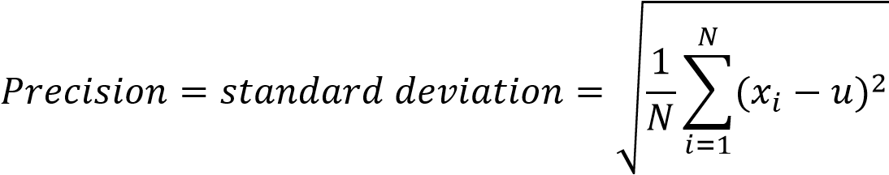

# 2.1. Depth Quality Test

## 2.1.1. Introduction

There are a variety of metrics that can be defined to evaluate depth quality. A common environment that is compatible with all tests is recommended to be used, such as a smooth and flat surface with a matt finish uniform, aligned parallel to the depth camera that is placed at a controllable and known distance from the camera under test. White or light color board mounted to a rigid frame or structure is a suitable target.

Depth data accuracy and precision (also called temporal noise or repeatability) are the primary characteristics for judging the depth camera image quality.

### 2.1.1.1. Accuracy

Accuracy is the mean difference between the measured distance and the true distance (ground truth). It is a description of systematic absolute errors.

### 2.1.1.2. Precision

Precision is mostly defined as a standard deviation of accuracy. It is also called temporal noise or repeatability. Precision measures the variation in depth values over a specific number of frames.

The following diagrams illustrate the relation between the two aspects:

## 2.1.2. Test Condition

• Target: 80cm\*80cm 40% reflectivity planar grey board mounted on bar attached to motion stage (refer to figure 1)
• Camera positioning: mounted on a steel fixture (refer to figure 2), laser distance meter used to measure distance from case front to the grey board
• Camera setting: default setting (refer to figure 3), camera warmed up for 20 minutes.
• Imaging environment: 22℃ room temperature, 200Lux room light on during testing, black curtain used on one side to minimize reflections around (refer to figure 1)
• Motion stage moves from 0.4meters to 4.5meters, and stopped in 0.4m, 1m,1.5m, 2m, 2.5m, 3m, 3.5m, 4m, 4.5m. During each step measure depth over 10×10 pixel ROI (region of interest) at image center, repeat 32 times at each position.
• Depth metrics are measured and recorded in real time by using the self-developed tool. For the evaluation of absolute depth values we use the mean depth of the image set in each pixel. The standard deviation is computed based on the deviation in an image set.

**80CM\*80CM 40% REFLECTIVITY TARGET & IMAGING ENVIRONMENT**:

**CAMERA MOUNTED ON THE FIXTURE**:

**DEFAULT CAMERA SETTING**:

## 2.1.3. Accuracy Testing

To achieve a result as accurate as possible, the cameras are calibrated at the factory and tested to guarantee a reliable accuracy. DS series cameras are calibrated for a measurement range of 0.4~4.5meters. Technically speaking, the camera is capable of measuring distances as minimal as 0.15meters so if users have quite near measurement requirement, we also offer products at a customized range.

### Test Result

Below Table 2 shows the data of two units’ mean measurement error and accuracy based on the test conditions listed above. Measurement Error keeps in millimeter or even submillimeter precise and accuracy is lower than 1%.

**ACCURACY TEST DATA**:

**MEASUREMENT ERROR IN DIFFERENT DISTANCE**:

**ACCURACY IN DIFFERENT DISTANCE**:

## 2.1.4. Precision Testing

Precision measures the variation in depth values over a specific number of frames, so it is also called temporal noise or repeatability. The purpose of precision measurement is to understand the depth camera’s time-dependent aspects of per pixel Z-accuracy. It is measured per pixel and then an average or median is taken over the ROI.

### Test Result

### 2.1.4.1. Relations between precision and distance

Following the test conditions described in Part 2, with the assistant of a self-developed software tool, average accuracy is measured over 10×10 pixels ROI at image center, repeat 32 times at each position then precision data as a standard deviation in depth values is calculated.

**PRECISION DATA IN DIFFERENT DISTANCE (EXPOSURE TIME @1MS DEFAULTED)**:

**PRECISION TREND IN DIFFERENT DISTANCE (EXPOSURE TIME @1MS DEFAULTED)**:

### 2.1.4.2. Relations between precision and exposure time

To help users understand the factors to influence precision, in each distance, we tested the precision with different exposure time setting at 1ms, 2ms, 3ms and 4ms. Below data shows that the longer exposure time the camera is set, the higher precision the camera can get, as long as images are not over exposure.

**PRECISION INFLUENCE WITH DIFFERENT EXPOSURE TIME**:

