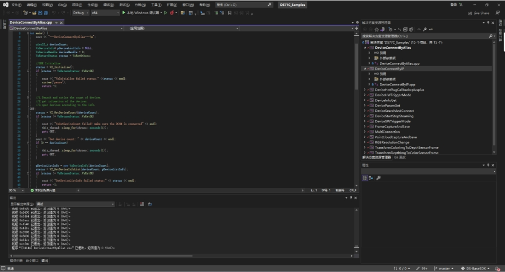

# Windows

## SDK Sample 使用流程

Nebula SDK 开发包提供的 Sample 用于演示 SDK 的 API 接口使用，位于 SDK 目录的 Samples 文件夹下。包含如下内容：

- Base：SDK 基础 API 调用 Sample 集合

- OpenCV：配合第三方库 OpenCV 的 Sample

## 项目配置

Windows 下使用 Visual Studio 2017 开发。新建应用项目工程，设置工程属性，将 Include 目录添加到包含目录中，将 Lib 目录添加到库目录中。另外，需要将 Nebula_api.lib 添加到附加依赖项中。可参考 Samples 中的项目配置。

## 基础例程

基础例程介绍 SDK 的单个特性 API 接口的使用。为了使用户可以快速的熟悉使用，例程根据产品进行分类，如 DS77、DS77C 等。例程包含打开图像数据流、图像获取、软/硬触发、点云转换与保存等 API 接口的使用。

1. 从 Gitee/GitHub 下载 Nebula SDK

   ```consle
    git clone https://gitee.com/Vzense/NebulaSDK
   ```

   

2. 根据实际产品选择对应的 sample，以 DS77C 产品编译 DeviceConnectByAlias 为例

   

3. 编译完成，调试运行。结果如下图：

   

## OpenCV 例程

1. 到 OpenCV 官网，下载并安装 [OpenCV 3.0.0](https://opencv.org/release/opencv-3-0-0/)。

   

2. 设置环境变量 OPENCV_DIR， 其值为安装的 OpenCV 的 build 目录的绝对路径。
   例如 D:\Programs\OpenCV300\opencv\build。

   

3. 根据实际产品选择对应的 sample。下面以 DS77C 为例，使用 Visual Studio 2017 打开 NebulaSDK\Windows\Samples\OpenCV\DS77C 目录下的 FrameViewer.vcxproj，直接编译。

   

4. 编译生成的可执行文件 FrameViewer.exe 在 NebulaSDK\Windows\Bin\x86\或 NebulaSDK\Windows\Bin\x64\目录下。

5. 运行 FrameViewer.exe，执行效果如下图。

   

## 说明

- 当使用多个网卡时，需要设置不同的 IP 网段。
