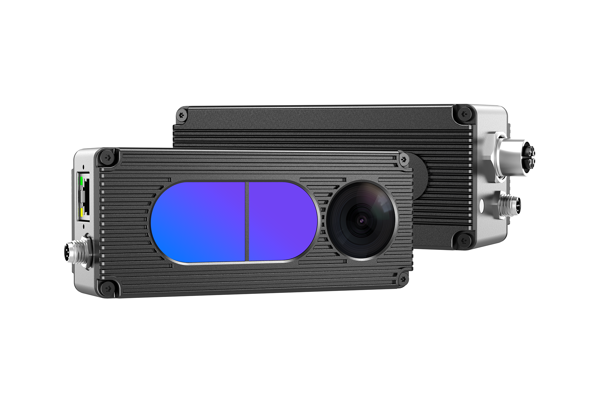
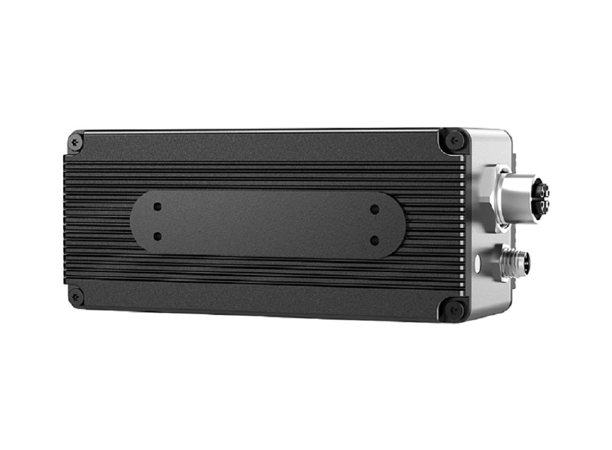
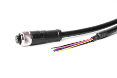

# 1. NYX650/660

Nuvoton ToF + RGB Camera Industrial High Frame Rate Wide Dynamic Range   

## 1.1. Specification

| Model               | NYX650                                                    | NYX660                                                    |
| :------------------ | :-------------------------------------------------------- | :-------------------------------------------------------- |
| Interface with Host |  |  |
| Model               | NYX650                                                    | NYX660                                                    |
| Sensor              | Nuvoton DepthSense ToF CMOS                               |                                                           |
| Vcsel               | 940nm VCSEL \* 2                                          |                                                           |
| Depth Sensor        | 640\*480, Max.30fps, 70°(H)\*50°(V)                       |                                                           |
| RGB Sensor          | 1600\*1200, Max.30fps, 70°(H)\*50°(V)                     |                                                           |
| Output Formats      | 16bit (Depth) + 8bit (IR) + JPEG (RGB)                    |                                                           |
| Interface           | Gigabit Ethernet                                          |                                                           |
| Physical Interface  | **RJ45**                                                  | **Aviation plug interface x 2**                           |
| Power Supply        | **12V\~24V (DC)**                                         | **PoE+ or 12V\~24V (DC)**                                 |
| Accuracy            | <2%\*                                                     |                                                           |
| Use Range           | 0.3m to 4.5m\*                                            |                                                           |
| Working Temperature | -20°C to +50°C                                            |                                                           |
| Operation System    | Windows/Linux/Arm Linux/ROS                               |                                                           |
| Development language| C/C++/C#/Python                                           |                                                           |
| Enclosure Rating    | **IP42**                                                  | **IP67**                                                  |
| Certification       | CE, FCC, FDA                                              |                                                           |

> Accuracy error and Use Range vary with the reflectivity of the measured object.

## 1.2. ToF FOV

### 70°(H)\*50°(V)

𝑊𝑖𝑑𝑡ℎ=𝑡𝑎𝑛⁡(𝐻𝐹𝑂𝑉/2)∗ 𝐷𝑖𝑠𝑡𝑎𝑛𝑐𝑒 ∗2

𝐻𝑒𝑖𝑔ℎ𝑡=𝑡𝑎𝑛⁡(𝑉𝐹𝑂𝑉/2)∗ 𝐷𝑖𝑠𝑡𝑎𝑛𝑐𝑒 ∗2

Calculated detectable area from 1, 2, 3, 4meters away:

| Distance(m) | Width(m) | Height(m) |
| :---------: | :------: | :-------: |
|      1      |   1.53   |   1.06    |
|      2      |   3.07   |   2.13    |
|      3      |   4.60   |   3.19    |
|      4      |   6.13   |   4.25    |

## 1.3. Dimension

### 1.3.1. NYX650 Dimension

### 1.3.2. NYX660 Dimension

## 1.4. Accessories included

### 1.4.1. NYX650 Accessories

| Model        | Picture                                                               | Description                              |
| :----------- | :-------------------------------------------------------------------- | :--------------------------------------- |
| 314000309438 |  | CAT6Ethernet Cable - 3m                  |
| 314000309436 |  | M8 A CODE Multiple Functional Cable - 2m |

### 1.4.2. NYX660 Accessories

| Model        | Picture                                                               | Description                              |
| :----------- | :-------------------------------------------------------------------- | :--------------------------------------- |
| 314000309437 |  | M12 X CODE CAT6 Ethernet Cable - 3m      |
| 314000309436 |  | M8 A CODE Multiple Functional Cable - 2m |
