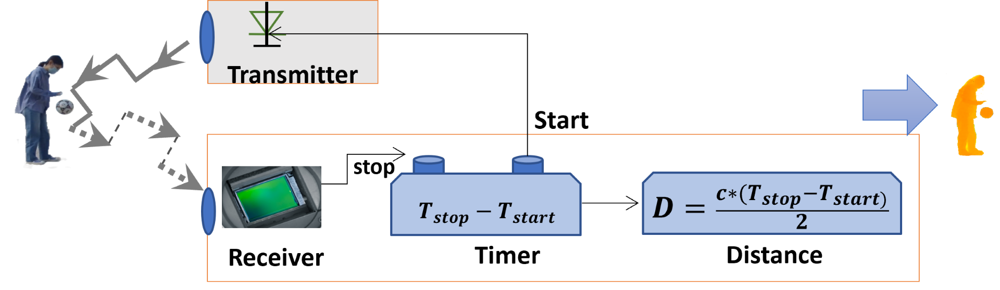
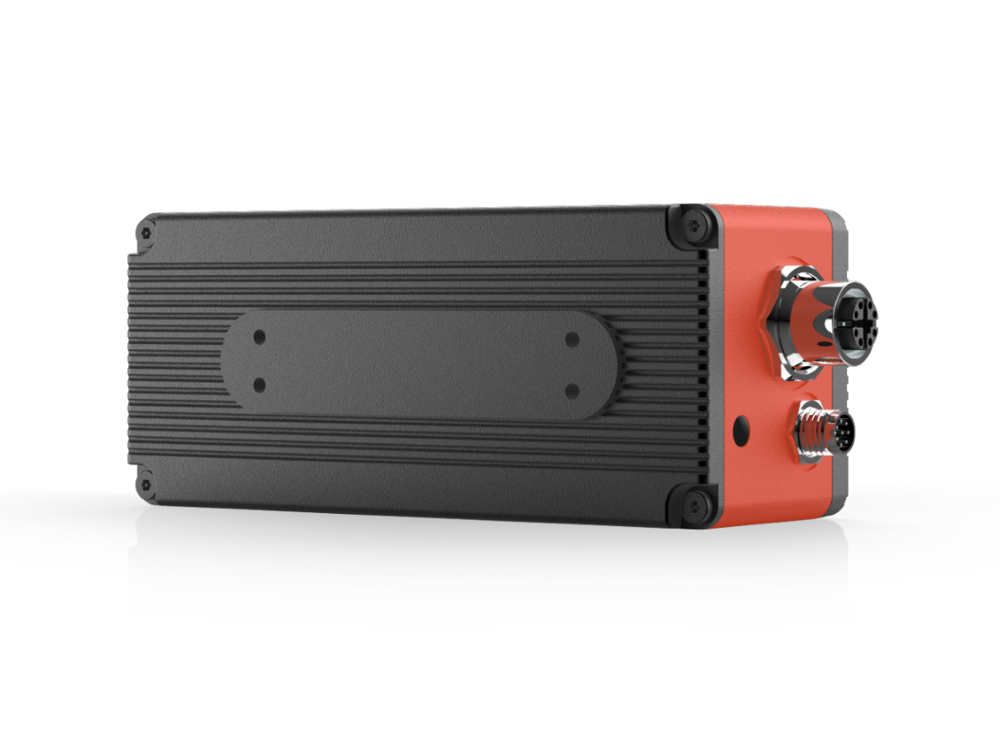
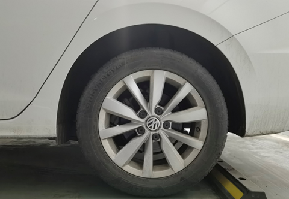
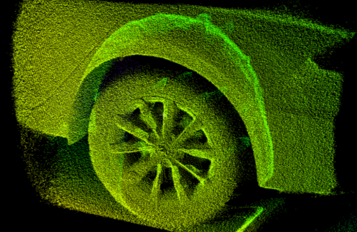
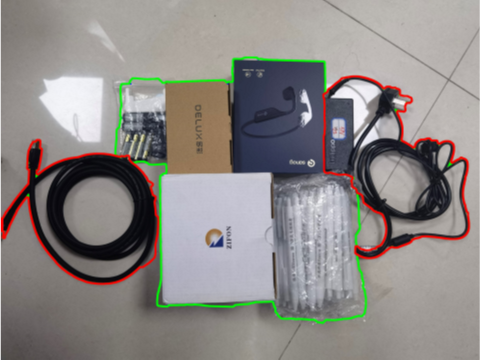
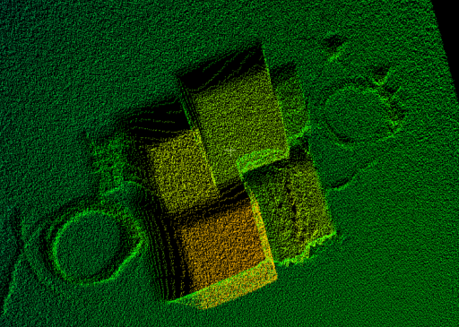

# 产品简介

## 成像原理

> TOF（Time of Flight）技术是通过向被测物体发射红外光源，光波被物体反射回来后，被传感器（sensor）收集，系统通过计算接收光波的脉冲差或时间差 △t，从而计算被测物体与相机间的距离。

## 产品参数

### DS86 & DS87

> 工业级高精度高稳定性索尼 ToF + RGB 相机

- 出厂价格:
  - DS86 4199 元
  - DS87 4999 元

| 型号                    | DS87                                   | DS86                  |
| :---------------------- | :------------------------------------- | :-------------------- |
| 接口示意图              |                   |  |
| 编号                    | DS87                                   | DS86                  |
| 传感器                  | Sony DepthSense ToF CMOS               |                       |
| 激光发射器              | 940nm VCSEL \* 2                       |                       |
| ToF 分辨率/帧率         | 640\*480, Max.15fps                    |                       |
| ToF HDR 模式            | 支持最高 10fps                         |                       |
| 视场角 FOV              | 60°(H)\*45°(V)                         |                       |
| RGB 传感器规格          | 1600\*1200, 全局曝光, 70°(H)\*50°(V)   |                       |
| 数据输出格式            | 16bit (Depth) + 8bit (IR) + JPEG (RGB) |                       |
| 通信协议                | 以太网(1000M) + RS485                  |                       |
| 物理接口                | **航空插头 x 2**                       | **RJ45**              |
| 供电及功耗              | **PoE+ or 12V\~24V (DC)**              | **12V\~24V (DC)**     |
| 精度误差                | <1%\*                                  |                       |
| 检测距离                | 0.15m to 5m\*                          |                       |
| 工作温度                | -20°C to +50°C                         |                       |
| 操作系统与平台          | Windows/Linux/Arm Linux/ROS1/ROS2      |                       |
| 开发语言与 Wrapper 支持 | C/C++/Python                           |                       |
| IP 防护等级             | **IP67**                               | **IP42**              |
| 认证和测试              | CE, FCC, FDA                           |                       |

### DS77 系列

> 工业级高精度高稳定性索尼 ToF 相机

- 出厂价格:
  - DS77 Lite 4199 元
  - DS77 Pro 4999 元

| 型号                    | DS77 PRO                          | DS77 LITE                         |
| :---------------------- | :-------------------------------- | :-------------------------------- |
| 接口示意图              |    |  |
| 编号                    | 608000200022                      | 608000200023                      |
| 传感器                  | Sony DepthSense ToF CMOS          |                                   |
| 激光发射器              | 940nm VCSEL \* 2                  |                                   |
| ToF 分辨率/帧率         | 640\*480, Max.25fps               |                                   |
| ToF HDR 模式            | 支持最高 15fps                    |                                   |
| 视场角 FOV              | 70°(H)\*50°(V)                    |                                   |
| 数据输出格式            | 16bit (Depth) + 8bit (IR)         |                                   |
| 通信协议                | 以太网(1000M)\&RS485              |                                   |
| 物理接口                | **M12 航空插头 x 2**              | **RJ45**                          |
| 供电及功耗              | **PoE+ or 12V\~24V (DC)**         | **12V\~24V (DC)**                 |
| 精度误差                | <1%\*                             |                                   |
| 检测距离                | 0.15m to 5m\*                     |                                   |
| 工作温度                | -20°C to +50°C                    |                                   |
| 操作系统与平台          | Windows/Linux/Arm Linux/ROS1/ROS2 |                                   |
| 开发语言与 Wrapper 支持 | C/C++/Python                      |                                   |
| IP 防护等级             | **IP67**                          | **IP42**                          |
| 认证和测试              | CE, FCC, FDA                      |                                   |

### DS77C 系列

> 工业级高精度高稳定性索尼 ToF + RGB 相机

- 出厂价格:
  - DS77C Lite 5299 元
  - DS77C Pro 6099 元

| 型号                    | DS77C PRO                              | DS77C LITE                           |
| :---------------------- | :------------------------------------- | :----------------------------------- |
| 接口示意图              |       |  |
| 编号                    | 608000200024                           | 608000200025                         |
| 传感器                  | Sony DepthSense ToF CMOS               |                                      |
| 激光发射器              | 940nm VCSEL \* 2                       |                                      |
| ToF 分辨率/帧率         | 640\*480, Max.25fps                    |                                      |
| ToF HDR 模式            | 支持最高 15fps                         |                                      |
| 视场角 FOV              | 70°(H)\*50°(V)                         |                                      |
| RGB 传感器规格          | 1600\*1200, 全局曝光, 77°(H)\*55°(V)   |                                      |
| 数据输出格式            | 16bit (Depth) + 8bit (IR) + JPEG (RGB) |                                      |
| 通信协议                | 以太网(1000M)\&RS485                   |                                      |
| 物理接口                | **M12 航空插头 x 2**                   | **RJ45**                             |
| 供电及功耗              | **PoE+ or 12V\~24V (DC)**              | **12V\~24V (DC)**                    |
| 精度误差                | <1%\*                                  |                                      |
| 检测距离                | 0.15m to 5m\*                          |                                      |
| 工作温度                | -20°C to +50°C                         |                                      |
| 操作系统与平台          | Windows/Linux/Arm Linux/ROS1/ROS2      |                                      |
| 开发语言与 Wrapper 支持 | C/C++/Python                           |                                      |
| IP 防护等级             | **IP67**                               | **IP42**                             |
| 认证和测试              | CE, FCC, FDA                           |                                      |

## 性能特点

- 基于 SONY 连续波 ToF 芯片，精度更高，数据更稳定
- 支持 HDR 模式以获取高对比度、复杂场景中的数据
- 不受环境光照的影响，可在强光和黑暗中无障碍识别
- 2MP RGB 彩色图像，全局快门曝光(DS86&DS87, DS77C 系列)
- RGB 图像与深度图像微秒级同步 (DS86&DS87, DS77C 系列)
- 支持 IP67 防水防尘，满足复杂环境要求

|                      |                      |
| :------------------- | :------------------- |
|  |  |

[点击下载 HDR ON/OFF 点云数据](https://www.123pan.com/s/xih9-fdnod)

|                      |                      |
| :------------------- | :------------------- |
|  |  |

[点击下载 HDR ON/OFF 点云数据](https://www.123pan.com/s/xih9-4dnod)
