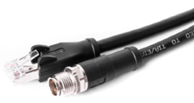

# 2. VENO86/87

SONY ToF + RGB Camera Industrial Grade

## 2.1. Specification

| Model               | VENO86                                                    | VENO87                                                    |
| :------------------ | :-------------------------------------------------------- | :-------------------------------------------------------- |
| Interface with Host |  |  |
| Model               | VENO86                                                    | VENO87                                                    |
| Sensor              | Sony DepthSense ToF CMOS                                  |                                                           |
| Vcsel               | 940nm VCSEL \* 2                                          |                                                           |
| Depth Sensor        | 640\*480, Max.15fps, 67°(H)\*50°(V)                       |                                                           |
| ToF HDR Mode        | Max.10fps                                                 |                                                           |
| RGB Sensor          | 1600\*1200, 70°(H)\*50°(V)                                |                                                           |
| Output Formats      | 16bit (Depth) + 8bit (IR) + JPEG (RGB)                    |                                                           |
| Interface           | Gigabit Ethernet                                          |                                                           |
| Physical Interface  | **RJ45**                                                  | **Aviation plug interface x 2**                           |
| Power Supply        | **12V\~24V (DC)**                                         | **PoE+ or 12V\~24V (DC)**                                 |
| Accuracy            | <1%\*                                                     |                                                           |
| Use Range           | 0.15m to 5m\*                                             |                                                           |
| Working Temperature | -20°C to +50°C                                            |                                                           |
| Operation System    | Windows/Linux/Arm Linux/ROS1/ROS2                         |                                                           |
| Software            | C/C++/C#/Python                                           |                                                           |
| Enclosure Rating    | **IP42**                                                  | **IP67**                                                  |
| Certification       | CE, FCC, FDA                                              |                                                           |

> Accuracy error and Use Range vary with the reflectivity of the measured object.

## 2.2. ToF FOV

### 67°(H)\*50°(V)

𝑊𝑖𝑑𝑡ℎ=𝑡𝑎𝑛⁡(𝐻𝐹𝑂𝑉/2)∗ 𝐷𝑖𝑠𝑡𝑎𝑛𝑐𝑒 ∗2

𝐻𝑒𝑖𝑔ℎ𝑡=𝑡𝑎𝑛⁡(𝑉𝐹𝑂𝑉/2)∗ 𝐷𝑖𝑠𝑡𝑎𝑛𝑐𝑒 ∗2

Calculated detectable area from 1, 2, 3, 4meters away:

| Distance(m) | Width(m) | Height(m) |
| :---------: | :------: | :-------: |
|      1      |   1.32   |   0.93    |
|      2      |   2.65   |   1.86    |
|      3      |   3.97   |   2.80    |
|      4      |   5.29   |   3.73    |

## 2.3. Dimension

### 2.3.1. VENO86 Dimension

### 2.3.2. VENO87 Dimension

## 2.4. Accessories

### 2.4.1. VENO86 Accessories

| Model        | Picture                                                               | Description                              |
| :----------- | :-------------------------------------------------------------------- | :--------------------------------------- |
| 314000309438 |  | CAT6Ethernet Cable - 3m                  |
| 314000309436 |  | M8 A CODE Multiple Functional Cable - 2m |

### 2.4.2. VENO87 Accessories

| Model        | Picture                                                               | Description                              |
| :----------- | :-------------------------------------------------------------------- | :--------------------------------------- |
| 314000309437 |  | M12 X CODE CAT6 Ethernet Cable - 3m      |
| 314000309436 |  | M8 A CODE Multiple Functional Cable - 2m |
