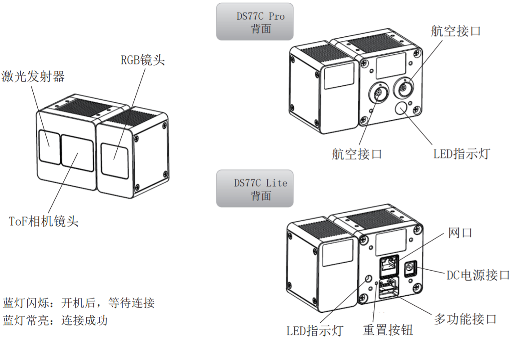
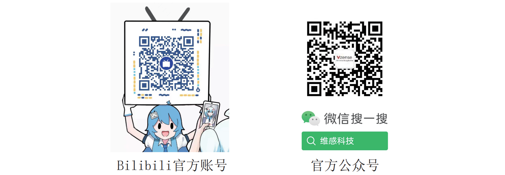

# DS77C

## 了解 DS77C

## 所含附件

| DS77C Pro          | DS77C Lite         |
| :----------------- | :----------------- |
| √ 一根以太网线     | √ 一根以太网线     |
| √ 一根多功能线     | √ 一根电源线       |
| √ 一份中英文说明书 | √ 一根多功能线     |
|                    | √ 一份中英文说明书 |

## 操作指南

1. 通过以太网线将相机连接至主机
2. 通过多功能线给 DS77C Pro 提供 12~24V 电源；通过电源线给 DS77C Lite 提供 12~24V 电源
3. 设置主机 IP 地址与相机在同一网段（相机的默认 IP 地址是 192.168.1.101 ，用户可以通过 NebulaGUITool 更改相机的 IP 地址）
4. 在 Windows 或 Ubuntu 系统下运行 NebulaGUITool，扫描并连接相机
5. 按照 NebulaGUITool 与 NebulaSDK 使用指导，开始探索 DS77C 相机

备注：DS77C Pro 支持 PoE+供电模式，推荐的 PoE+供电模块：

EWPAM2NPoE+ (H3C)/TL-PoE+170S(TP LINK)

## 下载链接

用户可通过下述链接下载 NebulaGUITool 与 NebulaSDK

NebulaGUITool: <https://gitee.com/Vzense/NebulaGUITool>

NebulaSDK: <https://gitee.com/Vzense/NebulaSDK>

## 了解更多

官网：[zh.vzense.com](http://zh.vzense.com)

