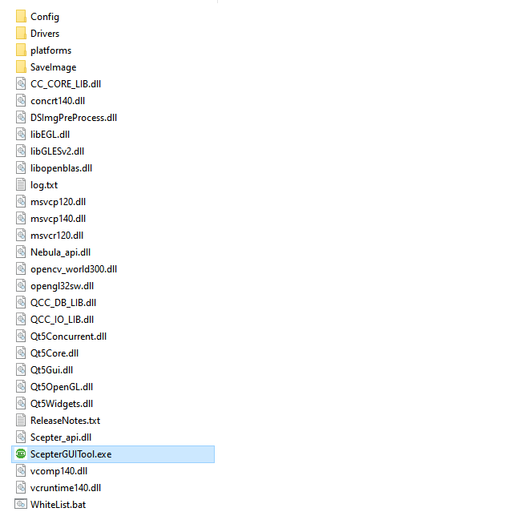

## 1.Hardware Connection<!-- {docsify-ignore-all} -->

1. Mount the camera in a suitable fixture, such as a camera stand.


2. Provide 12~24V power to the camera through the multi-function cable (typical value: 12V 3A). Some models can use PoE+ power supply mode, please refer to the product specifications for details.

3. Connect the product to the host computer via an Ethernet cable. At this time, the device is in a state of Ethernet broadcast and no connection is established, and the LED indicator light on the side used to display the status of the camera will turn **blue** and flash repeatedly.


4. Set the host IP address to be in the same network segment as the camera. The default IP of the device is **192.168.1.101**.

<!-- tabs:start -->

#### **Windows**

Set the local connection on Windows PC, set the subnet mask to 255.255.255.0, and set the IP address to the same network segment (such as 192.168.1.100).

<div class="center">


</div>

<div class="center">


</div>

<div class="center">


</div>

#### **Ubuntu**

Set the local connection on Linux, set the subnet mask to 255.255.255.0, and set the IP address to the same network segment (such as 192.168.1.100).

<div class="center">


</div>

<div class="center">


</div>

<div class="center">


</div>

#### **AArch64**

Set the local connection on ARM-Linux, set the subnet mask to 255.255.255.0, and set the IP address to the same network segment (such as 192.168.1.100). You can use nmtui to set it.

```consle
sudo nmtui
```

   <div class="center">


   </div>

<!-- tabs:end -->

> ① The network cards, routers, and switches used on the host side must meet the **Gigabit** requirements.
>
> ② When using multiple network cards, different IP network segments need to be set. This can cause network conflicts and connectivity issues when multiple network cards are configured for the same IP address range. In this case, if the connection between the host and the camera is interrupted, other devices may also be unable to establish or maintain a connection with the host due to IP address conflicts. To avoid this situation, each network card should be assigned a different IP network segment to ensure that every device on the network can communicate stably.

## 2.Device Open

Windows and Ubuntu18.04/20.04/22.04/24.04 users can download **ScepterGUITool** to explore the camera,

There is no graphical tool on the Ubuntu16.04 side, and the headless mode is commonly used on the AArch64 side. Users can download **ScepterSDK** to explore the camera:

 <!-- tabs:start -->

#### **ScepterGUITool**

ScepterGUITool download link:

<https://github.com/ScepterSW/ScepterGUITool>

or

<https://gitee.com/ScepterSW/ScepterGUITool>

You can download the Scepter development package through the following download methods:

Method 1: Downloads to local through git clone;

Method 2: Download the compressed package locally；

Method 3: Download the installer.

<!-- tabs:start -->

#### **Method 1**

① Open the download link, click Code, and copy the link;

```
git clone https://github.com/ScepterSW/ScepterGUITool
```


② Open the terminal, enter the copied code and press Enter, and wait for the download to complete.


#### **Method 2**

open the **Releases** link, download the lastest version

Download link:

<https://github.com/ScepterSW/ScepterGUITool/releases>

or

<https://gitee.com/ScepterSW/ScepterGUITool/releases>

Taking v24.9.2 as an example, click Source code.


#### **Method 3**

Open the **Releases** link，download the lastest version.

Download link:

<https://github.com/ScepterSW/ScepterGUITool/releases>

or

<https://gitee.com/ScepterSW/ScepterGUITool/releases>


<!-- tabs:start -->

#### **Windows**

**Download:** 

Taking v24.9.2 as an example, click ScepterGUITool_v24.9.2_windows_install.exe.


**Install:** 

Double-click the xxx_install.exe locally，the default installed path is **C:\Users\user.name\AppData\Roaming\ScepterGUITool**.


> Change the path with Browse.
>
> 
>
> Multi-install, choose overwrite or other path.
>
> 

Click Next.


Click Next.


Click Install.


Click Finish. Double-click the ScepterGUITool's icon in desktop，ro Double-click the ScepterGUITool in the installed path.


#### **Ubuntu**

**Download:** 

Taking v24.9.2 as an example, click ScepterGUITool_v24.9.2_ubuntu_install.run.


**Install:** 

Open the terminal and add the execution permission to xxx_install.run.

```
> sudo chmod +x ScepterGUITool_vXX.XX.XX_ubuntu_install.run
```


```
> ./ScepterGUITool_vXX.XX.XX_ubuntu_install.run
```


The installed path is **/home/username/ScepterGUITool/**


Click the ScepterGUITool icon in left, or search the ScepterGUITool and click, or Double-click the ScepterGUITool in the installed path.


<!-- tabs:end -->

<!-- tabs:end -->

ScepterGUITool includes the ScepterGUITool executable file and related dynamic link libraries.

<!-- tabs:start -->

#### **Windows**



> When running ScepterGUITool for the first time, set permissions for the program to pass through the system firewall, as shown in the figure below.
>
>  <div class="center">
>
> 
>
>  </div>

#### **Ubuntu**


<!-- tabs:end -->

Double-click the ScepterGUITool executable file, run ScepterGUITool, and follow the steps below to connect the device:

① Search for devices.


② Select the device you want to open.


③ Click Connect to connect the device.


④ After the device is successfully connected, click the switch on the right side of Stream to start the camera's stream.


⑤ After successful startup, the image will appear on the right side.


⑥ At this time, the device is in the state where the Ethernet broadcast connection is established, and the LED indicator light on the side used to display the status of the camera will be **blue** and always on.


You can refer to [ScepterGUITool introduction](/en/ScepterGUITool/Overview.md) to learn about the detailed functions of the camera and start exploring the camera.

#### **ScepterSDK**

ScepterSDK download link：

<https://github.com/ScepterSW/ScepterSDK>

or

<https://gitee.com/ScepterSW/ScepterSDK>

You can download the Scepter development package through the following download methods:

Method 1: Downloads to local through git clone;

Method 2: Download the compressed package locally.

<!-- tabs:start -->

#### **Method 1**

① Open the download link, click Code, and copy the link;

```
git clone https://github.com/ScepterSW/ScepterSDK
```


② Open the terminal, enter the copied code and press Enter, and wait for the download to complete.


#### **Method 2**

Open the download link, click Code, and then click Download ZIP to download ScepterSDK locally.

If you want to use it under Ubuntu system, please make sure that the downloaded compressed package is decompressed under Ubuntu system. Do not copy and use it after decompression under Windows system.


<!-- tabs:end -->

ScepterSDK includes a series of friendly APIs, application sample programs and related dynamic link libraries.


Enter the AArch64/PrecompiledSamples folder and use the terminal to open the precompiled program for the corresponding camera:

```consle
cd PrecompiledSamples
./XXXX_OpenCVSample
```


At this time, the device is in the state where the Ethernet broadcast connection is established, and the LED indicator light on the side used to display the status of the camera will be **blue** and always on.


You can refer to [ScepterSDK introduction](/en/ScepterSDK/Overview.md) to learn about the detailed functions of the camera and start exploring the camera.

<!-- tabs:end -->

<style>
.center
{
  width: auto;
  display: table;
  margin-left: auto;
  margin-right: auto;
}
</style>
