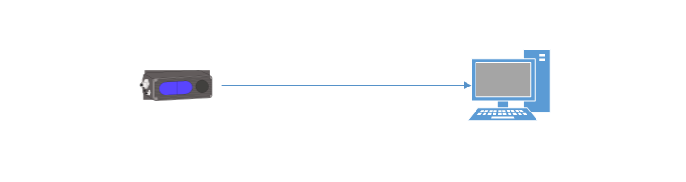
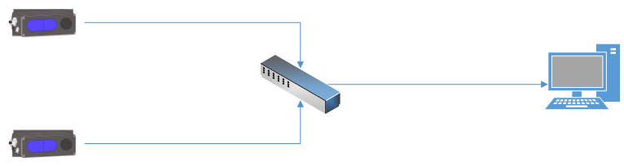
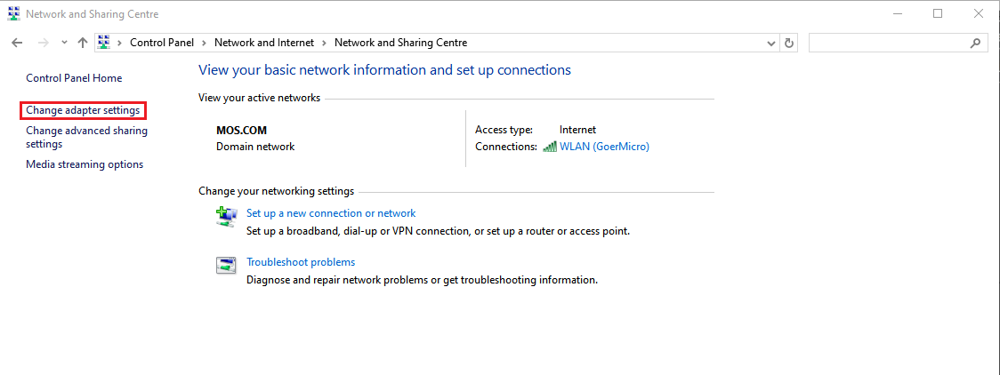
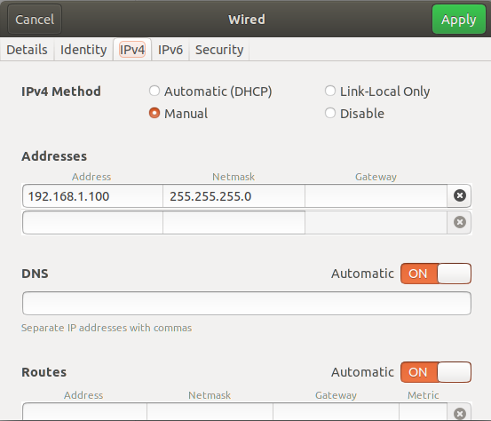
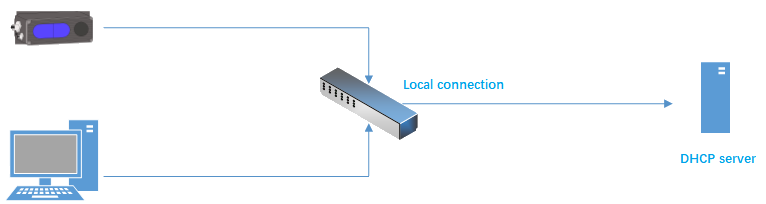
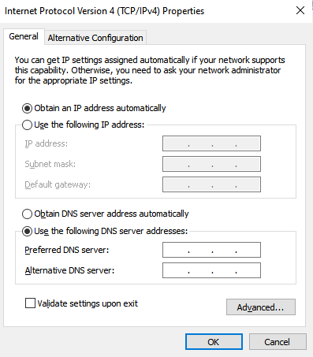
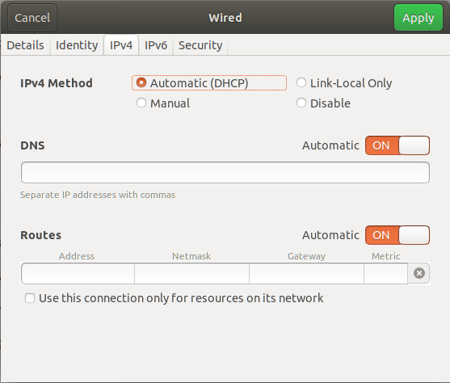

# 2. Device Connection

## 2.1. Recommend system requirements

<!-- tabs:start -->

#### **Windows**

| **Item** |            **Requirements**             |
| :------: | :-------------------------------------: |
|    OS    | Windows10 64 bits Windows11 64 bits |
|   RAM    |               At least 4g               |

#### **Ubuntu**

| **Item** |                            **Requirements**                            |
| :------: | :--------------------------------------------------------------------: |
|    OS    | Ubuntu 18.04 64 bits Ubuntu 20.04 64 bits Ubuntu 22.04 64 bits Ubuntu 24.04 64 bits |
|   RAM    |                              At least 4g                               |

<!-- tabs:end -->

## 2.2. Device Connection

Hardware module installation diagram

1. Connect the camera to the host through the Ethernet cable/aviation plug cable;

2. Connect the power cord to the camera and wait for the camera indicator to flash to complete the device connection.

> Network cable connection is divided into static IP address direct connection and DHCP connection. The device is connected by static IP address by default. If you need to change the IP address, subnet mask and DHCP, you can use ScepterGUITool to change them.

### 2.2.1. Static Address

Using static address connection method, device can be directly connected to computer, or with switch on the same network segment.

Direct connection: one end of the cable is connected to the camera, and the other end is plugged into RJ45 port of the PC. The default IP address of device is **192.168.1.101**, so the address of the PC can be set to 192.168.1.100. In Win10 system, the below picture can be referenced to set the PC network up.

Connection of multiple cameras: It should be noted that the default IP address of the camera is 192.168.1.101, and IP conflict will occur when the camera is connected to the same PC host. Therefore, the default IP address of the camera should be changed (for example, the IP address of camera 1 is 192.168.1.101, IP address of camera 2: 192.168.1.102), you can change the camera IP by referring to [3.5.IP Settings and Firmware Upgrade](/en/ScepterGUITool/FunctionIntroduction#_347-ip-SettingsandFirmwareUpgrade).

<!-- tabs:start -->

#### **Windows**

#### **Ubuntu**

<!-- tabs:end -->

### 2.2.2. DHCP

Using DHCP connection mode, the camera need be connected to a router which DHCP is enabled, then connect a PC on the same LAN. Set the local Connection of the PC to obtain the IP address automatically.

<!-- tabs:start -->

#### **Windows**

#### **Ubuntu**

<!-- tabs:end -->

> The network cards, routers, and switches used on the host side must meet the **Gigabit** requirements.

