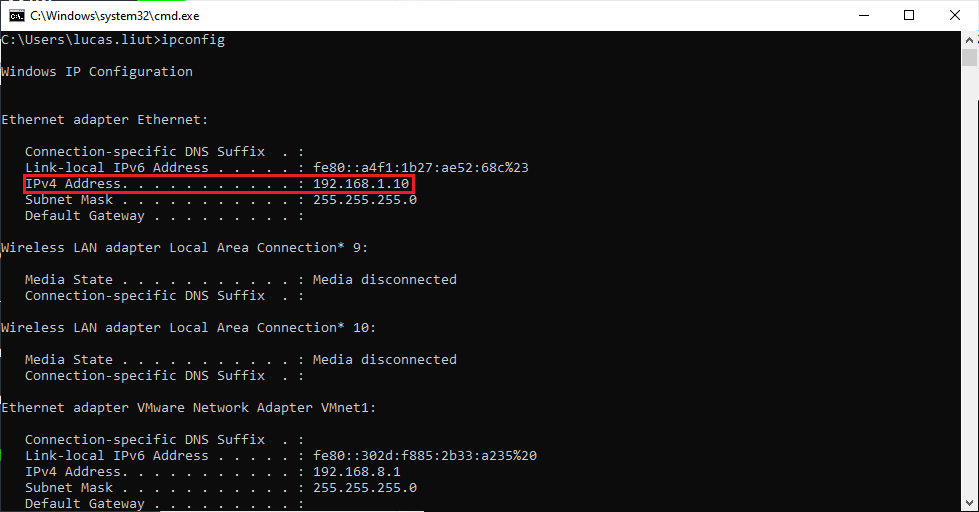

# 4. FAQ

**Q1：Why can I search for network devices but can't turn on the camera?**

**A1**: 1.Confirm that there is no problem with the connection and power supply of the camera, and the blue indicator light of the camera flashes.

2.Check if the camera IP (192.168.1.101 by default) can be pinged:

<!-- tabs:start -->

#### **Windows**

① Win + R opens the running command, enters the 'cmd' and clicks OK to open the command line program;

② Enter'ping 192.168.1.101 'and press Enter to check whether the camera is pinged (the default IP address of the camera is 192.168.1.101);

③ If the ping fails, open cmd and input the 'ipconfig' to check whether the IP of the host is in the same network segment as the default IP of the camera;

④ If you can ping, see if the firewall is down or allow the tool to use the public and private network

If none of the above measures can solve the problem, please use the ipconfig command to check the network status on the PC side, and disable the network other than the same network segment as the camera to search for the device again.

#### **Ubuntu**

① Open the Ubuntu terminal, enter'ping -C 5 192.168.1.101 'and press Enter to check whether the camera is pinged (the default IP address of the camera is 192.168.1.101);

② If the ping fails, open the terminal and input the 'ifconfig' to check whether the IP of the host and the default IP of the camera are in the same network segment;

If none of the above measures can solve the problem, please use the ifconfig command to check the network status on the PC side, and disable the network other than the same network segment as the camera to search for the device again.

<!-- tabs:end -->

**Q2:  Why can't I open the IR map and depth map saved through the GUI? How to view the point cloud?**

**A2**: The IR and Depth images saved by ScepterGUITool are 16-bit image data, which can be opened and viewed by ImageJ; the point cloud data saved by GUITool are in.txt format, which can be viewed by CloudCompare.

**Q3: How to improve the camera's detection of black objects**

**A3**:  Try the following methods: 1. Reduce the frame rate of the product (for example, 5 frames), and adjust the exposure time to the maximum value at the current frame rate; 2. Change the Confidence filter threshold to 2 or 5
