# 3. Function Introduction

## 3.1. Contents

ScepterGUITool Contents ScepterGUITool executable files and related dynamic link libraries.

<!-- tabs:start -->

#### **Windows**

> When the ScepterGUITool first run, all options of the firewall should be chosen.
>
> 

>
> 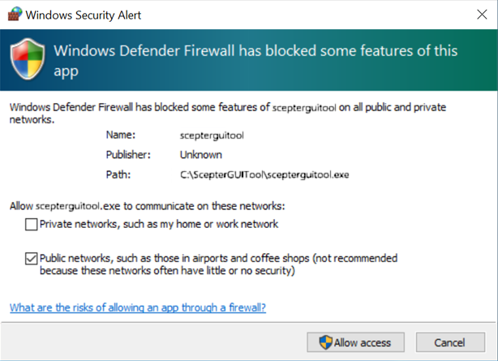
>
> 

#### **Linux**

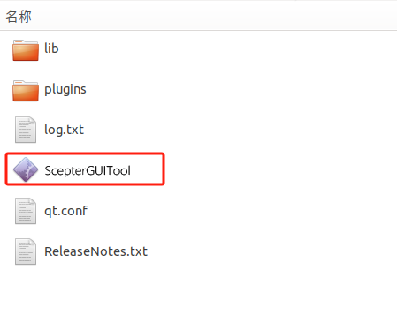

<!-- tabs:end -->

## 3.2. Device Connection

This part is used to describe the discovery and connection of devices. In this Document we opens only one camera for display purposes;

Multiple software can support opening multiple cameras, and the SDK also supports multiple cameras working at the same time.

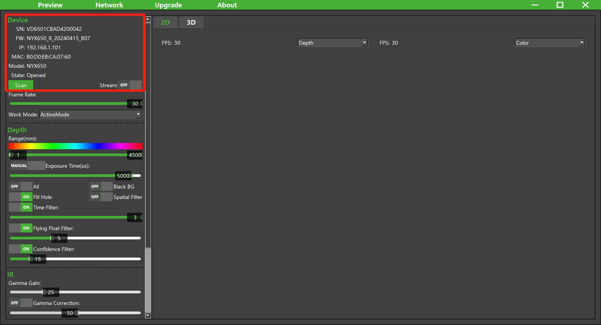

### 3.2.1. Open Device

① After the device is connected, wait for the blue light of the device flash and start scaning the device.

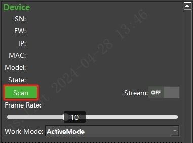

② Select the device you want to open.

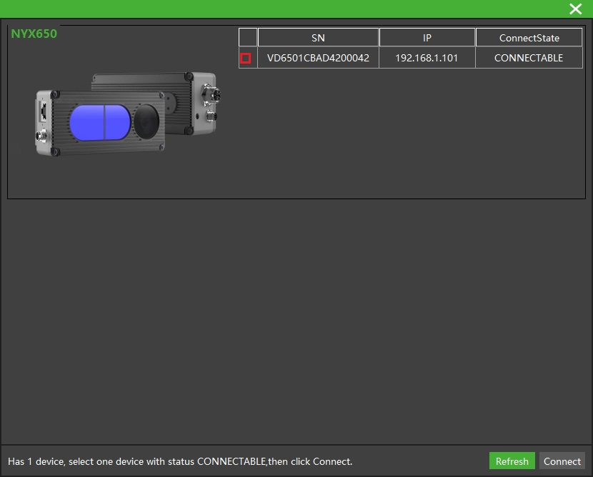

③ Click the Connect button to connect device.

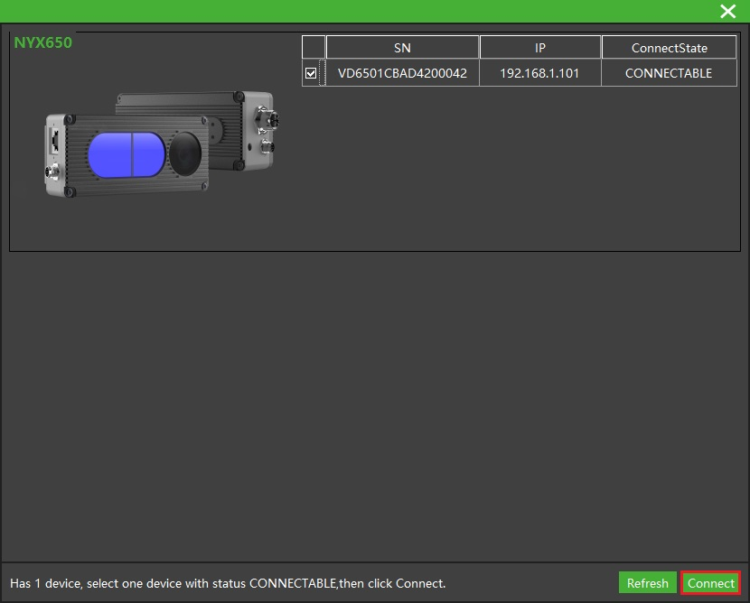

④ After the device is connected successfully, click the switch on the right side of Stream to start camera stream.

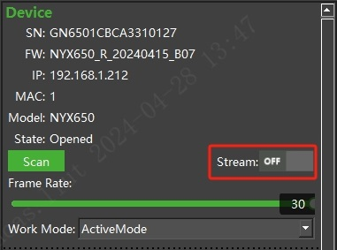

⑤ After successful startup, the image appears on the right side.

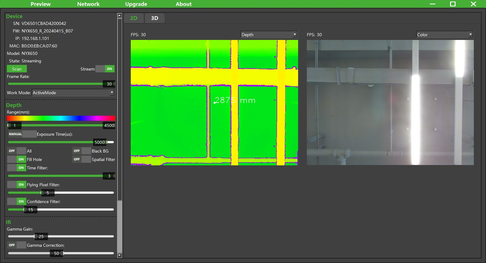

### 3.2.2. Device information

SN：serial number.

FW：firmware version.

IP：current IP address of the device.

MAC：MAC address of the device.

Model：device type.

State：current status of the device.

### 3.2.3. Device Close

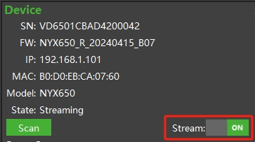

Click the Disconnect button to disconnect the camera from GUITool.

Click the switch on the right side of Stream to turn off the camera's stream.

## 3.3. Device Image

This part is used to introduce the way of image display. You can select 2D image or 3D point cloud from the tab:

### 3.3.1. Image Display

The default 2D images are Depth image and Color image.

The depth map selection box allows you to select Depth image, DepthImgToColorSensor image via the drop-down options menu.

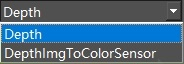

The Color map selection box allows you to select Color image, ColorImgToDepthSensor image, IR image via the drop-down options menu.

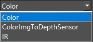

The values displayed below Depth Image are the coordinate value and depth value at the white point. The unit of the depth value is mm. As shown in the figure, the depth value of this point is 2894 mm.

The display value below IR Image is the gray value at the white point. As shown in the figure, the gray value of this point is 39.

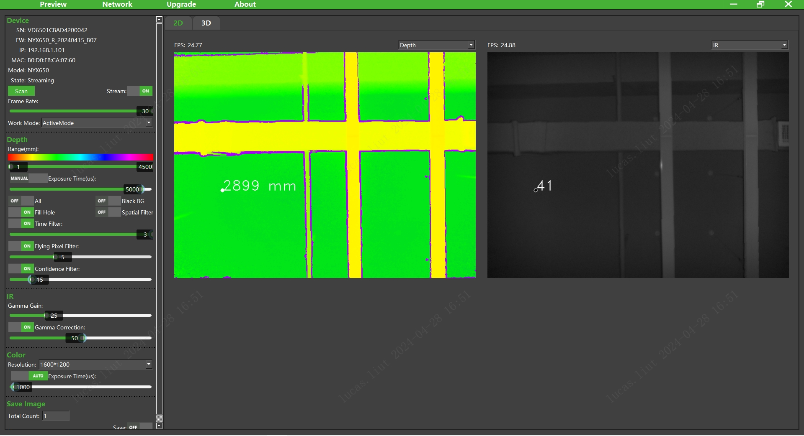

> Click the left mouse button to select the position of the white point, and the depth value and gray value of the corresponding point will be displayed.

### 3.3.2. RGBD Map

**1. DepthImgToColorSensor and Color**

Depth image map to RGB domain. When enabled, the images with Depth pixels aligned to the RGB pixel space are output and displayed, that is, the depth imagecorresponding to RGB pixel one by one.

#### Principle：

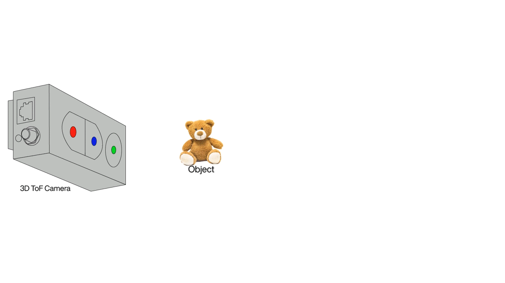

There is a distance between the Tof lens and the RGB camera, so there is a parallax from the actual image.

In order to align the depth image with the RGB image, eliminate the parallax and obtain a true RGB-D image, witch means the color of the object surface and its depth correspond accurately at the pixel level on the two-dimensional image. A conversion is required:

The depth under the coordinate system of the infrared camera is converted to the coordinate system of the RGB camera by rigid transformation, and then projected to the two-dimensional image coordinate system of the RGB image, and finally a depth map under the coordinate system of the RGB camera is formed.

| 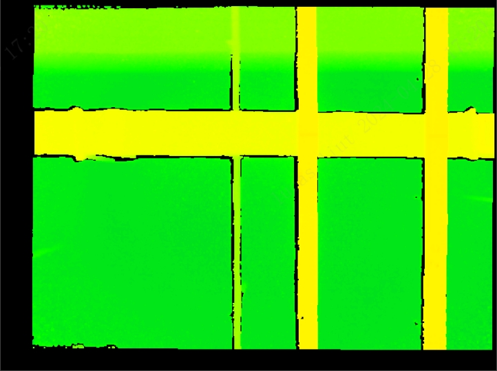 | 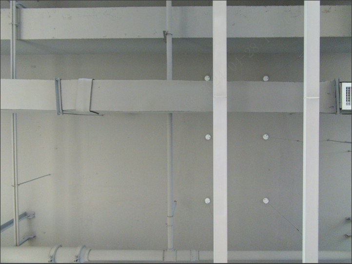 |
| :------------------------------------------------------------------------------------------: | :----------------------------------------------------------: |
|                                 DepthImgToColorSensor Image                                  |                         Color Image                          |

**2. ColorImgToDepthSensor and Depth**

设定 RGB 图像对齐到 Depth 域的功能。启用后将输出并显示 RGB 像素点对齐到 Depth 像素空间的图像，即与 Depth 像素逐一对应的 RGB 图像。

| 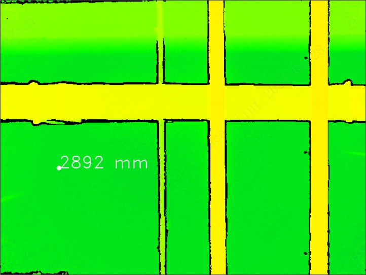 | 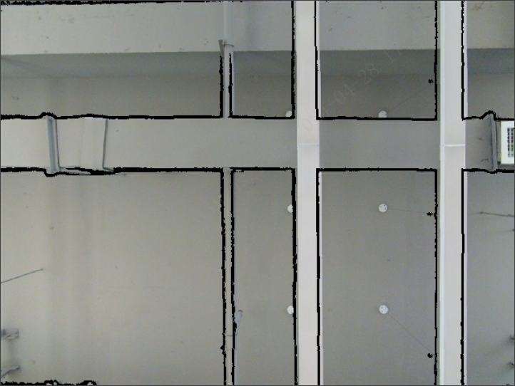 |
| :----------------------------------------------------------: | :------------------------------------------------------------------------------------------: |
|                          Depth 图像                          |                                      对齐后的 RGB 图像                                       |

**3. Depth and IR**

除了深度图像，相机还能够输出一个分辨率为 640\*480 的 IR 图像。由于 IR 图像和深度图像出自同一 sensor，所以 IR 图像与深度图在时间和像素上都实现了严格的对齐。

|  | 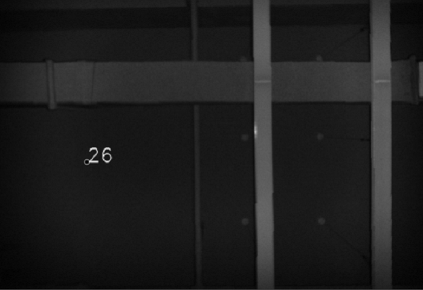 |
| :----------------------------------------------------------: | :----------------------------------------------------: |
|                          Depth 图像                          |                        IR 图像                         |

### 3.3.3 点云图

从标签页处选择 3D 可以显示点云，点云默认使用深度伪彩显示。

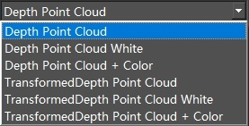

Depth Point Cloud：设定点云使用深度伪彩显示。

Depth Point Cloud White：设定点云使用白色单色显示。

Depth Point Cloud + RGB：设定点云填充 RGB 映射。

TransformedDepth Point Cloud：设定对齐到彩色像素空间的点云使用深度伪彩显示。

TransformedDepth Point Cloud White：设定对齐到彩色像素空间的点云使用白色单色显示。

TransformedDepth Point Cloud + RGB：设定对齐到彩色像素空间的点云填充 RGB 映射。

**点云控件操作：**

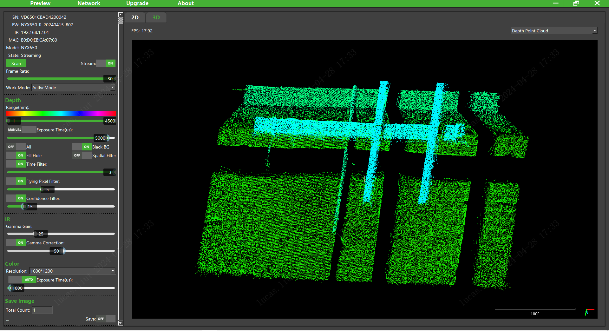

按住鼠标左键并拖动：旋转点云

按住鼠标右键并拖动：平移点云

鼠标滚轮：缩放点云

## 3.4. 设备参数操作

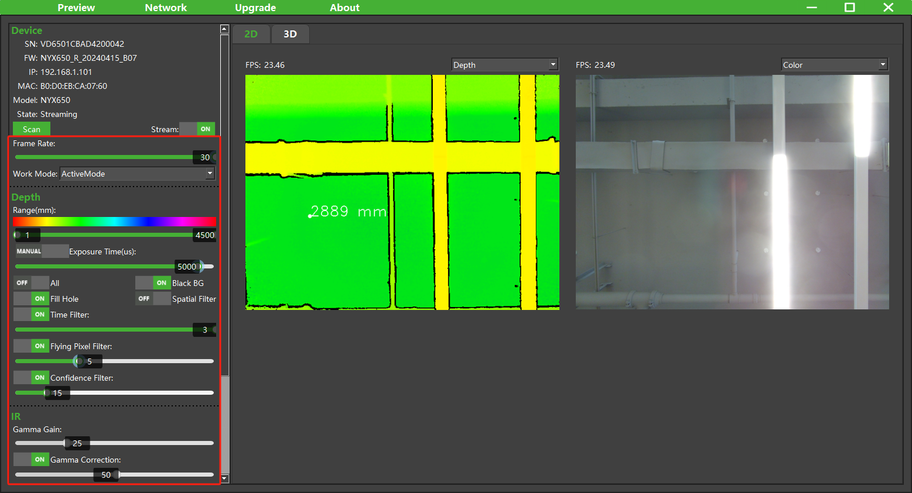

设备参数操作用于介绍控制设备的工作模式与参数，设置图像处理算法等功能。

### 3.4.1 设备帧率

通过左右滑动 Frame Rate 下方的滑块控制条可以调节相机的帧率，不同设备的最大帧率可能会有差异，请参考对应设备的产品规格书。

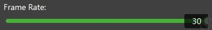

### 3.4.2 工作模式

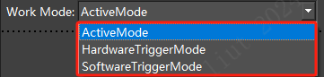

ActiveMode：主动出图模式。

HardwareTriggerMode：硬触发模式，通过硬件信号触发出图，具体请参考对应产品规格书。

SoftwareTriggerMode：软触发模式，通过调用软件接口触发出图，单击按钮发送软触发指令。

#### 3.4.2.1 硬触发模式

开启硬触发模式后，点击 Settings 按钮可配置触发信号参数，如下图所示：

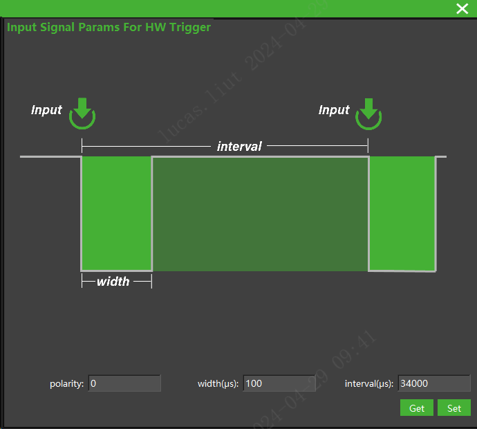

① polarity：信号有效性检测极性。0 代表低电平有效，1 代表高电平有效。

取值范围：\[0,1]

②width： 信号宽度有效性检测，小于宽度设置的信号不予响应。16-bit，单位为 μs。

取值范围：\[1,65535]

③interval： 连续信号间隔有效性检测，小于间隔设置的信号不予响应。

取值范围：\[34000,65535]

#### 3.4.2.2 软触发模式

开启软触发模式后，点击 Trigger 按钮可触发设备出图。

### 3.4.3 深度图像参数配置

#### 3.4.3.1. 伪彩色图映射

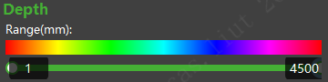

深度图采用伪彩色图映射显示，将单通道 16 位的原始深度图在范围 ColorMap_Min 至 ColoMap_Max 的深度值线性映射到 0-255 的值域范围，再将单通道 8 位的深度图映射到伪彩色空间（即色度图）COLORMAP_RAINBOW，如下示意图：

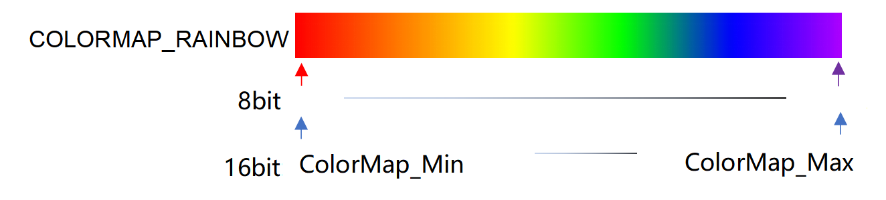

您可以通过调整 Range(mm) 下方的滑块控制条调整伪彩色图映射效果，如下图所示：

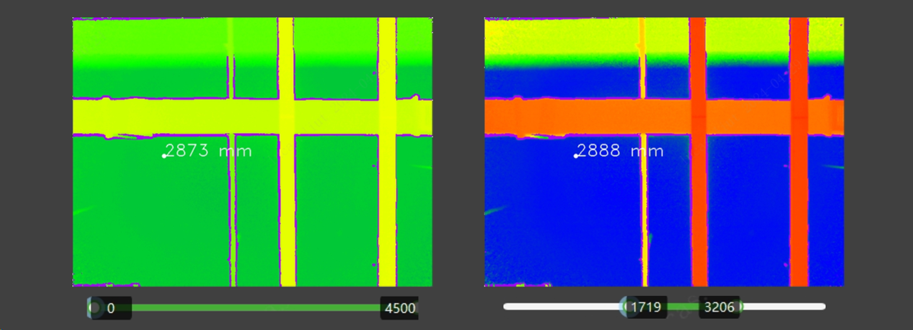

#### 3.4.3.2. ToF 曝光时间

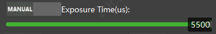

设定 ToF 传感器的曝光模式与时间。ToF 传感器默认使用手动曝光模式，可以设定的最大曝光时间与帧率有关。

不同设备的最大帧率可能会有差异，请参考对应设备的产品规格书。

Manual：ToF 传感器设置为手动曝光，通过滑条对曝光时间进行手动调节。

Auto：ToF 传感器设置为自动曝光，设备会根据图像距离进行曝光时间调节。

#### 3.4.3.3. 图像滤波

① **All**

开启/关闭所有滤波。

② **Black BG**

Black BG：开启/关闭黑色背景，仅用于显示效果，对实际数值无影响。效果如下：

|  |  |
| :--------------------------------------------------------------------: | :------------------------------------------------------------------: |
|                             Black BG 关闭                              |                            Black BG 开启                             |

③ **FillHole**

FillHole：数据填补，弥补部分空洞数据，默认开启。

④ **Spatial Filter**

Spatial Filter：平滑滤波，减少平面噪声与抖动。默认关闭。

|  |  |
| :--------------------------------------------------------------------------------: | :------------------------------------------------------------------------------: |
|                                Spatial Filter 关闭                                 |                               Spatial Filter 开启                                |

⑤ **Time Filter**

Time Filter：时间滤波，降低图像帧间抖动。默认开启，值越大，滤波效果越强。

⑥ **Flying Pixel Filter**

Flying Pixel Filter：飞点消除滤波，消除边界的深度值飞点。默认开启，值越大，滤波效果越强。

|  |  |
| :------------------------------------------------------------------------------------------: | :-------------------------------------------------------------------------------------------------: |
|                                   Flying Pixel Filter 关闭                                   |                                     Flying Pixel Filter 值为 15                                     |

⑦ **Confidence Filter**

Confidence Filter：置信度滤波，消除信号质量较差点。默认开启，值越大，信号质量要求越高。

|  |  |
| :--------------------------------------------------------------------------------------------: | :--------------------------------------------------------------------------------------------: |
|                                   Confidence Filter 值为 15                                    |                                   Confidence Filter 值为 50                                    |

⑧ **HDR Mode**

| 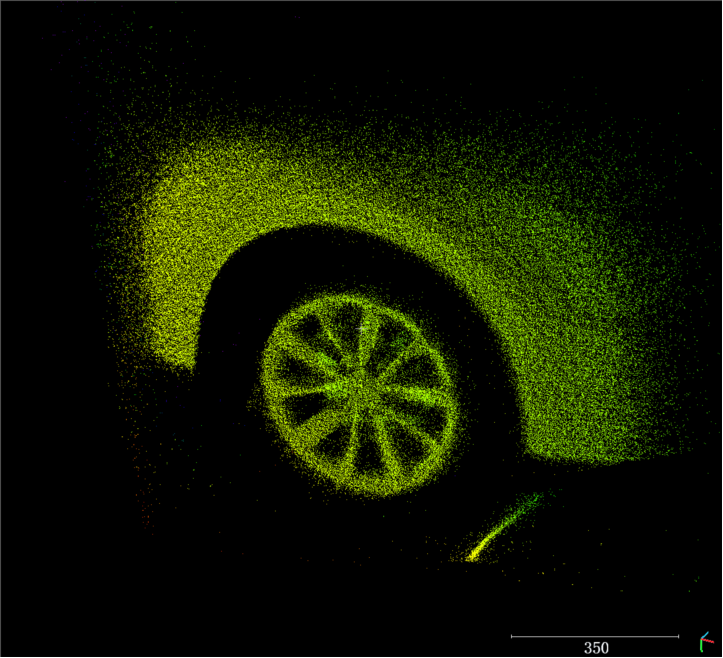 |   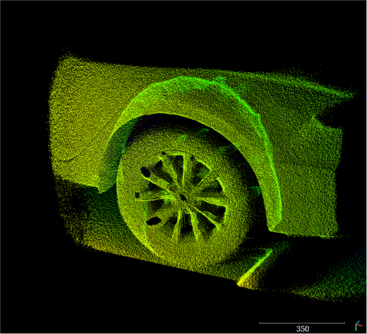 |   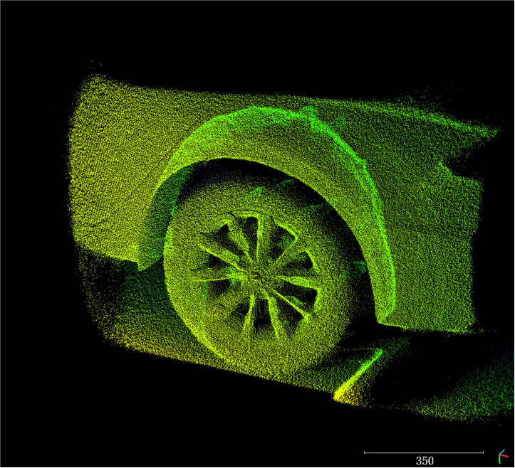 |
| :----------------------------------------------------------- | :----------------------------------------------------------------- | :----------------------------------------------- |
| 曝光时间 58us                                                | 曝光时间 1000us                                                    | HDR 曝光时间 1000us                              |

HDR(High Dynamic Range)即高动态范围功能通过设置多个不同曝光时间的方式，将采集到的多个图像合成到一帧中，完成对整个复杂场景的成像 **(参考产品介绍是否支持)** 。

### 3.4.4 IR 图像参数配置

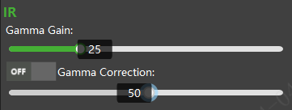

#### 3.4.4.1 Gamma Gain

设定 IR 图像的增益，通过更改传感器 Gamma 值参数调整图像亮度，表现为 Gamma Gain 值越高，IR 图像越亮。

| 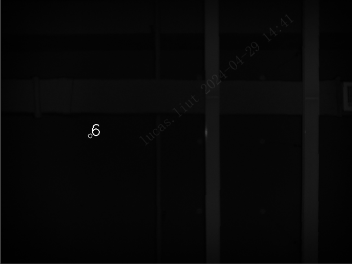 | 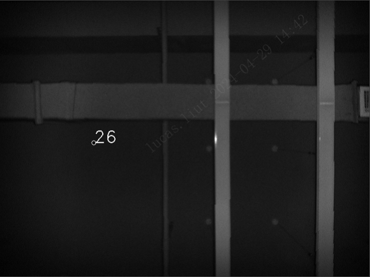 |
| :------------------------------------------------------------: | :--------------------------------------------------------------: |
|                        Gamma Gain 值 25                        |                        Gamma Gain 值 100                         |

#### 3.4.4.2 Gamma Correction

设定 IR 图像校正的开关和增益，通过软件后处理调整图像亮度，表现为 Gamma Correction 值越高，IR 图像越亮。

|  | 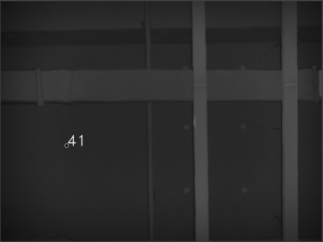 | 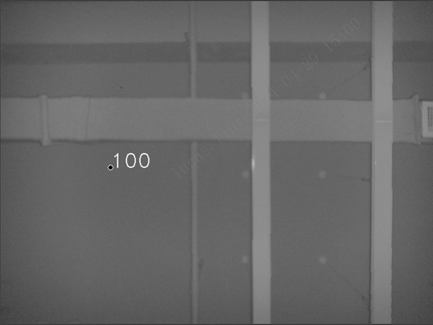 |
| :-------------------------------------------------------------------: | :------------------------------------------------------------------------: | :--------------------------------------------------------------------------: |
|                         Gamma Correction 关闭                         |                           Gamma Correction 值 50                           |                           Gamma Correction 值 100                            |

### 3.4.5 彩色图像参数配置

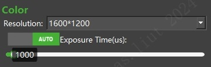

#### 3.4.5.1. 彩色图像分辨率

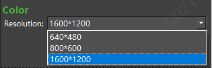

彩色图像分辨率可根据实际列表显示进行切换，如上图示例的分辨率有三种：640\*480，800\*600，1600\*1200。

不同设备的彩色图像分辨率列表可能会有差异，请参考对应设备的产品规格书。

#### 3.4.5.2. 彩色图像曝光时间

设定 RGB 传感器曝光模式与时间。RGB 传感器的默认曝光模式为自动曝光。

**Auto:**

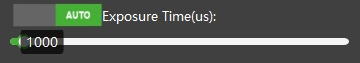

RGB 传感器设置为自动曝光，下面会显示可以设置 AEC Max ExposureTime(us)的滑块控制条。

当相机作业时会自动调节曝光时间。

AEC Max ExposureTime(us) ：设置相机自动曝光模式下的最大曝光时间。

**Manual:**

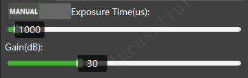

RGB 传感器设置为手动曝光，下面会显示 ExposureTime(us)和 Gain(dB)两行状态栏。

当相机作业时，需要手动调节相机曝光时间与相机 RGB 图像的亮度。

ExposureTime(us)：设置 RGB 相机的曝光时间，通过滑条对曝光时间进行手动调节。

Gain(dB): 设置 RGB 图像的亮度，通过滑条对 Gain 值进行手动调节。

### 3.4.6. 保存图像

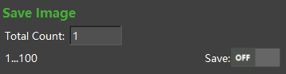

Record：保存多帧当前所有显示区域的图像。如果显示区域未开启，则不会保存。

Total Count：需要保存图像的数量，取值范围：\[1,10000]。

Snapshot：保存一帧当前所有显示区域的图像。如果显示区域未开启，则不会保存。

> 保存的所有图像/点云会存储在同一文件夹，文件夹以当前时间命名，存放在 ScepterGUITool.exe 的同级目录下的 SaveImage 文件夹中。如下图目录所示：
>
> 

**文件格式：**

Depth 图存储格式为 16 位单通道 png 格式，数值单位 mm；

IR 图存储格式为 8 位单通道 png 格式；

RGB 图存储格式为 8 位三通道彩色图，采用 JPG 格式保存；

PointCloud 数据以 txt 格式保存，每行数据表示一个点的三维坐标(Float: X, Y, Z)，单位 mm。保存后的文件可使用 CloudCompare 工具打开。

> ScepterGUITool 保存的深度图是 16bit 单通道 png 格式图像，每个 pixel 由 2 个字节表示。Windows 默认的图像显示工具只能显示 8bit 单通道的图像，所以看上去是黑色的。可以使用 Image J 来显示并查看像素距离值。

<!-- ### 3.4.7. 导出、导入参数

Export：导出通过 ScepterGUITool 设置的参数

Import：导入参数到 ScepterGUITool 中

导出的参数可以通过调用 API 函数在自编写的程序中直接使用。 -->

## 3.5. 设备网络设置

点击顶部菜单栏，弹出设备网络设置页面。

① **设置动态 IP：**

Obtain an IP address automatically(DHCP): 设置设备的 IP 地址为 DHCP 模式，由局域网内的路由器分配 IP 地址，使用该模式，主机端也需要设置为 DHCP 模式.

Step1:  选择“Obtain an IP address automatically（DHCP）”。

Step2: 点击 OK 保存。

Step3: 设备自动重启后生效。

② **设置静态 IP：**

Use the following IP address：设置设备的 IP 地址为固定地址。使用该模式，需要注意主机的 IP 地址以及子网掩码，确保主机和设备的 IP 地址在同一网段。

Step1:  选择“Use the following IP address”。

Step2:  更改 IP 地址和子网掩码。

Step3:  点击 OK 保存。

Step4: 设备自动重启后生效。

## 3.6. 设备固件升级

点击顶部菜单栏，弹出设备固件升级设置页面。

设备固件升级操作方法：

1.  点击，选择固件镜像。

> 暂不支持中文路径

2.  点击“Upgrade”按钮，等待升级开始（升级过程中设备不可断电）。

3.  升级开始后，进度条会开始增长，增长到“100%”升级完成。

4.  提示设备重启，点击确定后设备重启并完成固件升级。

## 3.7. 查看已保存图像/点云

1. 进入 ScepterGUITool 根目录下的 SaveImage 文件夹，选择想要查看的图像。

2. ScepterGUITool 保存的 Depth 和 IR 图像是 16bit 图片数据，可以使用 ImageJ 打开查看，鼠标指上去可以读出对应坐标下的深度值/IR 信号值。

   ImageJ 下载地址：<https://fiji.sc/>

   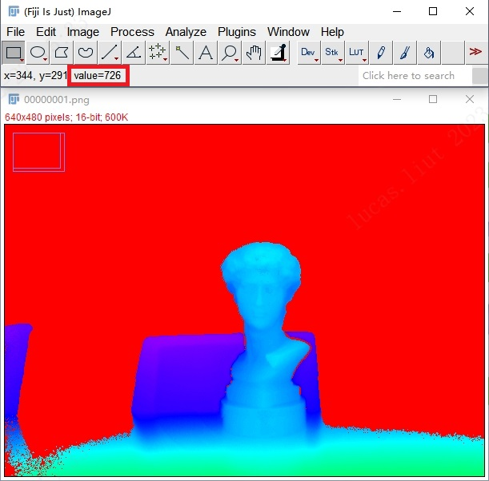

   > 可以使用 ImageJ 中的 LUT 菜单给图片添加伪彩色，并通过菜单 Image->Adjust->Brightness/Contrast(**Ctrl+Shift+C**)进行效果的调整。

3. ScepterGUITool 保存的点云图是.txt 格式，可使用 CloudCompare 打开查看。

   CloudCompare 下载地址：<https://www.cloudcompare.org/>

   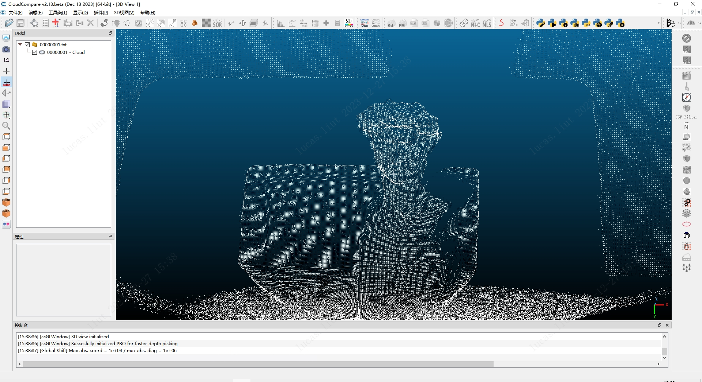

   ScepterGUITool 保存的.txt 格式点云图，从上到下行依次为 pixel 0 至最后一个 pixel，每一行的数值依次为该 pixel 的 X,Y,Z 值(RGBD 相机保存的彩色点云依次为 X,Y,Z,R,G,B 值)，说明如下：

   ​

   ​
