# 3. Function Introduction

## 3.1. Contents

ScepterGUITool Contents ScepterGUITool executable files and related dynamic link libraries.

<!-- tabs:start -->

#### **Windows**


> When the ScepterGUITool first run, all options of the firewall should be chosen.
>
> <div class="center">
>
> 
>
> </div>

#### **Linux**

Open in Terminal Enter the code below or double-click Scepter GUIToo to open it.

```
./ScepterGUITool
```

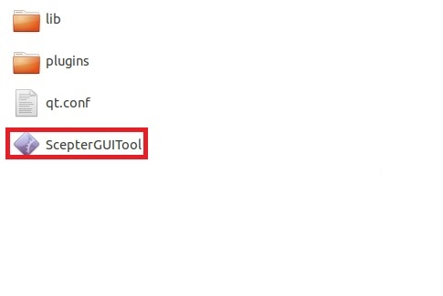

<!-- tabs:end -->

## 3.2. Device Connection

This part is used to describe the discovery and connection of devices. In this Document we opens only one camera for display purposes;

Multiple software can support opening multiple cameras, and the SDK also supports multiple cameras working at the same time.

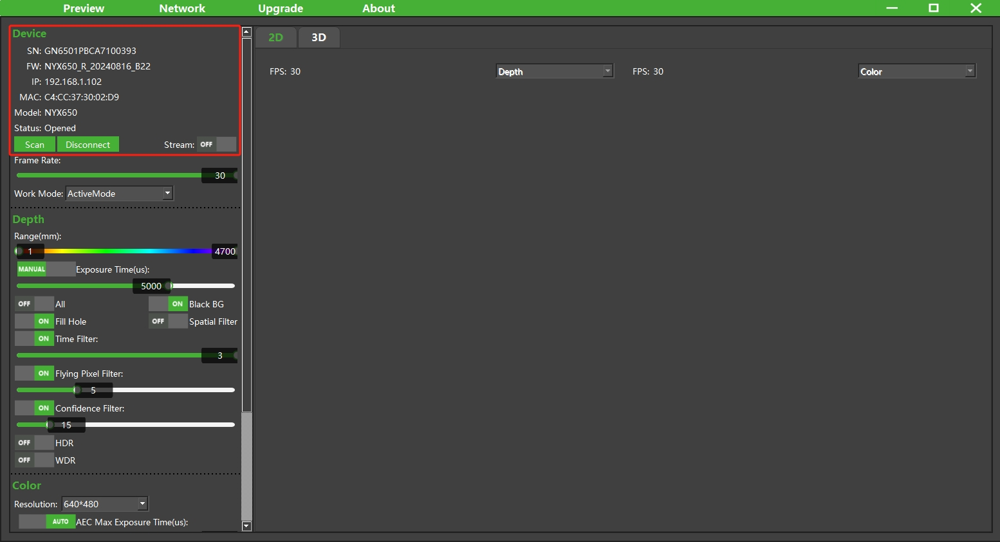

### 3.2.1. Open Device

① After the device is connected, wait for the blue light of the device flash and start scaning the device.

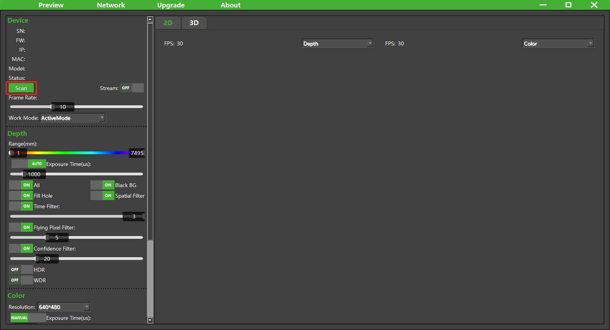

② Select the device you want to open.

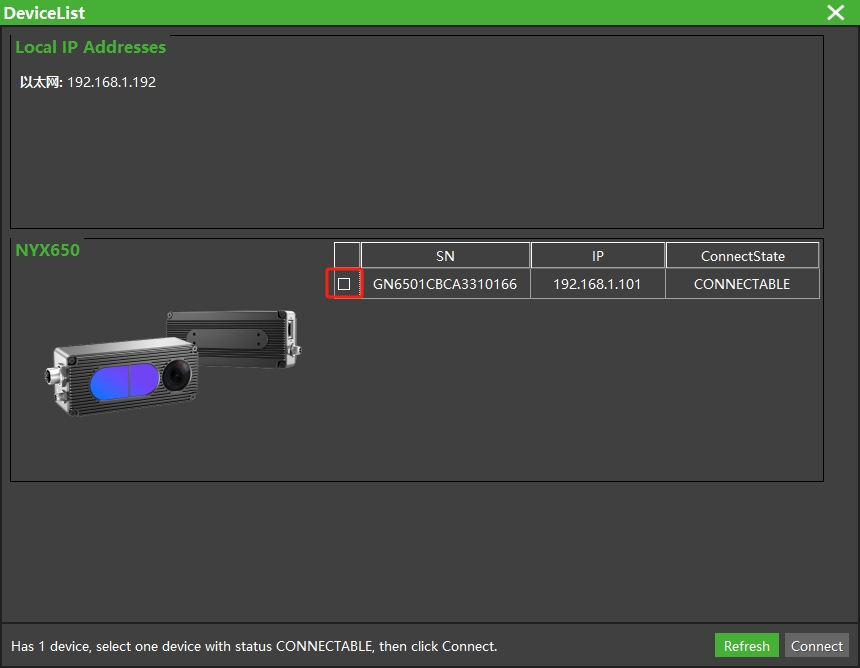

③ Click the Connect button to connect device.

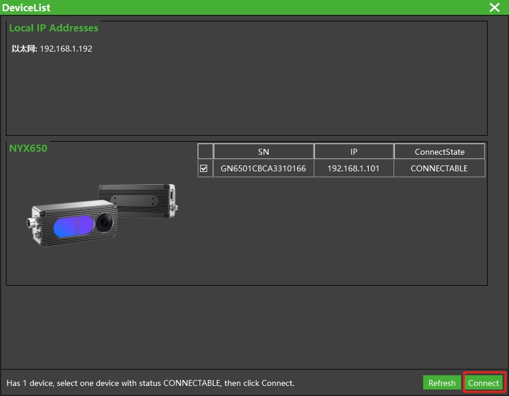

④ After the device is connected successfully, click the switch on the right side of Stream to start camera stream.


⑤ After successful startup, the image appears on the right side.

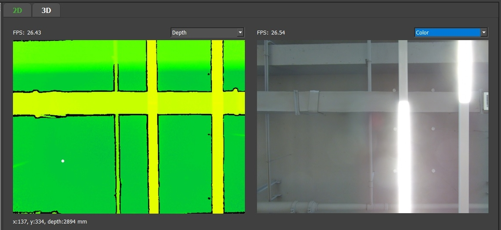

### 3.2.2. Device information


SN：serial number.

FW：firmware version.

IP：current IP address of the device.

MAC：MAC address of the device.

Model：device type.

State：current status of the device.

### 3.2.3. Device Close

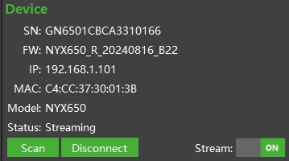

Click the Disconnect button to disconnect the camera from GUITool.

Click the switch on the right side of Stream to turn off the camera's stream.

## 3.3. Device Image

This part is used to introduce the way of image display. You can select 2D image or 3D point cloud from the tab:


### 3.3.1. Image Display

The default 2D images are Depth image and Color image.

The depth map selection box allows you to select Depth image, DepthImgToColorSensor image via the drop-down options menu.

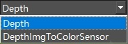

The Color map selection box allows you to select Color image, ColorImgToDepthSensor image, IR image via the drop-down options menu.


The values displayed below Depth Image are the coordinate value and depth value at the white point. The unit of the depth value is mm. As shown in the figure, the depth value of this point is 2894 mm.

The display value below IR Image is the gray value at the white point. As shown in the figure, the gray value of this point is 39.

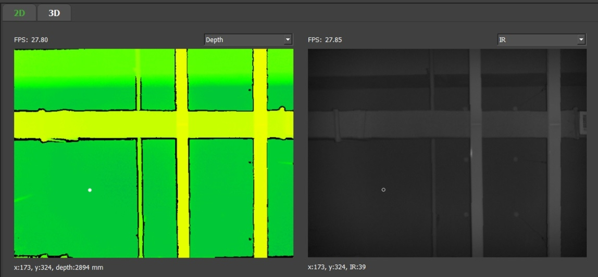

> Click the left mouse button to select the position of the white point, and the depth value and gray value of the corresponding point will be displayed.

### 3.3.2. RGBD Map

**1. DepthImgToColorSensor and Color**


Depth image map to Color domain. When enabled, the images with Depth pixels aligned to the Color pixel space are output and displayed, that is, the depth imagecorresponding to Color pixel one by one.

#### Principle：

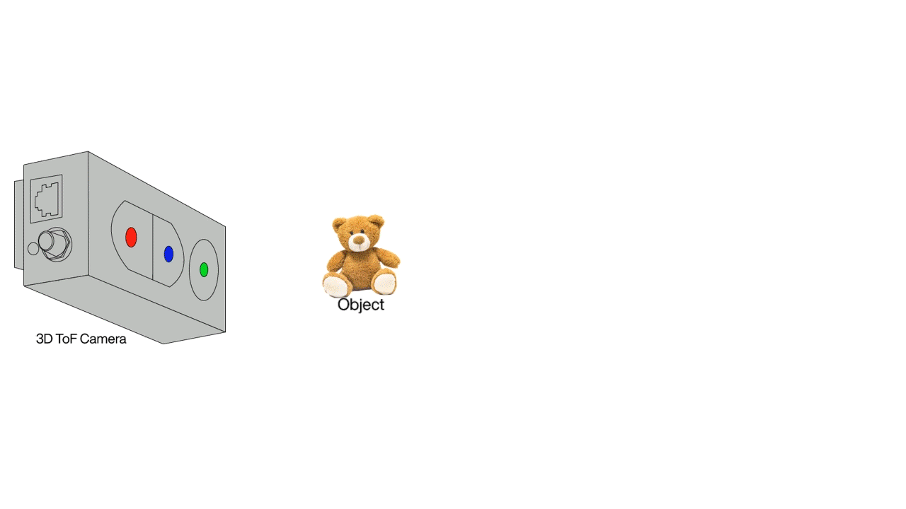

There is a distance between the ToF lens and the Color camera, so there is a parallax from the actual image.

In order to align the depth image with the Color image, eliminate the parallax and obtain a true RGB-D image, witch means the color of the object surface and its depth correspond accurately at the pixel level on the two-dimensional image. A conversion is required:

The depth under the coordinate system of the infrared camera is converted to the coordinate system of the Color camera by rigid transformation, and then projected to the two-dimensional image coordinate system of the Color image, and finally a depth map under the coordinate system of the Color camera is formed.

|  |  |
| :------------------------------------------------------------------------------------------: | :----------------------------------------------------------: |
|                                 DepthImgToColorSensor Image                                  |                         Color Image                          |

**2. ColorImgToDepthSensor and Depth**


RGB image map to Depth domain. When enabled, images with RGB pixels maptoDepth pixel space are output and displayed, that is, RGB images correspondingtodepth pixels one by one.

|  |  |
| :----------------------------------------------------------: | :------------------------------------------------------------------------------------------: |
|                         Depth Image                          |                                 ColorImgToDepthSensor Image                                  |

**3. Depth and IR**

In addition to the depth image, the camera is also capable of outputting an IR image with a resolution of 640 \* 480. Since the IR image and the depth image come from the same sensor, the IR image and the depth map are strictly aligned in time and pixels.

|  | 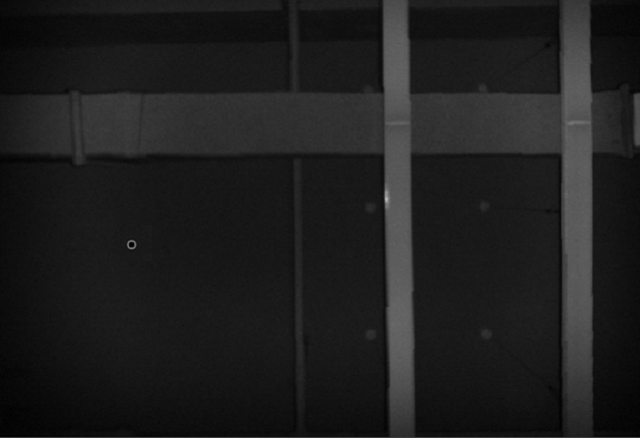 |
| :----------------------------------------------------------: | :----------------------------------------------------: |
|                         Depth Image                          |                        IR Image                        |

### 3.3.3 Point Cloud

Select 3D from the tab to display the point cloud. By default, the point cloud is displayed using a depth pseudo-color map.


Depth Point Cloud: Sets the point cloud to use depth pseudo-color display.

Depth Point Cloud White: Sets the point cloud to display in a white monochrome.

Depth Point Cloud + RGB: Set the point cloud to fill the RGB mapping.

Transformed Depth Point Cloud: Sets the point cloud aligned to the colored pixel space to be displayed with a deep pseudo-color.

Transformed Depth Point Cloud White: Sets the point cloud aligned to the colored pixel space to use a white monochrome display.

Transformed Depth Point Cloud + RGB: Sets the point cloud that is aligned to the color pixel space to fill the RGB map.

**Point cloud control operation:**

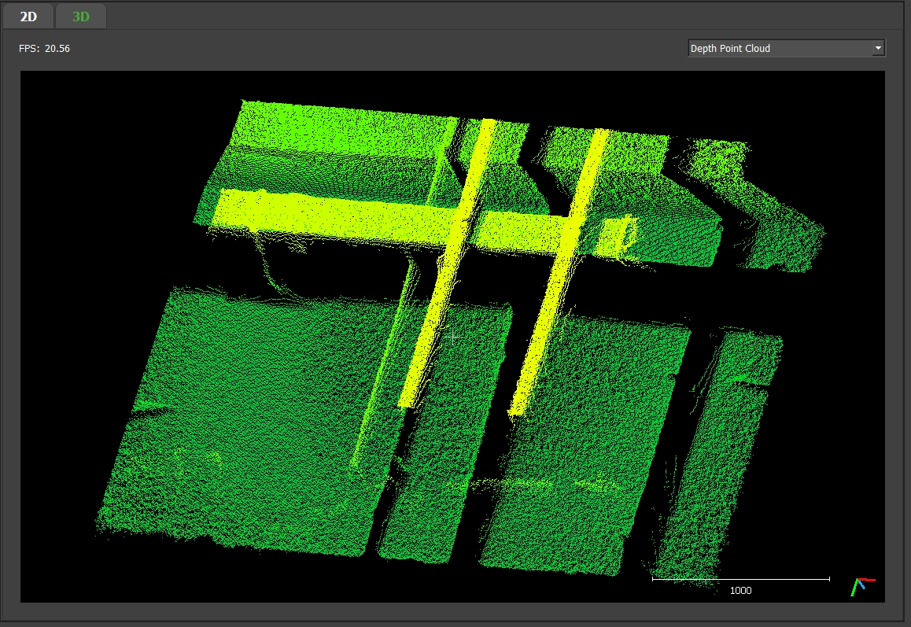

Hold down the left mouse button and drag to rotate the point cloud

Right-click and drag: Translates the point cloud

Mouse wheel: scaling point cloud

## 3.4. Device parameter

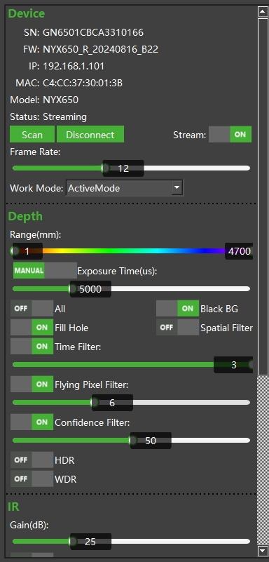

The device parameter operation is used to introduce the working mode and parameters of the control device, set the image processing algorithm and other functions.

### 3.4.1 Frame Rate

The frame rate of the camera can be adjusted by sliding the slider control bar below Frame Rate left and right. The maximum frame rate of different devices may be different. Please refer to the product specification of the corresponding device.


### 3.4.2 Work Mode


Active Mode: Active plotting mode.

HardwareTriggerMode: refers to the hardware trigger mode, which triggers the drawing through the hardware signal. For details, please refer to the corresponding product specification.

SoftwareTriggerMode: In the soft trigger mode, trigger the plot by calling the software interface, and click the button to send the soft trigger instruction.

#### 3.4.2.1 HardwareTriggerMode


After the hard trigger mode is enabled, click the Settings button to configure the trigger signal parameters, as shown in the following figure:


① Polarity: signal validity detection polarity. 0 is active low and 1 is active high.

Value Range: \[0,1]

② width: signal width validity detection, the signal less than the width setting will not respond. 16-bit, in μs.

Value Range: \[1,65535]

③ interval: continuous signal interval validity detection, no response to the signal less than the interval setting.

Value Range: \[34000,65535]

#### 3.4.2.2 SoftwareTriggerMode

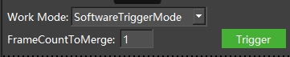

After the soft trigger mode is enabled, click the Trigger button to trigger the device plot.The more frames there are, the better frame's quality after algorithm merging, FrameCountToMerge in range [1,10].

### 3.4.3 Depth Image Configuration

#### 3.4.3.1. Color Map

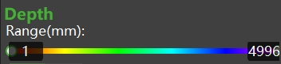

For displaying the depth image intuitively, we map 16-bit depth image to color image. When mapping, we intercept the depth value in a given range: fromColorMap_Min to ColorMap_Max, and then map it to 0-255 range. Finally, theimage is transformed into a color image by using color mapping.


The effect of color map mapping is shown below:


#### 3.4.3.2. ToF Sensor Exposure Time

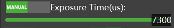

The exposure time of the ToF sensor can be set.

The maximum frame rate of different devices may be different. Please refer to the product specification of the corresponding device.

Manual：The ToF sensor is set to manual exposure, and the exposure time is manually adjusted through the slider or input box. The ToF sensor uses manual exposure mode by default, and the maximumexposure time that can be set is related to the frame rate.


Auto：The ToF sensor is set to automatic exposure, and the device will adjust theexposure time according to the image.


#### 3.4.3.3. Image filter


① **All**

Enable/disable all filters.

② **Black BG**

Black BG：enable or disable the Black background. The effect is as follows.

|  |  |
| :--------------------------------------------------------------------: | :------------------------------------------------------------------: |
|                              Black BG Off                              |                             Black BG On                              |

③ **FillHole**

FillHole：fill up some empty data. This function is enabled by default.

④ **Spatial Filter**

Spatial Filter：similar to Gaussian filter, reduce noise. This function is disabledby default.

|  |  |
| :--------------------------------------------------------------------------------: | :------------------------------------------------------------------------------: |
|                                 Spatial Filter Off                                 |                                Spatial Filter On                                 |

⑤ **Time Filter**

Time Filter：Time Filter reduce image noise. By default, this function is enabled. The larger value, the stronger filtering effect.


⑥ **Flying Pixel Filter**

Flying Pixel Filter：Flying Pixel Filter eliminate the depth value of the boundary flying points. The default value is 15, the larger value, the stronger filtering effect.


|  |  |
| :------------------------------------------------------------------------------------------: | :-------------------------------------------------------------------------------------------------: |
|                                   Flying Pixel Filter Off                                    |                                    Flying Pixel Filter value: 15                                    |

⑦ **Confidence Filter**


Confidence Filter：Confidence filter eliminate points with poor signal quality. The default threshold of Confidence Filter is 15.

|  |  |
| :--------------------------------------------------------------------------------------------: | :--------------------------------------------------------------------------------------------: |
|                                   Confidence Filter value 15                                   |                                   Confidence Filter value 50                                   |

⑧ **HDR Mode**

|  |    |    |
| :----------------------------------------------------------: | :----------------------------------------------------------------: | :----------------------------------------------: |
|                      Exposuretime 58us                       |                        Exposuretime 1000us                         |                     HDR Mode                     |

The HDR (High Dynamic Range) function synthesizes multiple captured images into one frame by setting multiple different exposure times to complete the imaging of the entire complex scene **(refer to the product introduction for support)**.

### 3.4.4 IR Image Configuration


#### 3.4.4.1 Gamma Gain

Set the gain of the IR image, and adjust the image brightness by changing the Gamma value parameter of the sensor. The higher the Gamma Gain value is, the brighter the IR image is.

|  | 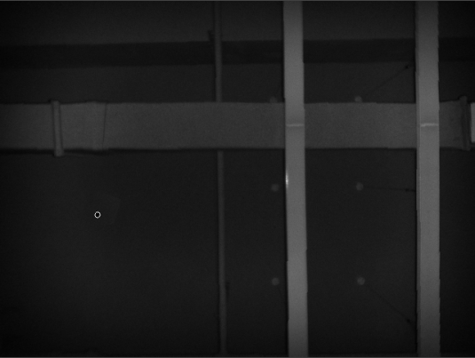 |
| :------------------------------------------------------------: | :--------------------------------------------------------------: |
|                     Gamma Gain value is 25                     |                     Gamma Gain value is 100                      |

#### 3.4.4.2 Gamma Correction

Set the switch and gain of IR image correction, and adjust the image brightness through software post-processing. The higher the Gamma Correction value is, the brighter the IR image is.

|  |  |  |
| :-------------------------------------------------------------------: | :------------------------------------------------------------------------: | :--------------------------------------------------------------------------: |
|                         Gamma Correction Off                          |                        Gamma Correction value is 50                        |                        Gamma Correction value is 100                         |

### 3.4.5 Color Image Configuration


#### 3.4.5.1. Color Image Resolution

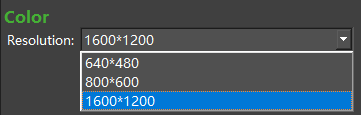

The color image resolution can be switched according to the actual list display. As shown in the figure above, there are three resolutions: 640 \* 480, 800 \* 600, 1600 \* 1200.

Different devices may have different color image resolution lists. Please refer to the product specifications of the corresponding devices.

#### 3.4.5.2. Color Sensor Exposure Time

Set the Color sensor exposure mode and time. The default exposure mode for the Color sensor is Auto Exposure.

**Auto:**

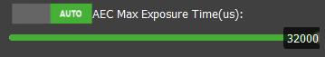

The Color sensor is set to auto exposure, and the slider control for setting the AEC Max ExposureTime (us) is shown below.

The exposure time is automatically adjusted when the camera is operating.

AEC Max ExposureTime (us): Sets the maximum exposure time when the camera is in auto exposure mode.

**Manual:**

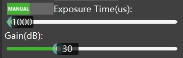

The Color sensor is set to manual exposure, and two status bars, ExposureTime (us) and Gain (dB), are displayed below.

When the camera is working, you need to manually adjust the camera exposure time and the brightness of the camera Color image.

ExposureTime (us): Set the exposure time of the Color camera. Manually adjust the exposure time with the slider.

Gain (dB): Set the brightness of the Color image, and adjust the Gain value manually through the slider.

### 3.4.6. Save Image

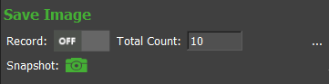

Record: Record images of all current display areas. If the display area is not turned on, it is not saved. Recording failed to save the point cloud.

Total Count: The number of images to be recorded. Value range: \[1,10000].

Snapshot: Save a frame of images of all the current display areas. If the display area is not turned on, it is not saved.

> All saved images/point clouds are stored in the same folder, named for the current time, in the SaveImage folder at the same level as the ScepterGUITool. Exe. As shown in the following table of contents:
>
> 

**File format:**

The Depth image is stored in 16-bit PNG format, the unit is mm.

IR images are stored in 8-bit single-channel PNG format.

The RGB diagram is an 8-bit three-channel color map, saved in JPG format.

The PointCloud data is saved in txt format, and each row of data represents thecoordinates of a point (X, Y, Z). The saved file can be viewed using CloudCompare.

> ScepterGUITooll's saved depth map is a 16bit single-channel PNG image, witheachpixel represented by two bytes. Windows' default image display tool can only display 8bit single-channel images, so they look black. User can use Image J todisplay and view pixel distance values.

<!-- ### 3.4.7. 导出、导入参数


Export：导出通过 ScepterGUITool 设置的参数

Import：导入参数到 ScepterGUITool 中

导出的参数可以通过调用 API 函数在自编写的程序中直接使用。 -->

## 3.5. Device Network Settings

Click on the top menu bar, the device network setting page pops up.


① **To set dynamic IP address:**

Obtain an IP address automatically(DHCP): Set the IP address of the device to the DHCP mode. The IP address is assigned by the router in the LAN. Using this mode, the host also needs to be set to the DHCP mode.

Step1: Choose “Obtain an IP address automatically (DHCP)”.


Step2: Click OK to save.

Step3: The device takes effect after automatic restart.

② **To set static IP address**

Use the following IP address：Set the IP address of the device to a fixed address. In this mode, you need to pay attention to the IP address of the host and the subnet mask to ensure that the IP addresses of the host and the device are on the same network segment.

Step1: Select "Use the following IP address"


Step2: Change the IP address and subnet mask

Step3: Click OK to save.

Step4: The device takes effect after automatic restart.

③ **To set Camera NTP timing：**

By default, the camera does not have any time synchronization function. Set the camera to synchronize with the NTP Sever.

Step1: Select NTP Server address in the Time sync column.


Step2: Enter the address of the time synchronization server.

Step3: Click Set to set successfully.

③ **To set Camera PTP timing：**

The camera defaults to no-turn-on dual-time function, and the camera PTP dual-time is set.

Step1: Select PTP in the Time sync column.


Step2: Click Set to set successfully.

## 3.6. Firmware upgrade

Click on the top menu bar, the firmware upgrade setting page pops up.


Perform the following operations to upgrade firmware:

1. Click,and select firmware.

> The path cannot contain Chinese

2. Tap the Upgrade button and wait for the Upgrade to start (do not power off thedevice during the Upgrade).

3. After the upgrade starts, the progress bar increases to 100%.

4. Prompt to restart the device. Click OK to restart the device and complete the firmware upgrade.

## 3.7. View Saved Images/Point Cloud

1. Go to the SaveImage folder in the root directory of the Scepter GUI Tool and select the image you want to view.

2. The Depth and IR images saved by ScepterGUITool are 16-bit image data, which can be opened and viewed by ImageJ, and the depth value/IR signal value under the corresponding coordinates can be read out by pointing the mouse.

   ImageJ download address：<https://fiji.sc/>

   

   > You can use the LUT menu in ImageJ to add pseudo-color to the image, and adjust the effect through the menu Image->Adjust->Brightness/Contrast(**Ctrl+Shift+C**).

3. ScepterGUITool saves point clouds in.txt format, which can be opened and viewed using CloudCompare.

   CloudCompare download address：<https://www.cloudcompare.org/>

   

   The.txt format point cloud image saved by ScepterGUITool is pixel 0 to the last pixel from top to bottom, and the values of each line are the X, Y, Z values of the pixel in turn (the color point cloud saved by RGBD camera is X, Y, Z, R, G, B values in turn). The description is as follows:

   ​

   ​
