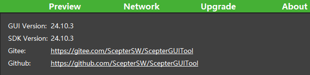

# 1. Overview


ScepterGUITool is a graphical interface tool based on ScepterSDK, which provides functions such as depth image color mapping display, 3D point cloud display, filter parameter adjustment, device parameter setting and RGB & depth alignment. You can also set the IP address and upgrade the firmware of the device through the setting page.

The ScepterGUITool version mentioned in the text is **v24.10.3**



> If you need to operate multiple devices at the same time, you need to open a separate ScepterGUITool instance for each device.
>
> <div class="center">
>
> 
>
> </div>

ScepterGUITool download link:

<https://github.com/ScepterSW/ScepterGUITool>

or

<https://gitee.com/ScepterSW/ScepterGUITool>

You can download the Scepter development package through the following download methods:

Method 1: Downloads to local through git clone;

Method 2: Download the compressed package locally；

Method 3: Download the installer.

<!-- tabs:start -->

#### **Method 1**

① Open the download link, click Code, and copy the link;

```shell
> git clone https://github.com/ScepterSW/ScepterGUITool
```


② Open the terminal, enter the copied code and press Enter, and wait for the download to complete.


#### **Method 2**

open the **Releases** link, download the lastest version

Download link:

<https://github.com/ScepterSW/ScepterGUITool/releases>

or

<https://gitee.com/ScepterSW/ScepterGUITool/releases>

Taking v24.9.2 as an example, click Source code.


#### **Method 3**

Open the **Releases** link，download the lastest version.

Download link:

<https://github.com/ScepterSW/ScepterGUITool/releases>

or

<https://gitee.com/ScepterSW/ScepterGUITool/releases>


<!-- tabs:start -->

#### **Windows**

**Download:** 

Taking v24.9.2 as an example, click ScepterGUITool_v24.9.2_windows_install.exe.


**Install:** 

Double-click the xxx_install.exe locally，the default installed path is **C:\Users\user.name\AppData\Roaming\ScepterGUITool**.


> Change the path with Browse.
>
> 
>
> Multi-install, choose overwrite or other path.
>
> 

Click Next.


Click Next.


Click Install.


Click Finish. Double-click the ScepterGUITool's icon in desktop，ro Double-click the ScepterGUITool in the installed path.


#### **Ubuntu**

**Download:** 

Taking v24.9.2 as an example, click ScepterGUITool_v24.9.2_ubuntu_install.run.


**Install:** 

Open the terminal and add the execution permission to xxx_install.run.

```shell
> sudo chmod +x ScepterGUITool_vXX.XX.XX_ubuntu_install.run
```


```shell
> ./ScepterGUITool_vXX.XX.XX_ubuntu_install.run
```


The installed path is **/home/username/ScepterGUITool/**


Click the ScepterGUITool icon in left, or search the ScepterGUITool and click, or Double-click the ScepterGUITool in the installed path.


<!-- tabs:end -->

<!-- tabs:end -->

The products currently supported by Scepter GUITool are:

- NYX650/660

- DS86/87

- DS77 Lite/DS77 Pro

- DS77C Lite/DS77C Pro

<style>
.center
{
  width: auto;
  display: table;
  margin-left: auto;
  margin-right: auto;
}
</style>
