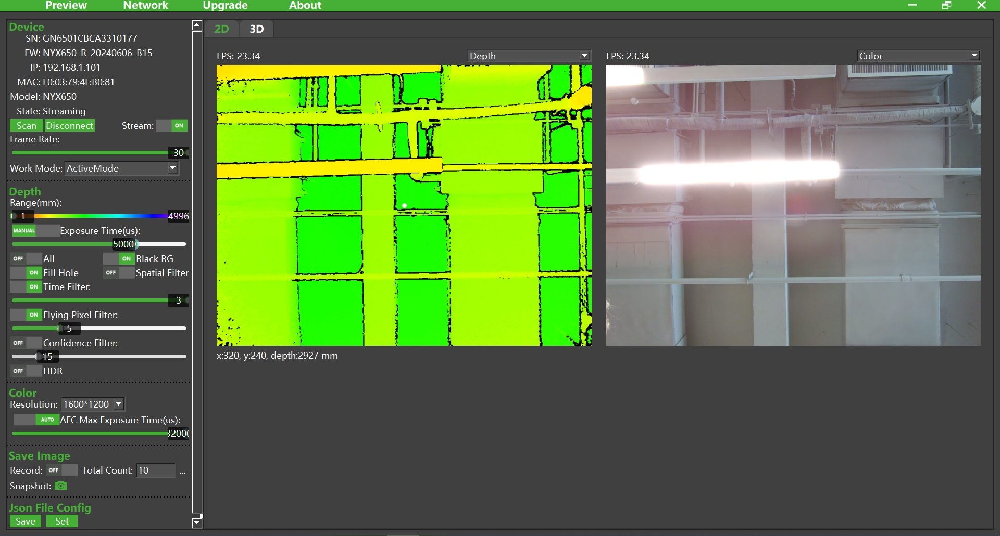

# 1. Overview



ScepterGUITool is a graphical interface tool based on Scepter SDK, which provides functions such as depth image color mapping display, 3D point cloud display, filter parameter adjustment, device parameter setting and RGB & depth alignment. You can also set the IP address and upgrade the firmware of the device through the setting page.

> If you need to operate multiple devices at the same time, you need to open a separate ScepterGUITool instance for each device.
>
> <div class="center">
>
> 
>
> </div>

ScepterGUITool download link:

<https://github.com/ScepterSW/ScepterGUITool>

or

<https://gitee.com/ScepterSW/ScepterGUITool>

You can download the Scepter development package through the following download methods:

Method 1: Downloads to local through git clone;

Method 2: Download the compressed package locally.

<!-- tabs:start -->

#### **Method 1**

① Open the download link, click Code, and copy the link;

```
git clone https://github.com/ScepterSW/ScepterGUITool
```


② Open the terminal, enter the copied code and press Enter, and wait for the download to complete.


#### **Method 2**

Open the download link, click Code, and then click Download ZIP to download the ScepterGUITool compressed package locally.


<!-- tabs:end -->

The products currently supported by Scepter GUITool are:

- NYX650/660

- DS86/87

- DS77 Lite/DS77 Pro

- DS77C Lite/DS77C Pro

<style>
.center
{
  width: auto;
  display: table;
  margin-left: auto;
  margin-right: auto;
}
</style>
