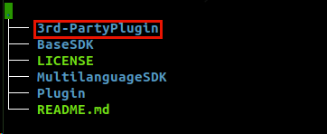
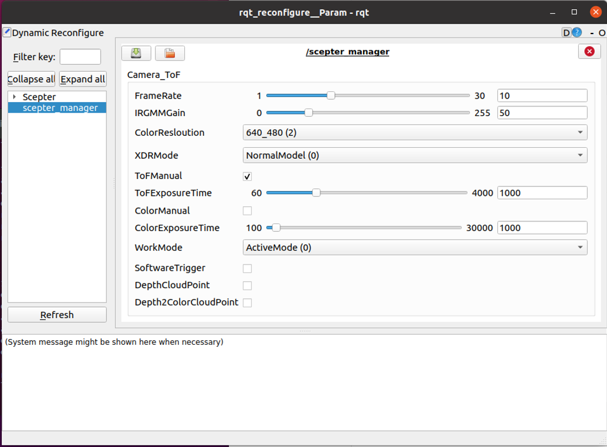

# 4.1. ROS

This ROS package facilitates depth IR and color data acquisition and processing for ScepterSDK.

## 4.1.1. Environmental requirements

**1. Install the recommended [ROS distribution](http://wiki.ros.org/Distributions) for your operating system**

- ROS Install page：<http://wiki.ros.org/ROS/Installation>

- You can use a third-party plug-in, FishROS, to quickly install ROS:<https://github.com/fishros/install>

**2. Version verified**

| system      | details         |
| ----------- | --------------- |
| Ubuntu20.04 | Noetic Ninjemys |
| Ubuntu18.04 | Melodic Morenia |
| Ubuntu16.04 | Kinetic Kame    |

## 4.1.2. Install the ROS package

<!-- 在 ScepterSDK 中，ScepterROS 可以用于连接单个设备，而 ScepterROS_MultiCameras 则适用于连接多个设备。 -->

In the ScepterSDK, ScepterROS can be used to connect to a single device, while ScepterROS_MultiCameras is suitable for connecting to multiple devices.

**1. Download the Scepter ROS package**

```console
> git clone https://github.com/ScepterSW/ScepterSDK
```

  <div class="center">



  </div>

**2. Install the Scepter ROS SDK**

```console
> cd 3rd-PartyPlugin/ROS/src
> catkin_init_workspace
```

<!-- 在运行**catkin_init_workspace**命令之后，其会在**ROS/src**文件夹下生成**CmakeLists.txt** -->

After run **catkin_init_workspace**, it will generate the **CmakeLists.txt** in the **ROS/src** folder

  <div class="center">


  </div>

<!-- tabs:start -->

#### **ROS**

```console
> cd ScepterROS
```

#### **ROS_MultiCameras**

```console
> cd ScepterROS_MultiCameras
```

<!-- tabs:end -->

<div class="center">


</div>

<!-- **3. install.py**: 通过命令"**python install.py (您的操作系统)**"，可以将与您操作系统匹配的**ScepterSDK**拷贝到**dependencies**文件夹中, 这里我们以**Ubuntu18.04**为例： -->

Run the cmd "**python install.py [your operating system]", take **Ubuntu18.04** as an example：

```console
> python install.py Ubuntu18.04
```

<!-- tabs:start -->

#### **ROS**

<div class="center">


</div>

#### **ROS_MultiCameras**

<div class="center">


</div>

<!-- tabs:end -->

**3. Build the ScepterROS package**

<!-- tabs:start -->

#### **ROS**

```console
> cd ../../
> catkin_make -DCATKIN_WHITELIST_PACKAGES="ScepterROS"
```

<div class="center">


</div>

#### **ROS_MultiCameras**

```console
> cd ../../
> catkin_make -DCATKIN_WHITELIST_PACKAGES="ScepterROS_MultiCameras"
```

<div class="center">


</div>

<!-- tabs:end -->

```console
> source devel/setup.bash
```

## 4.1.3. Usage

<!-- tabs:start -->

#### **ROS**

**1. Starting camera node**

```console
> cd src/ScepterROS/launch
> roslaunch ScepterROS scepter_camera.launch
```

<div class="center">


</div>

**2. With Rviz show frame**

```console
> rviz
```

<div class="center">


</div>

<div class="center">


</div>

**3. With RQT dynamic reconfigure**

```console
> rosrun rqt_reconfigure rqt_reconfigure
```

<div class="center">



</div>

> **Instructions:**

<!--
> - 修改 FrameRate 将影响 ToFExposureTime 和 ColorExposureTime 的最大值
> - 当 ToFExposureTime 或 ColorExposureTime 设置高于最大值时，该值无效
> - HDRMode 仅在 ToFManual 为 True 时生效
> - ToFManual 设置为 false 时，HDRMode 为 True 时无效
-->

> - Modifying the **FrameRate** will affect the maximum of **ToFExposureTime** and **ColorExposureTime**
> - The value is invalid when **ToFExposureTime** or **ColorExposureTime** is set above the maximum value
> - **HDRMode** takes effect only when **ToFManual** is True
> - **ToFManual** set to false is invalid when **HDRMode** is True

**4. Show PointCloud**

<!-- 打开一个新终端 -->

Open a new terminal

```console
> cd 3rd-PartyPlugin/ROS
> source devel/setup.bash
> cd src/ScepterROS/launch
> roslaunch ScepterROS scepter_pointCloudxyz.launch
```

<div class="center">


</div>

<div class="center">


</div>

**5. Show PointCloud with color**

```console
> roslaunch ScepterROS scepter_pointCloudxyzcolor.launch
```

<div class="center">


</div>

<div class="center">


</div>

#### **ROS_MultiCameras**

**1. Modify Launch**

<!-- **scepter_xxxxx.launch**支持 2 个相机。修改**camera1.lauch**和**camera2.launch**中的 ip。 -->

The **scepter_xxx.launch** support 2 cameras. Modiy the ip in **camera1.lauch** and **camera2.launch**.

<div class="center">


</div>

<div class="center">


</div>

**2. Starting camera node**

```console
> cd src/ScepterROS_MultiCameras/launch
> roslaunch ScepterROS_MultiCameras scepter_camera.launch
```

<div class="center">


</div>

**3. With Rviz show frame**

Rviz can show frames of multi topics

```console
> rviz
```

<div class="center">


</div>

<div class="center">


</div>

<div class="center">


</div>

**4. With RQT dynamic reconfigure**

```console
> rosrun rqt_reconfigure rqt_reconfigure
```

<div class="center">


</div>

> **Instructions:**
>
> - Modifying the **FrameRate** will affect the maximum of **ToFExposureTime** and **ColorExposureTime**
> - The value is invalid when **ToFExposureTime** or **ColorExposureTime** is set above the maximum value
> - **HDRMode** takes effect only when **ToFManual** is True
> - **ToFManual** set to false is invalid when **HDRMode** is True

**5. Show PointCloud**

Open a new terminal and rviz can only show one topic

```console
> cd 3rd-PartyPlugin/ROS
> source devel/setup.bash
> cd src/ScepterROS_MultiCameras/launch
> roslaunch ScepterROS_MultiCameras scepter_pointCloudxyz.launch
```

<div class="center">


</div>

<div class="center">


</div>

<div class="center">


</div>

**6. Show PointCloud with color**

Rviz can only show one topic

```console
> roslaunch ScepterROS_MultiCameras scepter_pointCloudxyzcolor.launch
```

<div class="center">


</div>

<div class="center">


</div>

<!-- tabs:end -->

## 4.1.4. Published Topics

<!-- tabs:start -->

#### **ROS**

The scepter_manager publishes messages defined by the [sensor_msgs](http://wiki.ros.org/sensor_msgs) package on the following topics

- /Scepter/depth/camera_info
- /Scepter/color/image_raw
- /Scepter/depth/image_raw
- /Scepter/ir/image_raw
- /Scepter/transformedColor/image_raw
- /Scepter/transformedDepth/image_raw

#### **ROS_MultiCameras**

The scepter_manager publishes messages defined by the [sensor_msgs](http://wiki.ros.org/sensor_msgs) package on the following topics

- /**nodename**/depth/camera_info
- /**nodename**/color/image_raw
- /**nodename**/depth/image_raw
- /**nodename**/ir/image_raw
- /**nodename**/transformedDepth/image_raw
- /**nodename**/transformedColor/image_raw


<!-- tabs:end -->

## 4.1.5. Programming guide

If developers need to set camera parameters or algorithm switches, please refer to the following process.
Take calling **scSetSpatialFilterEnabled** as an example:

1. Find the api From **/src/ScepterROS/dependencies/include/Scepter_api.h**

<div class="center">


</div>

2. Add the code into **/src/ScepterROS/src/scepter_manager.cpp**

<div class="center">


</div>

<style>
.center
{
  width: auto;
  display: table;
  margin-left: auto;
  margin-right: auto;
}
</style>
