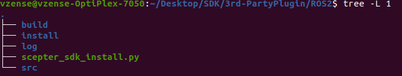
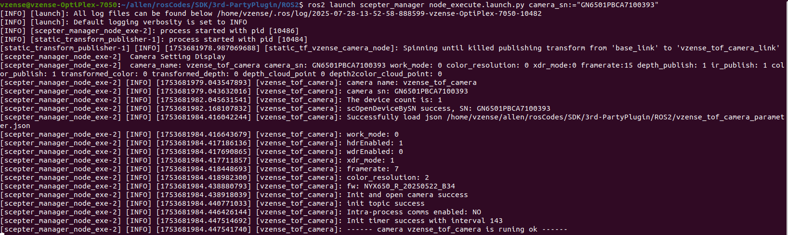
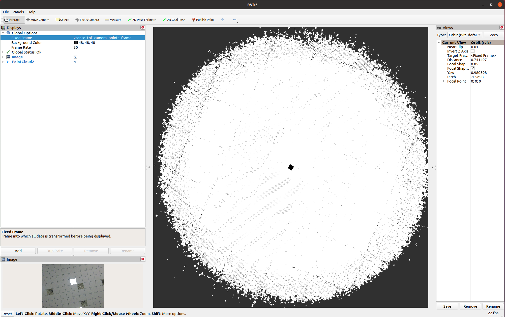
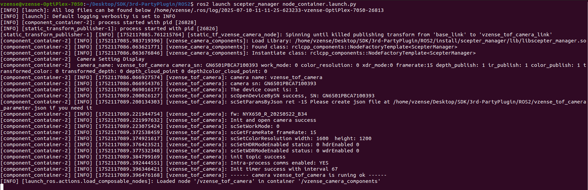
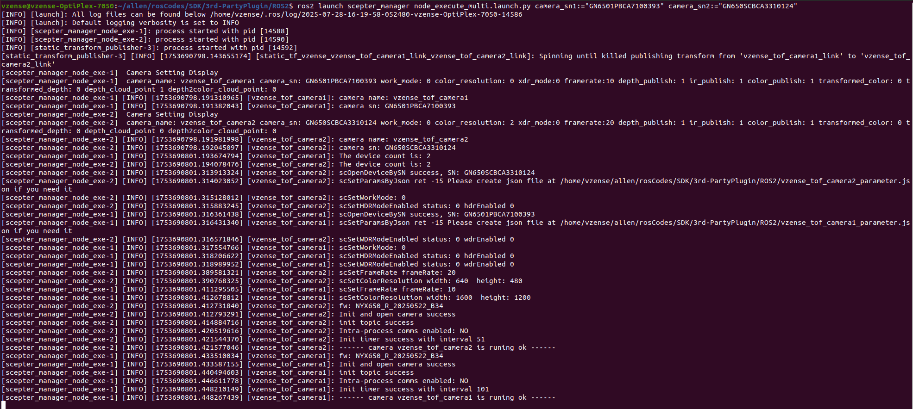
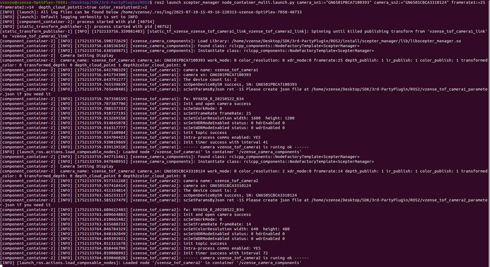

# 4.2. ROS2

The ROS2 software package is utilized for the acquisition and processing of Depth, Infrared (IR), and Color data from the ScepterSDK.

## 4.2.1. Environment requirements

**1. Install the recommended ROS2 distribution for your operation system.(<https://ros.org/reps/rep-2000.html>)**

- ROS2 installation page：<https://docs.ros.org/>

- The third-party plugin FishROS can be used to install ROS2 package quickly：<https://github.com/fishros/install>

**2. Verified version**

| System       | Distribution     |
| ------------ | ---------------- |
| Ubuntu 24.04 | Jazzy Jalisco    |
| Ubuntu 22.04 | Humble Hawksbill |
| Ubuntu 20.04 | Foxy Fitzroy     |

**3. Install the necessary tools**

- Install python 

  ```shell
  > sudo apt install python3
  ```

- Install colcon

  ```shell
  > sudo apt install python3-colcon-common-extensions
  ```

- Install pcl，just for **Jazzy Jalisco**

  ```shell
  > sudo apt install libpcl-dev
  ```


## 4.2.2. Install the ROS package

**1. Download the Scepter ROS2 package**

```shell
> git clone https://github.com/ScepterSW/ScepterSDK
```

  <div class="center">


  </div>

**2. Install Scepter ROS SDK**

```shell
> cd SDK/3rd-PartyPlugin/ROS2
```

<div class="center">


</div>

>./src
>
>├── sc_enumerate_devices -- The Vzense Camera enumeration package which is used to collect camera information such as camera IP, camera series number and camera status;
>
>├── scepter_manager -- The Vzense Camera package which is is used to connect to Vzense cameras for the collection and processing of Depth, IR and Color data;

The dependencies required by the Scepter ROS2 Wrapper can be copied to the **dependencies** folder by executing the command "**python3 scepter_sdk_install.py**".

Using the **x86_64-Ubuntu20.04** platform as sample:

```shell
> python3 scepter_sdk_install.py
```

```shell
Dependencies of package <scepter_manager> has installed successfully on Platform x86_64-Ubuntu20.04
Dependencies of package <sc_enumerate_devices> has installed successfully on Platform x86_64-Ubuntu20.04
```

**3.  Build ScepterROS2 Package**

```shell
> cd SDK/3rd-PartyPlugin/ROS2
```

- Build sc_enumerate_devices and scepter_manager 

```shell
> colcon build --packages-select sc_enumerate_devices scepter_manager
```

```shell
Starting >>> sc_enumerate_devices
Starting >>> scepter_manager
Finished <<< sc_enumerate_devices [3.47s]
Finished <<< scepter_manager [13.8s]

Summary: 2 packages finished [14.0s]
```

```shell
> source install/setup.bash
```

- Enumerate devices' information and status


```shell
> ros2 run sc_enumerate_devices sc_enumerate_devices 
```

```shell
[INFO] [1751508675.828313553] [sc_enumerate_devices]: Find device successfully, The device count is : 1
[INFO] [1751508675.828385016] [sc_enumerate_devices]: device 1 ip 192.168.1.103 seriesnumber GN6501PBCA7100393 status 1
```
<div class="center">


</div>

- Building result


<div class="center">



</div>

## 4.2.3. Usage
<!-- tabs:start -->

### **Single camera**

**1. Start the camera node**

Enter the camera SN which is obtained by sc_enumerate_devices package in the command-line parameters.

```shell
> ros2 launch scepter_manager node_execute.launch.py camera_sn:="GN6501PBCA7100393"
```

<div class="center">



</div>

 The **node_execute.launch.py** file is responsible for loading the **default.param.yaml** configuration, which is located at the path **./install/scepter_manager/share/scepter_manager/param/**. This file provides the necessary parameters that will be utilized as startup configurations for the camera node during its initialization.

>If you need to modify the camera node startup parameters, there are two following ways：
>
>Method 1: Modify the yaml file
>
>Modify the default.param.yaml as needed before the node starts.
>
>Method 2: Set command-line parameters
>
>For example, set the frame rate to 20 and set the color resolution to 640×480, the rest of parameters remain the configurations in the default.param.yaml file.
>
>```shell
>> ros2 launch scepter_manager node_execute.launch.py framerate:=20 color_resolution:=2
>```

**2. Camera dynamic parameter setting**

View parameter list

```Shell
> ros2 param list /vzense_tof_camera
```


| Parameter name          | Parameter meaning                                    | Parameter  type | Parameter value range                                       | Dynamic modification support |
| ----------------------- | ---------------------------------------------------  | --------------- | ------------------------------------------------------------ | ---------------------------- |
| camera_name             | Node name                                            | string          | Any combination of letters and numbers                       | No                           |
| camera_sn               | Camera Series Number                                 | string          | Camera Series Number                                         | No                           |
| framerate               | Framerate                                            | int             | [1-30]                                                       | Yes                          |
| work_mode               | Camera work mode                                     | int             | [0-2] <br />0: Active Mode <br />1: Hardwaretrigger Mode <br />2: Softwaretrigger Mode | Yes                          |
| color_resolution        | Camera RGB resolution                                | int             | [0-2] <br />0: 1600×1200 <br />1: 800×600 <br />2: 640×480   | Yes                          |
| xdr_mode                | Camera HDR and WDR mode setting                      | int             | [0-2] <br />0: hdr off&wdr off <br />1: hdr on&wdr off <br />2: hdr off&wdr on | Yes                          |
| depth_publish           | Depth image topic publication control                | bool            | [true,false]<br />true: Publish <br />false: Publish prohibited | Yes                          |
| ir_publish              | IR image topic publication control                   | bool            | [true,false]<br />true:Publish<br />false:Publish prohibited | Yes                          |
| color_publish           | RGB image topic publication control                  | bool            | [true,false]<br />true:Publish<br />false:Publish prohibited | Yes                          |
| transformed_color       | Color-to-Depth image topic publication control       | bool            | [true,false]<br />true:Publish<br />false:Publish prohibited | Yes                          |
| transformed_depth       | Depth-to-Color image topic publication control       | bool            | [true,false]<br />true:Publish<br />false:Publish prohibited | Yes                          |
| depth_cloud_point       | Depth cloud point topic publication control          | bool            | [true,false]<br />true:Publish<br />false:Publish prohibited | Yes                          |
| depth2color_cloud_point | Depth-to-Color cloud point topic publication control | bool            | [true,false]<br />true:Publish<br />false:Publish prohibited | Yes                          |
| software_trigger        | Software-trigger switch                              | bool            | [true,false]<br />true:Trigger once<br />false:Trigger once  | Yes                          |

<!-- tabs:start -->

### **Method 1**

```shell
> ros2 param set /vzense_tof_camera depth_cloud_point true
```

### **Method 2**

```shell
> rqt
```

<div class="center">


</div>

<!-- tabs:end -->

**3. Topic list**

The scepter_manager package publishes messages defined by the [sensor_msgs](http://wiki.ROS2.org/sensor_msgs) package on the following topics:

| Topic name                                               | Topic type                  | Topic information                                            |
| -------------------------------------------------------- | --------------------------- | ------------------------------------------------------------ |
| /tf_static                                               | tf2_msgs/msg/TFMessage      | Static TF message                                            |
| /vzense_tof_camera/\<sn\>/color/camera_info              | sensor_msgs/msg/CameraInfo  | Color sensor camera info                                     |
| /vzense_tof_camera/\<sn\>/color/image_raw                | sensor_msgs/msg/Image       | Color image                                                  |
| /vzense_tof_camera/\<sn\>/depth/camera_info              | sensor_msgs/msg/CameraInfo  | Depth sensor camera info                                     |
| /vzense_tof_camera/\<sn\>/depth/image_raw                | sensor_msgs/msg/Image       | Depth image                                                  |
| /vzense_tof_camera/\<sn\>/depth/points                   | sensor_msgs/msg/PointCloud2 | Depth cloud point                                            |
| /vzense_tof_camera/\<sn\>/depth/points/camera_info       | sensor_msgs/msg/CameraInfo  | Depth sensor camera info with depth cloud point frame id     |
| /vzense_tof_camera/\<sn\>/depth2color/points             | sensor_msgs/msg/PointCloud2 | Depth-to-color cloud point                                   |
| /vzense_tof_camera/\<sn\>/depth2color/points/camera_info | sensor_msgs/msg/CameraInfo  | Color sensor camera info with depth-to-color cloud point frame id |
| /vzense_tof_camera/\<sn\>/ir/camera_info                 | sensor_msgs/msg/CameraInfo  | Depth sensor camera info with IR frame id                    |
| /vzense_tof_camera/\<sn\>/ir/image_raw                   | sensor_msgs/msg/Image       | IR image                                                     |
| /vzense_tof_camera/\<sn\>/transformedColor/camera_info   | sensor_msgs/msg/CameraInfo  | Depth sensor camera info with color-to-depth frame id        |
| /vzense_tof_camera/\<sn\>/transformedColor/image_raw     | sensor_msgs/msg/Image       | Color-to-depth aligned image                                 |
| /vzense_tof_camera/\<sn\>/transformedDepth/camera_info   | sensor_msgs/msg/CameraInfo  | Color sensor camera info with depth-to-color frame id        |
| /vzense_tof_camera/\<sn\>/transformedDepth/image_raw     | sensor_msgs/msg/Image       | Depth-to-color aligned image                                 |

>Some topics are not published by default and must be activated through the configuration of dynamic parameters.

**4. Subscribe topics through the Rviz2**

```shell
> ros2 run rviz2 rviz2
```

- Subscribe the Color image

The topic name of the Color image is **/color/image_raw**

<div class="center">


</div>

<div class="center">


</div>

- Subscribe the Depth cloud point

The topic name of the Depth cloud point is **/depth/points**

```shell
> rqt
```

<div class="center">


</div>

> By default, the depth cloud point topic would not be published when the camera node starts up. You can modify it through dynamic parameter setting with rqt.

<div class="center">




</div>

**5. Intra Process Communication Support**

```Shell
> ros2 launch scepter_manager node_container.launch.py camera_sn:="GN6501PBCA7100393"
```

<div class="center">



</div>

### **Multiple cameras**

**1. Start multiple camera nodes**

Starting two camera nodes as example. Enter the camera SN which is obtained by sc_enumerate_devices package in the command-line parameters.

The command as follows:

```
> ros2 launch scepter_manager node_execute_multi.launch.py camera_sn1:="GN6501PBCA7100393" camera_sn2:="GN650SCBCA3310124"
```

<div class="center">



</div>

 The **node_execute_multi.launch.py** file is responsible for loading the **camera1.yaml** and **camera2.yaml** configuration, which is located at the path **./install/scepter_manager/share/scepter_manager/param/**. Those files provide the necessary parameters that will be utilized as startup configurations for the camera1 node and camera2 node during the node initialization.

>If you need to modify the camera node startup parameters, there are two following ways：
>
>Method 1: Modify the yaml file corresponding to the camera
>
>Modify the camera1.yaml when you want to modify camra1's startup parameters and modify the camera2.yaml as the same way for camera2.
>
>Method 2: Set the command-line parameters corresponding to the camera
>
>Only the parameters within camera\<ID\>.yaml can be set. The input parameter naming format is **paramname\<ID\>**. Taking framerate as an example, framerate1:=25 and framerate2:=14
>
>Use the default values within camera\<ID\>.yaml for those unset parameters;
>
>For example, set the frame rate of camera1 to 25 and publish the depth point cloud of camera1 and set the frame rate of camera2 to 14, and the color resolution of camera2 to 640*480. The remaining parameters still use the camera\<ID\>.yaml file configuration.
>
>```
>> ros2 launch scepter_manager node_execute_multi.launch.py camera_sn1:="GN6501PBCA7100393" camera_sn2:="GN650SCBCA3310124" framerate1:=25 framerate2:=14  depth_cloud_point1:=true color_resolution2:=2
>```

**2. Camera dynamic parameter setting**

The usage method is the same as the single device way, only the selected node name is different.

**3. Multiple camera topic list**

The scepter_manager package publishes messages defined by the [sensor_msgs](http://wiki.ROS2.org/sensor_msgs) package on the following topics：

| Topic name                                                 | Topic type                  | Topic information                                            |
| ---------------------------------------------------------- | --------------------------- | ------------------------------------------------------------ |
| /tf_static                                                 | tf2_msgs/msg/TFMessage      | Static TF message                                            |
| /vzense_tof_camera1/\<sn1\>/color/camera_info              | sensor_msgs/msg/CameraInfo  | Color sensor camera info of camera1                          |
| /vzense_tof_camera1/\<sn1\>/color/image_raw                | sensor_msgs/msg/Image       | Color image of camera1                                       |
| /vzense_tof_camera1/\<sn1\>/depth/camera_info              | sensor_msgs/msg/CameraInfo  | Depth sensor camera info of camera1                          |
| /vzense_tof_camera1/\<sn1\>/depth/image_raw                | sensor_msgs/msg/Image       | Depth image of camera1                                       |
| /vzense_tof_camera1/\<sn1\>/depth/points                   | sensor_msgs/msg/PointCloud2 | Depth cloud point of camera1                                 |
| /vzense_tof_camera1/\<sn1\>/depth/points/camera_info       | sensor_msgs/msg/CameraInfo  | Depth sensor camera info of camera1 with depth cloud point frame id |
| /vzense_tof_camera1/\<sn1\>/depth2color/points             | sensor_msgs/msg/PointCloud2 | Depth-to-color cloud point of camera1                        |
| /vzense_tof_camera1/\<sn1\>/depth2color/points/camera_info | sensor_msgs/msg/CameraInfo  | Color sensor camera info of camera1 with depth-to-color cloud point frame id |
| /vzense_tof_camera1/\<sn1\>/ir/camera_info                 | sensor_msgs/msg/CameraInfo  | Depth sensor camera info of camera1 with IR frame id         |
| /vzense_tof_camera1/\<sn1\>/ir/image_raw                   | sensor_msgs/msg/Image       | IR image of camera1                                          |
| /vzense_tof_camera1/\<sn1\>/transformedColor/camera_info   | sensor_msgs/msg/CameraInfo  | Depth sensor camera info of camera1 with color-to-depth frame id |
| /vzense_tof_camera1/\<sn1\>/transformedColor/image_raw     | sensor_msgs/msg/Image       | Color-to-depth aligned image of camera1                      |
| /vzense_tof_camera1/\<sn1\>/transformedDepth/camera_info   | sensor_msgs/msg/CameraInfo  | Color sensor camera info of camera1 with depth-to-color frame id |
| /vzense_tof_camera1/\<sn1\>/transformedDepth/image_raw     | sensor_msgs/msg/Image       | Depth-to-color aligned image of camera1                      |
| /vzense_tof_camera2/\<sn2\>/color/camera_info              | sensor_msgs/msg/CameraInfo  | Color sensor camera info of camera2                          |
| /vzense_tof_camera2/\<sn2\>/color/image_raw                | sensor_msgs/msg/Image       | Color image of camera2                                       |
| /vzense_tof_camera2/\<sn2\>/depth/camera_info              | sensor_msgs/msg/CameraInfo  | Depth sensor camera info of camera2                          |
| /vzense_tof_camera2/\<sn2\>/depth/image_raw                | sensor_msgs/msg/Image       | Depth image of camera2                                       |
| /vzense_tof_camera2/\<sn2\>/depth/points                   | sensor_msgs/msg/PointCloud2 | Depth cloud point of camera2                                 |
| /vzense_tof_camera2/\<sn2\>/depth/points/camera_info       | sensor_msgs/msg/CameraInfo  | Depth sensor camera info of camera2 with depth cloud point frame id |
| /vzense_tof_camera2/\<sn2\>/depth2color/points             | sensor_msgs/msg/PointCloud2 | Depth-to-color cloud point of camera2                        |
| /vzense_tof_camera2/\<sn2\>/depth2color/points/camera_info | sensor_msgs/msg/CameraInfo  | Color sensor camera info of camera2 with depth-to-color cloud point frame id |
| /vzense_tof_camera2/\<sn2\>/ir/camera_info                 | sensor_msgs/msg/CameraInfo  | Depth sensor camera info of camera2 with IR frame id         |
| /vzense_tof_camera2/\<sn2\>/ir/image_raw                   | sensor_msgs/msg/Image       | IR image of camera2                                          |
| /vzense_tof_camera2/\<sn2\>/transformedColor/camera_info   | sensor_msgs/msg/CameraInfo  | Depth sensor camera info of camera2 with color-to-depth frame id |
| /vzense_tof_camera2/\<sn2\>/transformedColor/image_raw     | sensor_msgs/msg/Image       | Color-to-depth aligned image of camera2                      |
| /vzense_tof_camera2/\<sn2\>/transformedDepth/camera_info   | sensor_msgs/msg/CameraInfo  | Color sensor camera info of camera2 with depth-to-color frame id |
| /vzense_tof_camera2/\<sn2\>/transformedDepth/image_raw     | sensor_msgs/msg/Image       | Depth-to-color aligned image of camera2                      |
>Some topics are not published by default and must be activated through the configuration of dynamic parameters.

**4. Subscribe topics through the Rviz2**

The subscription usage of multi cameras is same as the signle camera. Here is the example of subscribing to the Color image and Depth cloud point of camera1 and the Depth image of camera2.

<div class="center">


</div>

**5. Intra Process Communication Support**

```shell
> ros2 launch scepter_manager node_container_multi.launch.py camera_sn1:="GN6501PBCA7100393" camera_sn2:="GN650SCBCA3310124"
```

<div class="center">



</div>

<!-- tabs:end -->
## 4.2.4. Programming guide

If developers need to set camera parameters or algorithm switches, please refer to the following process.
Take calling **scSetSpatialFilterEnabled** as an example:

- Find the api file from **/src/scepter_manger/dependencies/Include/Scepter_api.h**

<div class="center">


</div>

- Add your codes to **/src/scepter_manger/src/scepter_manager.cpp**

<div class="center">


</div>

## 4.2.5. ROS2 Samples

**1. Samples introduction**

Six packages are available under the ROS2_Samples/src directory, which demonstrate the subscription of images and point clouds.

```shell
├── device_sw_trigger_mode -- Subscribe to the Depth/Ir/Color images of the camera node in SoftwareTigger mode
├── frame_capture_and_save -- Subscribe to the Depth/Ir/Color images of the camera node in Active mode
├── point_cloud_capture_and_save -- Subscribe to the depth cloud point of the camera node in Active mode
├── point_cloud_capture_and_save_depthimg_to_color_sensor -- Subscribe to the Depth-to-Color cloud point of the camera node in Active mode
├── transform_colorimg_to_depth_sensor_frame -- Subscribe to the Color-to-Depth images of the camera node in Active mode
└── transform_depthimg_to_color_sensor_frame-- Subscribe to the Depth-to-Color images of the camera node in Active mode
```

**2. Build samples**

```shell
> cd SDK/3rd-PartyPlugin/ROS2_Samples
> colcon build
```

```shell
Starting >>> device_sw_trigger_mode
Starting >>> frame_capture_and_save
Starting >>> point_cloud_capture_and_save
Starting >>> point_cloud_capture_and_save_depthimg_to_color_sensor
Starting >>> transform_colorimg_to_depth_sensor_frame
Starting >>> transform_depthimg_to_color_sensor_frame
Finished <<< frame_capture_and_save [17.0s]                                                    
Finished <<< transform_colorimg_to_depth_sensor_frame [17.1s]                     
Finished <<< transform_depthimg_to_color_sensor_frame [17.3s]              
Finished <<< device_sw_trigger_mode [17.7s]          
Finished <<< point_cloud_capture_and_save_depthimg_to_color_sensor [26.3s]
Finished <<< point_cloud_capture_and_save [26.9s]

Summary: 6 packages finished [27.1s]
```
**3. Run samples**

- Obtain the camera node name

```shell
> ros2 node list
```

```shell
/static_tf_vzense_camera_node  --- Static TF Node
/vzense_tof_camera             --- Vzense Camera Node
```

- Run the sample to subscribe to the specified data from the named camera node

```shell
> ros2 run device_sw_trigger_mode device_sw_trigger_mode --ros-args -p node_name:="/vzense_tof_camera"

> ros2 run frame_capture_and_save frame_capture_and_save --ros-args -p node_name:="/vzense_tof_camera"

> ros2 run point_cloud_capture_and_save point_cloud_capture_and_save --ros-args -p node_name:="/vzense_tof_camera"

> ros2 run point_cloud_capture_and_save_depthimg_to_color_sensor point_cloud_capture_and_save_depthimg_to_color_sensor  --ros-args -p node_name:="/vzense_tof_camera"

> ros2 run transform_colorimg_to_depth_sensor_frame transform_colorimg_to_depth_sensor_frame  --ros-args -p node_name:="/vzense_tof_camera"

> ros2 run transform_depthimg_to_color_sensor_frame transform_depthimg_to_color_sensor_frame  --ros-args -p node_name:="/vzense_tof_camera"
```

>
> The subscription data would be stored in the corresponding package directory after the sample is executed.
>
<style>
.center
{
  width: auto;
  display: table;
  margin-left: auto;
  margin-right: auto;
}
</style>