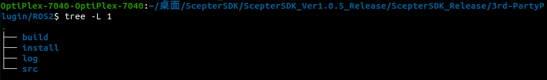
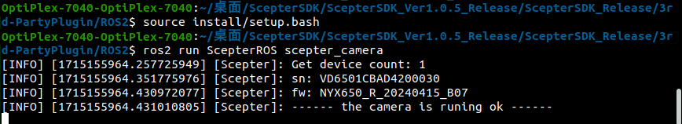
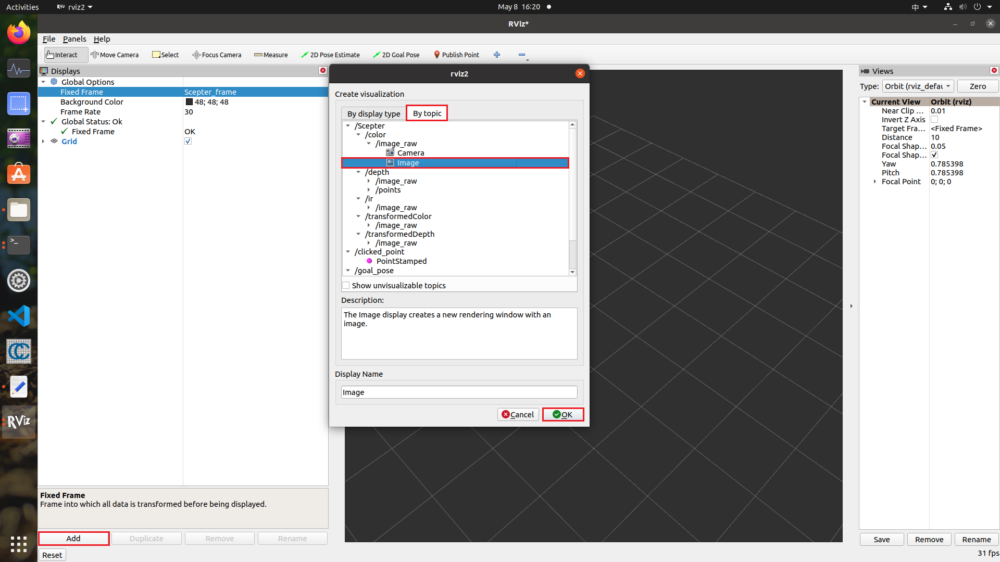
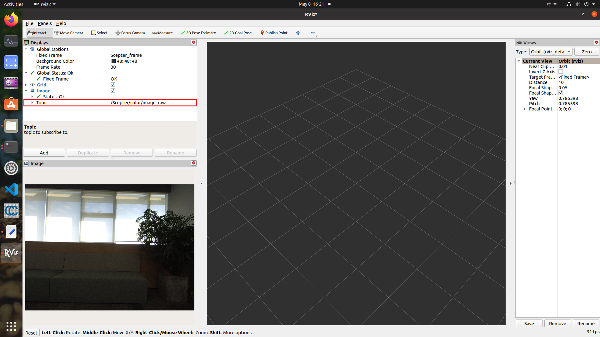
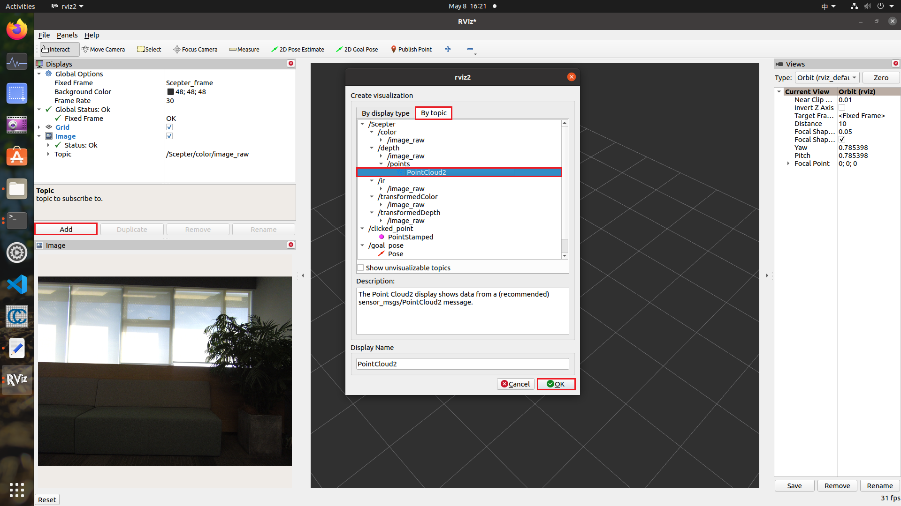
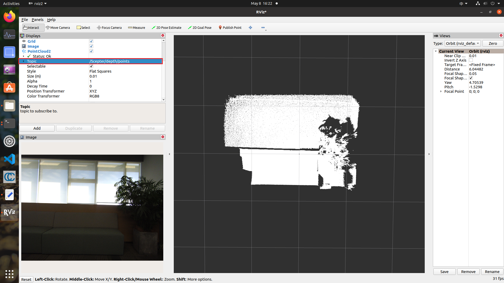
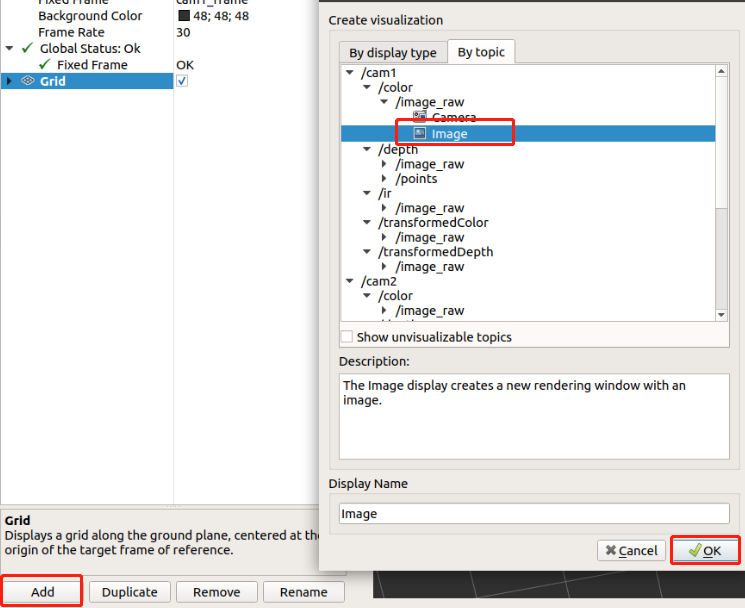
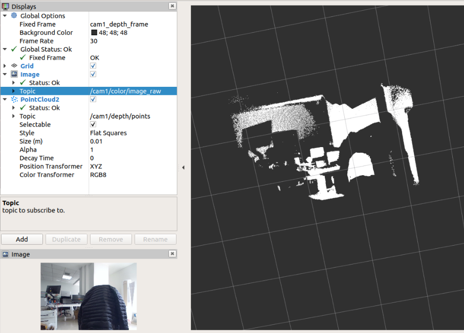
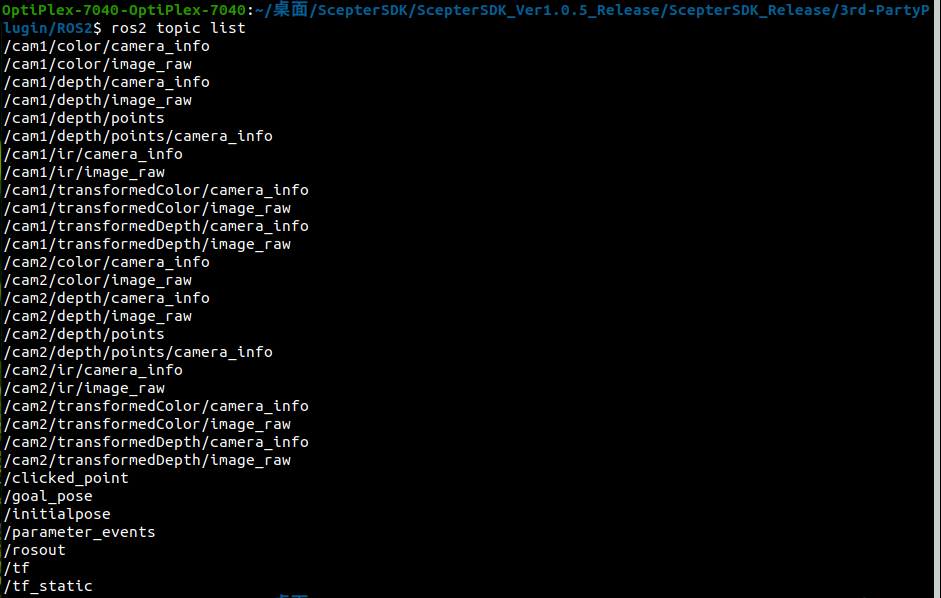

# 4.2. ROS2

This ROS2 package facilitates depth IR and color data acquisition and processing for ScepterSDK.

## 4.2.1. Environmental requirements

**1. Install the recommended ROS distribution(<http://wiki.ros.org/Distributions>) for your operating system**

- ROS2 Install page：<http://docs.ros.org/en/rolling/Installation.html>

- You can use a third-party plug-in, FishROS, to quickly install ROS：<https://github.com/fishros/install>

**2. Version verified**

| system       | details          |
| ------------ | ---------------- |
| Ubuntu 24.04 | Jazzy Jalisco    |
| Ubuntu 22.04 | Humble Hawksbill |
| Ubuntu 20.04 | Foxy Fitzroy     |

**3. Install the needed tools**

- install python

  ```
  > sudo apt install python3
  ```

- install colcon

  ```
  > sudo apt install python3-colcon-common-extensions
  ```

- install pcl, just for **Jazzy Jalisco** 

  ```
  > sudo apt install libpcl-dev
  ```


## 4.2.2. Install the ROS package

<!-- 在 ScepterSDK 中，ScepterROS 可以用于连接单个设备，而 ScepterROS_MultiCameras 则适用于连接多个设备。 -->

In the ScepterSDK, ScepterROS can be used to connect to a single device, while ScepterROS_MultiCameras is suitable for connecting to multiple devices.

**1. Download the Scepter ROS2 package**

```console
> git clone https://github.com/ScepterSW/ScepterSDK
```

  <div class="center">


  </div>

**2. Install the Scepter ROS SDK**

```console
> cd ROS2/src/ScepterROS
```

<div class="center">


</div>

<!-- **3. install.py**: 通过命令"**python install.py (您的操作系统)**"，可以将与您操作系统匹配的**ScepterSDK**拷贝到**dependencies**文件夹中, 这里我们以**Ubuntu20.04**为例： -->

Run the cmd "**python install.py [your operating system]**", take **Ubuntu20.04** as an example：

```console
> python install.py Ubuntu20.04
/home/vzense/work/ScepterSDK-master/BaseSDK
/home/vzense/work/ScepterSDK-master/3rd-PartyPlugin/ROS/src/ScepterROS
pull SDK success
```

<div class="center">
</div>

**3. Build the ScepterROS2 package**

<!-- tabs:start -->

#### **ROS2**

```console
> cd ../../
> colcon build --packages-select ScepterROS
```

<div class="center">


</div>

#### **ROS_MultiCameras**

```console
> cd ../../
> colcon build --packages-select ScepterROS_MultiCameras
```

<div class="center">



</div>

<!-- tabs:end -->

**5.Environment setup**

```console
> source install/setup.bash
```

## 4.2.3. Usage

<!-- tabs:start -->

#### **ROS2**

**1. Starting camera node**

```console
> ros2 run ScepterROS scepter_camera
```

<div class="center">



</div>

**2. With Rviz show frame**

```console
> ros2 run rviz2 rviz2
```

<div class="center">



</div>

<div class="center">



</div>

**3. With Rviz show PointCloud**

<div class="center">



</div>

<div class="center">



</div>

#### **ROS_MultiCameras**

**1. Starting camera node**

```console
> ros2 run ScepterROS_MultiCameras scepter_multicameras <nodename> <ip>
```

such as:

```console
> ros2 run ScepterROS_MultiCameras scepter_multicameras cam1 192.168.1.102
```

<div class="center">


</div>

**2. With Rviz show frame**

Only one topic can be displayed at a time

```console
> ros2 run rviz2 rviz2
```

<div class="center">



</div>

<div class="center">


</div>

**3. With Rviz show PointCloud**

Only one topic can be displayed at a time

<div class="center">


</div>

<div class="center">



</div>

<!-- tabs:end -->

## 4.2.4. Published Topics

<!-- tabs:start -->

#### **ROS2**

The scepter_manager publishes messages defined by the [sensor_msgs](http://wiki.ROS2.org/sensor_msgs) package on the following topics

- /Scepter/color/camera_info
- /Scepter/color/image_raw
- /Scepter/depth/camera_info
- /Scepter/depth/image_raw
- /Scepter/depth/points
- /Scepter/depth/points/camera_info
- /Scepter/ir/camera_info
- /Scepter/ir/image_raw
- /Scepter/transformedColor/camera_info
- /Scepter/transformedColor/image_raw
- /Scepter/transformedDepth/camera_info
- /Scepter/transformedDepth/image_raw

#### **ROS2_MultiCameras**

The scepter_manager publishes messages defined by the [sensor_msgs](http://wiki.ROS2.org/sensor_msgs) package on the following topics

- /**nodename**/color/camera_info
- /**nodename**/color/image_raw
- /**nodename**/depth/camera_info
- /**nodename**/depth/image_raw
- /**nodename**/depth/points
- /**nodename**/depth/points/camera_info
- /**nodename**/ir/camera_info
- /**nodename**/ir/image_raw
- /**nodename**/transformedColor/camera_info
- /**nodename**/transformedColor/image_raw
- /**nodename**/transformedDepth/camera_info
- /**nodename**/transformedDepth/image_raw

<div class="center">



</div>

<!-- tabs:end -->

## 4.2.5. Programming guide

If developers need to set camera parameters or algorithm switches, please refer to the following process.

Take calling **scSetSpatialFilterEnabled** as an example:

- Find the api From **/src/ScepterROS/dependencies/include/Scepter_api.h**

<div class="center">


</div>

- Add the code into **/src/ScepterROS/src/scepter_manager.cpp**

<div class="center">


</div>

<style>
.center
{
  width: auto;
  display: table;
  margin-left: auto;
  margin-right: auto;
}
</style>
