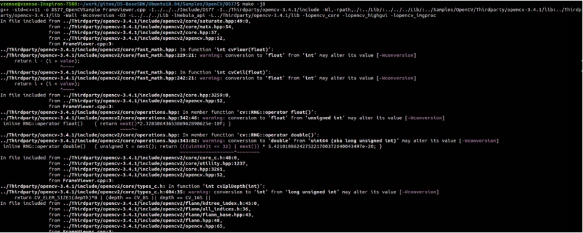
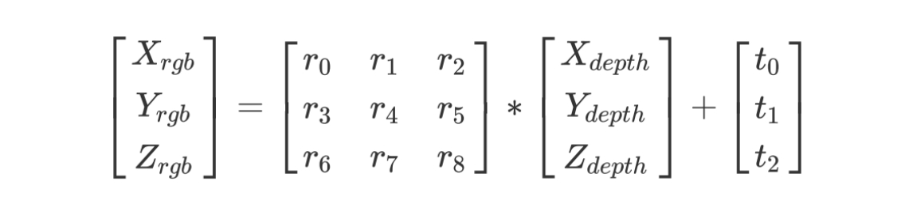

# 2. BaseSDK (C/C++)

## 2.1. Basic introduction

<!-- BaseSDK 包含 Windows，Ubuntu16.04，Ubuntu18.04，AArch64 开发包部分，目录结构如下： -->

BaseSDK includes Windows, Ubuntu 16.04, Ubuntu 18.04, and AArch64 development kits. The directory structure is as follows:

<!-- tabs:start -->

#### **Windows**

<!-- Windows 目录包含个人计算机平台(x86_64) Windows PC 开发包, 使用标准编译器 VS2017。 -->

The Windows directory contains the personal computer platform (x86 \_ 64) Windows PC development kit, using the standard compiler Visual Studio 2017.


<!-- - Bin：目录主要包含 SDK 的动态链接库，如 Scepter_api.dll，包括 x64 和 x86 的版本，运行基于该 SDK 开发的应用之前，需要先将相应平台的 dll 文件拷贝到可执行程序所在的目录。 -->

- Bin: The directory mainly contains the dynamic link library of the SDK, such as Scepter_api.dll,including x64 and x86 versions. Before running the application developed based on this SDK, it is necessary to copy the dll file of the corresponding platform to the directory where the executable program is located.

<!-- - Include：主要包含 SDK 的通用头文件：Scepter_api.h，Scepter_define.h，Scepter_enums.h，Scepter_types.h。 -->

- Include：Includes the common header files of SDK: Scepter_api.h，Scepter_define.h，Scepter_enums.h，Scepter_types.h.

<!-- - Lib：主要包含 SDK 的 lib 文件，如 Scepter_api.lib。-->

- Lib: Primarily the SDK lib files, such as the Scepter_api.lib.

<!-- - PrecompiledSamples：FrameViewer 可查看深度摄像头的深度图像和 IR 图像，针对不同设备，可自行编译 Samples 目录中的 FrameViewer 进行相应展示。 -->

- PrecompiledSamples:FrameViewer can view the depth image and IR image of the depth camera. For different devices, you can compile the FrameViewer in the Samples directory to display accordingly.

<!-- - Samples：主要包含使用 ScepterSDK 开发的例程。 -->

- Samples:Primarily contains samples developed using the Scepter SDK.

<!-- - README：SDK 的内容简介。 -->

- README:Introduction to the SDK.

<!-- - ReleaseNotes：SDK 的版本发布说明。 -->

- ReleaseNotes:Release Notes for the SDK.

#### **Ubuntu**

<!-- Ubuntu16.04 目录包含个人计算机平台(x86_64) Ubuntu16.04 开发包, 使用标准编译器 x86_64-linux-gnu(v5.4.0)。

Ubuntu18.04 目录包含个人计算机平台(x86_64) Ubuntu18.04 开发包, 使用标准编译器 x86_64-linux-gnu(v7.5.0)。

Ubuntu18.04 SDK 包与 Ubuntu20.04、Ubuntu22.04 兼容。 -->

Ubuntu16.04 directory contains the personal computer platform (x86_64) Ubuntu 16.04 development package, using the standard compiler x86_64-linux-gnu(v5.4.0).

Ubuntu18.04 directory contains the Personal Computer Platform (x86_64) Ubuntu18.04 development package, using the standard compiler x86_64-linux-gnu(v7.5.0).

Ubuntu18.04 SDK package is compatible with Ubuntu20.04, Ubuntu22.04.


<!-- - Include：主要包含 SDK 的通用头文件：Scepter_api.h，Scepter_define.h，Scepter_enums.h，Scepter_types.h。 -->

- Include：includes the common header files of SDK:Scepter_api.h，Scepter_define.h，Scepter_enums.h，Scepter_types.h.

<!-- - Lib：主要包含 SDK 的 lib 文件，如 Scepter_api.so。 -->

- Lib: Primarily the SDK lib files, such as the Scepter_api.so.

<!-- - PrecompiledSamples：FrameViewer 可查看深度摄像头的深度图像和 IR 图像，针对不同设备，可自行编译 Samples 目录中的 FrameViewer 进行相应展示。 -->

- PrecompiledSamples:FrameViewer can view the depth image and IR image of the depth camera. For different devices, you can compile the FrameViewer in the Samples directory to display accordingly.

<!-- - Samples：主要包含使用 ScepterSDK 开发的例程。 -->

- Samples:Primarily contains routines developed using the Scepter SDK.

<!-- - README：SDK 的内容简介。 -->

- README:Introduction to the SDK.

<!-- - ReleaseNotes：SDK 的版本发布说明。 -->

- ReleaseNotes:Release Notes for the SDK.

#### **AArch64**

<!-- AArch64 目录包含 64 位 Arm-Linux 开发包，使用标准编译器 aarch64-linux-gnu(v7.5.0)。 -->

AArch64 directory contains the 64-bit Arm-Linux development package, using the standard compiler aarch64-linux-gnu(v7.5.0).


<!-- - Include：主要包含 SDK 的通用头文件：Scepter_api.h，Scepter_define.h，Scepter_enums.h，Scepter_types.h。 -->

- Include：includes the common header files of SDK:Scepter_api.h，Scepter_define.h，Scepter_enums.h，Scepter_types.h.

<!-- - Lib：主要包含 SDK 的 lib 文件，如 Scepter_api.so。 -->

- Lib: Primarily the SDK lib files, such as the Scepter_api.so.

<!-- - PrecompiledSamples：FrameViewer 可查看深度摄像头的深度图像和 IR 图像，针对不同设备，可自行编译 Samples 目录中的 FrameViewer 进行相应展示。 -->

- PrecompiledSamples:FrameViewer can view the depth image and IR image of the depth camera. For different devices, you can compile the FrameViewer in the Samples directory to display accordingly.

<!-- - Samples：主要包含使用 ScepterSDK 开发的例程。 -->

- Samples:Primarily contains routines developed using the Scepter SDK.

<!-- - README：SDK 的内容简介。 -->

- README:Introduction to the SDK.

<!-- - ReleaseNotes：SDK 的版本发布说明。 -->

- ReleaseNotes:Release Notes for the SDK.

<!-- tabs:end -->

## 2.2. Project Configuration

<!-- tabs:start -->

#### **Windows**

<!-- Windows 下使用 Visual Studio 2017 开发，可以选择以下两种方式新建工程：

方式一设置 VC++ 目录和链接器的属性值；

方式二设置 C/C++ 和链接器的属性值。 -->

When developing with Visual Studio 2017 under Windows, you can choose the following two ways to create a new project:

The first method is to set the attribute value of VC++ directory and linker;

The second method is to set the attribute value of C/C++ and linker.

<!-- tabs:start -->

#### **Method 1**

<!-- 新建应用项目工程，设置工程属性，将 Include 目录添加到包含目录中，将 Lib 目录添加到库目录中。 -->

Open the project property, insert the Include path of ScepterSDK to [Include Directories].The Lib path also need be added in [Library Directories].


#### **Method 2**

<!-- 新建应用项目工程，设置工程属性，将 Include 目录添加到附加包含目录中。 -->

Open the project property, insert the Include path of ScepterSDK to [Include Directories].


<!-- 将 Lib 目录添加到附加库目录中。 -->

The Lib path also need be added in [Library Directories].


<!-- tabs:end -->

<!-- 将 Scepter_api.lib 添加到附加依赖项中。 -->

Additionally, it needs to add the Scepter_api.lib to [Additional Dependencies].


<!-- 依据开发环境(x64/x86)将 SDK 的 Bin 文件夹中 x64/x86 下的所有文件拷贝到项目工程指定的输出目录中。 -->

Copy all files under x64/x86 in the Bin folder of SDK to the output directory specified by the project according to the development environment (x64/x86).


<!-- 可参考 Samples 中的项目配置。 -->

The project configuration in samples can be referenced.

#### **Ubuntu**

<!-- 使用 ScepterSDK 开发新的项目，需要在 CMakeList 中将 SDK 中的 Include 目录加入到包含路径: -->

Developing new projects with ScepterSDK need configure the Include and Lib path in the CMakeList.txt.

```consle
include_directories("../../../Include")
```

<!-- 将 Lib 目录加入到链接搜索路径，并链接 libScepter_api.so。 -->

Add Lib directory to link search path and link that libScepter_api.so.

```consle
LINK_DIRECTORIES("${CMAKE_CURRENT_SOURCE_DIR}/../../../Lib/")
```

<!-- 具体内容可参考 Samples 中的例程配置。 -->

For details, please refer the CMake example in samples.


#### **AArch64**

<!-- 使用 ScepterSDK 开发新的项目，需要在 CMakeList 中将 SDK 中的 Include 目录加入到包含路径: -->

Developing new projects with ScepterSDK need configure the Include and Lib path in the CMakeList.txt.

```consle
include_directories("../../../Include")
```

<!-- 将 Lib 目录加入到链接搜索路径，并链接 libScepter_api.so。 -->

Add Lib directory to link search path and link that libScepter_api.so.

```consle
LINK_DIRECTORIES("${CMAKE_CURRENT_SOURCE_DIR}/../../../Lib/")
```

<!-- 具体内容可参考 Samples 中的例程配置。 -->

For details, please refer the CMake example in samples.


<!-- tabs:end -->

## 2.3. Base Samples

<!-- 基础例程介绍 SDK 的单个特性 API 接口的使用。为了使用户可以快速的熟悉使用，例程根据产品进行分类。 -->

The base sample is used to demonstrate the single feature of basic APIs. In order to help developer familiar with SDK quickly, the examples are classified according to products.

<!-- 例程包含打开图像数据流、图像获取、软/硬触发、点云转换与保存等 API 接口的使用。 -->

Open device, image acquisition, software/hardware trigger, point cloud store are all included in the SDK example codes.


<!-- 接下来，我们将详细介绍每个例程的Function。 -->

Next, we will detail the Function for each sample.

```cpp
ColorExposureTimeSetGet                         //Set and get the exposure time of color sensor.
ColorResolutionChange                           //Change device color sensor resolution.
DevHotPlugCallbackC                             //Set the callback function for hotplug status by C.
DevHotPlugCallbackCpp                           //Set the callback function for hotPlug status by C++.
DeviceConnectByIP                               //Use the device IP address to connect the device.
DeviceConnectBySN                               //Use the serial number to connect the device.
DeviceHWTriggerMode                             //Set device to Hardware Trigger Mode.
DeviceInfoGet                                   //Get Device SN, IP address and firmware version information.
DeviceParamSetGet                               //Get intrinsic parameters and extrinsic parameters of the device, and set and get the GmmaGian value of the Device.
DeviceSearchAndConnect                          //Search and connect the Device.
DeviceSetFrameRate                              //Set Device Rrame Rate.
DeviceSetParamsByJson                           //Set device parameters by Json.
DeviceStartStopStreaming                        //Start and stop device streaming
DeviceSWTriggerMode                             //Set device to Software Trigger Mode.
FrameCaptureAndSave                             //Capture and save device frame.
IRGMMCorrectionSetGet                           //Set and get the IRGMMCorrection parameters of device.
MultiConnection                                 //Multiple device connection.
MultiConnectionInMultiThread                    //Multiple device connections in multiple threads.
PointCloudCaptureAndSave                        //Capture and save point cloud.
PointCloudCaptureAndSaveDepthImgToColorSensor   //Capture the point cloud and save the depth image to the color sensor.
PointCloudVectorAndSave                         //Capture and save point clouds in the ROI.
PointCloudVectorAndSaveDepthImgToColorSensor    //Capture the point cloud in the ROI and save the depth image to the color sensor.
ToFExposureTimeSetGet                           //Set and get ToF exposure time of the device.
ToFFiltersSetGet                                //Set and get ToF Filters switch of the device.
TransformColorImgToDepthSensorFrame             //Color image is transformed to depth sensor space where the resolution is the same as the depth frame's resolution.
TransformDepthImgToColorSensorFrame             //Depth image is transformed to color sensor space where the resolution is the same as the color frame's resolution.
```

<!-- 下面，我们以单个产品的单独例程为例，演示其编译运行的过程： -->

Take a single routine of a single product as an example to demonstrate the process of compiling and running it:

<!-- tabs:start -->

#### **Windows**

<!-- 1. 根据实际产品选择对应的 sample，以 NYX650 产品编译 DeviceConnectBySN 为例:

   ① 鼠标右键选择需要启动的项目，选择右键选项栏中的“设为启动项目”选项。

   ② 点击菜单栏的“调试”按钮，选择下拉栏中的“开始调试”或使用快捷键“F5”编译运行项目。 -->

1. Select the corresponding sample according to the actual product. Take the NYX650 product to compile DeviceConnectBySN as an example:

   ① Select the item to be started with the right mouse button, and select the "Set as Startup Item" option in the right-click option bar.

   ② Click the "Debug" button in the menu bar, and select "Start Debugging" in the drop-down bar or use the shortcut key "F5" to compile and run the project.

   

<!-- 2. 编译完成，调试运行。结果如下图： -->

2. After compilation is complete, debug and run. The results are as follows:

   

#### **Ubuntu**

<!-- 1. 根据实际产品选择对应的 sample，以 NYX650 产品编译 DeviceConnectBySN 为例 -->

1. Select the corresponding sample according to the actual product. Take the NYX650 product to compile DeviceConnectBySN as an example:

   ```consle
   cd ScepterSDK/Ubuntu18.04/Samples/Base/NYX650
   mkdir build
   cd build/
   cmake ../
   make
   ```

   

   

<!-- 2. 编译完成，输出路径为 PrecompiledSamples，进入目录后运行。 -->

2. After compiling, the output path is PrecompiledSamples. Enter the directory and run.

   ```consle
   cd ScepterSDK/Ubuntu/PrecompiledSamples/NYX650_Samples/
   ./DeviceConnectBySN
   ```

   

#### **AArch64**

<!-- 1. 根据实际产品选择对应的 sample，以 NYX650 产品编译 DeviceConnectBySN 为例: -->

1. Select the corresponding sample according to the actual product. Take the NYX650 product to compile DeviceConnectBySN as an example:

   ```consle
   cd ScepterSDK/AArch64/Samples/Base/NYX650/
   mkdir build
   cd build/
   cmake ../
   make
   ```

   

   

<!-- 2. 编译完成，输出路径为 PrecompiledSamples，进入目录后运行。 -->

2. After compiling, the output path is PrecompiledSamples. Enter the directory and run.

   ```consle
   cd ScepterSDK/AArch64/PrecompiledSamples/NYX650_Samples/
   ./DeviceConnectBySN
   ```

   

<!-- tabs:end -->

## 2.4. OpenCV Samples

<!-- OpenCV 例程用于展示如何搭配第三方库使用 ScepterSDK。例程使用 OpenCV 的图像映射Function展示彩色深度图像、IR 与 Color 图像。 -->

The OpenCV samples show how to use ScepterSDK with third-party libraries. The example uses the image mapping function of OpenCV to display color depth images, IR, and Color images.

<!-- tabs:start -->

#### **Windows**

<!-- 1. 到 OpenCV 官网，下载并安装 [OpenCV 3.0.0](https://sourceforge.net/projects/opencvlibrary/files/opencv-win/3.0.0-rc1/opencv-3.0.0-rc1.exe/download)。 -->

   <!-- 选用此版本的原因是在 ScepterSDK 中，OpenCVSample 采用了 OpenCV 3.0.0 版本进行开发。您可以根据实际的编程需求，选择使用不同版本的 OpenCV。 -->

1. Download and install [OpenCV 3.0.0](https://sourceforge.net/projects/opencvlibrary/files/opencv-win/3.0.0-rc1/opencv-3.0.0-rc1.exe/download) from OpenCV official website.

   The reason for choosing this version is that in Scepter SDK, OpenCV Sample is developed with OpenCV version 3.0.0. You can choose to use different versions of OpenCV according to your actual programming needs.

   
   <!-- 选择指定的位置开始解压。 -->

   Select the specified location to start the extraction.

   

<!-- 2. 设置环境变量 OPENCV_DIR。

   设置此环境变量的原因是在 ScepterSDK 中，OpenCVSample 采用了 OPENCV_DIR 这一环境变量。

   其值为安装的 OpenCV 的 build 目录的绝对路径，例如： -->

2. Set the environment variable OPENCV \_ DIR.

   The reason for setting this environment variable is that in the Scepter SDK, OpenCVSample uses the OPENCV \_ DIR environment variable.

   Its value is the absolute path to the build directory of the installed OpenCV, for example:

   D:\Programs\OpenCV300\opencv\build。

   

<!-- 3. 根据实际产品选择对应的 sample。

   下面以 NYX650 为例，使用 Visual Studio 2017 打开 ScepterSDK\Windows\Samples\OpenCV\NYX650 目录下的 FrameViewer.vcxproj，直接编译。 -->

3. Select the corresponding sample according to the actual product.

   Next, take NYX650 as an example, use Visual Studio 2017 to open the FrameViewer.vcxproj under the directory ScepterSDK\Windows\Samples\OpenCV\NYX650 to compile directly.

   

<!-- 4. 编译生成的可执行文件 FrameViewer.exe 在 ScepterSDK\Windows\Bin\x86\或 ScepterSDK\Windows\Bin\x64\目录下。 -->

4. The FrameViewer.exe of the executable file generated by compilation is in the ScepterSDK\Windows\Bin\x86\ or ScepterSDK\Windows\Bin\x64\ directory.

<!-- 5. 运行 FrameViewer.exe，执行效果如下图。 -->

5. Run the FrameViewer.exe, and the execution effect is shown in the following figure.

   

#### **Ubuntu**

<!-- 1. 为方便您直接使用，Samples/OpenCV/Thirdparty 目录下已经包含预编译好的 OpenCV 3.4.1 版本，无需您额外下载和编译。 -->

1. For your convenience, the pre-compiled version of OpenCV 3.4.1 is already included in the Samples/OpenCV/Thirdparty directory. You do not need to download and compile it.

   

   <!-- 选用此版本的原因是在 ScepterSDK 中，OpenCVSample 采用了 OpenCV 3.4.1 版本进行开发。您可以根据实际的编程需求，选择使用不同版本的 OpenCV。 -->

   The reason for choosing this version is that in Scepter SDK, OpenCV Sample is developed with OpenCV version 3.4.1. You can choose to use different versions of OpenCV according to your actual programming needs.

<!-- 2. 根据实际产品选择对应的 sample，以 NYX650 为例编译 OpenCV 显示例程 -->

2. Select the corresponding sample according to the actual product, and compile the OpenCV display routine with NYX650 as an example.

   ```consle
   cd ScepterSDK/Ubuntu/Samples/OpenCV/NYX650
   mkdir build
   cd build/
   cmake ../
   make
   ```

   

<!-- 3. 运行编译成功后的 Demo -->

3. Run the successfully compiled Demo

   ```consle
   cd ScepterSDK/Ubuntu/PrecompiledSamples/
   ./NYX650_OpenCVSample
   ```

   

#### **AArch64**

<!-- 1. 为方便您直接使用，Samples/OpenCV/Thirdparty 目录下已经包含预编译好的 OpenCV 3.4.1 版本，无需您额外下载和编译。 -->

1. For your convenience, the pre-compiled version of OpenCV 3.4.1 is already included in the Samples/OpenCV/Thirdparty directory. You do not need to download and compile it.

   

   <!-- 选用此版本的原因是在 ScepterSDK 中，OpenCVSample 采用了 OpenCV 3.4.1 版本进行开发。您可以根据实际的编程需求，选择使用不同版本的 OpenCV。

   > AArch64 端常用 headless 模式，该模式下运行 OpenCV 会出错。OpenCV 在 headless 模式下运行可能遇到的问题包括：依赖的图形库不可用、图形环境配置错误、或者 OpenCV 的某些Function依赖于图形处理能力。 -->

   The reason for choosing this version is that in Scepter SDK, OpenCV Sample is developed with OpenCV version 3.4.1. You can choose to use different versions of OpenCV according to your actual programming needs.

   > The headless mode is commonly used on the AArch64 side, and running OpenCV in this mode will cause errors. Problems that OpenCV may encounter when running in headless mode include: a dependent graphics library is not available, the graphics environment is misconfigured, or some OpenCV Functions depend on graphics processing capabilities.

<!-- 2. 根据实际产品选择对应的 sample，以 NYX650 为例编译 OpenCV 显示例程 -->

2. Select the corresponding sample according to the actual product, and compile the OpenCV display routine with NYX650 as an example.

   ```consle
   cd ScepterSDK/AArch64/Samples/OpenCV/NYX650
   mkdir build
   cd build/
   cmake ../
   make
   ```

   

<!-- 3. 运行编译成功后的 Demo -->

3. Run the successfully compiled Demo

   ```consle
   cd ScepterSDK/AArch64/PrecompiledSamples/
   ./NYX650_OpenCVSample
   ```

   

<!-- tabs:end -->

## 2.5. API Introduction

<!-- > 不同型号产品对应的枚举值个数可能不同，请以实际枚举值为准。 -->

> The number of enumeration values corresponding to different models of products may be different. Please refer to the actual enumeration value.

<!-- tabs:start -->

#### **Enum Type**

### 2.5.1.1. ScFrameType

**Description：**

Image type.

**Enumerator：**

```cpp
typedef enum
{
    SC_DEPTH_FRAME                               = 0,   // Depth frame with 16 bits per pixel in millimeters.
    SC_IR_FRAME                                  = 1,   // IR frame with 8 bits per pixel.
    SC_COLOR_FRAME                               = 3,   // Color frame with 24 bits per pixel in RGB/BGR format.
    SC_TRANSFORM_COLOR_IMG_TO_DEPTH_SENSOR_FRAME = 4,   // Color frame with 24 bits per pixel in RGB/BGR format, that is transformed to depth
                                                        // sensor space where the resolution is the same as the depth frame's resolution.
                                                        // This frame type can be enabled using ::scSetTransformColorImgToDepthSensorEnabled().
    SC_TRANSFORM_DEPTH_IMG_TO_COLOR_SENSOR_FRAME = 5,   // Depth frame with 16 bits per pixel, in millimeters, that is transformed to color sensor
                                                        // space where the resolution is same as the color frame's resolution.
                                                        // This frame type can be enabled using ::scSetTransformDepthImgToColorSensorEnabled().
} ScFrameType;
```

### 2.5.1.2. ScPixelFormat

**Description：**

Pixel type of image data.

**Enumerator：**

```cpp
typedef enum
{
    SC_PIXEL_FORMAT_DEPTH_MM16   = 0,   // Depth image pixel format, 16 bits per pixel in mm.
    SC_PIXEL_FORMAT_GRAY_8       = 2,   // Gray image pixel format, 8 bits per pixel.

    // Color
    SC_PIXEL_FORMAT_RGB_888_JPEG = 3,   // By jpeg decompress, color image pixel format, 24 bits per pixel RGB format.
    SC_PIXEL_FORMAT_BGR_888_JPEG = 4,   // By jpeg decompress, color image pixel format, 24 bits per pixel BGR format.
    SC_PIXEL_FORMAT_RGB_888      = 5,   // Without compress, color image pixel format, 24 bits per pixel RGB format.
    SC_PIXEL_FORMAT_BGR_888      = 6,   // Without compress, color image pixel format, 24 bits per pixel BGR format.
    SC_PIXEL_FORMAT_RGB_565      = 7,   // Without compress, color image pixel format, 16 bits per pixel RGB format.
    SC_PIXEL_FORMAT_BGR_565      = 8,   // Without compress, color image pixel format, 16 bits per pixel BGR format.
} ScPixelFormat;
```

### 2.5.1.3. ScSensorType

**Description：**

Sensor Type.

**Enumerator：**

```cpp
typedef enum
{
    SC_TOF_SENSOR   = 0x01,   // Indicates a depth sensor.
    SC_COLOR_SENSOR = 0x02,   // Indicates a color sensor.
} ScSensorType;
```

### 2.5.1.4. ScStatus

**Description：**

Returns of an interface function.

**Enumerator：**

```cpp
typedef enum
{
    SC_OK                           = 0,      // The function completed successfully.
    SC_NO_DEVICE_CONNECTED          = -1,     // There is no. depth camera connected or the camera has not been connected correctly.
                                              // Check the hardware connection or try unplugging and re-plugging the USB cable.
    SC_INVALID_DEVICE_INDEX         = -2,     // The input device index is invalid.
    SC_DEVICE_POINTER_IS_NULL       = -3,     // The device structure pointer is null.
    SC_INVALID_FRAME_TYPE           = -4,     // The input frame type is invalid.
    SC_FRAME_POINTER_IS_NULL        = -5,     // The output frame buffer is null.
    SC_NO_PROPERTY_VALUE_GET        = -6,     // Cannot get the value for the specified property.
    SC_NO_PROPERTY_VALUE_SET        = -7,     // Cannot set the value for the specified property.
    SC_PROPERTY_POINTER_IS_NULL     = -8,     // The input property value buffer pointer is null.
    SC_PROPERTY_SIZE_NOT_ENOUGH     = -9,     // The input property value buffer size is too small to store the specified property value.
    SC_INVALID_DEPTH_RANGE          = -10,    // The input depth range mode is invalid.
    SC_GET_FRAME_READY_TIME_OUT     = -11,    // Capture the next image frame time out.
    SC_INPUT_POINTER_IS_NULL        = -12,    // An input pointer parameter is null.
    SC_CAMERA_NOT_OPENED            = -13,    // The camera has not been opened.
    SC_INVALID_CAMERA_TYPE          = -14,    // The specified type of camera is invalid.
    SC_INVALID_PARAMS               = -15,    // One or more of the parameter values provided are invalid.
    SC_CURRENT_VERSION_NOT_SUPPORT  = -16,    // This feature is not supported in the current version.
    SC_UPGRADE_IMG_ERROR            = -17,    // There is an error in the upgrade file.
    SC_UPGRADE_IMG_PATH_TOO_LONG    = -18,    // Upgrade file path length greater than 260.
    SC_UPGRADE_CALLBACK_NOT_SET     = -19,    // scSetUpgradeStatusCallback is not called.
    SC_PRODUCT_NOT_SUPPORT          = -20,    // The current product does not support this operation.
    SC_NO_CONFIG_FOLDER             = -21,    // No product profile found.
    SC_WEB_SERVER_START_ERROR       = -22,    // WebServer Start/Restart error(IP or PORT).
    SC_GET_OVER_STAY_FRAME          = -23,    // The time from frame ready to get frame is out of 1s.
    SC_CREATE_LOG_DIR_ERROR         = -24,    // Create log directory error.
    SC_CREATE_LOG_FILE_ERROR        = -25,    // Create log file error.
    SC_NO_ADAPTER_CONNECTED         = -100,   // There is no. adapter connected.
    SC_REINITIALIZED                = -101,   // The SDK has been Initialized.
    SC_NO_INITIALIZED               = -102,   // The SDK has not been Initialized.
    SC_CAMERA_OPENED                = -103,   // The camera has been opened.
    SC_CMD_ERROR                    = -104,   // Set/Get cmd control error.
    SC_CMD_SYNC_TIME_OUT            = -105,   // Set cmd ok.but time out for the sync return.
    SC_IP_NOT_MATCH                 = -106,   // IP is not in the same network segment.
    SC_NOT_STOP_STREAM              = -107,   // Please invoke scStopStream first to close the data stream.
    SC_NOT_START_STREAM             = -108,   // Please invoke scStartStream first to get the data stream.
    SC_NOT_FIND_DRIVERS_FOLDER      = -109,   // Please check whether the Drivers directory exists.
    SC_CAMERA_OPENING               = -110,   // The camera is openin,by another Sc_OpenDeviceByXXX API.
    SC_CAMERA_OPENED_BY_ANOTHER_APP = -111,   // The camera has been opened by another APP.
    SC_OTHERS                       = -255,   // An unknown error occurred.
} ScStatus;
```

### 2.5.1.5. ScConnectStatus

**Description：**

Device connection status.

**Enumerator：**

```cpp
typedef enum
{
    SC_LIMBO       = 0,   // Unknown device status and cannot try to open.
    SC_CONNECTABLE = 1,   // Device connectable state and support open.
    SC_OPENED      = 2,   // The device is connected and cannot be opened again.
} ScConnectStatus;
```

### 2.5.1.6. ScWorkMode

**Description：**

Device working condition.

**Enumerator：**

```cpp
typedef enum
{
    SC_ACTIVE_MODE           = 0x00,   // Enter the active mode.
    SC_HARDWARE_TRIGGER_MODE = 0x01,   // Enter the hardware salve mode, at this time need to connect
                                       // the hardware trigger wire, provide hardware signal, to trigger the image.
    SC_SOFTWARE_TRIGGER_MODE = 0x02,   // Enter the software salve mode, at this time need to invoke scSoftwareTriggerOnce, to trigger the image.
} ScWorkMode;
```

### 2.5.1.7. ScExposureControlMode

**Description：**

Exposure mode of the sensor.

**Enumerator：**

```cpp
typedef enum
{
    SC_EXPOSURE_CONTROL_MODE_AUTO   = 0,   // Enter the auto exposure mode.
    SC_EXPOSURE_CONTROL_MODE_MANUAL = 1,   // Enter the manual exposure mode.
} ScExposureControlMode;
```

#### **Struct Type**

### 2.5.2.1. ScVector3f

**Description：**

Three dimensional point coordinates in millimeters.

**Members：**

```cpp
typedef struct
{
    float x;   // Represents the coordinate value along the X-axis.
    float y;   // Represents the coordinate value along the y axis.
    float z;   // Represents the coordinate value along the z axis.
} ScVector3f;
```

### 2.5.2.2. ScVector2u16

**Description：**

Two dimensional point coordinates.

**Members：**

```cpp
typedef struct
{
    uint16_t x;   // Represents the coordinate value along the X-axis.
    uint16_t y;   // Represents the coordinate value along the y axis.
} ScVector2u16;
```

### 2.5.2.3. ScDepthVector3

**Description：**

A pixel representation of a depth image.

**Members：**

```cpp
typedef struct
{
    int32_t      depthX;   // Indicates the coordinate value along the X-axis in the image coordinate system.
    int32_t      depthY;   // Represents the coordinate value along the Y-axis in the image coordinate system.
    ScDepthPixel depthZ;   // Indicates the depth value at pixel coordinates (depthX, depthY), in millimeters.
} ScDepthVector3;
```

### 2.5.2.4. ScResolution

**Description：**

Image resolution.

**Members：**

```cpp
typedef struct
{
    int32_t width;   // The width of the image.
    int32_t height;  // The height of the image.
} ScResolution;
```

### 2.5.2.5. ScResolutionList

**Description：**

Supported Image Resolution.

**Members：**

```cpp
typedef struct
{
    int32_t      count;          // The number of image resolutions.
    ScResolution resolution[6];  // The information of image resolution.
} ScResolutionList;
```

### 2.5.2.6. ScSensorIntrinsicParameters

**Description：**

<!-- 传感器的镜头内参和畸变参数。内参通常用于点云的计算，畸变参数用于图像反畸变算法使用。

SDK 中已经实现深度图像到点云的转换及图像反畸变的Function，请参考例程使用相关接口。 -->

Lens parameters and distortion parameters of the sensor. The internal parameter is usually used to calculate the point cloud and the distortion parameter is used in the image anti-distortion algorithm.

SDK has realized the function of converting depth image to point cloud and image anti-distortion, please refer to the routine to use the relevant interface.

**Members：**

```cpp
typedef struct
{
    double fy;   // Focal length y (pixel).
    double fx;   // Focal length x (pixel).
    double cx;   // Principal point x (pixel).
    double cy;   // Principal point y (pixel).
    double k1;   // Radial distortion coefficient, 1st-order.
    double k2;   // Radial distortion coefficient, 2nd-order.
    double p1;   // Tangential distortion coefficient.
    double p2;   // Tangential distortion coefficient.
    double k3;   // Radial distortion coefficient, 3rd-order.
    double k4;   // Radial distortion coefficient, 4st-order.
    double k5;   // Radial distortion coefficient, 5nd-order.
    double k6;   // Radial distortion coefficient, 6rd-order.
} ScSensorIntrinsicParameters;
```

### 2.5.2.7. ScSensorExtrinsicParameters

**Description：**

The external parameters R and T of the camera are used to align depth with RGB images. The reference formula is as follows:



**Members：**

```cpp
typedef struct
{
    double rotation[9];      // A 3x3 rotation matrix.
    double translation[3];   // 3×1 translation matrix.
} ScSensorExtrinsicParameters;
```

### 2.5.2.8. ScFrame

**Description：**

Depth/IR/Color image information.

**Members：**

```cpp
typedef struct
{
    uint32_t      frameIndex;        // Indicates the index of the frame.
    ScFrameType   frameType;         // Indicates the type of frame. See ::ScFrameType for more information.
    ScPixelFormat pixelFormat;       // Indicates the pixel format used by a frame. See ::ScPixelFormat for more information.
    uint8_t*      pFrameData;        // A buffer containing the frame’s image data.
    uint32_t      dataLen;           // Indicates the length of pFrame, in bytes.
    float         exposureTime;      // Indicates the exposure time, in milliseconds.
    uint8_t       depthRange;        // Indicates the depth range mode of the current frame. Used only for depth frames.
    uint16_t      width;             // Indicates the width of the frame, in pixels.
    uint16_t      height;            // Indicates the height of the frame, in pixels.
    uint64_t      deviceTimestamp;   // Indicates the timestamp when the frame be generated on the device. Frame processing and transfer time are not included.
} ScFrame;
```

### 2.5.2.9. ScFrameReady

**Description：**

Whether the image data is ready (1 means ready, 0 means not ready).

**Enumerator：**

```cpp
typedef struct
{
    uint32_t depth            : 1;    // Indicates whether the depth image data is ready.
    uint32_t ir               : 1;    // Indicates whether grayscale image data is ready.
    uint32_t color            : 1;    // Indicates whether color image data is ready.
    uint32_t transformedColor : 1;    // Indicates whether the color image aligned to the depth sensor space is ready.
    uint32_t transformedDepth : 1;    // Indicates whether the depth image is ready to align to the color sensor space.
    uint32_t reserved         : 27;   //  Reserved bit.
} ScFrameReady;
```

### 2.5.2.10. ScDeviceInfo

**Description：**

Device information.

**Members：**

```cpp
typedef struct
{
    char            productName[64];    // Indicates the Product type name.
    char            SerialNumber[64];   // Indicates the SerialNumber of the device.
    char            ip[17];             // Indicates the IP address of the device.
    ScConnectStatus status;             // Indicates the connection status of the device.
} ScDeviceInfo;
```

### 2.5.2.11. ScTimeFilterParams

**Description：**

Time filter parameter.

**Members：**

```cpp
typedef struct
{
    int32_t threshold;   // Range in [1, 6],The larger the value is, the more obvious the filtering effect is and The smaller the point cloud wobble.
    bool    enable;      // Indicates whether filtering is enabled. True indicates that filtering is enabled. False indicates that filtering is disabled.
} ScTimeFilterParams;
```

### 2.5.2.12. ScConfidenceFilterParams

**Description：**

Confidence filtering parameter.

**Members：**

```cpp
typedef struct
{
    int32_t threshold;   // Range in [1, 100]. The larger the value is, the more obvious the filtering effect is and the more points are filtered out.
    bool    enable;      // Indicates whether filtering is enabled. True indicates that filtering is enabled. False indicates that filtering is disabled.
 filter.
} ScConfidenceFilterParams;
```

### 2.5.2.13. ScFlyingPixelFilterParams

**Description：**

To fly point filter parameters.

**Members：**

```cpp
typedef struct
{
    int32_t threshold;   // Range in [0, 16]. The larger the value is, the more obvious the filtering effect is and the more points are filtered out.
    bool    enable;      // Indicates whether filtering is enabled. True indicates that filtering is enabled. False indicates that filtering is disabled.
} ScFlyingPixelFilterParams;
```

### 2.5.2.14. ScIRGMMCorrectionParams

**Description：**

IR gain value correction parameter.

**Members：**

```cpp
typedef struct
{
    int32_t threshold;   // Range in [1, 100]. The larger the value is, the more obvious the correction effect.
    bool    enable;      // Indicates whether filtering is enabled. True indicates that filtering is enabled. False indicates that filtering is disabled.
} ScIRGMMCorrectionParams;
```

### 2.5.2.15. ScInputSignalParamsForHWTrigger

**Description：**

Input signal parameters for Hardware Trigger.

**Members：**

```cpp
typedef struct
{
    uint16_t width;                  // Range in [1,65535]. The width of input signal.
    uint16_t interval;               // Range in [34000,65535]. The interval of input signal.
    uint8_t  polarity;               // Range in [0,1]. 0 for active low; 1 for active high.
} ScInputSignalParamsForHWTrigger;
```

### 2.5.2.16. ScOutputSignalParams

**Description：**

Output signal parameters.

**Members：**

```cpp
typedef struct
{
    uint16_t width;       // Range in [1,65535]. The width of output signal.
    uint16_t delay;       // Range in [0,65535]. The delay time of output signal.
    uint8_t  polarity;    // Range in [0,1]. 0 for active low; 1 for active high.
} ScOutputSignalParams;
```

### 2.5.2.17. ScTimeSyncConfig

**Description：**

Time Sync parameters.

**Members：**

```cpp
typedef struct
{
    uint8_t flag;     //!< 0: disable, 1: NTP, 2: PTP, only NTP needs the ip.
    uint8_t ip[16];   //!< just for NTP.
} ScTimeSyncConfig;
```

#### **API**

### 2.5.3.1. scInitialize

**Prototype：**

```cpp
ScStatus scInitialize()
```

**Description：**

Initializes the API on the device. This function must be invoked before any other Scepter APIs.

**Parameters：**

There is no.

**Returns：**

[**ScStatus**](#_2514-scstatus)：SC_OK If the function succeeded, or one of the error values defined by ::ScStatus.

### 2.5.3.2. scShutdown

**Prototype：**

```cpp
ScStatus scShutdown()
```

**Description：**

Shuts down the API on the device and clears all resources allocated by the API. After invoking this function, no other Scepter APIs can be invoked.

**Parameters：**

There is no.

**Returns：**

[**ScStatus**](#_2514-scstatus)：SC_OK If the function succeeded, or one of the error values defined by ::ScStatus.

### 2.5.3.3. scGetSDKVersion

**Prototype：**

```cpp
ScStatus scGetSDKVersion(char* pSDKVersion, int32_t length)
```

**Description：**

Obtain the SDK version: X.X.X.

**Parameters：**

There is no.

**Returns：**

Returns The SDK version number.

### 2.5.3.4. scGetDeviceCount

**Prototype：**

```cpp
ScStatus scGetDeviceCount(uint32_t* pDeviceCount, uint32_t scanTime)
```

**Description：**

Get the number of connected devices.

**Parameters：**

<span style="color: #4ec9b0; font-weight: bold">uint32_t</span>\* pDeviceCount：Pointer to a 32-bit integer variable in which to return the device count.

<span style="color: #4ec9b0; font-weight: bold">uint32_t</span> scanTime：Scans time, the unit is millisecond.This function scans devices for scanTime(ms) and then returns the count of devices.

**Returns：**

[**ScStatus**](#_2514-scstatus)：SC_OK If the function succeeded, or one of the error values defined by ::ScStatus.

### 2.5.3.5. scGetDeviceInfoList

**Prototype：**

```cpp
ScStatus scGetDeviceInfoList(uint32_t deviceCount, ScDeviceInfo* pDevicesInfoList)
```

**Description：**

Obtain the device list of the number of Devicecounts.

**Parameters：**

<span style="color: #4ec9b0; font-weight: bold">uint32_t</span> deviceCount：The number of camera devices.

[**ScDeviceInfo**](#_25210-scdeviceinfo)\* pDevicesInfoList：Pointer to a buffer in which to store the devices list infos.

**Returns：**

[**ScStatus**](#_2514-scstatus)：SC_OK If the function succeeded, or one of the error values defined by ::ScStatus.

### 2.5.3.6. scOpenDeviceBySN

**Prototype：**

```cpp
ScStatus scOpenDeviceBySN(const char* pSN, ScDeviceHandle* pDevice)
```

**Description：**

Opens the device using the device SerialNumber. The device must be subsequently closed using scCloseDevice().

**Parameters：**

<span style="color: #4ec9b0; font-weight: bold">const</span> char\* pSN：The SerialNumber of the device. See ::ScDeviceInfo for more information.

<span style="color: #4ec9b0; font-weight: bold">ScDeviceHandle</span>\* pDevice：The handle of the device on which to open.

**Returns：**

[**ScStatus**](#_2514-scstatus)：SC_OK If the function succeeded, or one of the error values defined by ::ScStatus.

### 2.5.3.7. scOpenDeviceByIP

**Prototype：**

```cpp
ScStatus scOpenDeviceByIP(const char* pIP, ScDeviceHandle* pDevice)
```

**Description：**

Use the device IP address to open the device. The device must be subsequently closed using scCloseDevice().

**Parameters：**

<span style="color: #4ec9b0; font-weight: bold">const</span> char\* pIP：The IP adress of the device. See ::ScDeviceInfo for more information.

<span style="color: #4ec9b0; font-weight: bold">ScDeviceHandle</span>\* pDevice： The handle of the device on which to open.

**Returns：**

[**ScStatus**](#_2514-scstatus)：SC_OK If the function succeeded, or one of the error values defined by ::ScStatus.

### 2.5.3.8. scCloseDevice

**Prototype：**

```cpp
ScStatus scCloseDevice(ScDeviceHandle* pDevice)
```

**Description：**

Closes the device specified by device that was opened using scOpenDevice.

**Parameters：**

<span style="color: #4ec9b0; font-weight: bold">ScDeviceHandle</span>\* pDevice： The handle of the device to close.

**Returns：**

[**ScStatus**](#_2514-scstatus)：SC_OK If the function succeeded, or one of the error values defined by ::ScStatus.

### 2.5.3.9. scStartStream

**Prototype：**

```cpp
ScStatus scStartStream(ScDeviceHandle device)
```

**Description：**

Starts capturing the image stream indicated by device.Invoke scStopStream() to stop capturing the image stream.

**Parameters：**

<span style="color: #4ec9b0; font-weight: bold">ScDeviceHandle</span> device： The handle of the device on which to start capturing the image stream.

**Returns：**

[**ScStatus**](#_2514-scstatus)：SC_OK If the function succeeded, or one of the error values defined by ::ScStatus.

### 2.5.3.10. scStopStream

**Prototype：**

```cpp
ScStatus scStopStream(ScDeviceHandle device)
```

**Description：**

Stops capturing the image stream on the device specified by device. that was started using scStartStream.

**Parameters：**

<span style="color: #4ec9b0; font-weight: bold">ScDeviceHandle</span> device： The handle of the device on which to stop capturing the image stream.

**Returns：**

[**ScStatus**](#_2514-scstatus)：SC_OK If the function succeeded, or one of the error values defined by ::ScStatus.

### 2.5.3.11. scGetFrameReady

**Prototype：**

```cpp
ScStatus scGetFrameReady(ScDeviceHandle device, uint16_t waitTime, ScFrameReady* pFrameReady)
```

**Description：**

Gets the image ready state. This function must be called before calling scGetFrame, otherwise the image cannot be retrieved.

**Parameters：**

<span style="color: #4ec9b0; font-weight: bold">ScDeviceHandle</span> device： The handle of the device.

<span style="color: #4ec9b0; font-weight: bold">uint16_t</span> waitTime：The unit is millisecond, the value is in the range (0,65535).You can change the value according to the frame rate. For example,the frame rate is 30, so the theoretical waittime interval is 33ms,but if set the time value is 20ms, it means the maximum wait time is 20 ms when capturing next frame, so when call the scGetFrameReady,it may return SC_GET_FRAME_READY_TIME_OUT(-11).So the recommended value is 2 \* 1000/ FPS.

[**ScFrameReady**](#_2529-scframeready)\* pFrameReady：Pointer to a buffer in which to store the signal on which image is ready to be get.

**Returns：**

[**ScStatus**](#_2514-scstatus)：SC_OK If the function succeeded, or one of the error values defined by ::ScStatus.

### 2.5.3.12. scGetFrame

**Prototype：**

```cpp
ScStatus scGetFrame(ScDeviceHandle device, ScFrameType frameType, ScFrame* pScFrame)
```

**Description：**

Gets image data of the specified image type scGetFrameReady must be called before calling this function.

**Parameters：**

<span style="color: #4ec9b0; font-weight: bold">ScDeviceHandle</span> device： The handle of the device to capture an image frame from.

[**ScFrameType**](#_2511-scframetype) frameType：The image frame type.

[**ScFrame**](#_2528-scframe)\* pScFrame：Pointer to a buffer in which to store the returned image data.

**Returns：**

[**ScStatus**](#_2514-scstatus)：SC_OK If the function succeeded, or one of the error values defined by ::ScStatus.

### 2.5.3.13. scSetWorkMode

**Prototype：**

```cpp
ScStatus scSetWorkMode(ScDeviceHandle device, ScWorkMode mode)
```

**Description：**

Set the working mode of the camera.

**Parameters：**

<span style="color: #4ec9b0; font-weight: bold">ScDeviceHandle</span> device： The handle of the device.

[**ScWorkMode**](#_2516-scworkmode) mode：The work mode of camera. For ActiveMode, set the Time filter default true, for SlaveMode, set the Time filter default false.

**Returns：**

[**ScStatus**](#_2514-scstatus)：SC_OK If the function succeeded, or one of the error values defined by ::ScStatus.

### 2.5.3.14. scGetWorkMode

**Prototype：**

```cpp
ScStatus scGetWorkMode(ScDeviceHandle device, ScWorkMode* pMode)
```

**Description：**

Get the working mode of the camera.

**Parameters：**

<span style="color: #4ec9b0; font-weight: bold">ScDeviceHandle</span> device：The handle of the device.

[**ScWorkMode**](#_2516-scworkmode)\* pMode：Indicates the working mode of the obtained device.

**Returns：**

[**ScStatus**](#_2514-scstatus)：SC_OK If the function succeeded, or one of the error values defined by ::ScStatus.

### 2.5.3.15. scSoftwareTriggerOnce

**Prototype：**

```cpp
ScStatus scSoftwareTriggerOnce(ScDeviceHandle device)
```

**Description：**

Performs a software trigger, valid only when the camera is in SC_SOFTWARE_TRIGGER_MODE.

**Parameters：**

<span style="color: #4ec9b0; font-weight: bold">ScDeviceHandle</span> device：The handle of the device.

**Returns：**

[**ScStatus**](#_2514-scstatus)：SC_OK If the function succeeded, or one of the error values defined by ::ScStatus.

### 2.5.3.16. scGetSensorIntrinsicParameters

**Prototype：**

```cpp
ScStatus scGetSensorIntrinsicParameters(ScDeviceHandle device, ScSensorType sensorType, ScSensorIntrinsicParameters* pSensorIntrinsicParameters)
```

**Description：**

Gets the internal intrinsic parameters from the sensor lens.

**Parameters：**

<span style="color: #4ec9b0; font-weight: bold">ScDeviceHandle</span> device：The handle of the device.

[**ScSensorType**](#_2513-scsensortype) sensorType：The type of sensor (depth or color) from which to get parameter information. Pass in the applicable value defined by ::ScSensorType.

[**ScSensorIntrinsicParameters**](#_2526-scsensorintrinsicparameters)\* pSensorIntrinsicParameters：Pointer to a ScSensorIntrinsicParameters variable in which to store the parameter values.

**Returns：**

[**ScStatus**](#_2514-scstatus)：SC_OK If the function succeeded, or one of the error values defined by ::ScStatus.

### 2.5.3.17. scGetSensorExtrinsicParameters

**Prototype：**

```cpp
ScStatus scGetSensorExtrinsicParameters(ScDeviceHandle device, ScSensorExtrinsicParameters* pSensorExtrinsicParameters)
```

**Description：**

Gets the internal extrinsic parameters from the sensor lens.

**Parameters：**

<span style="color: #4ec9b0; font-weight: bold">ScDeviceHandle</span> device：The handle of the device.

[**ScSensorExtrinsicParameters**](#_2527-scsensorextrinsicparameters)\* pSensorExtrinsicParameters：Pointer to a ::ScSensorExtrinsicParameters variable in which to store the parameters.

**Returns：**

[**ScStatus**](#_2514-scstatus)：SC_OK If the function succeeded, or one of the error values defined by ::ScStatus.

### 2.5.3.18. scGetFirmwareVersion

**Prototype：**

```cpp
ScStatus scGetFirmwareVersion(ScDeviceHandle device, char* pFirmwareVersion, int32_t length)
```

**Description：**

Obtain the firmware version of the device.

**Parameters：**

<span style="color: #4ec9b0; font-weight: bold">ScDeviceHandle</span> device：The handle of the device.

<span style="color: #4ec9b0; font-weight: bold">char</span>\* pFirmwareVersion：Pointer to a variable in which to store the returned fw value.

<span style="color: #4ec9b0; font-weight: bold">int32_t</span> length：Byte length of the cache pointed to by FirmwareVersion.The maximum length is 64 bytes.

**Returns：**

[**ScStatus**](#_2514-scstatus)：SC_OK If the function succeeded, or one of the error values defined by ::ScStatus.

### 2.5.3.19. scGetDeviceMACAddress

**Prototype：**

```cpp
ScStatus scGetDeviceMACAddress(ScDeviceHandle device, char* pMACAddress)
```

**Description：**

Obtain the MAC address of the device.

**Parameters：**

<span style="color: #4ec9b0; font-weight: bold">ScDeviceHandle</span> device：The handle of the device.

<span style="color: #4ec9b0; font-weight: bold">char</span>\* pMACAddress：Pointer to a buffer in which to store the device MAC address. the buffer default size is 18, and the last buffer set '\0'.

**Returns：**

[**ScStatus**](#_2514-scstatus)：SC_OK If the function succeeded, or one of the error values defined by ::ScStatus.

### 2.5.3.20. scSetIRGMMGain

**Prototype：**

```cpp
ScStatus scSetIRGMMGain(ScDeviceHandle device, uint8_t gmmgain)
```

**Description：**

Sets the digital gain of the IR image.

**Parameters：**

<span style="color: #4ec9b0; font-weight: bold">ScDeviceHandle</span> device：The handle of the device.

<span style="color: #4ec9b0; font-weight: bold">uint8_t</span> gmmgain：The value of IRGMM Gain. Different products have different maximum value. Please refer to the product specification.

**Returns：**

[**ScStatus**](#_2514-scstatus)：SC_OK If the function succeeded, or one of the error values defined by ::ScStatus.

### 2.5.3.21. scGetIRGMMGain

**Prototype：**

```cpp
ScStatus scGetIRGMMGain(ScDeviceHandle device, uint8_t* pGmmgain)
```

**Description：**

Obtaines the digital gain of the IR image.

**Parameters：**

<span style="color: #4ec9b0; font-weight: bold">ScDeviceHandle</span> device：The handle of the device.

<span style="color: #4ec9b0; font-weight: bold">uint8_t</span>\* pGmmgain：Pointer to a variable in which to store the returned GMM gain.

**Returns：**

[**ScStatus**](#_2514-scstatus)：SC_OK If the function succeeded, or one of the error values defined by ::ScStatus.

### 2.5.3.22. scSetIRGMMCorrection

**Prototype：**

```cpp
ScStatus scSetIRGMMCorrection(ScDeviceHandle device, const ScIRGMMCorrectionParams params)
```

**Description：**

Set the device IR GMM Correction on a device.

**Parameters：**

<span style="color: #4ec9b0; font-weight: bold">ScDeviceHandle</span> device：The handle of the device.

<span style="color: #4ec9b0; font-weight: bold">const</span> [**ScIRGMMCorrectionParams**](#_25214-scirgmmcorrectionparams) params：The value of IR GMM Correction.

**Returns：**

[**ScStatus**](#_2514-scstatus)：SC_OK If the function succeeded, or one of the error values defined by ::ScStatus.

### 2.5.3.23. scGetIRGMMCorrection

**Prototype：**

```cpp
ScStatus scGetIRGMMCorrection(ScDeviceHandle device, ScIRGMMCorrectionParams* params)
```

**Description：**

Obtaines the device IR GMM Correction on a device.

**Parameters：**

<span style="color: #4ec9b0; font-weight: bold">ScDeviceHandle</span> device：The handle of the device.

[**ScIRGMMCorrectionParams**](#_25214-scirgmmcorrectionparams)\* params：The value of IR GMM Correction.

**Returns：**

[**ScStatus**](#_2514-scstatus)：SC_OK If the function succeeded, or one of the error values defined by ::ScStatus.

### 2.5.3.24. scSetColorPixelFormat

**Prototype：**

```cpp
ScStatus scSetColorPixelFormat(ScDeviceHandle device,ScPixelFormat pixelFormat)
```

**Description：**

Set the color image pixel format on the device specified by device. Currently only RGB and BGR formats are supported.

**Parameters：**

<span style="color: #4ec9b0; font-weight: bold">ScDeviceHandle</span> device：The handle of the device.

[**ScPixelFormat**](#_2512-scpixelformat) pixelFormat：The color pixel format to use. Pass in one of the values defined by ::ScPixelFormat. Others cameras support only SC_PIXEL_FORMAT_RGB_888_JPEG and SC_PIXEL_FORMAT_BGR_888_JPEG.

**Returns：**

[**ScStatus**](#_2514-scstatus)：SC_OK If the function succeeded, or one of the error values defined by ::ScStatus.

### 2.5.3.25. scSetColorGain

**Prototype：**

```cpp
ScStatus scSetColorGain(ScDeviceHandle device, float params)
```

**Description：**

Set the color Gain with the exposure mode of Color sensor in SC_EXPOSURE_CONTROL_MODE_MANUAL.

**Parameters：**

<span style="color: #4ec9b0; font-weight: bold">ScDeviceHandle</span> device：The handle of the device.

<span style="color: #4ec9b0; font-weight: bold">float</span> params：The value of color Gain.Different products have different maximum value. Please refer to the product specification.

**Returns：**

[**ScStatus**](#_2514-scstatus)：SC_OK If the function succeeded, or one of the error values defined by ::ScStatus.

### 2.5.3.26. scGetColorGain

**Prototype：**

```cpp
ScStatus scGetColorGain(ScDeviceHandle device, float params)
```

**Description：**

Get the color Gain.

**Parameters：**

<span style="color: #4ec9b0; font-weight: bold">ScDeviceHandle</span> device：The handle of the device.

<span style="color: #4ec9b0; font-weight: bold">float</span> params：The value of color Gain.

**Returns：**

[**ScStatus**](#_2514-scstatus)：SC_OK If the function succeeded, or one of the error values defined by ::ScStatus.

### 2.5.3.27. scSetColorResolution

**Prototype：**

```cpp
ScStatus scSetColorResolution(ScDeviceHandle device, int32_t w, int32_t h)
```

**Description：**

Set the color frame Resolution.

**Parameters：**

<span style="color: #4ec9b0; font-weight: bold">ScDeviceHandle</span> device：The handle of the device.

<span style="color: #4ec9b0; font-weight: bold">int32_t</span> w：The width of color image.

<span style="color: #4ec9b0; font-weight: bold">int32_t</span> h：The height of color image.

**Returns：**

[**ScStatus**](#_2514-scstatus)：SC_OK If the function succeeded, or one of the error values defined by ::ScStatus.

### 2.5.3.28. scGetColorResolution

**Prototype：**

```cpp
ScStatus scGetColorResolution(ScDeviceHandle device, int32_t* pW, int32_t* pH)
```

**Description：**

Obtaines the the color frame Resolution.

**Parameters：**

<span style="color: #4ec9b0; font-weight: bold">ScDeviceHandle</span> device：The handle of the device.

<span style="color: #4ec9b0; font-weight: bold">int32_t</span>\* pW：Ruturns the width of color image.

<span style="color: #4ec9b0; font-weight: bold">int32_t</span>\* pH：Ruturns the height of color image.

**Returns：**

[**ScStatus**](#_2514-scstatus)：SC_OK If the function succeeded, or one of the error values defined by ::ScStatus.

### 2.5.3.29. scGetSupportedResolutionList

**Prototype：**

```cpp
ScStatus scGetSupportedResolutionList(ScDeviceHandle device, ScSensorType type, ScResolutionList* pList)
```

**Description：**

Get a list of image resolutions supported by Sensor.

**Parameters：**

<span style="color: #4ec9b0; font-weight: bold">ScDeviceHandle</span> device：The handle of the device.

[**ScSensorType**](#_2513-scsensortype) type：The sensor type.

[**ScResolutionList**](#_2525-scresolutionlist)\* pList：List of supported resolutions.

**Returns：**

[**ScStatus**](#_2514-scstatus)：SC_OK If the function succeeded, or one of the error values defined by ::ScStatus.

### 2.5.3.30. scSetFrameRate

**Prototype：**

```cpp
ScStatus scSetFrameRate(ScDeviceHandle device, int32_t value)
```

**Description：**

Sets the device's image frame rate for both depth and color images. This interface is a synchronization interface, which takes about 500ms.

**Parameters：**

<span style="color: #4ec9b0; font-weight: bold">ScDeviceHandle</span> device：The handle of the device.

<span style="color: #4ec9b0; font-weight: bold">int32_t</span> value：The rate value. Different products have different maximum values. Please refer to the product specification.

**Returns：**

[**ScStatus**](#_2514-scstatus)：SC_OK If the function succeeded, or one of the error values defined by ::ScStatus.

### 2.5.3.31. scGetFrameRate

**Prototype：**

```cpp
ScStatus scGetFrameRate(ScDeviceHandle device, int32_t* pValue)
```

**Description：**

Gets the image frame rate of the device.

**Parameters：**

<span style="color: #4ec9b0; font-weight: bold">ScDeviceHandle</span> device：The handle of the device.

<span style="color: #4ec9b0; font-weight: bold">int32_t</span>\* pValue：Returns the frame rate of the device image.

**Returns：**

[**ScStatus**](#_2514-scstatus)：SC_OK If the function succeeded, or one of the error values defined by ::ScStatus.

### 2.5.3.32. scSetExposureControlMode

**Prototype：**

```cpp
ScStatus scSetExposureControlMode(ScDeviceHandle device, ScSensorType sensorType, ScExposureControlMode controlMode)
```

**Description：**

Set the exposure mode of sensor.

**Parameters：**

<span style="color: #4ec9b0; font-weight: bold">ScDeviceHandle</span> device：The handle of the device.

[**ScSensorType**](#_2513-scsensortype) sensorType：The type of sensor (depth or color) from which to get parameter information. Pass in the applicable value defined by ::ScSensorType.

[**ScExposureControlMode**](#_2517-scexposurecontrolmode) controlMode：The exposure control mode.

**Returns：**

[**ScStatus**](#_2514-scstatus)：SC_OK If the function succeeded, or one of the error values defined by ::ScStatus.

### 2.5.3.33. scGetExposureControlMode

**Prototype：**

```cpp
ScStatus scGetExposureControlMode(ScDeviceHandle device, ScSensorType sensorType, ScExposureControlMode* pControlMode)
```

**Description：**

Get the exposure mode of sensor.

**Parameters：**

<span style="color: #4ec9b0; font-weight: bold">ScDeviceHandle</span> device：The handle of the device.

[**ScSensorType**](#_2513-scsensortype) sensorType：The type of sensor (depth or color) from which to get parameter information. Pass in the applicable value defined by ::ScSensorType.

[**ScExposureControlMode**](#_2517-scexposurecontrolmode) controlMode：Returns the exposure control mode.

**Returns：**

[**ScStatus**](#_2514-scstatus)：SC_OK If the function succeeded, or one of the error values defined by ::ScStatus.

### 2.5.3.34. scSetExposureTime

**Prototype：**

```cpp
ScStatus scSetExposureTime(ScDeviceHandle device, ScSensorType sensorType, int32_t exposureTime)
```

**Description：**

Set the exposure time of sensor.

**Parameters：**

<span style="color: #4ec9b0; font-weight: bold">ScDeviceHandle</span> device：The handle of the device.

[**ScSensorType**](#_2513-scsensortype) sensorType：The type of sensor (depth or color) from which to get parameter information. Pass in the applicable value defined by ::ScSensorType.

<span style="color: #4ec9b0; font-weight: bold">int32_t</span> exposureTime：The exposure time. The value must be within the maximum exposure time of sensor.

**Returns：**

[**ScStatus**](#_2514-scstatus)：SC_OK If the function succeeded, or one of the error values defined by ::ScStatus.

### 2.5.3.35. scGetExposureTime

**Prototype：**

```cpp
ScStatus scGetExposureTime(ScDeviceHandle device, ScSensorType sensorType, int32_t* pExposureTime)
```

**Description：**

Get the exposure time of sensor.

**Parameters：**

<span style="color: #4ec9b0; font-weight: bold">ScDeviceHandle</span> device：The handle of the device.

[**ScSensorType**](#_2513-scsensortype) sensorType：The type of sensor (depth or color) from which to get parameter information. Pass in the applicable value defined by ::ScSensorType.

<span style="color: #4ec9b0; font-weight: bold">int32_t\*</span> pExposureTime：Returns the exposure time.

**Returns：**

[**ScStatus**](#_2514-scstatus)：SC_OK If the function succeeded, or one of the error values defined by ::ScStatus.

### 2.5.3.36. scSetColorAECMaxExposureTime

**Prototype：**

```cpp
ScStatus scSetColorAECMaxExposureTime(ScDeviceHandle device, int32_t exposureTime);
```

**Description：**

Set the maximum exposure time of color sensor in automatic mode. The interface is used in automatic mode.

**Parameters：**

<span style="color: #4ec9b0; font-weight: bold">ScDeviceHandle</span> device：The handle of the device.

<span style="color: #4ec9b0; font-weight: bold">int32_t</span> exposureTime：The exposure time. The value must be within the maximum exposure time of sensor.

**Returns：**

[**ScStatus**](#_2514-scstatus)：SC_OK If the function succeeded, or one of the error values defined by ::ScStatus.

### 2.5.3.37. scGetColorAECMaxExposureTime

**Prototype：**

```cpp
ScStatus scGetColorAECMaxExposureTime(ScDeviceHandle device, int32_t* pExposureTime)
```

**Description：**

Get the maximum exposure time of color sensor in automatic mode. The interface is used in automatic mode.

**Parameters：**

<span style="color: #4ec9b0; font-weight: bold">ScDeviceHandle</span> device：The handle of the device.

<span style="color: #4ec9b0; font-weight: bold">int32_t\*</span> pExposureTime：Returns the exposure time.

**Returns：**

[**ScStatus**](#_2514-scstatus)：SC_OK If the function succeeded, or one of the error values defined by ::ScStatus.

### 2.5.3.38. scGetMaxExposureTime

**Prototype：**

```cpp
ScStatus scGetMaxExposureTime(ScDeviceHandle device, ScSensorType sensorType, int32_t* pMaxExposureTime);
```

**Description：**

Get the maximum exposure time of sensor.

**Parameters：**

<span style="color: #4ec9b0; font-weight: bold">ScDeviceHandle</span> device：The handle of the device.

[**ScSensorType**](#_2513-scsensortype) sensorType：The type of sensor (depth or color) from which to get parameter information. Pass in the applicable value defined by ::ScSensorType.

<span style="color: #4ec9b0; font-weight: bold">int32_t</span>\* pMaxExposureTime：The maximum exposure time. The maximum exposure time is different at different frame rates.

**Returns：**

[**ScStatus**](#_2514-scstatus)：SC_OK If the function succeeded, or one of the error values defined by ::ScStatus.

### 2.5.3.39. scSetTimeFilterParams

**Prototype：**

```cpp
ScStatus scSetTimeFilterParams(ScDeviceHandle device, ScTimeFilterParams params)
```

**Description：**

Set the parameters of the Time filter.

**Parameters：**

<span style="color: #4ec9b0; font-weight: bold">ScDeviceHandle</span> device：The handle of the device.

[**ScTimeFilterParams**](#_25211-sctimefilterparams) params：Pointer to a variable in which to store the parameters.

**Returns：**

[**ScStatus**](#_2514-scstatus)：SC_OK If the function succeeded, or one of the error values defined by ::ScStatus.

### 2.5.3.40. scGetTimeFilterParams

**Prototype：**

```cpp
ScStatus scGetTimeFilterParams(ScDeviceHandle device, ScTimeFilterParams* pParams)
```

**Description：**

Get the parameters of the Time Filter feature.

**Parameters：**

<span style="color: #4ec9b0; font-weight: bold">ScDeviceHandle</span> device：The handle of the device.

[**ScTimeFilterParams**](#_25211-sctimefilterparams) params：Pointer to a variable in which to store the returned value.

**Returns：**

[**ScStatus**](#_2514-scstatus)：SC_OK If the function succeeded, or one of the error values defined by ::ScStatus.

### 2.5.3.41. scSetConfidenceFilterParams

**Prototype：**

```cpp
ScStatus scSetConfidenceFilterParams(ScDeviceHandle device,ScConfidenceFilterParams params)
```

**Description：**

Set the parameters of the Confidence filter.

**Parameters：**

<span style="color: #4ec9b0; font-weight: bold">ScDeviceHandle</span> device：The handle of the device.

[**ScConfidenceFilterParams**](#_25212-scconfidencefilterparams) params：Pointer to a variable in which to store the parameters.

**Returns：**

[**ScStatus**](#_2514-scstatus)：SC_OK If the function succeeded, or one of the error values defined by ::ScStatus.

### 2.5.3.42. scGetConfidenceFilterParams

**Prototype：**

```cpp
ScStatus scGetConfidenceFilterParams(ScDeviceHandle device, ScConfidenceFilterParams *pParams)
```

**Description：**

Get the parameters of the ConfidenceFilter feature.

**Parameters：**

<span style="color: #4ec9b0; font-weight: bold">ScDeviceHandle</span> device：The handle of the device.

[**ScConfidenceFilterParams**](#_25212-scconfidencefilterparams) *pParams：Pointer to a variable in which to store the returned value.

**Returns：**

[**ScStatus**](#_2514-scstatus)：SC_OK If the function succeeded, or one of the error values defined by ::ScStatus.

### 2.5.3.43. scSetFlyingPixelFilterParams

**Prototype：**

```cpp
ScStatus scSetFlyingPixelFilterParams(ScDeviceHandle device, const ScFlyingPixelFilterParams params)
```

**Description：**

Set the parameters of the FlyingPixel filter.

**Parameters：**

<span style="color: #4ec9b0; font-weight: bold">ScDeviceHandle</span> device：The handle of the device.

<span style="color: #4ec9b0; font-weight: bold">const</span> [**ScFlyingPixelFilterParams**](#_25213-scflyingpixelfilterparams) params：Pointer to a variable in which to store the parameters.

**Returns：**

[**ScStatus**](#_2514-scstatus)：SC_OK If the function succeeded, or one of the error values defined by ::ScStatus.

### 2.5.3.44. scGetFlyingPixelFilterParams

**Prototype：**

```cpp
ScStatus scGetFlyingPixelFilterParams(ScDeviceHandle device, ScFlyingPixelFilterParams* params)
```

**Description：**

Get the parameters of the FlyingPixel filter.

**Parameters：**

<span style="color: #4ec9b0; font-weight: bold">ScDeviceHandle</span> device：The handle of the device.

[**ScFlyingPixelFilterParams**](#_25213-scflyingpixelfilterparams)\* params：Pointer to a variable in which to store the returned value.

**Returns：**

[**ScStatus**](#_2514-scstatus)：SC_OK If the function succeeded, or one of the error values defined by ::ScStatus.

### 2.5.3.45. scSetFillHoleFilterEnabled

**Prototype：**

```cpp
ScStatus scSetFillHoleFilterEnabled(ScDeviceHandle device, bool bEnabled);
```

**Description：**

Enables or disables the FillHole filter.

**Parameters：**

<span style="color: #4ec9b0; font-weight: bold">ScDeviceHandle</span> device：The handle of the device.

<span style="color: #4ec9b0; font-weight: bold">bool</span> bEnabled：Set to true to enable the feature or false to disable the feature.

**Returns：**

[**ScStatus**](#_2514-scstatus)：SC_OK If the function succeeded, or one of the error values defined by ::ScStatus.

### 2.5.3.46. scGetFillHoleFilterEnabled

**Prototype：**

```cpp
ScStatus scGetFillHoleFilterEnabled(ScDeviceHandle device, bool* pEnabled);
```

**Description：**

Obtaines the Boolean value of whether the FillHole Filter feature is enabled or disabled.

**Parameters：**

<span style="color: #4ec9b0; font-weight: bold">ScDeviceHandle</span> device：The handle of the device.

<span style="color: #4ec9b0; font-weight: bold">bool</span>\* pEnabled：True on, false off.

**Returns：**

[**ScStatus**](#_2514-scstatus)：SC_OK If the function succeeded, or one of the error values defined by ::ScStatus.

### 2.5.3.47. scSetSpatialFilterEnabled

**Prototype：**

```cpp
ScStatus scSetSpatialFilterEnabled(ScDeviceHandle device, bool bEnabled)
```

**Description：**

Enables or disables the Spatial filter.

**Parameters：**

<span style="color: #4ec9b0; font-weight: bold">ScDeviceHandle</span> device：The handle of the device.

<span style="color: #4ec9b0; font-weight: bold">bool</span> bEnabled： Set to true to enable the feature or false to disable the feature.

**Returns：**

[**ScStatus**](#_2514-scstatus)：SC_OK If the function succeeded, or one of the error values defined by ::ScStatus.

### 2.5.3.48. scGetSpatialFilterEnabled

**Prototype：**

```cpp
ScStatus scGetSpatialFilterEnabled(ScDeviceHandle device, bool* pEnabled)
```

**Description：**

Obtaines the Boolean value of whether the Spatial Filter feature is enabled or disabled.

**Parameters：**

<span style="color: #4ec9b0; font-weight: bold">ScDeviceHandle</span> device：The handle of the device.

<span style="color: #4ec9b0; font-weight: bold">bool</span>\* pEnabled：True on, false off.

**Returns：**

[**ScStatus**](#_2514-scstatus)：SC_OK If the function succeeded, or one of the error values defined by ::ScStatus.

### 2.5.3.49. scSetTransformColorImgToDepthSensorEnabled

**Prototype：**

```cpp
ScStatus scSetTransformColorImgToDepthSensorEnabled(ScDeviceHandle device, bool bEnabled)
```

**Description：**

Enables or disables transforms a color image into the geometry of the depth sensor. When enabled, scGetFrame() can be invoked passing ::ScTransformedColorFrame as the frame type for get a color image which each pixel matches the corresponding pixel coordinates of the depth sensor. The resolution of the transformed color frame is the same as that of the depth image.

**Parameters：**

<span style="color: #4ec9b0; font-weight: bold">ScDeviceHandle</span> device：The handle of the device.

<span style="color: #4ec9b0; font-weight: bold">bool</span> bEnabled：Set to true to enable the feature or false to disable the feature.

**Returns：**

[**ScStatus**](#_2514-scstatus)：SC_OK If the function succeeded, or one of the error values defined by ::ScStatus.

### 2.5.3.50. scGetTransformColorImgToDepthSensorEnabled

**Prototype：**

```cpp
ScStatus scGetTransformColorImgToDepthSensorEnabled(ScDeviceHandle device, bool *bEnabled)
```

**Description：**

Obtaines the Boolean value of whether the transformed of the color image to depth sensor space feature is enabled or disabled.

**Parameters：**

<span style="color: #4ec9b0; font-weight: bold">ScDeviceHandle</span> device：The handle of the device.

<span style="color: #4ec9b0; font-weight: bold">bool</span> \*bEnabled：Pointer to a variable in which to store the returned Boolean value.

**Returns：**

[**ScStatus**](#_2514-scstatus)：SC_OK If the function succeeded, or one of the error values defined by ::ScStatus.

### 2.5.3.51. scSetTransformDepthImgToColorSensorEnabled

**Prototype：**

```cpp
ScStatus scSetTransformDepthImgToColorSensorEnabled(ScDeviceHandle device, bool bEnabled)
```

**Description：**

Enables or disables transforms the depth map into the geometry of the color sensor. When enabled, scGetFrame() can
be invoked passing ::ScTransformedDepthFrame as the frame type for get a depth image which each pixel matches the
corresponding pixel coordinates of the color sensor. The resolution of the transformed depth frame is the same as that
of the color image.

**Parameters：**

<span style="color: #4ec9b0; font-weight: bold">ScDeviceHandle</span> device：The handle of the device.

<span style="color: #4ec9b0; font-weight: bold">bool</span> bEnabled：Set to true to enable the feature or false to disable the feature.

**Returns：**

[**ScStatus**](#_2514-scstatus)：SC_OK If the function succeeded, or one of the error values defined by ::ScStatus.

### 2.5.3.52. scGetTransformDepthImgToColorSensorEnabled

**Prototype：**

```cpp
ScStatus scGetTransformDepthImgToColorSensorEnabled(ScDeviceHandle device, bool *bEnabled)
```

**Description：**

Obtaines the Boolean value of whether the transformed of the depth image to color space feature is enabled or disabled.

**Parameters：**

<span style="color: #4ec9b0; font-weight: bold">ScDeviceHandle</span> device：The handle of the device.

<span style="color: #4ec9b0; font-weight: bold">bool</span> \*bEnabled：Pointer to a variable in which to store the returned Boolean value.

**Returns：**

[**ScStatus**](#_2514-scstatus)：SC_OK If the function succeeded, or one of the error values defined by ::ScStatus.

### 2.5.3.53. scTransformDepthPointToColorPoint

**Prototype：**

```cpp
ScStatus scTransformDepthPointToColorPoint(const ScDeviceHandle device, const ScDepthVector3 depthPoint, const ScVector2u16 colorSize, ScVector2u16* pPointInColor)
```

**Description：**

Returns the point value of the frame that the mapping of the depth image to Color space.

**Parameters：**

<span style="color: #4ec9b0; font-weight: bold">ScDeviceHandle</span> device：The handle of the device.

<span style="color: #4ec9b0; font-weight: bold">const</span> [**ScDepthVector3**](#_2523-scdepthvector3) depthPoint：The point in depth frame.

<span style="color: #4ec9b0; font-weight: bold">const</span> [**ScVector2u16**](#_2522-scvector2u16) colorSize：The size(x = w,y = h) of color frame.

[**ScVector2u16**](#_2522-scvector2u16)\* pPointInColor：The point in the color frame.

**Returns：**

[**ScStatus**](#_2514-scstatus)：SC_OK If the function succeeded, or one of the error values defined by ::ScStatus.

### 2.5.3.54. scConvertDepthToPointCloud

**Prototype：**

```cpp
ScStatus scConvertDepthToPointCloud(ScDeviceHandle device, ScDepthVector3* pDepthVector, ScVector3f* pWorldVector, int32_t pointCount, ScSensorIntrinsicParameters* pSensorParam)
```

**Description：**

Converts the input points from depth coordinate space to world coordinate space.

**Parameters：**

<span style="color: #4ec9b0; font-weight: bold">ScDeviceHandle</span> device：The handle of the device.

[**ScDepthVector3**](#_2523-scdepthvector3)\* pDepthVector：Pointer to a buffer containing the x, y, and z values of the depth coordinates to be converted. x and y are measured in pixels, where 0, 0 is located at the top left corner of the image. z is measured in millimeters, based on the ::ScPixelFormat depth frame.

[**ScVector3f**](#_2521-scvector3f)\* pWorldVector： Pointer to a buffer in which to output the converted x, y, and z values of the world coordinates, measured in millimeters.

<span style="color: #4ec9b0; font-weight: bold">int32_t</span> pointCount：The number of points to convert.

[**ScSensorIntrinsicParameters**](#_2526-scsensorintrinsicparameters)\* pSensorParam：The intrinsic parameters for the depth sensor. See ::ScSensorIntrinsicParameters.

**Returns：**

[**ScStatus**](#_2514-scstatus)：SC_OK If the function succeeded, or one of the error values defined by ::ScStatus.

### 2.5.3.55. scConvertDepthFrameToPointCloudVector

**Prototype：**

```cpp
ScStatus scConvertDepthFrameToPointCloudVector(ScDeviceHandle device, const ScFrame* pDepthFrame, ScVector3f* pWorldVector)
```

**Description：**

Converts the input Depth frame from depth coordinate space to world coordinate space on the device. Currently supported depth image types are SC_DEPTH_FRAME and SC_TRANSFORM_DEPTH_IMG_TO_COLOR_SENSOR_FRAME.

**Parameters：**

<span style="color: #4ec9b0; font-weight: bold">ScDeviceHandle</span> device：The handle of the device.

<span style="color: #4ec9b0; font-weight: bold">const</span> [**ScFrame**](#_2528-scframe)\* pDepthFrame：The depth frame.

[**ScVector3f**](#_2521-scvector3f)\* pWorldVector： Pointer to a buffer in which to output the converted x, y, and z values of the world coordinates,measured in millimeters. The length of pWorldVector must is (ScFrame.width \* ScFrame.height).

**Returns：**

[**ScStatus**](#_2514-scstatus)：SC_OK If the function succeeded, or one of the error values defined by ::ScStatus.

### 2.5.3.56. scSetHotPlugStatusCallback

**Prototype：**

```cpp
ScStatus scSetHotPlugStatusCallback(PtrHotPlugStatusCallback pCallback, const void* pUserData)
```

**Description：**

Set hotplug status callback function.

**Parameters：**

PtrHotPlugStatusCallback pCallback： Pointer to the callback function. See ::PtrHotPlugStatusCallback.

<span style="color: #4ec9b0; font-weight: bold">const</span> <span style="color: #4ec9b0; font-weight: bold">void</span>\* pUserData：Pointer to the user data. See ::PtrHotPlugStatusCallback.

**Returns：**

[**ScStatus**](#_2514-scstatus)：SC_OK If the function succeeded, or one of the error values defined by ::ScStatus.

### 2.5.3.57. scRebootDevie

**Prototype：**

```cpp
ScStatus scRebootDevie(ScDeviceHandle device);
```

**Description：**

Reboot the device.

**Parameters：**

<span style="color: #4ec9b0; font-weight: bold">ScDeviceHandle</span> device：The handle of the device.

**Returns：**

[**ScStatus**](#_2514-scstatus)：SC_OK If the function succeeded, or one of the error values defined by ::ScStatus.

### 2.5.3.58. scSetHDRModeEnabled

**Prototype：**

```cpp
ScStatus scSetHDRModeEnabled(ScDeviceHandle device, bool bEnabled)
```

**Description：**

Enables or disables the HDR Mode of the ToF sensor with SC_EXPOSURE_CONTROL_MODE_MANUAL. Default enabled,so if you want switch to the SC_EXPOSURE_CONTROL_MODE_AUTO, set HDR Mode disable firstly.

**Parameters：**

<span style="color: #4ec9b0; font-weight: bold">ScDeviceHandle</span> device：The handle of the device.

<span style="color: #4ec9b0; font-weight: bold">bool</span> bEnabled：Set to true to enable the feature or false to disable the feature.

**Returns：**

[**ScStatus**](#_2514-scstatus)：SC_OK If the function succeeded, or one of the error values defined by ::ScStatus.

### 2.5.3.59. scGetHDRModeEnabled

**Prototype：**

```cpp
ScStatus scGetHDRModeEnabled(ScDeviceHandle device, bool* bEnabled)
```

**Description：**

Returns the Boolean value of whether the HDRMode of ToF sensor feature is enabled or disabled.

**Parameters：**

<span style="color: #4ec9b0; font-weight: bold">ScDeviceHandle</span> device：The handle of the device.

<span style="color: #4ec9b0; font-weight: bold">bool</span>\* bEnabled：Set to true to enable the feature or false to disable the feature.

**Returns：**

[**ScStatus**](#_2514-scstatus)：SC_OK If the function succeeded, or one of the error values defined by ::ScStatus.

### 2.5.3.60. scSetInputSignalParamsForHWTrigger

**Prototype：**

```cpp
ScStatus scSetInputSignalParamsForHWTrigger(ScDeviceHandle device, ScInputSignalParamsForHWTrigger params);
```

**Description：**

Set the input signal parameters for Hardware Trigger.

**Parameters：**

<span style="color: #4ec9b0; font-weight: bold">ScDeviceHandle</span> device：The handle of the device.

[**ScInputSignalParamsForHWTrigger**](#_25215-scinputsignalparamsforhwtrigger) params：Pointer to a variable in which to store the parameters.

**Returns：**

[**ScStatus**](#_2514-scstatus)：SC_OK If the function succeeded, or one of the error values defined by ::ScStatus.

### 2.5.3.61. scGetInputSignalParamsForHWTrigger

**Prototype：**

```cpp
ScStatus scGetInputSignalParamsForHWTrigger(ScDeviceHandle device, ScInputSignalParamsForHWTrigger* pParams);
```

**Description：**

Get the Input signal parameters for Hardware Trigger.

**Parameters：**

<span style="color: #4ec9b0; font-weight: bold">ScDeviceHandle</span> device：The handle of the device.

[**ScInputSignalParamsForHWTrigger**](#_25215-scinputsignalparamsforhwtrigger)\* pParams：Pointer to a variable in which to store the returned value.

**Returns：**

[**ScStatus**](#_2514-scstatus)：SC_OK If the function succeeded, or one of the error values defined by ::ScStatus.

### 2.5.3.62. scSetParamsByJson

**Prototype：**

```cpp
ScStatus scSetParamsByJson(ScDeviceHandle device, char* pfilePath)
```

**Description：**

Set the parameters by Json file that can be saved by ScepterGUITool.

**Parameters：**

<span style="color: #4ec9b0; font-weight: bold">ScDeviceHandle</span> device：The handle of the device.

<span style="color: #4ec9b0; font-weight: bold">char</span>\* pfilePath：Pointer to the path of Json file.

**Returns：**

[**ScStatus**](#_2514-scstatus)：SC_OK If the function succeeded, or one of the error values defined by ::ScStatus.

### 2.5.3.63. scGetDepthRangeValue

**Prototype：**

```cpp
ScStatus scGetDepthRangeValue(ScDeviceHandle device, int16_t* minValue, int16_t* maxValue)
```

**Description：**

Get the depth range in the current working mode of the device.

**Parameters：**

<span style="color: #4ec9b0; font-weight: bold">ScDeviceHandle</span> device：The handle of the device.

<span style="color: #4ec9b0; font-weight: bold">int16_t</span> \* minValue: The min value of the depth.

<span style="color: #4ec9b0; font-weight: bold">int16_t</span> \* maxValue: The max value of the depth.

**Returns：**

[**ScStatus**](#_2514-scstatus)：SC_OK If the function succeeded, or one of the error values defined by ::ScStatus.

### 2.5.3.64. scSetTimeSyncConfig

**Prototype：**

```cpp
ScStatus scSetTimeSyncConfig(ScDeviceHandle device, ScTimeSyncConfig params)
```

**Description：**

Set the parameters for time sync.

**Parameters：**

<span style="color: #4ec9b0; font-weight: bold">ScDeviceHandle</span> device：The handle of the device.

[**ScTimeSyncConfig**](#_25217-sctimesyncconfig) params : The parameters for time sync.

**Returns：**

[**ScStatus**](#_2514-scstatus)：SC_OK If the function succeeded, or one of the error values defined by ::ScStatus.

### 2.5.3.65. scGetTimeSyncConfig

**Prototype：**

```cpp
ScStatus scGetTimeSyncConfig(ScDeviceHandle device, ScTimeSyncConfig* pParams)
```

**Description：**

Get the parameters for time sync.

**Parameters：**

<span style="color: #4ec9b0; font-weight: bold">ScDeviceHandle</span> device：The handle of the device.

[**ScTimeSyncConfig**](#_25217-sctimesyncconfig)* pParams : The parameters for time sync.

**Returns：**

[**ScStatus**](#_2514-scstatus)：SC_OK If the function succeeded, or one of the error values defined by ::ScStatus.

### 2.5.3.66. scGetDistanceLevelCountOfHDRMode

**Prototype：**

```cpp
ScStatus scGetDistanceLevelCountOfHDRMode(ScDeviceHandle device, int32_t* pCount)
```

**Description：**

 Get the count of distance level in HDR mode.

 **Parameters：**

 <span style="color: #4ec9b0; font-weight: bold">ScDeviceHandle</span> device：The handle of the device.

 <span style="color: #4ec9b0; font-weight: bold">int32_t</span>\* pCount：The distance level count.

 **Returns：**

[**ScStatus**](#_2514-scstatus)：SC_OK If the function succeeded, or one of the error values defined by ::ScStatus.

### 2.5.3.67. scSetExposureTimeOfHDR

**Prototype：**

```cpp
ScStatus scSetExposureTimeOfHDR(ScDeviceHandle device, uint8_t level, int32_t exposureTime)
```

**Description：**

Set the exposure time of depth sensor with the level in HDR mode.

 **Parameters：**

 <span style="color: #4ec9b0; font-weight: bold">ScDeviceHandle</span> device：The handle of the device.

 <span style="color: #4ec9b0; font-weight: bold">uint8_t</span> levelThe distance level from 0 to the count (get by scGetDistanceLevelCountOfHDRMode).

 <span style="color: #4ec9b0; font-weight: bold">int32_t</span> exposureTime：The exposure time. The value must be within the maximum exposure time of sensor.

 **Returns：**

[**ScStatus**](#_2514-scstatus)：SC_OK If the function succeeded, or one of the error values defined by ::ScStatus.

### 2.5.3.68. scGetExposureTimeOfHDR

**Prototype：**

```cpp
ScStatus scGetExposureTimeOfHDR(ScDeviceHandle device, uint8_t level, int32_t* pExposureTime)
```

**Description：**

Get the exposure time of depth sensor with the level in HDR mode.

 **Parameters：**

 <span style="color: #4ec9b0; font-weight: bold">ScDeviceHandle</span> device：The handle of the device.

 <span style="color: #4ec9b0; font-weight: bold">uint8_t</span> level: The distance level from 0 to the count (get by scGetDistanceLevelCountOfHDRMode).

 <span style="color: #4ec9b0; font-weight: bold">int32_t</span> pExposureTime：The exposure time.

 **Returns：**

[**ScStatus**](#_2514-scstatus)：SC_OK If the function succeeded, or one of the error values defined by ::ScStatus.


### 2.5.3.69. scGetMaxExposureTimeOfHDR

**Prototype：**

```cpp
ScStatus scGetMaxExposureTimeOfHDR(ScDeviceHandle device, uint8_t level, int32_t* pMaxExposureTime)
```

**Description：**

Get the maximum exposure time of depth sensor with the level in HDR mode.

 **Parameters：**

 <span style="color: #4ec9b0; font-weight: bold">ScDeviceHandle</span> device：The handle of the device.

 <span style="color: #4ec9b0; font-weight: bold">uint8_t</span> level: The distance level from 0 to the count (get by scGetDistanceLevelCountOfHDRMode).

 <span style="color: #4ec9b0; font-weight: bold">int32_t</span> pExposureTime：The exposure time.

 **Returns：**

[**ScStatus**](#_2514-scstatus)：SC_OK If the function succeeded, or one of the error values defined by ::ScStatus.
<!-- tabs:end -->
