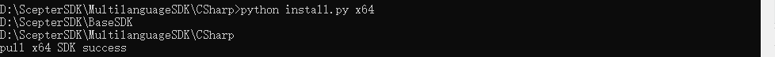
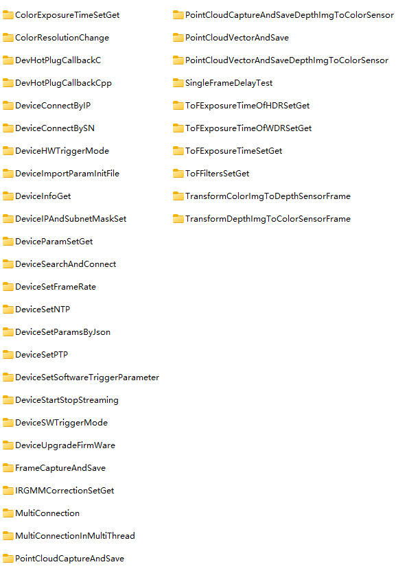
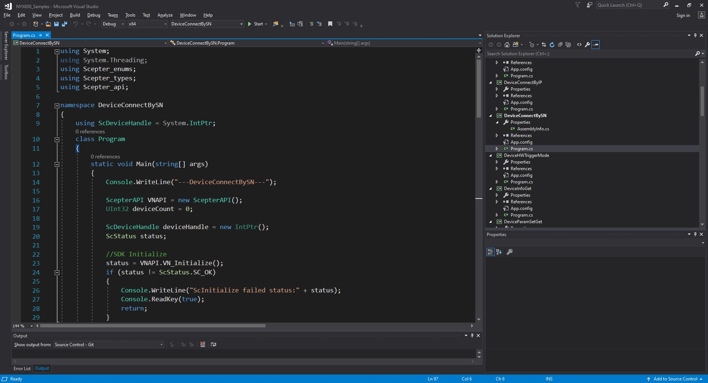
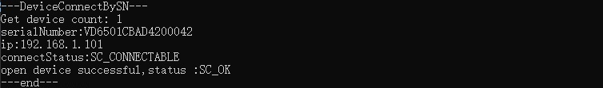

# 3.2. CSharp

## 3.2.1. Basic introduction

<!-- CSharp SDK 目录结构如下： -->

The CSharp SDK directory structure is as follows:


<!-- - Bin：目录主要包含 SDK 的动态链接库，如 Scepter_CSharp.dll，包括 x64 和 x86 的版本，运行基于该 SDK 开发的应用之前，需要先将相应平台的 dll 文件拷贝到可执行程序所在的目录。 -->

- Bin: The directory mainly contains the dynamic link library of the SDK, such as Scepter_CSharp.dll,including x64 and x86 versions. Before running the application developed based on this SDK, it is necessary to copy the dll file of the corresponding platform to the directory where the executable program is located.

<!-- - Samples：主要包含使用 ScepterSDK 开发的例程。 -->

- Samples: Primarily contains samples developed using the ScepterSDK.

<!-- - install.py：用于从指定的路径中提取并移动 Scepter_CSharp.dll 文件的脚本文件。 -->

- install.py: A script file used to extract and move the Scepter_CSharp.dll file from the specified path.

<!-- - README.md：SDK 的项目配置的简要说明。 -->

- README: Introduction to the SDK.

## 3.2.2. Project Configuration

<!-- Windows 下使用 Visual Studio 2017 开发，需要.NET Framework 为 4.6.x 版本。 -->

Visual Studio 2017 is used for development under Windows, and version 4.6.x of .NET Framework is required.

<!-- 可按照以下步骤构建 CSharp 依赖的库环境。 -->

Follow these steps to build depend libraries envrionment for CSharp.

<!-- 项目支持 x64 和 x86，需要将相应的文件复制到'Bin/x64'或'Bin/x86'。 以**x64**为例： -->

x64 and x86 are supportted by project, copy the corresponding files to the 'Bin/x64' or 'Bin/x86' is necessary. Take x64 as an example:

<!-- 方法一运行自动化脚本完成文件的复制； -->

The first method is to run the automation script to complete the copy of the file.

<!-- 方法二手动复制指定文件。 -->

The second method is to manually copy the specified file.

<!-- tabs:start -->

#### **Method 1**

<!-- 运行**ScepterSDK/C#/install.py** , install.py 用于从指定的路径中提取并移动 Scepter_CSharp.dll 文件的脚本文件。 -->

Run the **ScepterSDK/C#/install.py**.

```console
python install.py x64
```



#### **Method 2**

<!-- 手动将**ScepterSDK/Windows/Bin/x64**中的所有文件复制到**ScepterSDK/C#/Bin/x64** -->

Copy all files in **ScepterSDK/Windows/Bin/x64** to **ScepterSDK/C#/Bin/x64** manually.

<!-- tabs:end -->

## 3.2.3. Base Samples

<!-- 基础例程介绍 SDK 的单个特性 API 接口的使用。为了使用户可以快速的熟悉使用，例程根据产品进行分类。 -->

The base sample is used to demonstrate the single feature of basic APIs. In order to help developer familiar with SDK quickly, the examples are classified according to products.

<!-- 例程包含打开图像数据流、图像获取、软/硬触发、点云转换与保存等 API 接口的使用。 -->

Open device, image acquisition, software/hardware trigger, point cloud store are all included in the SDK example codes.



<!-- 接下来，我们将详细介绍每个例程的Function。 -->

Next, we will detail the function for each sample.

```csharp
ColorExposureTimeSetGet                         //Set and get the exposure time of color sensor.
ColorResolutionChange                           //Change device color sensor resolution.
DevHotPlugCallbackC                             //Set the callback function for hotplug status by C.
DevHotPlugCallbackCpp                           //Set the callback function for hotPlug status by C++.
DeviceConnectByIP                               //Use the device IP address to connect the device.
DeviceConnectBySN                               //Use the serial number to connect the device.
DeviceHWTriggerMode                             //Set device to Hardware Trigger Mode.
DeviceImportParamInitFile					   //Import the init file of parameters into device.
DeviceInfoGet                                   //Get Device SN, IP address and firmware version. information.
DeviceIPAndSubnetMaskSet					    //Set the IP and the SubnetMask with DHCP disabled.
DeviceParamSetGet                               //Get intrinsic parameters and extrinsic parameters of the device, and set and get the GmmaGian value of the Device.
DeviceSearchAndConnect                          //Search and connect the Device.
DeviceSetFrameRate                              //Set Device Rrame Rate.
DeviceSetNTP				                    //Set NTP enabled.
DeviceSetParamsByJson                           //Set device parameters by Json.
DeviceSetPTP				                    //Set PTP enabled.
DeviceSetSoftwareTriggerParameter               //Set the framecount to merge in Software Trigger Mode.
DeviceStartStopStreaming                        //Start and stop device streaming.
DeviceSWTriggerMode                             //Set device to Software Trigger Mode.
DeviceUpgradeFirmWare                           //Upgrade the firmWare.
FrameCaptureAndSave                             //Capture and save device frame.
IRGMMCorrectionSetGet                           //Set and get the IRGMMCorrection parameters of device.
MultiConnection                                 //Multiple device connection.
MultiConnectionInMultiThread                    //Multiple device connections in multiple threads.
PointCloudCaptureAndSave                        //Capture and save point cloud.
PointCloudCaptureAndSaveDepthImgToColorSensor   //Capture the point cloud and save the depth image to the color sensor.
PointCloudVectorAndSave                         //Capture and save point clouds in the ROI.
PointCloudVectorAndSaveDepthImgToColorSensor    //Capture the point cloud in the ROI and save the depth image to the color sensor.
SingleFrameDelayTest                            //Get the delay for trigger to get frame in APP.
ToFExposureTimeOfHDRSetGet                      //Set and get ToF exposure time of the device,in HDR enabled.
ToFExposureTimeOfWDRSetGet                      //Set and get ToF exposure time of the device,in WDR enabled.
ToFExposureTimeSetGet                           //Set and get ToF exposure time of the device.
ToFFiltersSetGet                                //Set and get ToF Filters switch of the device.
TransformColorImgToDepthSensorFrame             //Color image is transformed to depth sensor space where the resolution is the same as the depth frame's resolution.
TransformDepthImgToColorSensorFrame             //Depth image is transformed to color sensor space where the resolution is the same as the color frame's resolution.
```

<!-- 下面，我们以单个产品的单独例程为例，演示其编译运行的过程： -->

Take a single routine of a single product as an example to demonstrate the process of compiling and running it:

<!-- 1. 根据实际产品选择对应的 sample，以 NYX650 产品编译 DeviceConnectBySN 为例:

   ① 鼠标右键选择需要启动的项目，选择右键选项栏中的“设为启动项目”选项。

   ② 点击菜单栏的“调试”按钮，选择下拉栏中的“开始调试”或使用快捷键“F5”编译运行项目。 -->

1. Select the corresponding sample according to the actual product. Take the NYX650 product to compile DeviceConnectBySN as an example:

   ① Select the item to be started with the right mouse button, and select the "Set as Startup Item" option in the right-click option bar.

   ② Click the "Debug" button in the menu bar, and select "Start Debugging" in the drop-down bar or use the shortcut key "F5" to compile and run the project.

   

<!-- 2. 编译完成，调试运行。结果如下图： -->

2. After compilation is complete, debug and run. The results are as follows:

   

## 3.2.4. API Introduction

<!-- > 不同型号产品对应的Enumerator个数可能不同，请以实际Enumerator为准。 -->

> The number of enumeration values corresponding to different models of products may be different. Please refer to the actual enumeration value.

<!-- tabs:start -->

#### **Enum Type**

### 3.2.4.1.1. ScFrameType

**Description：**

Image type.

**Enumerator：**

```csharp
typedef enum
{
    SC_DEPTH_FRAME                               = 0,   // Depth frame with 16 bits per pixel in millimeters.
    SC_IR_FRAME                                  = 1,   // IR frame with 8 bits per pixel.
    SC_COLOR_FRAME                               = 3,   // Color frame with 24 bits per pixel in RGB/BGR format.
    SC_TRANSFORM_COLOR_IMG_TO_DEPTH_SENSOR_FRAME = 4,   // Color frame with 24 bits per pixel in RGB/BGR format, that is transformed to depth
                                                        // sensor space where the resolution is the same as the depth frame's resolution.
                                                        // This frame type can be enabled using ::scSetTransformColorImgToDepthSensorEnabled().
    SC_TRANSFORM_DEPTH_IMG_TO_COLOR_SENSOR_FRAME = 5,   // Depth frame with 16 bits per pixel, in millimeters, that is transformed to color sensor
                                                        // space where the resolution is same as the color frame's resolution.
                                                        // This frame type can be enabled using ::scSetTransformDepthImgToColorSensorEnabled().
} ScFrameType;
```

### 3.2.4.1.2. ScPixelFormat

**Description：**

Pixel type of image data.。

**Enumerator：**

```csharp
typedef enum
{
    SC_PIXEL_FORMAT_DEPTH_MM16   = 0,   // Depth image pixel format, 16 bits per pixel in mm.
    SC_PIXEL_FORMAT_GRAY_8       = 2,   // Gray image pixel format, 8 bits per pixel.

    // Color
    SC_PIXEL_FORMAT_RGB_888_JPEG = 3,   // By jpeg decompress, color image pixel format, 24 bits per pixel RGB format.
    SC_PIXEL_FORMAT_BGR_888_JPEG = 4,   // By jpeg decompress, color image pixel format, 24 bits per pixel BGR format.
    SC_PIXEL_FORMAT_RGB_888      = 5,   // Without compress, color image pixel format, 24 bits per pixel RGB format.
    SC_PIXEL_FORMAT_BGR_888      = 6,   // Without compress, color image pixel format, 24 bits per pixel BGR format.
    SC_PIXEL_FORMAT_RGB_565      = 7,   // Without compress, color image pixel format, 16 bits per pixel RGB format.
    SC_PIXEL_FORMAT_BGR_565      = 8,   // Without compress, color image pixel format, 16 bits per pixel BGR format.
} ScPixelFormat;
```

### 3.2.4.1.3. ScSensorType

**Description：**

Sensor Type.

**Enumerator：**

```csharp
typedef enum
{
    SC_TOF_SENSOR   = 0x01,   // ToF camera.
    SC_COLOR_SENSOR = 0x02,   // Color camera.
} ScSensorType;
```

### 3.2.4.1.4. ScStatus

**Description：**

Returns of an interface function.

**Enumerator：**

```csharp
typedef enum
{
    SC_OK                           = 0,      // The function completed successfully.
    SC_NO_DEVICE_CONNECTED          = -1,     // There is no depth camera connected or the camera has not been connected correctly.
                                              // Check the hardware connection or try unplugging and re-plugging the USB cable.
    SC_INVALID_DEVICE_INDEX         = -2,     // The input device index is invalid.
    SC_DEVICE_POINTER_IS_NULL       = -3,     // The device structure pointer is null.
    SC_INVALID_FRAME_TYPE           = -4,     // The input frame type is invalid.
    SC_FRAME_POINTER_IS_NULL        = -5,     // The output frame buffer is null.
    SC_NO_PROPERTY_VALUE_GET        = -6,     // Cannot get the value for the specified property.
    SC_NO_PROPERTY_VALUE_SET        = -7,     // Cannot set the value for the specified property.
    SC_PROPERTY_POINTER_IS_NULL     = -8,     // The input property value buffer pointer is null.
    SC_PROPERTY_SIZE_NOT_ENOUGH     = -9,     // The input property value buffer size is too small to store the specified property value.
    SC_INVALID_DEPTH_RANGE          = -10,    // The input depth range mode is invalid.
    SC_GET_FRAME_READY_TIME_OUT     = -11,    // Capture the next image frame time out.
    SC_INPUT_POINTER_IS_NULL        = -12,    // An input pointer parameter is null.
    SC_CAMERA_NOT_OPENED            = -13,    // The camera has not been opened.
    SC_INVALID_CAMERA_TYPE          = -14,    // The specified type of camera is invalid.
    SC_INVALID_PARAMS               = -15,    // One or more of the parameter values provided are invalid.
    SC_CURRENT_VERSION_NOT_SUPPORT  = -16,    // This feature is not supported in the current version.
    SC_UPGRADE_IMG_ERROR            = -17,    // There is an error in the upgrade file.
    SC_UPGRADE_IMG_PATH_TOO_LONG    = -18,    // Upgrade file path length greater than 260.
    SC_UPGRADE_CALLBACK_NOT_SET     = -19,    // scSetUpgradeStatusCallback is not called.
    SC_PRODUCT_NOT_SUPPORT          = -20,    // The current product does not support this operation.
    SC_NO_CONFIG_FOLDER             = -21,    // No product profile found.
    SC_WEB_SERVER_START_ERROR       = -22,    // WebServer Start/Restart error(IP or PORT).
    SC_GET_OVER_STAY_FRAME          = -23,    // The time from frame ready to get frame is out of 1s.
    SC_CREATE_LOG_DIR_ERROR         = -24,    // Create log directory error.
    SC_CREATE_LOG_FILE_ERROR        = -25,    // Create log file error.
    SC_NO_ADAPTER_CONNECTED         = -100,   // There is no adapter connected.
    SC_REINITIALIZED                = -101,   // The SDK has been Initialized.
    SC_NO_INITIALIZED               = -102,   // The SDK has not been Initialized.
    SC_CAMERA_OPENED                = -103,   // The camera has been opened.
    SC_CMD_ERROR                    = -104,   // Set/Get cmd control error.
    SC_CMD_SYNC_TIME_OUT            = -105,   // Set cmd ok.but time out for the sync return.
    SC_IP_NOT_MATCH                 = -106,   // IP is not in the same network segment.
    SC_NOT_STOP_STREAM              = -107,   // Please invoke scStopStream first to close the data stream.
    SC_NOT_START_STREAM             = -108,   // Please invoke scStartStream first to get the data stream.
    SC_NOT_FIND_DRIVERS_FOLDER      = -109,   // Please check whether the Drivers directory exists.
    SC_CAMERA_OPENING               = -110,   // The camera is openin,by another Sc_OpenDeviceByXXX API.
    SC_CAMERA_OPENED_BY_ANOTHER_APP = -111,   // The camera has been opened by another APP.
    SC_OTHERS                       = -255,   // An unknown error occurred.
} ScStatus;
```

### 3.2.4.1.5. ScConnectStatus

**Description：**

Device connection status.

**Enumerator：**

```csharp
typedef enum
{
    SC_LIMBO       = 0,   // Unknown device status and cannot try to open.
    SC_CONNECTABLE = 1,   // Device connectable state and support open.
    SC_OPENED      = 2,   // The device is connected and cannot be opened again.
} ScConnectStatus;
```

### 3.2.4.1.6. ScWorkMode

**Description：**

Equipment working condition.

**Enumerator：**

```csharp
typedef enum
{
    SC_ACTIVE_MODE           = 0x00,   // Enter the active mode.
    SC_HARDWARE_TRIGGER_MODE = 0x01,   // Enter the hardware salve mode, at this time need to connect
                                       // the hardware trigger wire, provide hardware signal, to trigger the image.
    SC_SOFTWARE_TRIGGER_MODE = 0x02,   // Enter the software salve mode, at this time need to invoke scSoftwareTriggerOnce, to trigger the image.
} ScWorkMode;
```

### 3.2.4.1.7. ScExposureControlMode

**Description：**

Exposure mode of the sensor.

**Enumerator：**

```csharp
typedef enum
{
    SC_EXPOSURE_CONTROL_MODE_AUTO   = 0,   // Enter the auto exposure mode.
    SC_EXPOSURE_CONTROL_MODE_MANUAL = 1,   // Enter the manual exposure mode.
} ScExposureControlMode;
```

#### **Struct Type**

### 3.2.4.2.1. ScVector3f

**Description：**

Three dimensional point coordinates in millimeters.

**Members：**

```csharp
typedef struct
{
    float x;   // The x components of the vector.
    float y;   // The y components of the vector.
    float z;   // The z components of the vector.
} ScVector3f;
```

### 3.2.4.2.2. ScVector2u16

**Description：**

Two dimensional point coordinates.

**Members：**

```csharp
typedef struct
{
    uint16_t x;   // The x components of the vector.
    uint16_t y;   // The y components of the vector.
} ScVector2u16;
```

### 3.2.4.2.3. ScDepthVector3

**Description：**

A pixel representation of a depth image.

**Members：**

```csharp
typedef struct
{
    int32_t      depthX;   // The x coordinate of the pixel.
    int32_t      depthY;   // The y coordinate of the pixel.
    ScDepthPixel depthZ;   // The depth of the pixel, in millimeters.
} ScDepthVector3;
```

### 3.2.4.2.4. ScResolution

**Description：**

Image resolution.

**Members：**

```csharp
typedef struct
{
    int32_t width;   // The width of the image.
    int32_t height;  // The height of the image.
} ScResolution;
```

### 3.2.4.2.5. ScResolutionList

**Description：**

Supported Image Resolution.

**Members：**

```csharp
typedef struct
{
    int32_t      count;          // The number of image resolutions.
    ScResolution resolution[6];  // The information of image resolution.
} ScResolutionList;
```

### 3.2.4.2.6. ScSensorIntrinsicParameters

**Description：**

<!-- 传感器的镜头内参和畸变参数。内参通常用于点云的计算，畸变参数用于图像反畸变算法使用。

SDK 中已经实现深度图像到点云的转换及图像反畸变的Function，请参考例程使用相关接口。 -->

Lens parameters and distortion parameters of the sensor. The internal parameter is usually used to calculate the point cloud and the distortion parameter is used in the image anti-distortion algorithm.

SDK has realized the function of converting depth image to point cloud and image anti-distortion, please refer to the routine to use the relevant interface.

**Members：**

```csharp
typedef struct
{
    double fx;   //!< Focal length x (pixel).
    double fy;   //!< Focal length y (pixel).
    double cx;   //!< Principal point x (pixel).
    double cy;   //!< Principal point y (pixel).
    double k1;   //!< Radial distortion coefficient, 1st-order.
    double k2;   //!< Radial distortion coefficient, 2nd-order.
    double p1;   //!< Tangential distortion coefficient.
    double p2;   //!< Tangential distortion coefficient.
    double k3;   //!< Radial distortion coefficient, 3rd-order.
    double k4;   //!< Radial distortion coefficient, 4st-order.
    double k5;   //!< Radial distortion coefficient, 5nd-order.
    double k6;   //!< Radial distortion coefficient, 6rd-order.
} ScSensorIntrinsicParameters;
```

### 3.2.4.2.7. ScSensorExtrinsicParameters

**Description：**

<!-- 相机外参 R 与 T，用于 depth 与 rgb 图像的对齐，参考公式如下: -->

The external parameters R and T of the camera are used to align depth with RGB images. The reference formula is as follows:


**Members：**

```csharp
typedef struct
{
    double rotation[9];      // Orientation stored as an array of 9 double representing a 3x3 rotation matrix.
    double translation[3];   // Location stored as an array of 3 double representing a 3-D translation vector.
} ScSensorExtrinsicParameters;
```

### 3.2.4.2.8. ScFrame

**Description：**

Depth/IR/Color image information.

**Members：**

```csharp
typedef struct
{
    uint32_t      frameIndex;        // The index of the frame.
    ScFrameType   frameType;         // The type of frame. See ::ScFrameType for more information.
    ScPixelFormat pixelFormat;       // The pixel format used by a frame. See ::ScPixelFormat for more information.
    uint8_t*      pFrameData;        // A buffer containing the frame’s image data.
    uint32_t      dataLen;           // The length of pFrame, in bytes.
    float         exposureTime;      // The exposure time, in milliseconds.
    uint8_t       depthRange;        // The depth range mode of the current frame. Used only for depth frames.
    uint16_t      width;             // The width of the frame, in pixels.
    uint16_t      height;            // The height of the frame, in pixels.
    uint64_t      deviceTimestamp;   // The timestamp when the frame be generated on the device. Frame processing and transfer time are not included.
} ScFrame;
```

### 3.2.4.2.9. ScFrameReady

**Description：**

Whether the image data is ready (1 means ready, 0 means not ready)

**Enumerator：**

```csharp
typedef struct
{
    uint32_t depth            : 1;    // Indicates whether the depth image data is ready.
    uint32_t ir               : 1;    // Indicates whether grayscale image data is ready.
    uint32_t color            : 1;    // Indicates whether color image data is ready.
    uint32_t transformedColor : 1;    // Indicates whether the color image aligned to the depth sensor space is ready.
    uint32_t transformedDepth : 1;    // Indicates whether the depth image is ready to align to the color sensor space.
    uint32_t reserved         : 27;   //  Reserved bit.
} ScFrameReady;
```

### 3.2.4.2.10. ScDeviceInfo

**Description：**

Device information.

**Members：**

```csharp
typedef struct
{
    char            productName[64];    // Product type name.
    char            serialNumber[64];   // Device serial number.
    char            ip[17];             // Indicates the IP address of the device.
    ScConnectStatus status;             // Indicates the connection status of the device.
} ScDeviceInfo;
```

### 3.2.4.2.11. ScTimeFilterParams

**Description：**

Time filter parameter.

**Members：**

```csharp
typedef struct
{
    int32_t threshold;   // Range in [1, 6],The larger the value is, the more obvious the filtering effect is and The smaller the point cloud wobble.
    bool    enable;      // Whether to enable time filter.
} ScTimeFilterParams;
```

### 3.2.4.2.12. ScConfidenceFilterParams

**Description：**

Confidence filtering parameter.

**Members：**

```csharp
typedef struct
{
    int32_t threshold;   // Range in [1, 100]. The larger the value is, the more obvious the filtering effect is and the more points are filtered out.
    bool    enable;      // Whether to enable confidence filter.
} ScConfidenceFilterParams;
```

### 3.2.4.2.13. ScFlyingPixelFilterParams

**Description：**

Deflying-point filtering parameter.

**Members：**

```csharp
typedef struct
{
    int32_t threshold;   // Range in [0, 16]. The larger the value is, the more obvious the filtering effect is and the more points are filtered out.
    bool    enable;      // Whether to enable flying pixel filter.
} ScFlyingPixelFilterParams;
```

### 3.2.4.2.14. ScIRGMMCorrectionParams

**Description：**

IR gain value correction parameter.

**Members：**

```csharp
typedef struct
{
    int32_t threshold;   // Range in [1, 100]. The larger the value is, the more obvious the correction effect.
    bool    enable;      // Whether to enable IRGMM correction.
} ScIRGMMCorrectionParams;
```

### 3.2.4.2.15. ScInputSignalParamsForHWTrigger

**Description：**

Input signal parameters for Hardware Trigger.

**Members：**

```csharp
typedef struct
{
    uint16_t width;                  // Range in [1,65535]. The width of input signal.
    uint16_t interval;               // Range in [34000,65535]. The interval of input signal.
    uint8_t  polarity;               // Range in [0,1]. 0 for active low; 1 for active high.
} ScInputSignalParamsForHWTrigger;
```

### 3.2.4.2.16. ScOutputSignalParams

**Description：**

Output signal parameters.

**Members：**

```csharp
typedef struct
{
    uint16_t width;       // Range in [1,65535]. The width of output signal.
    uint16_t delay;       // Range in [0,65535]. The delay time of output signal.
    uint8_t  polarity;    // Range in [0,1]. 0 for active low; 1 for active high.
} ScOutputSignalParams;
```

#### **API**

### 3.2.4.3.1. VN_Initialize

**Prototype：**

```csharp
ScStatus VN_Initialize()
```

**Description:**

Initializes the API on the device. This function must be invoked before any other Scepter APIs.

**Parameters：**

There is no.

**Returns：**

[**ScStatus**](#_2514-scstatus): SC_OK If the function succeeded, or one of the error values defined by ::ScStatus.

### 3.2.4.3.2. VN_Shutdown

**Prototype:**

```csharp
ScStatus VN_Shutdown()
```

**Description:**

Shuts down the API on the device and clears all resources allocated by the API. After invoking this function, no other Scepter APIs can be invoked.

**Parameters:**

There is no.

**Returns:**

[**ScStatus**](#_2514-scstatus): SC_OK If the function succeeded, or one of the error values defined by ::ScStatus.

### 3.2.4.3.3. VN_GetSDKVersion

**Prototype:**

```csharp
ScStatus VN_GetSDKVersion(char* pSDKVersion, int32_t length)
```

**Description:**

Obtain the SDK version: X.X.X.

**Parameters:**

<span style="color: #4ec9b0; font-weight: bold">char</span>\* pSDKVersion: SDK version

<span style="color: #4ec9b0; font-weight: bold">int32_t</span> length: the length of SDK version

**Returns:**

[**ScStatus**](#_2514-scstatus): SC_OK If the function succeeded, or one of the error values defined by ::ScStatus.

### 3.2.4.3.4. VN_GetDeviceCount

**Prototype:**

```csharp
ScStatus VN_GetDeviceCount(uint32_t* pDeviceCount, uint32_t scanTime)
```

**Description:**

Get the number of connected devices.

**Parameters:**

<span style="color: #4ec9b0; font-weight: bold">uint32_t</span>\* pDeviceCount: Pointer to a 32-bit integer variable in which to return the device count.

<span style="color: #4ec9b0; font-weight: bold">uint32_t</span> scanTime: Scans time, the unit is millisecond.This function scans devices for scanTime(ms) and then returns the count of devices.

**Returns:**

[**ScStatus**](#_2514-scstatus): SC_OK If the function succeeded, or one of the error values defined by ::ScStatus.

### 3.2.4.3.5. VN_GetDeviceInfoList

**Prototype:**

```csharp
ScStatus VN_GetDeviceInfoList(uint32_t deviceCount, ScDeviceInfo* pDevicesInfoList)
```

**Description:**

Obtain the device list of the number of Devicecounts.

**Parameters:**

<span style="color: #4ec9b0; font-weight: bold">uint32_t</span> deviceCount: The number of camera devices.

[**ScDeviceInfo**](#_25210-scdeviceinfo)\* pDevicesInfoList: Pointer to a buffer in which to store the devices list infos.

**Returns:**

[**ScStatus**](#_2514-scstatus): SC_OK If the function succeeded, or one of the error values defined by ::ScStatus.

### 3.2.4.3.6. VN_OpenDeviceBySN

**Prototype:**

```csharp
ScStatus VN_OpenDeviceBySN(const char* pSN, ScDeviceHandle* pDevice)
```

**Description:**

Opens the device using the device SerialNumber. The device must be subsequently closed using scCloseDevice().

**Parameters:**

<span style="color: #4ec9b0; font-weight: bold">const</span> char\* pSN: The SerialNumber of the device. See ::ScDeviceInfo for more information.

<span style="color: #4ec9b0; font-weight: bold">ScDeviceHandle</span>\* pDevice: The handle of the device on which to open.

**Returns:**

[**ScStatus**](#_2514-scstatus): SC_OK If the function succeeded, or one of the error values defined by ::ScStatus.

### 3.2.4.3.7. VN_OpenDeviceByIP

**Prototype:**

```csharp
ScStatus VN_OpenDeviceByIP(const char* pIP, ScDeviceHandle* pDevice)
```

**Description:**

Use the device IP address to open the device. The device must be subsequently closed using scCloseDevice().

**Parameters:**

<span style="color: #4ec9b0; font-weight: bold">const</span> char\* pIP: The IP adress of the device. See ::ScDeviceInfo for more information.

<span style="color: #4ec9b0; font-weight: bold">ScDeviceHandle</span>\* pDevice:  The handle of the device on which to open.

**Returns:**

[**ScStatus**](#_2514-scstatus): SC_OK If the function succeeded, or one of the error values defined by ::ScStatus.

### 3.2.4.3.8. VN_CloseDevice

**Prototype:**

```csharp
ScStatus VN_CloseDevice(ScDeviceHandle* pDevice)
```

**Description:**

Closes the device specified by device that was opened using scOpenDevice.

**Parameters:**

<span style="color: #4ec9b0; font-weight: bold">ScDeviceHandle</span>\* pDevice:  The handle of the device to close.

**Returns:**

[**ScStatus**](#_2514-scstatus): SC_OK If the function succeeded, or one of the error values defined by ::ScStatus.

### 3.2.4.3.9. VN_StartStream

**Prototype:**

```csharp
ScStatus VN_StartStream(ScDeviceHandle device)
```

**Description:**

Starts capturing the image stream indicated by device.Invoke scStopStream() to stop capturing the image stream.

**Parameters:**

<span style="color: #4ec9b0; font-weight: bold">ScDeviceHandle</span> device:  The handle of the device on which to start capturing the image stream.

**Returns:**

[**ScStatus**](#_2514-scstatus): SC_OK If the function succeeded, or one of the error values defined by ::ScStatus.

### 3.2.4.3.10. VN_StopStream

**Prototype:**

```csharp
ScStatus VN_StopStream(ScDeviceHandle device)
```

**Description:**

Stops capturing the image stream on the device specified by device. that was started using scStartStream.

**Parameters:**

<span style="color: #4ec9b0; font-weight: bold">ScDeviceHandle</span> device:  The handle of the device on which to stop capturing the image stream.

**Returns:**

[**ScStatus**](#_2514-scstatus): SC_OK If the function succeeded, or one of the error values defined by ::ScStatus.

### 3.2.4.3.11. VN_GetFrameReady

**Prototype:**

```csharp
ScStatus VN_GetFrameReady(ScDeviceHandle device, uint16_t waitTime, ScFrameReady* pFrameReady)
```

**Description:**

Gets the image ready state. This function must be called before calling scGetFrame, otherwise the image cannot be retrieved.

**Parameters:**

<span style="color: #4ec9b0; font-weight: bold">ScDeviceHandle</span> device:  The handle of the device.

<span style="color: #4ec9b0; font-weight: bold">uint16_t</span> waitTime: The unit is millisecond, the value is in the range (0,65535).You can change the value according to the frame rate. For example,the frame rate is 30, so the theoretical waittime interval is 33ms,but if set the time value is 20ms, it means the maximum wait time is 20 ms when capturing next frame, so when call the scGetFrameReady,it may return SC_GET_FRAME_READY_TIME_OUT(-11).So the recommended value is 2 \* 1000/ FPS.

[**ScFrameReady**](#_2529-scframeready)\* pFrameReady: Pointer to a buffer in which to store the signal on which image is ready to be get.

**Returns:**

[**ScStatus**](#_2514-scstatus): SC_OK If the function succeeded, or one of the error values defined by ::ScStatus.

### 3.2.4.3.12. VN_GetFrame

**Prototype:**

```csharp
ScStatus VN_GetFrame(ScDeviceHandle device, ScFrameType frameType, ScFrame* pScFrame)
```

**Description:**

Gets image data of the specified image type scGetFrameReady must be called before calling this function.

**Parameters:**

<span style="color: #4ec9b0; font-weight: bold">ScDeviceHandle</span> device:  The handle of the device to capture an image frame from.

[**ScFrameType**](#_2511-scframetype) frameType: The image frame type.

[**ScFrame**](#_2528-scframe)\* pScFrame: Pointer to a buffer in which to store the returned image data.

**Returns:**

[**ScStatus**](#_2514-scstatus): SC_OK If the function succeeded, or one of the error values defined by ::ScStatus.

### 3.2.4.3.13. VN_GetDepthRangeValue

**Prototype:**

```csharp
ScStatus VN_GetDepthRangeValue(ScDeviceHandle device, int16_t* minValue, int16_t* maxValue)
```

**Description:**

Get the depth range in the current working mode of the device.

**Parameters:**

<span style="color: #4ec9b0; font-weight: bold">ScDeviceHandle</span> device: The handle of the device.

<span style="color: #4ec9b0; font-weight: bold">int16_t</span> \* minValue: The min value of the depth.

<span style="color: #4ec9b0; font-weight: bold">int16_t</span> \* maxValue: The max value of the depth.

**Returns:**

[**ScStatus**](#_2514-scstatus): SC_OK If the function succeeded, or one of the error values defined by ::ScStatus.

### 3.2.4.3.14. VN_GetSensorIntrinsicParameters

**Prototype:**

```csharp
ScStatus VN_GetSensorIntrinsicParameters(ScDeviceHandle device, ScSensorType sensorType, ScSensorIntrinsicParameters* pSensorIntrinsicParameters)
```

**Description:**

Gets the internal intrinsic parameters from the sensor lens.

**Parameters:**

<span style="color: #4ec9b0; font-weight: bold">ScDeviceHandle</span> device: The handle of the device.

[**ScSensorType**](#_2513-scsensortype) sensorType: The type of sensor (depth or color) from which to get parameter information. Pass in the applicable value defined by ::ScSensorType.

[**ScSensorIntrinsicParameters**](#_2526-scsensorintrinsicparameters)\* pSensorIntrinsicParameters:Pointer to a ScSensorIntrinsicParameters variable in which to store the parameter values.

**Returns:**

[**ScStatus**](#_2514-scstatus): SC_OK If the function succeeded, or one of the error values defined by ::ScStatus.

### 3.2.4.3.15. VN_GetSensorExtrinsicParameters

**Prototype:**

```csharp
ScStatus VN_GetSensorExtrinsicParameters(ScDeviceHandle device, ScSensorExtrinsicParameters* pSensorExtrinsicParameters)
```

**Description:**

Gets the internal extrinsic parameters from the sensor lens.

**Parameters:**

<span style="color: #4ec9b0; font-weight: bold">ScDeviceHandle</span> device: The handle of the device.

[**ScSensorExtrinsicParameters**](#_2527-scsensorextrinsicparameters)\* pSensorExtrinsicParameters:Pointer to a ::ScSensorExtrinsicParameters variable in which to store the parameters.

**Returns:**

[**ScStatus**](#_2514-scstatus): SC_OK If the function succeeded, or one of the error values defined by ::ScStatus.

### 3.2.4.3.16. VN_GetFirmwareVersion

**Prototype:**

```csharp
ScStatus VN_GetFirmwareVersion(ScDeviceHandle device, char* pFirmwareVersion, int32_t length)
```

**Description:**

Obtain the firmware version of the device.

**Parameters:**

<span style="color: #4ec9b0; font-weight: bold">ScDeviceHandle</span> device: The handle of the device.

<span style="color: #4ec9b0; font-weight: bold">char</span>\* pFirmwareVersion: Pointer to a variable in which to store the returned fw value.

<span style="color: #4ec9b0; font-weight: bold">int32_t</span> length: Byte length of the cache pointed to by FirmwareVersion.The maximum length is 64 bytes.

**Returns:**

[**ScStatus**](#_2514-scstatus): SC_OK If the function succeeded, or one of the error values defined by ::ScStatus.

### 3.2.4.3.17. VN_GetDeviceMACAddress

**Prototype:**

```csharp
ScStatus VN_GetDeviceMACAddress(ScDeviceHandle device, char* pMACAddress)
```

**Description:**

Obtain the MAC address of the device.

**Parameters:**

<span style="color: #4ec9b0; font-weight: bold">ScDeviceHandle</span> device: The handle of the device.

<span style="color: #4ec9b0; font-weight: bold">char</span>\* pMACAddress: Pointer to a buffer in which to store the device MAC address. the buffer default size is 18, and the last buffer set '\0'.

**Returns:**

[**ScStatus**](#_2514-scstatus): SC_OK If the function succeeded, or one of the error values defined by ::ScStatus.

### 3.2.4.3.18. VN_SetDeviceDHCPEnabled

**Prototype:**

```csharp
ScStatus VN_SetDeviceDHCPEnabled(ScDeviceHandle device, bool bEnabled)
```

**Description:**

Enables or disables the DHCP.

**Parameters:**

<span style="color: #4ec9b0; font-weight: bold">ScDeviceHandle</span> device: The handle of the device.

<span style="color: #4ec9b0; font-weight: bold">bool</span> bEnabled: Set to true to enable the feature or false to disable the feature.

**Returns:**

[**ScStatus**](#_2514-scstatus): SC_OK If the function succeeded, or one of the error values defined by ::ScStatus.

### 3.2.4.3.19. VN_GetDeviceDHCPEnabled

**Prototype:**

```csharp
ScStatus VN_GetDeviceDHCPEnabled(ScDeviceHandle device, bool* bEnabled)
```

**Description:**

Returns the Boolean value of whether the DHCP is enabled or disabled.

**Parameters:**

<span style="color: #4ec9b0; font-weight: bold">ScDeviceHandle</span> device: The handle of the device.

<span style="color: #4ec9b0; font-weight: bold">bool</span>\* bEnabled: true is enable the feature or false is disable the feature.

**Returns:**

[**ScStatus**](#_2514-scstatus): SC_OK If the function succeeded, or one of the error values defined by ::ScStatus.

### 3.2.4.3.20. VN_SetDeviceIPAddr

Prototype:

```csharp
ScStatus VN_SetDeviceIPAddr(ScDeviceHandle device, const char* ipAddr, int32_t length)
```

**Description:**

Set the IP address of the device in non-DHCP mode. The call takes effect after the device is restarted.

**Parameters:**

<span style="color: #4ec9b0; font-weight: bold">ScDeviceHandle</span> device: The handle of the device.

<span style="color: #4ec9b0; font-weight: bold">const char</span>\* ipAddr: Pointer to a buffer in which to store the device IP address. the buffer default size is 16, and the last buffer set '\0'.

<span style="color: #4ec9b0; font-weight: bold">int32_t</span> length: The length of the buffer.

**Returns:**

[**ScStatus**](#_2514-scstatus): SC_OK If the function succeeded, or one of the error values defined by ::ScStatus.

### 3.2.4.3.21. VN_GetDeviceIPAddr

**Prototype:**

```csharp
ScStatus VN_GetDeviceIPAddr(ScDeviceHandle device, char* ipAddr)
```

**Description:**

Get the IP address of the device in non-DHCP mode.

**Parameters:**

<span style="color: #4ec9b0; font-weight: bold">ScDeviceHandle</span> device: The handle of the device.

<span style="color: #4ec9b0; font-weight: bold">char</span>\* ipAddr: Pointer to a buffer in which to store the device IP address. the buffer default size is 16, and the last buffer set '\0'.

**Returns:**

[**ScStatus**](#_2514-scstatus): SC_OK If the function succeeded, or one of the error values defined by ::ScStatus.

### 3.2.4.3.22. VN_SetDeviceSubnetMask

**Prototype:**

```csharp
ScStatus VN_SetDeviceSubnetMask(ScDeviceHandle device, const char* pMask, int32_t length)
```

**Description:**

Set the subnet mask of the device in non-DHCP mode. The call takes effect after the device is restarted.

**Parameters:**

<span style="color: #4ec9b0; font-weight: bold">ScDeviceHandle</span> device: The handle of the device.

<span style="color: #4ec9b0; font-weight: bold">const char</span>\* pMask: Pointer to a buffer in which to store the subnet mask address. the buffer default size is 16, and the last buffer set '\0'.

<span style="color: #4ec9b0; font-weight: bold">int32_t</span> length: The length of the buffer.

**Returns:**

[**ScStatus**](#_2514-scstatus): SC_OK If the function succeeded, or one of the error values defined by ::ScStatus.

### 3.2.4.3.23. VN_GetDeviceSubnetMask

**Prototype:**

```csharp
ScStatus VN_GetDeviceSubnetMask(ScDeviceHandle device, char* pMask)
```

**Description:**

Get the subnet mask of the device in non-DHCP mode.

**Parameters:**

<span style="color: #4ec9b0; font-weight: bold">ScDeviceHandle</span> device: The handle of the device.

<span style="color: #4ec9b0; font-weight: bold">char</span>\* pMask:  Pointer to a buffer in which to store the device subnet mask address. the buffer default size is 16, and the last buffer set '\0'.

**Returns:**

[**ScStatus**](#_2514-scstatus): SC_OK If the function succeeded, or one of the error values defined by ::ScStatus.

### 3.2.4.3.24. VN_SetRealTimeSyncConfig

**Prototype:**

```csharp
ScStatus VN_SetRealTimeSyncConfig(ScDeviceHandle device, ScTimeSyncConfig params)
```

**Description:**

Set the parameters for time sync, such as enable the NTP/PTP

**Parameters:**

<span style="color: #4ec9b0; font-weight: bold">ScDeviceHandle</span> device: The handle of the device.

[**ScTimeSyncConfig**](#_25217-sctimesyncconfig) params : The parameters defined by ::ScTimeSyncConfig.

**Returns:**

[**ScStatus**](#_2514-scstatus): SC_OK If the function succeeded, or one of the error values defined by ::ScStatus.

### 3.2.4.3.25. VN_GetRealTimeSyncConfig

**Prototype:**

```csharp
ScStatus VN_GetRealTimeSyncConfig(ScDeviceHandle device, ScTimeSyncConfig* pParams)
```

**Description:**

 Get the parameters for time sync,such as the status of the NTP/PTP

**Parameters:**

<span style="color: #4ec9b0; font-weight: bold">ScDeviceHandle</span> device: The handle of the device.

[**ScTimeSyncConfig**](#_25217-sctimesyncconfig)* pParams : Pointer to a variable in which to store the returned value.

**Returns:**

[**ScStatus**](#_2514-scstatus): SC_OK If the function succeeded, or one of the error values defined by ::ScStatus.

### 3.2.4.3.26. VN_SetFrameRate

**Prototype:**

```csharp
ScStatus VN_SetFrameRate(ScDeviceHandle device, int32_t value)
```

**Description:**

Sets the device's image frame rate for both depth and color images. This interface is a synchronization interface, which takes about 500ms.

**Parameters:**

<span style="color: #4ec9b0; font-weight: bold">ScDeviceHandle</span> device: The handle of the device.

<span style="color: #4ec9b0; font-weight: bold">int32_t</span> value: The rate value. Different products have different maximum values. Please refer to the product specification.

**Returns:**

[**ScStatus**](#_2514-scstatus): SC_OK If the function succeeded, or one of the error values defined by ::ScStatus.

### 3.2.4.3.27. VN_GetFrameRate

**Prototype:**

```csharp
ScStatus VN_GetFrameRate(ScDeviceHandle device, int32_t* pValue)
```

**Description:**

Gets the image frame rate of the device.

**Parameters:**

<span style="color: #4ec9b0; font-weight: bold">ScDeviceHandle</span> device: The handle of the device.

<span style="color: #4ec9b0; font-weight: bold">int32_t</span>\* pValue: Returns the frame rate of the device image.

**Returns:**

[**ScStatus**](#_2514-scstatus): SC_OK If the function succeeded, or one of the error values defined by ::ScStatus.

### 3.2.4.3.28. VN_SetWorkMode

**Prototype:**

```csharp
ScStatus VN_SetWorkMode(ScDeviceHandle device, ScWorkMode mode)
```

**Description:**

Set the working mode of the camera.

**Parameters:**

<span style="color: #4ec9b0; font-weight: bold">ScDeviceHandle</span> device:  The handle of the device.

[**ScWorkMode**](#_2516-scworkmode) mode: The work mode of camera. For ActiveMode, set the Time filter default true, for SlaveMode, set the Time filter default false.

**Returns:**

[**ScStatus**](#_2514-scstatus): SC_OK If the function succeeded, or one of the error values defined by ::ScStatus.

### 3.2.4.3.29. VN_GetWorkMode

**Prototype:**

```csharp
ScStatus VN_GetWorkMode(ScDeviceHandle device, ScWorkMode* pMode)
```

**Description:**

Get the working mode of the camera.

**Parameters:**

<span style="color: #4ec9b0; font-weight: bold">ScDeviceHandle</span> device: The handle of the device.

[**ScWorkMode**](#_2516-scworkmode)\* pMode: Indicates the working mode of the obtained device.

**Returns:**

[**ScStatus**](#_2514-scstatus): SC_OK If the function succeeded, or one of the error values defined by ::ScStatus.

### 3.2.4.3.30. VN_SetSoftwareTriggerParameter

**Prototype:**

```csharp
ScStatus VN_SetSoftwareTriggerParameter(ScDeviceHandle device, uint8_t frameCount)
```

**Description:**

 Set the count of frame in SC_SOFTWARE_TRIGGER_MODE. The more frames there are, the better frame's quality after algorithm processing

**Parameters:**

<span style="color: #4ec9b0; font-weight: bold">ScDeviceHandle</span> device: The handle of the device.

<span style="color: #4ec9b0; font-weight: bold">uint8_t</span> frameCount: The count of frame, in range [1,10].

**Returns:**

[**ScStatus**](#_2514-scstatus): SC_OK If the function succeeded, or one of the error values defined by ::ScStatus.

### 3.2.4.3.31. VN_GetSoftwareTriggerParameter

**Prototype:**

```csharp
ScStatus VN_GetSoftwareTriggerParameter(ScDeviceHandle device, uint8_t* pframeCount)
```

**Description:**

Get the count of framer in SC_SOFTWARE_TRIGGER_MODE.

**Parameters:**

<span style="color: #4ec9b0; font-weight: bold">ScDeviceHandle</span> device: The handle of the device.

<span style="color: #4ec9b0; font-weight: bold">uint8_t</span>* pframeCount: Pointer to a variable in which to store the count of frame, in range [1,10].

**Returns:**

[**ScStatus**](#_2514-scstatus): SC_OK If the function succeeded, or one of the error values defined by ::ScStatus.

### 3.2.4.3.32. VN_SoftwareTriggerOnce

**Prototype:**

```csharp
ScStatus VN_SoftwareTriggerOnce(ScDeviceHandle device)
```

**Description:**

Performs a software trigger, valid only when the camera is in SC_SOFTWARE_TRIGGER_MODE.

**Parameters:**

<span style="color: #4ec9b0; font-weight: bold">ScDeviceHandle</span> device: The handle of the device.

**Returns:**

[**ScStatus**](#_2514-scstatus): SC_OK If the function succeeded, or one of the error values defined by ::ScStatus.

### 3.2.4.3.33. VN_SetInputSignalParamsForHWTrigger

**Prototype:**

```csharp
ScStatus VN_SetInputSignalParamsForHWTrigger(ScDeviceHandle device, ScInputSignalParamsForHWTrigger params);
```

**Description:**

Set the input signal parameters for Hardware Trigger.

**Parameters:**

<span style="color: #4ec9b0; font-weight: bold">ScDeviceHandle</span> device: The handle of the device.

[**ScInputSignalParamsForHWTrigger**](#_25215-scinputsignalparamsforhwtrigger) params: Pointer to a variable in which to store the parameters.

**Returns:**

[**ScStatus**](#_2514-scstatus): SC_OK If the function succeeded, or one of the error values defined by ::ScStatus.

### 3.2.4.3.34. VN_GetInputSignalParamsForHWTrigger

**Prototype:**

```csharp
ScStatus VN_GetInputSignalParamsForHWTrigger(ScDeviceHandle device, ScInputSignalParamsForHWTrigger* pParams);
```

**Description:**

Get the Input signal parameters for Hardware Trigger.

**Parameters:**

<span style="color: #4ec9b0; font-weight: bold">ScDeviceHandle</span> device: The handle of the device.

[**ScInputSignalParamsForHWTrigger**](#_25215-scinputsignalparamsforhwtrigger)\* pParams: Pointer to a variable in which to store the returned value.

**Returns:**

[**ScStatus**](#_2514-scstatus): SC_OK If the function succeeded, or one of the error values defined by ::ScStatus.

### 3.2.4.3.35. VN_SetIRGMMGain

**Prototype:**

```csharp
ScStatus VN_SetIRGMMGain(ScDeviceHandle device, uint8_t gmmgain)
```

**Description:**

Sets the digital gain of the IR image.

**Parameters:**

<span style="color: #4ec9b0; font-weight: bold">ScDeviceHandle</span> device: The handle of the device.

<span style="color: #4ec9b0; font-weight: bold">uint8_t</span> gmmgain: The value of IRGMM Gain. Different products have different maximum value. Please refer to the product specification.

**Returns:**

[**ScStatus**](#_2514-scstatus): SC_OK If the function succeeded, or one of the error values defined by ::ScStatus.

### 3.2.4.3.36. VN_GetIRGMMGain

**Prototype:**

```csharp
ScStatus VN_GetIRGMMGain(ScDeviceHandle device, uint8_t* pGmmgain)
```

**Description:**

Obtaines the digital gain of the IR image.

**Parameters:**

<span style="color: #4ec9b0; font-weight: bold">ScDeviceHandle</span> device: The handle of the device.

<span style="color: #4ec9b0; font-weight: bold">uint8_t</span>\* pGmmgain: Pointer to a variable in which to store the returned GMM gain.

**Returns:**

[**ScStatus**](#_2514-scstatus): SC_OK If the function succeeded, or one of the error values defined by ::ScStatus.

### 3.2.4.3.37. VN_SetIRGMMCorrection

**Prototype:**

```csharp
ScStatus VN_SetIRGMMCorrection(ScDeviceHandle device, const ScIRGMMCorrectionParams params)
```

**Description:**

Set the device IR GMM Correction on a device.

**Parameters:**

<span style="color: #4ec9b0; font-weight: bold">ScDeviceHandle</span> device: The handle of the device.

<span style="color: #4ec9b0; font-weight: bold">const</span> [**ScIRGMMCorrectionParams**](#_25214-scirgmmcorrectionparams) params: The value of IR GMM Correction.

**Returns:**

[**ScStatus**](#_2514-scstatus): SC_OK If the function succeeded, or one of the error values defined by ::ScStatus.

### 3.2.4.3.38. VN_GetIRGMMCorrection

**Prototype:**

```csharp
ScStatus VN_GetIRGMMCorrection(ScDeviceHandle device, ScIRGMMCorrectionParams* params)
```

**Description:**

Obtaines the device IR GMM Correction on a device.

**Parameters:**

<span style="color: #4ec9b0; font-weight: bold">ScDeviceHandle</span> device: The handle of the device.

[**ScIRGMMCorrectionParams**](#_25214-scirgmmcorrectionparams)\* params: The value of IR GMM Correction.

**Returns:**

[**ScStatus**](#_2514-scstatus): SC_OK If the function succeeded, or one of the error values defined by ::ScStatus.

### 3.2.4.3.39. VN_SetColorPixelFormat

**Prototype:**

```csharp
ScStatus VN_SetColorPixelFormat(ScDeviceHandle device,ScPixelFormat pixelFormat)
```

**Description:**

Set the color image pixel format on the device specified by device. Currently only RGB and BGR formats are supported.

**Parameters:**

<span style="color: #4ec9b0; font-weight: bold">ScDeviceHandle</span> device: The handle of the device.

[**ScPixelFormat**](#_2512-scpixelformat) pixelFormat: The color pixel format to use. Pass in one of the values defined by ::ScPixelFormat. Others cameras support only SC_PIXEL_FORMAT_RGB_888_JPEG and SC_PIXEL_FORMAT_BGR_888_JPEG.

**Returns:**

[**ScStatus**](#_2514-scstatus): SC_OK If the function succeeded, or one of the error values defined by ::ScStatus.

### 3.2.4.3.40. VN_SetColorGain

**Prototype:**

```csharp
ScStatus VN_SetColorGain(ScDeviceHandle device, float params)
```

**Description:**

Set the color Gain with the exposure mode of Color sensor in SC_EXPOSURE_CONTROL_MODE_MANUAL.

**Parameters:**

<span style="color: #4ec9b0; font-weight: bold">ScDeviceHandle</span> device: The handle of the device.

<span style="color: #4ec9b0; font-weight: bold">float</span> params: The value of color Gain.Different products have different maximum value. Please refer to the product specification.

**Returns:**

[**ScStatus**](#_2514-scstatus): SC_OK If the function succeeded, or one of the error values defined by ::ScStatus.

### 3.2.4.3.41. VN_GetColorGain

**Prototype:**

```csharp
ScStatus VN_GetColorGain(ScDeviceHandle device, float params)
```

**Description:**

Get the color Gain.

**Parameters:**

<span style="color: #4ec9b0; font-weight: bold">ScDeviceHandle</span> device: The handle of the device.

<span style="color: #4ec9b0; font-weight: bold">float</span> params: The value of color Gain.

**Returns:**

[**ScStatus**](#_2514-scstatus): SC_OK If the function succeeded, or one of the error values defined by ::ScStatus.

### 3.2.4.3.42. VN_GetSupportedResolutionList

**Prototype:**

```csharp
ScStatus VN_GetSupportedResolutionList(ScDeviceHandle device, ScSensorType type, ScResolutionList* pList)
```

**Description:**

Get a list of image resolutions supported by Sensor.

**Parameters:**

<span style="color: #4ec9b0; font-weight: bold">ScDeviceHandle</span> device: The handle of the device.

[**ScSensorType**](#_2513-scsensortype) type: The sensor type.

[**ScResolutionList**](#_2525-scresolutionlist)\* pList: List of supported resolutions.

**Returns:**

[**ScStatus**](#_2514-scstatus): SC_OK If the function succeeded, or one of the error values defined by ::ScStatus.

### 3.2.4.3.43. VN_SetColorResolution

**Prototype:**

```csharp
ScStatus VN_SetColorResolution(ScDeviceHandle device, int32_t w, int32_t h)
```

**Description:**

Set the color frame Resolution.

**Parameters:**

<span style="color: #4ec9b0; font-weight: bold">ScDeviceHandle</span> device: The handle of the device.

<span style="color: #4ec9b0; font-weight: bold">int32_t</span> w: The width of color image.

<span style="color: #4ec9b0; font-weight: bold">int32_t</span> h: The height of color image.

**Returns:**

[**ScStatus**](#_2514-scstatus): SC_OK If the function succeeded, or one of the error values defined by ::ScStatus.

### 3.2.4.3.44. VN_GetColorResolution

**Prototype:**

```csharp
ScStatus VN_GetColorResolution(ScDeviceHandle device, int32_t* pW, int32_t* pH)
```

**Description:**

Obtaines the the color frame Resolution.

**Parameters:**

<span style="color: #4ec9b0; font-weight: bold">ScDeviceHandle</span> device: The handle of the device.

<span style="color: #4ec9b0; font-weight: bold">int32_t</span>\* pW: Ruturns the width of color image.

<span style="color: #4ec9b0; font-weight: bold">int32_t</span>\* pH: Ruturns the height of color image.

**Returns:**

[**ScStatus**](#_2514-scstatus): SC_OK If the function succeeded, or one of the error values defined by ::ScStatus.

### 3.2.4.3.45. VN_SetExposureControlMode

**Prototype:**

```csharp
ScStatus VN_SetExposureControlMode(ScDeviceHandle device, ScSensorType sensorType, ScExposureControlMode controlMode)
```

**Description:**

Set the exposure mode of sensor.

**Parameters:**

<span style="color: #4ec9b0; font-weight: bold">ScDeviceHandle</span> device: The handle of the device.

[**ScSensorType**](#_2513-scsensortype) sensorType: The type of sensor (depth or color) from which to get parameter information. Pass in the applicable value defined by ::ScSensorType.

[**ScExposureControlMode**](#_2517-scexposurecontrolmode) controlMode: The exposure control mode.

**Returns:**

[**ScStatus**](#_2514-scstatus): SC_OK If the function succeeded, or one of the error values defined by ::ScStatus.

### 3.2.4.3.46. VN_GetExposureControlMode

**Prototype:**

```csharp
ScStatus VN_GetExposureControlMode(ScDeviceHandle device, ScSensorType sensorType, ScExposureControlMode* pControlMode)
```

**Description:**

Get the exposure mode of sensor.

**Parameters:**

<span style="color: #4ec9b0; font-weight: bold">ScDeviceHandle</span> device: The handle of the device.

[**ScSensorType**](#_2513-scsensortype) sensorType: The type of sensor (depth or color) from which to get parameter information. Pass in the applicable value defined by ::ScSensorType.

[**ScExposureControlMode**](#_2517-scexposurecontrolmode) controlMode: Returns the exposure control mode.

**Returns:**

[**ScStatus**](#_2514-scstatus): SC_OK If the function succeeded, or one of the error values defined by ::ScStatus.

### 3.2.4.3.47. VN_SetExposureTime

**Prototype:**

```csharp
ScStatus VN_SetExposureTime(ScDeviceHandle device, ScSensorType sensorType, int32_t exposureTime)
```

**Description:**

Set the exposure time of sensor.

**Parameters:**

<span style="color: #4ec9b0; font-weight: bold">ScDeviceHandle</span> device: The handle of the device.

[**ScSensorType**](#_2513-scsensortype) sensorType: The type of sensor (depth or color) from which to get parameter information. Pass in the applicable value defined by ::ScSensorType.

<span style="color: #4ec9b0; font-weight: bold">int32_t</span> exposureTime: The exposure time. The value must be within the maximum exposure time of sensor.

**Returns:**

[**ScStatus**](#_2514-scstatus): SC_OK If the function succeeded, or one of the error values defined by ::ScStatus.

### 3.2.4.3.48. VN_GetExposureTime

**Prototype:**

```csharp
ScStatus VN_GetExposureTime(ScDeviceHandle device, ScSensorType sensorType, int32_t* pExposureTime)
```

**Description:**

Get the exposure time of sensor.

**Parameters:**

<span style="color: #4ec9b0; font-weight: bold">ScDeviceHandle</span> device: The handle of the device.

[**ScSensorType**](#_2513-scsensortype) sensorType: The type of sensor (depth or color) from which to get parameter information. Pass in the applicable value defined by ::ScSensorType.

<span style="color: #4ec9b0; font-weight: bold">int32_t\*</span> pExposureTime: Returns the exposure time.

**Returns:**

[**ScStatus**](#_2514-scstatus): SC_OK If the function succeeded, or one of the error values defined by ::ScStatus.

### 3.2.4.3.49. VN_SetColorAECMaxExposureTime

**Prototype:**

```csharp
ScStatus VN_SetColorAECMaxExposureTime(ScDeviceHandle device, int32_t exposureTime);
```

**Description:**

Set the maximum exposure time of color sensor in automatic mode. The interface is used in automatic mode.

**Parameters:**

<span style="color: #4ec9b0; font-weight: bold">ScDeviceHandle</span> device: The handle of the device.

<span style="color: #4ec9b0; font-weight: bold">int32_t</span> exposureTime: The exposure time. The value must be within the maximum exposure time of sensor.

**Returns:**

[**ScStatus**](#_2514-scstatus): SC_OK If the function succeeded, or one of the error values defined by ::ScStatus.

### 3.2.4.3.50. VN_GetColorAECMaxExposureTime

**Prototype:**

```csharp
ScStatus VN_GetColorAECMaxExposureTime(ScDeviceHandle device, int32_t* pExposureTime)
```

**Description:**

Get the maximum exposure time of color sensor in automatic mode. The interface is used in automatic mode.

**Parameters:**

<span style="color: #4ec9b0; font-weight: bold">ScDeviceHandle</span> device: The handle of the device.

<span style="color: #4ec9b0; font-weight: bold">int32_t\*</span> pExposureTime: Returns the exposure time.

**Returns:**

[**ScStatus**](#_2514-scstatus): SC_OK If the function succeeded, or one of the error values defined by ::ScStatus.

### 3.2.4.3.51. VN_GetMaxExposureTime

**Prototype:**

```csharp
ScStatus VN_GetMaxExposureTime(ScDeviceHandle device, ScSensorType sensorType, int32_t* pMaxExposureTime);
```

**Description:**

Get the maximum exposure time of sensor.

**Parameters:**

<span style="color: #4ec9b0; font-weight: bold">ScDeviceHandle</span> device: The handle of the device.

[**ScSensorType**](#_2513-scsensortype) sensorType: The type of sensor (depth or color) from which to get parameter information. Pass in the applicable value defined by ::ScSensorType.

<span style="color: #4ec9b0; font-weight: bold">int32_t</span>\* pMaxExposureTime: The maximum exposure time. The maximum exposure time is different at different frame rates.

**Returns:**

[**ScStatus**](#_2514-scstatus): SC_OK If the function succeeded, or one of the error values defined by ::ScStatus.

### 3.2.4.3.52. VN_SetHDRModeEnabled

**Prototype:**

```csharp
ScStatus VN_SetHDRModeEnabled(ScDeviceHandle device, bool bEnabled)
```

**Description:**

Enables or disables the HDR Mode of the ToF sensor with SC_EXPOSURE_CONTROL_MODE_MANUAL. Default enabled,so if you want switch to the SC_EXPOSURE_CONTROL_MODE_AUTO, set HDR Mode disable firstly.

**Parameters:**

<span style="color: #4ec9b0; font-weight: bold">ScDeviceHandle</span> device: The handle of the device.

<span style="color: #4ec9b0; font-weight: bold">bool</span> bEnabled: Set to true to enable the feature or false to disable the feature.

**Returns:**

[**ScStatus**](#_2514-scstatus): SC_OK If the function succeeded, or one of the error values defined by ::ScStatus.

### 3.2.4.3.53. VN_GetHDRModeEnabled

**Prototype:**

```csharp
ScStatus VN_GetHDRModeEnabled(ScDeviceHandle device, bool* bEnabled)
```

**Description:**

Returns the Boolean value of whether the HDR Mode of ToF sensor feature is enabled or disabled.

**Parameters:**

<span style="color: #4ec9b0; font-weight: bold">ScDeviceHandle</span> device: The handle of the device.

<span style="color: #4ec9b0; font-weight: bold">bool</span>\* bEnabled: Set to true to enable the feature or false to disable the feature.

**Returns:**

[**ScStatus**](#_2514-scstatus): SC_OK If the function succeeded, or one of the error values defined by ::ScStatus.

### 3.2.4.3.54. VN_GetFrameCountOfHDRMode

**Prototype:**

```csharp
ScStatus VN_GetFrameCountOfHDRMode(ScDeviceHandle device, int32_t* pCount)
```

**Description:**

Get the count of frame in HDR mode.

 **Parameters:**

 <span style="color: #4ec9b0; font-weight: bold">ScDeviceHandle</span> device: The handle of the device.

 <span style="color: #4ec9b0; font-weight: bold">int32_t</span>\* pCount:  The frame count.

 **Returns:**

[**ScStatus**](#_2514-scstatus): SC_OK If the function succeeded, or one of the error values defined by ::ScStatus.

### 3.2.4.3.55. VN_SetExposureTimeOfHDR

**Prototype:**

```csharp
ScStatus VN_SetExposureTimeOfHDR(ScDeviceHandle device, uint8_t frameIndex, int32_t exposureTime)
```

**Description:**

Set the exposure time of depth sensor with the frameIndex in HDR mode.

 **Parameters:**

 <span style="color: #4ec9b0; font-weight: bold">ScDeviceHandle</span> device: The handle of the device.

 <span style="color: #4ec9b0; font-weight: bold">uint8_t</span> frameIndex: The frameIndex from 0 to the count (get by scGetFrameCountOfHDRMode).

 <span style="color: #4ec9b0; font-weight: bold">int32_t</span> exposureTime: The exposure time. The value must be within the maximum exposure time of sensor.

 **Returns:**

[**ScStatus**](#_2514-scstatus): SC_OK If the function succeeded, or one of the error values defined by ::ScStatus.

### 3.2.4.3.56. VN_GetExposureTimeOfHDR

**Prototype:**

```csharp
ScStatus VN_GetExposureTimeOfHDR(ScDeviceHandle device, uint8_t frameIndex, int32_t* pExposureTime)
```

**Description:**

Get the exposure time of depth sensor with the frameIndex in HDR mode.

 **Parameters:**

 <span style="color: #4ec9b0; font-weight: bold">ScDeviceHandle</span> device: The handle of the device.

 <span style="color: #4ec9b0; font-weight: bold">uint8_t</span> frameIndex: The frameIndex from 0 to the count (get by scGetFrameCountOfHDRMode).

 <span style="color: #4ec9b0; font-weight: bold">int32_t</span> pExposureTime: The exposure time.

 **Returns:**

[**ScStatus**](#_2514-scstatus): SC_OK If the function succeeded, or one of the error values defined by ::ScStatus.


### 3.2.4.3.57. VN_GetMaxExposureTimeOfHDR

**Prototype:**

```csharp
ScStatus VN_GetMaxExposureTimeOfHDR(ScDeviceHandle device, uint8_t frameIndex, int32_t* pMaxExposureTime)
```

**Description:**

Get the maximum exposure time of depth sensor with the frameIndex in HDR mode.

 **Parameters:**

 <span style="color: #4ec9b0; font-weight: bold">ScDeviceHandle</span> device: The handle of the device.

 <span style="color: #4ec9b0; font-weight: bold">uint8_t</span> frameIndex: The frameIndex from 0 to the count (get by scGetFrameCountOfHDRMode).

 <span style="color: #4ec9b0; font-weight: bold">int32_t</span> pExposureTime: The exposure time.

 **Returns:**

[**ScStatus**](#_2514-scstatus): SC_OK If the function succeeded, or one of the error values defined by ::ScStatus.

### 3.2.4.3.58. VN_SetWDRModeEnabled

**Prototype:**

```csharp
ScStatus VN_SetWDRModeEnabled(ScDeviceHandle device, bool bEnabled)
```

**Description:**

Enables or disables the WDR Mode of the ToF sensor with SC_EXPOSURE_CONTROL_MODE_MANUAL. Default enabled,so if you want switch to the SC_EXPOSURE_CONTROL_MODE_AUTO, set HDR Mode disable firstly.

**Parameters:**

<span style="color: #4ec9b0; font-weight: bold">ScDeviceHandle</span> device: The handle of the device.

<span style="color: #4ec9b0; font-weight: bold">bool</span> bEnabled: Set to true to enable the feature or false to disable the feature.

**Returns:**

[**ScStatus**](#_2514-scstatus): SC_OK If the function succeeded, or one of the error values defined by ::ScStatus.

### 3.2.4.3.59. VN_GetWDRModeEnabled

**Prototype:**

```csharp
ScStatus VN_GetWDRModeEnabled(ScDeviceHandle device, bool* bEnabled)
```

**Description:**

Returns the Boolean value of whether the WDR Mode of ToF sensor feature is enabled or disabled.

**Parameters:**

<span style="color: #4ec9b0; font-weight: bold">ScDeviceHandle</span> device: The handle of the device.

<span style="color: #4ec9b0; font-weight: bold">bool</span>\* bEnabled: Set to true to enable the feature or false to disable the feature.

**Returns:**

[**ScStatus**](#_2514-scstatus): SC_OK If the function succeeded, or one of the error values defined by ::ScStatus.

### 3.2.4.3.60. VN_GetFrameCountOfWDRMode

**Prototype:**

```csharp
ScStatus VN_GetFrameCountOfWDRMode(ScDeviceHandle device, int32_t* pCount)
```

**Description:**

Get the count of frame in WDR mode.

**Parameters:**

<span style="color: #4ec9b0; font-weight: bold">ScDeviceHandle</span> device: The handle of the device.

<span style="color: #4ec9b0; font-weight: bold">int32_t</span>\* pCount: The frame count.

**Returns:**

[**ScStatus**](#_2514-scstatus): SC_OK If the function succeeded, or one of the error values defined by ::ScStatus.

### 3.2.4.3.61. VN_SetExposureTimeOfWDR

**Prototype:**

```csharp
ScStatus VN_SetExposureTimeOfWDR(ScDeviceHandle device, uint8_t frameIndex, int32_t exposureTime)
```

**Description:**

Set the exposure time of depth sensor with the frameIndex in WDR mode.

**Parameters:**

<span style="color: #4ec9b0; font-weight: bold">ScDeviceHandle</span> device: The handle of the device.

<span style="color: #4ec9b0; font-weight: bold">uint8_t</span> frameIndex: The frameIndex from 0 to the count (get by scGetFrameCountOfWDRMode).

<span style="color: #4ec9b0; font-weight: bold">int32_t</span> exposureTime: The exposure time. The value must be within the maximum exposure time of sensor.

**Returns:**

[**ScStatus**](#_2514-scstatus): SC_OK If the function succeeded, or one of the error values defined by ::ScStatus.

### 3.2.4.3.62. VN_GetExposureTimeOfWDR

**Prototype:**

```csharp
ScStatus VN_GetExposureTimeOfWDR(ScDeviceHandle device, uint8_t frameIndex, int32_t* pExposureTime)
```

**Description:**

Get the exposure time of depth sensor with the frameIndex in WDR mode.

 **Parameters:**

 <span style="color: #4ec9b0; font-weight: bold">ScDeviceHandle</span> device: The handle of the device.

 <span style="color: #4ec9b0; font-weight: bold">uint8_t</span> frameIndex: The frameIndex from 0 to the count (get by scGetFrameCountOfWDRMode).

 <span style="color: #4ec9b0; font-weight: bold">int32_t</span> pExposureTime: The exposure time.

 **Returns:**

[**ScStatus**](#_2514-scstatus): SC_OK If the function succeeded, or one of the error values defined by ::ScStatus.


### 3.2.4.3.63. VN_GetMaxExposureTimeOfWDR

**Prototype:**

```csharp
ScStatus VN_GetMaxExposureTimeOfWDR(ScDeviceHandle device, uint8_t frameIndex, int32_t* pMaxExposureTime)
```

**Description:**

Get the maximum exposure time of depth sensor with the frameIndex in WDR mode.

 **Parameters:**

 <span style="color: #4ec9b0; font-weight: bold">ScDeviceHandle</span> device: The handle of the device.

 <span style="color: #4ec9b0; font-weight: bold">uint8_t</span> frameIndex: The frameIndex from 0 to the count (get by scGetFrameCountOfWDRMode).

 <span style="color: #4ec9b0; font-weight: bold">int32_t</span> pExposureTime: The exposure time.

 **Returns:**

[**ScStatus**](#_2514-scstatus): SC_OK If the function succeeded, or one of the error values defined by ::ScStatus.

### 3.2.4.3.64. VN_SetTimeFilterParams

**Prototype:**

```csharp
ScStatus VN_SetTimeFilterParams(ScDeviceHandle device, ScTimeFilterParams params)
```

**Description:**

Set the parameters of the Time filter.

**Parameters:**

<span style="color: #4ec9b0; font-weight: bold">ScDeviceHandle</span> device: The handle of the device.

[**ScTimeFilterParams**](#_25211-sctimefilterparams) params: Pointer to a variable in which to store the parameters.

**Returns:**

[**ScStatus**](#_2514-scstatus): SC_OK If the function succeeded, or one of the error values defined by ::ScStatus.

### 3.2.4.3.65. VN_GetTimeFilterParams

**Prototype:**

```csharp
ScStatus VN_GetTimeFilterParams(ScDeviceHandle device, ScTimeFilterParams* pParams)
```

**Description:**

Get the parameters of the Time Filter feature.

**Parameters:**

<span style="color: #4ec9b0; font-weight: bold">ScDeviceHandle</span> device: The handle of the device.

[**ScTimeFilterParams**](#_25211-sctimefilterparams) params: Pointer to a variable in which to store the returned value.

**Returns:**

[**ScStatus**](#_2514-scstatus): SC_OK If the function succeeded, or one of the error values defined by ::ScStatus.

### 3.2.4.3.66. VN_SetConfidenceFilterParams

**Prototype:**

```csharp
ScStatus VN_SetConfidenceFilterParams(ScDeviceHandle device,ScConfidenceFilterParams params)
```

**Description:**

Set the parameters of the Confidence filter.

**Parameters:**

<span style="color: #4ec9b0; font-weight: bold">ScDeviceHandle</span> device: The handle of the device.

[**ScConfidenceFilterParams**](#_25212-scconfidencefilterparams) params: Pointer to a variable in which to store the parameters.

**Returns:**

[**ScStatus**](#_2514-scstatus): SC_OK If the function succeeded, or one of the error values defined by ::ScStatus.

### 3.2.4.3.67. VN_GetConfidenceFilterParams

**Prototype:**

```csharp
ScStatus VN_GetConfidenceFilterParams(ScDeviceHandle device, ScConfidenceFilterParams *pParams)
```

**Description:**

Get the parameters of the ConfidenceFilter feature.

**Parameters:**

<span style="color: #4ec9b0; font-weight: bold">ScDeviceHandle</span> device: The handle of the device.

[**ScConfidenceFilterParams**](#_25212-scconfidencefilterparams) *pParams: Pointer to a variable in which to store the returned value.

**Returns:**

[**ScStatus**](#_2514-scstatus): SC_OK If the function succeeded, or one of the error values defined by ::ScStatus.

### 3.2.4.3.68. VN_SetFlyingPixelFilterParams

**Prototype:**

```csharp
ScStatus VN_SetFlyingPixelFilterParams(ScDeviceHandle device, const ScFlyingPixelFilterParams params)
```

**Description:**

Set the parameters of the FlyingPixel filter.

**Parameters:**

<span style="color: #4ec9b0; font-weight: bold">ScDeviceHandle</span> device: The handle of the device.

<span style="color: #4ec9b0; font-weight: bold">const</span> [**ScFlyingPixelFilterParams**](#_25213-scflyingpixelfilterparams) params: Pointer to a variable in which to store the parameters.

**Returns:**

[**ScStatus**](#_2514-scstatus): SC_OK If the function succeeded, or one of the error values defined by ::ScStatus.

### 3.2.4.3.69. VN_GetFlyingPixelFilterParams

**Prototype:**

```csharp
ScStatus VN_GetFlyingPixelFilterParams(ScDeviceHandle device, ScFlyingPixelFilterParams* params)
```

**Description:**

Get the parameters of the FlyingPixel filter.

**Parameters:**

<span style="color: #4ec9b0; font-weight: bold">ScDeviceHandle</span> device: The handle of the device.

[**ScFlyingPixelFilterParams**](#_25213-scflyingpixelfilterparams)\* params: Pointer to a variable in which to store the returned value.

**Returns:**

[**ScStatus**](#_2514-scstatus): SC_OK If the function succeeded, or one of the error values defined by ::ScStatus.

### 3.2.4.3.70. VN_SetFillHoleFilterEnabled

**Prototype:**

```csharp
ScStatus VN_SetFillHoleFilterEnabled(ScDeviceHandle device, bool bEnabled);
```

**Description:**

Enables or disables the FillHole filter.

**Parameters:**

<span style="color: #4ec9b0; font-weight: bold">ScDeviceHandle</span> device: The handle of the device.

<span style="color: #4ec9b0; font-weight: bold">bool</span> bEnabled: Set to true to enable the feature or false to disable the feature.

**Returns:**

[**ScStatus**](#_2514-scstatus): SC_OK If the function succeeded, or one of the error values defined by ::ScStatus.

### 3.2.4.3.71. VN_GetFillHoleFilterEnabled

**Prototype:**

```csharp
ScStatus VN_GetFillHoleFilterEnabled(ScDeviceHandle device, bool* pEnabled);
```

**Description:**

Obtaines the Boolean value of whether the FillHole Filter feature is enabled or disabled.

**Parameters:**

<span style="color: #4ec9b0; font-weight: bold">ScDeviceHandle</span> device: The handle of the device.

<span style="color: #4ec9b0; font-weight: bold">bool</span>\* pEnabled: True on, false off.

**Returns:**

[**ScStatus**](#_2514-scstatus): SC_OK If the function succeeded, or one of the error values defined by ::ScStatus.

### 3.2.4.3.72. VN_SetSpatialFilterEnabled

**Prototype:**

```csharp
ScStatus VN_SetSpatialFilterEnabled(ScDeviceHandle device, bool bEnabled)
```

**Description:**

Enables or disables the Spatial filter.

**Parameters:**

<span style="color: #4ec9b0; font-weight: bold">ScDeviceHandle</span> device: The handle of the device.

<span style="color: #4ec9b0; font-weight: bold">bool</span> bEnabled:  Set to true to enable the feature or false to disable the feature.

**Returns:**

[**ScStatus**](#_2514-scstatus): SC_OK If the function succeeded, or one of the error values defined by ::ScStatus.

### 3.2.4.3.73. VN_GetSpatialFilterEnabled

**Prototype:**

```csharp
ScStatus VN_GetSpatialFilterEnabled(ScDeviceHandle device, bool* pEnabled)
```

**Description:**

Obtaines the Boolean value of whether the Spatial Filter feature is enabled or disabled.

**Parameters:**

<span style="color: #4ec9b0; font-weight: bold">ScDeviceHandle</span> device: The handle of the device.

<span style="color: #4ec9b0; font-weight: bold">bool</span>\* pEnabled: True on, false off.

**Returns:**

[**ScStatus**](#_2514-scstatus): SC_OK If the function succeeded, or one of the error values defined by ::ScStatus.

### 3.2.4.3.74. VN_SetTransformColorImgToDepthSensorEnabled

**Prototype:**

```csharp
ScStatus VN_SetTransformColorImgToDepthSensorEnabled(ScDeviceHandle device, bool bEnabled)
```

**Description:**

Enables or disables transforms a color image into the geometry of the depth sensor. When enabled, scGetFrame() can be invoked passing ::ScTransformedColorFrame as the frame type for get a color image which each pixel matches the corresponding pixel coordinates of the depth sensor. The resolution of the transformed color frame is the same as that of the depth image.

**Parameters:**

<span style="color: #4ec9b0; font-weight: bold">ScDeviceHandle</span> device: The handle of the device.

<span style="color: #4ec9b0; font-weight: bold">bool</span> bEnabled: Set to true to enable the feature or false to disable the feature.

**Returns:**

[**ScStatus**](#_2514-scstatus): SC_OK If the function succeeded, or one of the error values defined by ::ScStatus.

### 3.2.4.3.75. VN_GetTransformColorImgToDepthSensorEnabled

**Prototype:**

```csharp
ScStatus VN_GetTransformColorImgToDepthSensorEnabled(ScDeviceHandle device, bool *bEnabled)
```

**Description:**

Obtaines the Boolean value of whether the transformed of the color image to depth sensor space feature is enabled or disabled.

**Parameters:**

<span style="color: #4ec9b0; font-weight: bold">ScDeviceHandle</span> device: The handle of the device.

<span style="color: #4ec9b0; font-weight: bold">bool</span> \*bEnabled: Pointer to a variable in which to store the returned Boolean value.

**Returns:**

[**ScStatus**](#_2514-scstatus): SC_OK If the function succeeded, or one of the error values defined by ::ScStatus.

### 3.2.4.3.76. VN_SetTransformDepthImgToColorSensorEnabled

**Prototype:**

```csharp
ScStatus VN_SetTransformDepthImgToColorSensorEnabled(ScDeviceHandle device, bool bEnabled)
```

**Description:**

Enables or disables transforms the depth map into the geometry of the color sensor. When enabled, scGetFrame() can
be invoked passing ::ScTransformedDepthFrame as the frame type for get a depth image which each pixel matches the
corresponding pixel coordinates of the color sensor. The resolution of the transformed depth frame is the same as that
of the color image.

**Parameters:**

<span style="color: #4ec9b0; font-weight: bold">ScDeviceHandle</span> device: The handle of the device.

<span style="color: #4ec9b0; font-weight: bold">bool</span> bEnabled: Set to true to enable the feature or false to disable the feature.

**Returns:**

[**ScStatus**](#_2514-scstatus): SC_OK If the function succeeded, or one of the error values defined by ::ScStatus.

### 3.2.4.3.77. VN_GetTransformDepthImgToColorSensorEnabled

**Prototype:**

```csharp
ScStatus VN_GetTransformDepthImgToColorSensorEnabled(ScDeviceHandle device, bool *bEnabled)
```

**Description:**

Obtaines the Boolean value of whether the transformed of the depth image to color space feature is enabled or disabled.

**Parameters:**

<span style="color: #4ec9b0; font-weight: bold">ScDeviceHandle</span> device: The handle of the device.

<span style="color: #4ec9b0; font-weight: bold">bool</span> \*bEnabled: Pointer to a variable in which to store the returned Boolean value.

**Returns:**

[**ScStatus**](#_2514-scstatus): SC_OK If the function succeeded, or one of the error values defined by ::ScStatus.

### 3.2.4.3.78. VN_TransformDepthPointToColorPoint

**Prototype:**

```csharp
ScStatus VN_TransformDepthPointToColorPoint(const ScDeviceHandle device, const ScDepthVector3 depthPoint, const ScVector2u16 colorSize, ScVector2u16* pPointInColor)
```

**Description:**

Returns the point value of the frame that the mapping of the depth image to Color space.

**Parameters:**

<span style="color: #4ec9b0; font-weight: bold">ScDeviceHandle</span> device: The handle of the device.

<span style="color: #4ec9b0; font-weight: bold">const</span> [**ScDepthVector3**](#_2523-scdepthvector3) depthPoint: The point in depth frame.

<span style="color: #4ec9b0; font-weight: bold">const</span> [**ScVector2u16**](#_2522-scvector2u16) colorSize: The size(x = w,y = h) of color frame.

[**ScVector2u16**](#_2522-scvector2u16)\* pPointInColor: The point in the color frame.

**Returns:**

[**ScStatus**](#_2514-scstatus): SC_OK If the function succeeded, or one of the error values defined by ::ScStatus.

### 3.2.4.3.79. VN_ConvertDepthToPointCloud

**Prototype:**

```csharp
ScStatus VN_ConvertDepthToPointCloud(ScDeviceHandle device, ScDepthVector3* pDepthVector, ScVector3f* pWorldVector, int32_t pointCount, ScSensorIntrinsicParameters* pSensorParam)
```

**Description:**

Converts the input points from depth coordinate space to world coordinate space.

**Parameters:**

<span style="color: #4ec9b0; font-weight: bold">ScDeviceHandle</span> device: The handle of the device.

[**ScDepthVector3**](#_2523-scdepthvector3)\* pDepthVector: Pointer to a buffer containing the x, y, and z values of the depth coordinates to be converted. x and y are measured in pixels, where 0, 0 is located at the top left corner of the image. z is measured in millimeters, based on the ::ScPixelFormat depth frame.

[**ScVector3f**](#_2521-scvector3f)\* pWorldVector:  Pointer to a buffer in which to output the converted x, y, and z values of the world coordinates, measured in millimeters.

<span style="color: #4ec9b0; font-weight: bold">int32_t</span> pointCount: The number of points to convert.

[**ScSensorIntrinsicParameters**](#_2526-scsensorintrinsicparameters)\* pSensorParam: The intrinsic parameters for the depth sensor. See ::ScSensorIntrinsicParameters.

**Returns:**

[**ScStatus**](#_2514-scstatus): SC_OK If the function succeeded, or one of the error values defined by ::ScStatus.

### 3.2.4.3.80. VN_ConvertDepthFrameToPointCloudVector

**Prototype:**

```csharp
ScStatus VN_ConvertDepthFrameToPointCloudVector(ScDeviceHandle device, const ScFrame* pDepthFrame, ScVector3f* pWorldVector)
```

**Description:**

Converts the input Depth frame from depth coordinate space to world coordinate space on the device. Currently supported depth image types are SC_DEPTH_FRAME and SC_TRANSFORM_DEPTH_IMG_TO_COLOR_SENSOR_FRAME.

**Parameters:**

<span style="color: #4ec9b0; font-weight: bold">ScDeviceHandle</span> device: The handle of the device.

<span style="color: #4ec9b0; font-weight: bold">const</span> [**ScFrame**](#_2528-scframe)\* pDepthFrame: The depth frame.

[**ScVector3f**](#_2521-scvector3f)\* pWorldVector:  Pointer to a buffer in which to output the converted x, y, and z values of the world coordinates,measured in millimeters. The length of pWorldVector must is (ScFrame.width \* ScFrame.height).

**Returns:**

[**ScStatus**](#_2514-scstatus): SC_OK If the function succeeded, or one of the error values defined by ::ScStatus.

### 3.2.4.3.81. VN_SetParamsByJson

**Prototype:**

```csharp
ScStatus VN_SetParamsByJson(ScDeviceHandle device, char* pfilePath)
```

**Description:**

Set the parameters by Json file that can be saved by ScepterGUITool.

**Parameters:**

<span style="color: #4ec9b0; font-weight: bold">ScDeviceHandle</span> device: The handle of the device.

<span style="color: #4ec9b0; font-weight: bold">char</span>\* pfilePath: Pointer to the path of Json file.

**Returns:**

[**ScStatus**](#_2514-scstatus): SC_OK If the function succeeded, or one of the error values defined by ::ScStatus.

### 3.2.4.3.82. VN_ExportParamInitFile

**Prototype:**

```csharp
ScStatus VN_ExportParamInitFile(ScDeviceHandle device, char* pfilePath)
```

**Description:**

Export the parameter initialization file from the device.

**Parameters:**

<span style="color: #4ec9b0; font-weight: bold">ScDeviceHandle</span> device: The handle of the device.

<span style="color: #4ec9b0; font-weight: bold">char</span>\* pfilePath: Pointer to the path of parameter initialization file.

**Returns:**

[**ScStatus**](#_2514-scstatus): SC_OK If the function succeeded, or one of the error values defined by ::ScStatus.

### 3.2.4.3.83. VN_ImportParamInitFile

**Prototype:**

```csharp
ScStatus VN_ImportParamInitFile(ScDeviceHandle device, char* pfilePath)
```

**Description:**

Import the parameter initialization file into the device and take effect after reboot the device.

**Parameters:**

<span style="color: #4ec9b0; font-weight: bold">ScDeviceHandle</span> device: The handle of the device.

<span style="color: #4ec9b0; font-weight: bold">char</span>\* pfilePath: Pointer to the path of parameter initialization file.

**Returns:**

[**ScStatus**](#_2514-scstatus): SC_OK If the function succeeded, or one of the error values defined by ::ScStatus.

### 3.2.4.3.84. VN_RestoreParamInitFile

**Prototype:**

```csharp
ScStatus VN_RestoreParamInitFile(ScDeviceHandle device)
```

**Description:**

Restore the parameter initialization file of the device.

**Parameters:**

<span style="color: #4ec9b0; font-weight: bold">ScDeviceHandle</span> device: The handle of the device.

**Returns:**

[**ScStatus**](#_2514-scstatus): SC_OK If the function succeeded, or one of the error values defined by ::ScStatus.

### 3.2.4.3.85. VN_RebootDevie

**Prototype:**

```csharp
ScStatus VN_RebootDevie(ScDeviceHandle device);
```

**Description:**

Reboot the device.

**Parameters:**

<span style="color: #4ec9b0; font-weight: bold">ScDeviceHandle</span> device: The handle of the device.

**Returns:**

[**ScStatus**](#_2514-scstatus): SC_OK If the function succeeded, or one of the error values defined by ::ScStatus.

### 3.2.4.3.86. VN_SetHotPlugStatusCallback

**Prototype:**

```csharp
ScStatus VN_SetHotPlugStatusCallback(PtrHotPlugStatusCallback pCallback, const void* pUserData)
```

**Description:**

Set hotplug status callback function.

**Parameters:**

PtrHotPlugStatusCallback pCallback:  Pointer to the callback function. See ::PtrHotPlugStatusCallback.

<span style="color: #4ec9b0; font-weight: bold">const</span> <span style="color: #4ec9b0; font-weight: bold">void</span>\* pUserData: Pointer to the user data. See ::PtrHotPlugStatusCallback.

**Returns:**

[**ScStatus**](#_2514-scstatus): SC_OK If the function succeeded, or one of the error values defined by ::ScStatus.

### 3.2.4.3.87. VN_StartUpgradeFirmWare

**Prototype:**

```csharp
ScStatus VN_StartUpgradeFirmWare(ScDeviceHandle device, char* pImgPath)
```

**Description:**

Input the firmware file path and start upgrading device firmware.

**Parameters:**

<span style="color: #4ec9b0; font-weight: bold">ScDeviceHandle</span> device: The handle of the device.

<span style="color: #4ec9b0; font-weight: bold">char</span>\* pImgPath: Pointer to the path of firmware file. The firmware upgrade file is in .img format.

**Returns:**

[**ScStatus**](#_2514-scstatus): SC_OK If the function succeeded, or one of the error values defined by ::ScStatus.

### 3.2.4.3.88. VN_GetUpgradeStatus

 **Prototype:**

```csharp
ScStatus VN_GetUpgradeStatus(ScDeviceHandle device, int32_t* pStatus, int32_t* pProcess)
```

**Description:**

Get firmware upgrade status and progress.

**Parameters:**

<span style="color: #4ec9b0; font-weight: bold">ScDeviceHandle</span> device: The handle of the device.

<span style="color: #4ec9b0; font-weight: bold">int32_t</span>\* pStatus:  Pointer to the status of firmware upgrade. 0 indicates normal, other values indicate anomalies.

<span style="color: #4ec9b0; font-weight: bold">int32_t</span>\* pProcess: Pointer to the process of firmware upgrade, in range [0, 100]. Under normal circumstances, 100 indicates a successful upgrade.

**Returns:**

[**ScStatus**](#_2514-scstatus): SC_OK If the function succeeded, or one of the error values defined by ::ScStatus.

<!-- tabs:end -->
