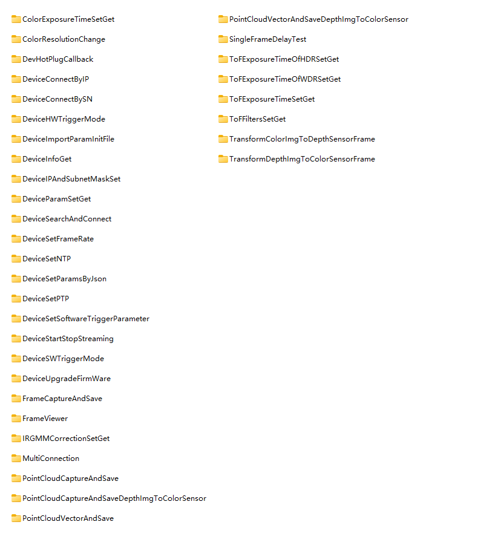
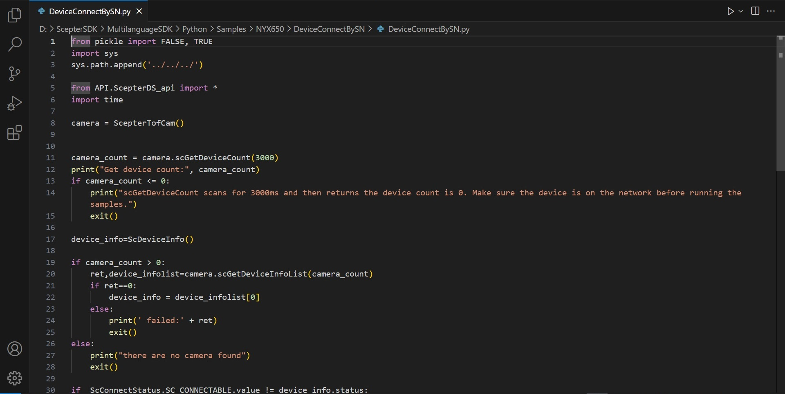
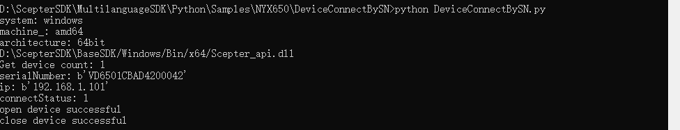
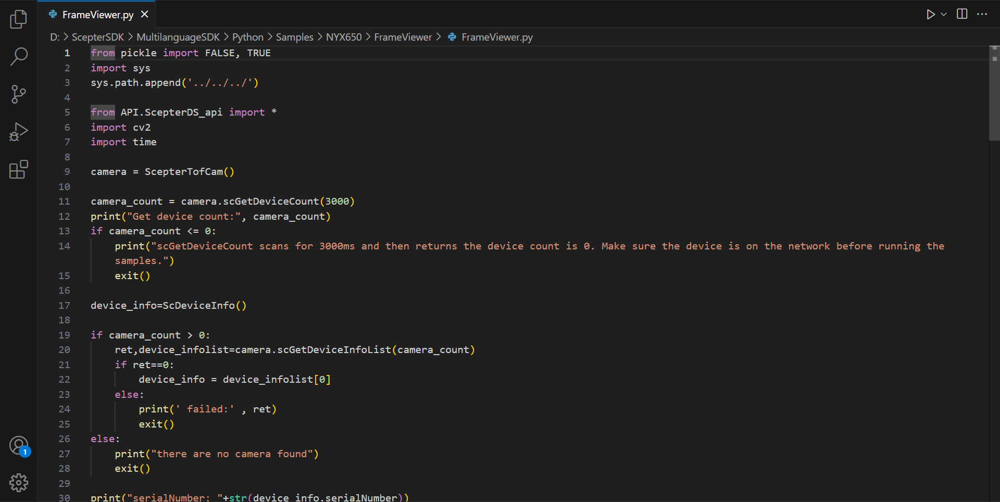
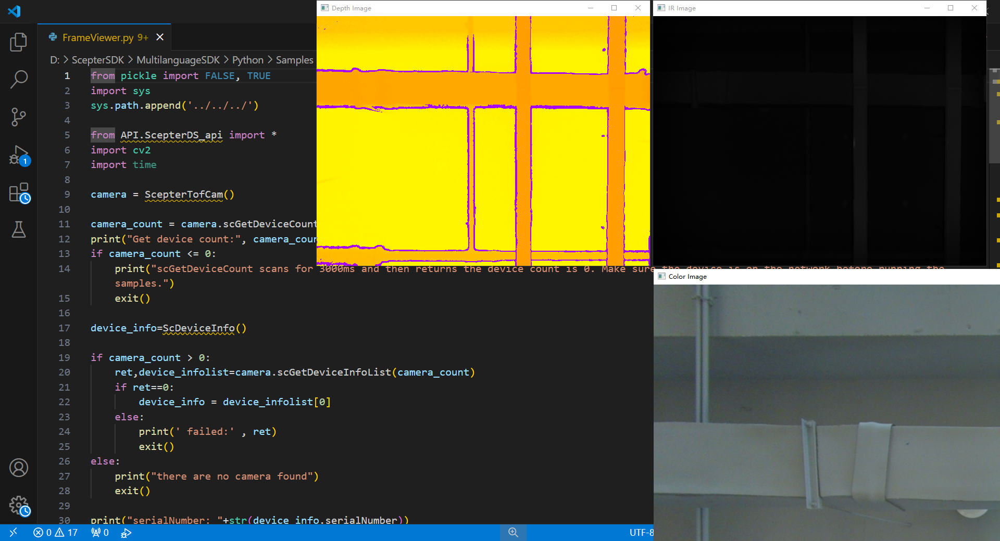
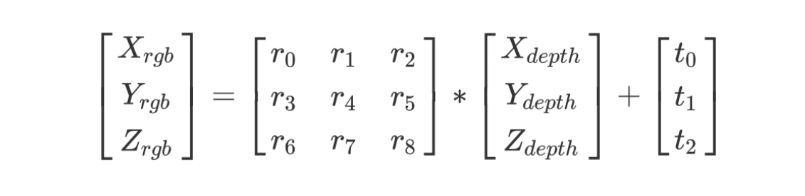

# 3.1. Python

## 3.1.1. Basic introduction

<!-- Python SDK 目录结构如下： -->

The Python SDK directory structure is as follows:


<!-- - API：主要包含 SDK 的通用头文件：Scepter_api.py，Scepter_define.py，Scepter_enums.py，Scepter_types.py。 -->

- API：Includes the common header files of SDK: Scepter_api.py，Scepter_define.py，Scepter_enums.py，Scepter_types.py.

<!-- - Samples：主要包含使用 ScepterSDK 开发的例程。 -->

- Samples:Primarily contains samples developed using the ScepterSDK.

<!-- - README.md：SDK 的内容简介。 -->

- README:Introduction to the SDK.

## 3.1.2. Project Configuration

<!-- 在运行 ScepterSDK 之前，请确保您的 Python 版本为 3.7.x 或更高版本，并已安装 ctypes、numpy 模块。在大多数 Python 发行版中，ctypes 都是作为内置模块存在的，因此我们There is no.需额外安装。 -->

Before running the ScepterSDK, make sure that your Python version is 3.7.x or higher and that you have the ctypes, numpy modules installed. In most Python distributions, ctypes exists as a built-in module, so we don't need to install it.

```console
pip install numpy
```

<!-- 使用 ScepterSDK 开发新的项目，需要使用英文路径。针对不同的操作系统，需要同时复制 SDK 中的 Python 文件夹和对应系统的文件夹。API 文件夹中的 Scepter_api.py 会自动读取相机的 libScepter_api.so 或 Scepter_api.dll 库文件。 -->

To develop a new project using the ScepterSDK, you need to use the English path. For different operating systems, you need to copy the Python folder in the SDK and the folder of the corresponding system at the same time. The Scepter_api.py in the API folder automatically reads the camera's libScepter_api.so or the Scepter_api.dll library file.

```python
if system_ == 'linux':
   if machine_ == 'x86_64':
      os_info = os.uname()
      print('os_info:',type(os_info))
      system_info = os_info.version
      print('version:',system_info)
      if system_info.find('18.04') != -1 or system_info.find('20.04') != -1:
         libpath = (os.path.abspath(os.path.dirname(os.getcwd()) + os.path.sep + "../../../../BaseSDK/"))+"/Ubuntu18.04/Lib/libScepter_api.so"
         print(libpath)
         self.sc_cam_lib = cdll.LoadLibrary(libpath)
      else:
         libpath = (os.path.abspath(os.path.dirname(os.getcwd()) + os.path.sep + "../../../../BaseSDK/"))+"/Ubuntu16.04/Lib/libScepter_api.so"
         print(libpath)
         self.sc_cam_lib = cdll.LoadLibrary(libpath)
      elif machine_ == 'aarch64':
         libpath = (os.path.abspath(os.path.dirname(os.getcwd()) + os.path.sep + "../../../../BaseSDK/"))+"/AArch64/Lib/libScepter_api.so"
         print(libpath)
         self.sc_cam_lib = cdll.LoadLibrary(libpath)
   else:
      print('do not supported OS', system_, machine_)
      exit()
elif platform.system() == 'Windows':
   if machine_ == 'amd64':
      if architecture_ == '64bit':
         libpath = (os.path.abspath(os.path.dirname(os.getcwd()) + os.path.sep + "../../../../BaseSDK/"))+"/Windows/Bin/x64/Scepter_api.dll"
         print(libpath)
         elf.sc_cam_lib = cdll.LoadLibrary(libpath)
   else:
      libpath = (os.path.abspath(os.path.dirname(os.getcwd()) + os.path.sep + "../../../../BaseSDK/"))+"/Windows/Bin/x86/Scepter_api.dll"
      print(libpath)
      self.sc_cam_lib = cdll.LoadLibrary(libpath)
   else:
      print('do not supported OS', system_, machine_)
      exit()
else:
   print('do not supported OS', system_, machine_)
   exit()

```

## 3.1.3. Base Samples

<!-- 基础例程介绍 SDK 的单个特性 API 接口的使用。为了使用户可以快速的熟悉使用，例程根据产品进行分类。 -->

The base sample is used to demonstrate the single feature of basic APIs. In order to help developer familiar with SDK quickly, the examples are classified according to products.

<!-- 例程包含打开图像数据流、图像获取、软/硬触发、点云转换与保存等 API 接口的使用。 -->

Open device, image acquisition, software/hardware trigger, point cloud store are all included in the SDK example codes.



<!-- 接下来，我们将详细介绍每个例程的Function。 -->

Next, we will detail the Function for each sample.

```python
ColorExposureTimeSetGet                         #Set and get the exposure time of color sensor.
ColorResolutionChange                           #Change device color sensor resolution.
DevHotPlugCallback                              #Set the callback function for hotplug status.
DeviceConnectByIP                               #Use the device IP address to connect the device.
DeviceConnectBySN                               #Use the serial number to connect the device.
DeviceHWTriggerMode                             #Set device to Hardware Trigger Mode.
DeviceImportParamInitFile					   #Import the init file of parameters into device.
DeviceInfoGet                                   #Get Device SN, IP address and firmware version. information.
DeviceIPAndSubnetMaskSet					    #Set the IP and the SubnetMask with DHCP disabled.
DeviceParamSetGet                               #Get intrinsic parameters and extrinsic parameters of the device, and set and get the GmmaGian value of the Device.
DeviceSearchAndConnect                          #Search and connect the Device.
DeviceSetFrameRate                              #Set Device Rrame Rate.
DeviceSetNTP				                    #Set NTP enabled.
DeviceSetParamsByJson                           #Set device parameters by Json.
DeviceSetPTP				                    #Set PTP enabled.
DeviceSetSoftwareTriggerParameter               #Set the framecount to merge in Software Trigger Mode.
DeviceStartStopStreaming                        #Start and stop device streaming.
DeviceSWTriggerMode                             #Set device to Software Trigger Mode.
DeviceUpgradeFirmWare                           #Upgrade the firmWare.
FrameCaptureAndSave                             #Capture and save device frame.
IRGMMCorrectionSetGet                           #Set and get the IRGMMCorrection parameters of device.
MultiConnection                                 #Multiple device connection.
PointCloudCaptureAndSave                        #Capture and save point cloud.
PointCloudCaptureAndSaveDepthImgToColorSensor   #Capture the point cloud and save the depth image to the color sensor.
PointCloudVectorAndSave                         #Capture and save point clouds in the ROI.
PointCloudVectorAndSaveDepthImgToColorSensor    #Capture the point cloud in the ROI and save the depth image to the color sensor.
SingleFrameDelayTest                            #Get the delay for trigger to get frame in APP.
ToFExposureTimeOfHDRSetGet                      #Set and get ToF exposure time of the device,in HDR enabled.
ToFExposureTimeOfWDRSetGet                      #Set and get ToF exposure time of the device,in WDR enabled.
ToFExposureTimeSetGet                           #Set and get ToF exposure time of the device.
ToFFiltersSetGet                                #Set and get ToF Filters switch of the device.
TransformColorImgToDepthSensorFrame             #Color image is transformed to depth sensor space where the resolution is the same as the depth frame's resolution.
TransformDepthImgToColorSensorFrame             #Depth image is transformed to color sensor space where the resolution is the same as the color frame's resolution.
FrameViewer                                     #OpenCV sample
```

<!-- 下面，我们以单个产品的单独例程为例，演示其编译运行的过程： -->

Take a single routine of a single product as an example to demonstrate the process of compiling and running it:

<!-- 1. 根据实际产品选择对应的 sample，以 NYX650 产品编译 DeviceConnectBySN 为例 -->

1. Select the corresponding sample according to the actual product. Take the NYX650 product to compile DeviceConnectBySN as an example:

   

<!-- 2. 编译完成，调试运行。 -->

2. After compilation is complete, debug and run.

   ```consle
   cd ScepterSDK\Python\Samples\NYX650\DeviceConnectBySN
   python DeviceConnectBySN.py
   ```

   <!-- 结果如下图： -->

   The results are as follows:

   

## 3.1.4. OpenCV Samples

<!-- OpenCV 例程用于展示如何搭配第三方库使用 Scepter SDK。例程使用 OpenCV 的图像映射Function展示彩色深度图像、IR 与 Color 图像。 -->

The OpenCV samples show how to use ScepterSDK with third-party libraries. The example uses the image mapping function of OpenCV to display color depth images, IR, and Color images.

<!-- 1. 安装 opencv-python 模块。 -->

1. Install the opencv-python module.

   ```console
   pip install opencv-python
   ```

<!-- 2. 根据实际产品选择对应的 sample，以 NYX650 为例 -->

2. Select the corresponding sample according to the actual product, taking NYX650 as an example

   

<!-- 3. 运行 OpenCV 显示例程 -->

3. Run the OpenCV display sample

   ```consle
   cd ScepterSDK\Python\Samples\NYX650\FrameViewer
   python FrameViewer.py
   ```

   

## 3.1.5. API Introduction

<!-- > 不同型号产品对应的Enumerator个数可能不同，请以实际Enumerator为准。 -->

> The number of enumeration values corresponding to different models of products may be different. Please refer to the actual enumeration value.

<!-- tabs:start -->

#### **Enum Type**

### 3.1.5.1.1. ScFrameType

**Function：**

Image type.

**Enumerator：**

```python
class ScFrameType(Enum):
    SC_DEPTH_FRAME                               = 0,   # Depth frame with 16 bits per pixel in millimeters.
    SC_IR_FRAME                                  = 1,   # IR frame with 8 bits per pixel.
    SC_COLOR_FRAME                               = 3,   # Color frame with 24 bits per pixel in RGB/BGR format.
    SC_TRANSFORM_COLOR_IMG_TO_DEPTH_SENSOR_FRAME = 4,   # Color frame with 24 bits per pixel in RGB/BGR format, that is transformed to depth
                                                        # sensor space where the resolution is the same as the depth frame's resolution.
                                                        # This frame type can be enabled using ::scSetTransformColorImgToDepthSensorEnabled().
    SC_TRANSFORM_DEPTH_IMG_TO_COLOR_SENSOR_FRAME = 5,   # Depth frame with 16 bits per pixel, in millimeters, that is transformed to color sensor
                                                        # space where the resolution is same as the color frame's resolution.
                                                        # This frame type can be enabled using ::scSetTransformDepthImgToColorSensorEnabled().
```

### 3.1.5.1.2. ScSensorType

**Function：**

传感器类型。

**Enumerator：**

```python
class ScSensorType(Enum):
    SC_TOF_SENSOR   = 0x01,   # Indicates a depth sensor.
    SC_COLOR_SENSOR = 0x02,   # Indicates a color sensor.
```

### 3.1.5.1.3. ScPixelFormat

**Function：**

Pixel type of image data.

**Enumerator：**

```python
class ScPixelFormat(Enum):
    SC_PIXEL_FORMAT_DEPTH_MM16   = 0,   # Depth image pixel format, 16 bits per pixel in mm.
    SC_PIXEL_FORMAT_GRAY_8       = 2,   # Gray image pixel format, 8 bits per pixel.

    # Color
    SC_PIXEL_FORMAT_RGB_888_JPEG = 3,   # By jpeg decompress, color image pixel format, 24 bits per pixel RGB format.
    SC_PIXEL_FORMAT_BGR_888_JPEG = 4,   # By jpeg decompress, color image pixel format, 24 bits per pixel BGR format.
    SC_PIXEL_FORMAT_RGB_888      = 5,   # Without compress, color image pixel format, 24 bits per pixel RGB format.
    SC_PIXEL_FORMAT_BGR_888      = 6,   # Without compress, color image pixel format, 24 bits per pixel BGR format.
    SC_PIXEL_FORMAT_RGB_565      = 7,   # Without compress, color image pixel format, 16 bits per pixel RGB format.
    SC_PIXEL_FORMAT_BGR_565      = 8,   # Without compress, color image pixel format, 16 bits per pixel BGR format.
```

### 3.1.5.1.4. ScReturnStatus

**Function：**

Returns of an interface function.

**Enumerator：**

```python
class ScReturnStatus(Enum):
    SC_OK                           = 0,      # The function completed successfully.
    SC_NO_DEVICE_CONNECTED          = -1,     # There is no. depth camera connected or the camera has not been connected correctly.
                                              # Check the hardware connection or try unplugging and re-plugging the USB cable.
    SC_INVALID_DEVICE_INDEX         = -2,     # The input device index is invalid.
    SC_DEVICE_POINTER_IS_NULL       = -3,     # The device structure pointer is null.
    SC_INVALID_FRAME_TYPE           = -4,     # The input frame type is invalid.
    SC_FRAME_POINTER_IS_NULL        = -5,     # The output frame buffer is null.
    SC_NO_PROPERTY_VALUE_GET        = -6,     # Cannot get the value for the specified property.
    SC_NO_PROPERTY_VALUE_SET        = -7,     # Cannot set the value for the specified property.
    SC_PROPERTY_POINTER_IS_NULL     = -8,     # The input property value buffer pointer is null.
    SC_PROPERTY_SIZE_NOT_ENOUGH     = -9,     # The input property value buffer size is too small to store the specified property value.
    SC_INVALID_DEPTH_RANGE          = -10,    # The input depth range mode is invalid.
    SC_GET_FRAME_READY_TIME_OUT     = -11,    # Capture the next image frame time out.
    SC_INPUT_POINTER_IS_NULL        = -12,    # An input pointer parameter is null.
    SC_CAMERA_NOT_OPENED            = -13,    # The camera has not been opened.
    SC_INVALID_CAMERA_TYPE          = -14,    # The specified type of camera is invalid.
    SC_INVALID_PARAMS               = -15,    # One or more of the parameter values provided are invalid.
    SC_CURRENT_VERSION_NOT_SUPPORT  = -16,    # This feature is not supported in the current version.
    SC_UPGRADE_IMG_ERROR            = -17,    # There is an error in the upgrade file.
    SC_UPGRADE_IMG_PATH_TOO_LONG    = -18,    # Upgrade file path length greater than 260.
    SC_UPGRADE_CALLBACK_NOT_SET     = -19,    # scSetUpgradeStatusCallback is not called.
    SC_PRODUCT_NOT_SUPPORT          = -20,    # The current product does not support this operation.
    SC_NO_CONFIG_FOLDER             = -21,    # No product profile found.
    SC_WEB_SERVER_START_ERROR       = -22,    # WebServer Start/Restart error(IP or PORT).
    SC_GET_OVER_STAY_FRAME          = -23,    # The time from frame ready to get frame is out of 1s.
    SC_CREATE_LOG_DIR_ERROR         = -24,    # Create log directory error.
    SC_CREATE_LOG_FILE_ERROR        = -25,    # Create log file error.
    SC_NO_ADAPTER_CONNECTED         = -100,   # There is no adapter connected.
    SC_REINITIALIZED                = -101,   # The SDK has been Initialized.
    SC_NO_INITIALIZED               = -102,   # The SDK has not been Initialized.
    SC_CAMERA_OPENED                = -103,   # The camera has been opened.
    SC_CMD_ERROR                    = -104,   # Set/Get cmd control error.
    SC_CMD_SYNC_TIME_OUT            = -105,   # Set cmd ok.but time out for the sync return.
    SC_IP_NOT_MATCH                 = -106,   # IP is not in the same network segment.
    SC_NOT_STOP_STREAM              = -107,   # Please invoke scStopStream first to close the data stream.
    SC_NOT_START_STREAM             = -108,   # Please invoke scStartStream first to get the data stream.
    SC_NOT_FIND_DRIVERS_FOLDER      = -109,   # Please check whether the Drivers directory exists.
    SC_CAMERA_OPENING               = -110,   # The camera is openin,by another Sc_OpenDeviceByXXX API.
    SC_CAMERA_OPENED_BY_ANOTHER_APP = -111,   # The camera has been opened by another APP.
    SC_OTHERS                       = -255,   # An unknown error occurred.
```

### 3.1.5.1.5. ScConnectStatus

**Function：**

Device connection status.

**Enumerator：**

```python
class ScConnectStatus(Enum):
    SC_LIMBO       = 0,   # Unknown device status and cannot try to open.
    SC_CONNECTABLE = 1,   # Device connectable state and support open.
    SC_OPENED      = 2,   # The device is connected and cannot be opened again.
```

### 3.1.5.1.6. ScWorkMode

**Function：**

Device working condition.

**Enumerator：**

```python
class ScWorkMode(Enum):
    SC_ACTIVE_MODE           = 0x00,   # Enter the active mode.
    SC_HARDWARE_TRIGGER_MODE = 0x01,   # Enter the hardware salve mode, at this time need to connect
                                       # the hardware trigger wire, provide hardware signal, to trigger the image.
    SC_SOFTWARE_TRIGGER_MODE = 0x02,   # Enter the software salve mode, at this time need to invoke scSoftwareTriggerOnce, to trigger the image.
```

### 3.1.5.1.7. ScExposureControlMode

**Function：**

Exposure mode of the sensor.

**Enumerator：**

```python
class ScExposureControlMode(Enum):
    SC_EXPOSURE_CONTROL_MODE_AUTO   = 0,   # Enter the auto exposure mode.
    SC_EXPOSURE_CONTROL_MODE_MANUAL = 1,   # Enter the manual exposure mode.
```

#### **Struct Type**

### 3.1.5.2.1. ScRGB888Pixel

**Function：**

Color image pixel type RGB888.

**Members：**

```python
class ScRGB888Pixel(Structure):
    _pack_ = 1
    _fields_ = [("r", c_uint8),     #indicates the red channel.
                ("g", c_uint8),     #indicates the green channel.
                ("b", c_uint8)]     #indicates the blue channe.
```

### 3.1.5.2.2. ScBGR888Pixel

Color image pixel type BGR888.

**Members：**

```python
class ScBGR888Pixel(Structure):
    _pack_ = 1
    _fields_ = [("b", c_uint8),     #indicates the blue channel.
                ("g", c_uint8),     #indicates the green channel.
                ("r", c_uint8)]     #indicates the red channe.
```

### 3.1.5.2.3. ScVector3f

**Function：**

Three dimensional point coordinates in millimeters.

**Members：**

```python
class ScVector3f(Structure):
    _pack_ = 1
    _fields_ = [("x", c_float),     #Represents the coordinate value along the X-axis.
                ("y", c_float),     #Represents the coordinate value along the y axis.
                ("z", c_float)]     #Represents the coordinate value along the z axis.
```

### 3.1.5.2.4. ScVector2u16

**Function：**

Two dimensional point coordinates.

**Members：**

```python
class ScVector2u16(Structure):
    _pack_ = 1
    _fields_ = [("x", c_uint16),    #Represents the coordinate value along the X-axis.
                ("y", c_uint16)]    #Represents the coordinate value along the y axis.
```

### 3.1.5.2.5. ScDepthVector3

**Function：**

深度图像的像素点表示。

**Members：**

```python
class ScDepthVector3(Structure):
    _pack_ = 1
    _fields_ = [("depthX", c_int),     #Indicates the coordinate value along the X-axis in the image coordinate system.
                ("depthY", c_int),     #Represents the coordinate value along the Y-axis in the image coordinate system.
                ("depthZ", c_uint16)]  #Indicates the depth value at pixel coordinates (depthX, depthY), in millimeters.
```

### 3.1.5.2.6. ScResolution

**Function：**

Image resolution.

**Members：**

```python
class ScResolution(Structure):
    _pack_ = 1
    _fields_ = [("width", c_int),      #The width of the image.
                ("height", c_int)]     #The height of the image.
```

### 3.1.5.2.7. ScResolutionList

**Function：**

Supported Image Resolution.

**Members：**

```python
class ScResolutionList(Structure):
    _pack_ = 1
    _fields_ = [("count", c_int),                     #The number of image resolutions.
                ("resolution", ScResolution * 6)]     #The information of image resolution.
```

### 3.1.5.2.8. ScSensorIntrinsicParameters

**Function：**

<!-- 传感器的镜头内参和畸变参数。内参通常用于点云的计算，畸变参数用于图像反畸变算法使用。

SDK 中已经实现深度图像到点云的转换及图像反畸变的Function，请参考例程使用相关接口。 -->

Lens parameters and distortion parameters of the sensor. The internal parameter is usually used to calculate the point cloud and the distortion parameter is used in the image anti-distortion algorithm.

SDK has realized the function of converting depth image to point cloud and image anti-distortion, please refer to the routine to use the relevant interface.

**Members：**

```python
class ScSensorIntrinsicParameters(Structure):
    _pack_ = 1
    _fields_ = [("fx", c_double),      #Focal length y (pixel).
                ("fy", c_double),      #Focal length x (pixel).
                ("cx", c_double),      #Principal point x (pixel).
                ("cy", c_double),      #Principal point y (pixel).
                ("k1", c_double),      #Radial distortion coefficient, 1st-order.
                ("k2", c_double),      #Radial distortion coefficient, 2nd-order.
                ("p1", c_double),      #Tangential distortion coefficient.
                ("p2", c_double),      #Tangential distortion coefficient.
                ("k3", c_double),      #Radial distortion coefficient, 3rd-order.
                ("k4", c_double),      #Radial distortion coefficient, 4st-order.
                ("k5", c_double),      #Radial distortion coefficient, 5nd-order.
                ("k6", c_double)]      #Radial distortion coefficient, 6rd-order.
```

### 3.1.5.2.9. ScSensorExtrinsicParameters

**Function：**

The external parameters R and T of the camera are used to align depth with RGB images. The reference formula is as follows:



**Members：**

```python
class ScSensorExtrinsicParameters(Structure):
    _pack_ = 1
    _fields_ = [("rotation", c_double * 9),        #A 3x3 rotation matrix.
                ("translation", c_double * 3)]     #3×1 translation matrix.
```

### 3.1.5.2.10. ScTimeStamp

**Function：**

Represents the image timestamp.

**Members：**

```python
class ScTimeStamp(Structure):
    _pack_ = 1
    _fields_ = [("tm_sec", c_uint16),     #Seconds.
                ("tm_min", c_uint16),     #Minute.
                ("tm_hour", c_uint16),    #Hour.
                ("tm_msec", c_uint16)]    #Milliseconds.
```

### 3.1.5.2.11. ScFrame

**Function：**

Depth/IR/Color image information.

**Members：**

```python
class ScFrame(Structure):
    _pack_ = 1
    _fields_ = [("frameIndex", c_uint32),             #Indicates the index of the frame.
                ("frameType", c_int32),               #Indicates the type of frame.
                ("pixelFormat", c_int32),             #Indicates the pixel format used by a frame.
                ("pFrameData", POINTER(c_uint8)),     #A buffer containing the frame’s image data.
                ("dataLen", c_uint32),                #Indicates the length of pFrame, in bytes.
                ("exposureTime", c_float),            #Indicates the exposure time, in milliseconds.
                ("depthRange", c_uint8),              #Indicates the depth range mode of the current frame. Used only for depth frames.
                ("width", c_uint16),                  #Indicates the width of the frame, in pixels.
                ("height", c_uint16),                 #Indicates the height of the frame, in pixels.
                ("hardwaretimestamp", c_uint64)]      #Indicates the timestamp when the frame be generated on the device. Frame processing and transfer time are not included.
```

### 3.1.5.2.12. ScFrameReady

**Function：**

Whether the image data is ready (1 means ready, 0 means not ready).

**Enumerator：**

```python
class ScFrameReady(Structure):
    _pack_ = 1
    _fields_ = [("depth", c_uint, 1),                 #Indicates whether the depth image data is ready.
                ("ir", c_uint, 1),                    #Indicates whether grayscale image data is ready.
                ("color", c_uint, 1),                 #Indicates whether color image data is ready.
                ("transformedColor", c_uint, 1),      #Indicates whether the color image aligned to the depth sensor space is ready.
                ("transformedDepth", c_uint, 1),      #Indicates whether the depth image is ready to align to the color sensor space.
                ("reserved", c_uint, 27)]             #Reserved bit.
```

### 3.1.5.2.13. ScDeviceInfo

**Function：**

Device information.

**Members：**

```python
class ScDeviceInfo(Structure):
    _pack_ = 1
    _fields_ = [("productName", c_char * 64),      #Indicates the Product type name.
                ("serialNumber", c_char * 64),     #Indicates the SerialNumber of the device.
                ("ip", c_char * 17),               #Indicates the IP address of the device.
                ("status", c_int32)]               #Indicates the connection status of the device.
```

### 3.1.5.2.14. ScConfidenceFilterParams

**Function：**

Confidence filtering parameter.

**Members：**

```python
class ScConfidenceFilterParams(Structure):
    _pack_ = 1
    _fields_ = [("threshold", c_int32),      #Range in [1, 100]. The larger the value is, the more obvious the filtering effect is and the more points are filtered out.
                ("enable", c_bool)]          #Indicates whether filtering is enabled. True indicates that filtering is enabled. False indicates that filtering is disabled.
```

### 3.1.5.2.15. ScFlyingPixelFilterParams

**Function：**

To fly point filter parameters.

**Members：**

```python
class ScFlyingPixelFilterParams(Structure):
    _pack_ = 1
    _fields_ = [("threshold", c_int32),      #Range in [0, 16]. The larger the value is, the more obvious the filtering effect is and the more points are filtered out.
                ("enable", c_bool)]          #Indicates whether filtering is enabled. True indicates that filtering is enabled. False indicates that filtering is disabled.
```

### 3.1.5.2.16. ScTimeFilterParams

**Function：**

Time filter parameter.

**Members：**

```python
class ScTimeFilterParams(Structure):
    _pack_ = 1
    _fields_ = [("threshold", c_int32),      #Range in [1, 6],The larger the value is, the more obvious the filtering effect is and The smaller the point cloud wobble.
                ("enable", c_bool)]          #Indicates whether filtering is enabled. True indicates that filtering is enabled. False indicates that filtering is disabled.
```

### 3.1.5.2.17. ScIRGMMCorrectionParams

**Function：**

IR gain value correction parameter.

**Members：**

```python
class ScIRGMMCorrectionParams(Structure):
    _pack_ = 1
    _fields_ = [("threshold", c_int32),      #Range in [1, 100]. The larger the value is, the more obvious the correction effect.
                ("enable", c_bool)]          #Indicates whether filtering is enabled. True indicates that filtering is enabled. False indicates that filtering is disabled.
```

### 3.1.5.2.18. ScInputSignalParamsForHWTrigger

**Function：**

Input signal parameters for Hardware Trigger.

**Members：**

```python
class ScInputSignalParamsForHWTrigger(Structure):
    _pack_ = 1
    _fields_ = [("width", c_uint16),        #Range in [1,65535]. The width of input signal.
                ("interval", c_uint16),     #Range in [34000,65535]. The interval of input signal.65535]
                ("polarity", c_uint8)]		#Range in [0,1]. 0 for active low; 1 for active high.
```

### 3.1.5.2.19. ScTimeSyncConfig

**Function：**

Time Sync parameters.

**Members：**

```python
class ScTimeSyncConfig(Structure):
    _pack_ = 1
    _fields_ = [("flag", c_uint8),			#0: disable, 1: NTP, 2: PTP, only NTP needs the ip.
                ("ip", c_uint8 * 16)]       #just for NTP.
```

#### **API**

class ScepterTofCam change the BaseSDK API to Python.

### 3.1.5.3.1. scInitialize

**Prototype：**

```python
def scInitialize(self):
    return self.sc_cam_lib.scInitialize()
```

**Description：**

Initializes the API on the device. This function must be invoked before any other Scepter APIs.

**Parameters：**

There is no.

**Returns：**

[**ScReturnStatus**](#_31514-screturnstatus)：SC_OK If the function succeeded, or one of the error values defined by ::ScStatus.


> scInitialize has been called in def __init__(self) ，so the Samples do not call it again
### 3.1.5.3.2. scShutdown

**Prototype：**

```python
def scShutdown(self):
    return self.sc_cam_lib.scShutdown()
```

**Description：**

Shuts down the API on the device and clears all resources allocated by the API. After invoking this function, no other Scepter APIs can be invoked.

**Parameters：**

There is no.

**Returns：**

[**ScReturnStatus**](#_31514-screturnstatus)：SC_OK If the function succeeded, or one of the error values defined by ::ScStatus.

> scInitialize has been called in def __del__(self) ，so the Samples do not call it again
### 3.1.5.3.3. scGetSDKVersion

**Prototype：**

```python
def scGetSDKVersion(self):
    tmp = c_char * 64
    version = tmp()
    return self.sc_cam_lib.scGetSDKVersion(version, 63),version.value
```

**Description：**

Obtain the SDK version: X.X.X.

**Parameters：**

There is no.

**Returns：**

version.value：Returns The SDK version number.

### 3.1.5.3.4. scGetDeviceCount

**Prototype：**

```python
def scGetDeviceCount(self, scanTime = c_uint32(33)):
    count = c_int()
    self.sc_cam_lib.scGetDeviceCount(byref(count), scanTime)
    return count.value
```

**Description：**

Get the number of connected devices.

**Parameters：**

scanTime：The unit is millisecond, and the numeric range is (0, 65535).
The API returns immediately when the device count is not 0.
When the device count is 0, the API waits up to the wait time (ms) unless the device count is not 0.

**Returns：**

count.value：Count of devices.

### 3.1.5.3.5. GetDeviceInfoList

**Prototype：**

```python
def scGetDeviceInfoList(self, cam_count = 1):
    tmp  = ScDeviceInfo* cam_count
    device_infolist = tmp()
    return self.sc_cam_lib.scGetDeviceInfoList(cam_count, device_infolist),device_infolist
```

**Description：**

Obtain the device list of the number of Devicecounts.

**Parameters：**

cam_count：The number of camera devices.

**Returns：**

[**ScReturnStatus**](#_31514-screturnstatus)：SC_OK If the function succeeded, or one of the error values defined by ::ScStatus.

[device_infolist](#_315213-scdeviceinfo)：Returns a list of device information that should point to a cache of size sizeof(ScDeviceInfo)\*deviceCount.

### 3.1.5.3.6. scOpenDeviceBySN

**Prototype：**

```python
def scOpenDeviceBySN(self,  SN=c_char_p()):
    if SN:
        return self.sc_cam_lib.scOpenDeviceBySN(SN, byref(self.device_handle))
    else:
        return ScReturnStatus.SC_INPUT_POINTER_IS_NULL
```

**Description：**

Opens the device using the device SerialNumber.

**Parameters：**

SN：The SerialNumber of the device.

**Returns：**

[**ScReturnStatus**](#_31514-screturnstatus)：SC_OK If the function succeeded, or one of the error values defined by ::ScStatus.

### 3.1.5.3.7. scOpenDeviceByIP

**Prototype：**

```python
def scOpenDeviceByIP(self,  ip=c_char_p()):
    if ip:
        return self.sc_cam_lib.scOpenDeviceByIP(ip, byref(self.device_handle))
    else:
        return ScReturnStatus.SC_INPUT_POINTER_IS_NULL, 0
```

**Description：**

Use the device IP address to open the device.

**Parameters：**

ip：The IP adress of the device.

**Returns：**

[**ScReturnStatus**](#_31514-screturnstatus)：SC_OK If the function succeeded, or one of the error values defined by ::ScStatus.

### 3.1.5.3.8. scCloseDevice

**Prototype：**

```python
def scCloseDevice(self):
    return self.sc_cam_lib.scCloseDevice(byref(self.device_handle))
```

**Description：**

Closes the device.

**Parameters：**

There is no.

**Returns：**

[**ScReturnStatus**](#_31514-screturnstatus)：SC_OK If the function succeeded, or one of the error values defined by ::ScStatus.

### 3.1.5.3.9. scStartStream

**Prototype：**

```python
def scStartStream(self):
    return self.sc_cam_lib.scStartStream(self.device_handle)
```

**Description：**

Open data Stream.

**Parameters：**

There is no.

**Returns：**

[**ScReturnStatus**](#_31514-screturnstatus)：SC_OK If the function succeeded, or one of the error values defined by ::ScStatus.

### 3.1.5.3.10. scStopStream

**Prototype：**

```python
def scStopStream(self):
    return self.sc_cam_lib.scStopStream(self.device_handle)
```

**Description：**

Close the data stream.

**Parameters：**

There is no.

**Returns：**

[**ScReturnStatus**](#_31514-screturnstatus)：SC_OK If the function succeeded, or one of the error values defined by ::ScStatus.

### 3.1.5.3.11. scGetFrameReady

**Prototype：**

```python
def scGetFrameReady(self,waitTime = c_uint16(33)):
    frameready = ScFrameReady()
    if not self.device_handle:
        return -3, frameready
    return self.sc_cam_lib.scGetFrameReady(self.device_handle, waitTime, byref(frameready)), frameready
```

**Description：**

Gets the image ready state. This function must be called before calling scGetFrame, otherwise the image cannot be retrieved.

**Parameters：**

waitTime：The unit is millisecond, the value is in the range (0,65535).You can change the value according to the frame rate. For example,the frame rate is 30, so the theoretical waittime interval is 33ms,but if set the time value is 20ms, it means the maximum wait time is 20 ms when capturing next frame, so when call the scGetFrameReady,it may return SC_GET_FRAME_READY_TIME_OUT(-11).So the recommended value is 2 \* 1000/ FPS.

**Returns：**

[**ScReturnStatus**](#_31514-screturnstatus)：SC_OK If the function succeeded, or one of the error values defined by ::ScStatus.

[frameready](#_315212-scframeready)：Returns the ready state of the image.

### 3.1.5.3.12. scGetFrame

**Prototype：**

```python
def scGetFrame(self,  frametype = ScFrameType.SC_DEPTH_FRAME):
    Scframe = ScFrame()
    return self.sc_cam_lib.scGetFrame(self.device_handle, frametype.value, byref(Scframe)), Scframe
```

**Description：**

Gets image data of the specified image type scGetFrameReady must be called before calling this function.

**Parameters：**

[frametype.value](#_31511-scframetype)：Specifies the type of the image to be obtained.

**Returns：**

[**ScReturnStatus**](#_31514-screturnstatus)：SC_OK If the function succeeded, or one of the error values defined by ::ScStatus.

[Scframe](#_315211-scframe)：The returned image data.

### 3.1.5.3.13.scGetDepthRangeValue

**Prototype：**

```python
def scGetDepthRangeValue(self):
    minValue = c_int16(0)
    maxValue = c_int16(0)
    return self.sc_cam_lib.scGetDepthRangeValue(self.device_handle, byref(minValue), byref(maxValue)), minValue, maxValue
 
```

**Description：**

Get the depth range in the current working mode of the device.

**Parameters：**

There is no.

**Returns：**

[**ScReturnStatus**](#_31514-screturnstatus)：SC_OK If the function succeeded, or one of the error values defined by ::ScStatus.

minValue：The min value of the depth.

minValue：The max value of the depth.

### 3.1.5.3.14. scGetSensorIntrinsicParameters

**Prototype：**

```python
def scGetSensorIntrinsicParameters(self, sensorType = ScSensorType.SC_TOF_SENSOR):
    CameraParameters = ScSensorIntrinsicParameters()
    return self.sc_cam_lib.scGetSensorIntrinsicParameters(self.device_handle, sensorType.value, byref(CameraParameters)), CameraParameters
```

**Description：**

Gets the internal intrinsic parameters from the sensor lens.

**Parameters：**

[sensorType](#_31512-scsensortype)：Indicates the sensor type.

**Returns：**

[**ScReturnStatus**](#_31514-screturnstatus)：SC_OK If the function succeeded, or one of the error values defined by ::ScStatus.

[CameraParameters](#_31528-scsensorintrinsicparameters)：Returns the internal intrinsic parameters from the sensor lens.

### 3.1.5.3.15. scGetSensorExtrinsicParameters

**Prototype：**

```python
def scGetSensorExtrinsicParameters(self):
    CameraExtrinsicParameters = ScSensorExtrinsicParameters()
    return self.sc_cam_lib.scGetSensorExtrinsicParameters(self.device_handle, byref(CameraExtrinsicParameters)), CameraExtrinsicParameters
```

**Description：**

Gets the internal extrinsic parameters from the sensor lens.

**Parameters：**

There is no.

**Returns：**

[**ScReturnStatus**](#_31514-screturnstatus)：SC_OK If the function succeeded, or one of the error values defined by ::ScStatus.

[CameraExtrinsicParameters](#_31529-scsensorextrinsicparameters)：Returns the internal extrinsic parameters from the sensor lens.

### 3.1.5.3.16. scGetFirmwareVersion

**Prototype：**

```python
def scGetFirmwareVersion(self):
    tmp = c_char * 64
    fw = tmp()
    return self.sc_cam_lib.scGetFirmwareVersion(self.device_handle, fw, 63),fw.value
```

**Description：**

Obtain the firmware version of the device.

**Parameters：**

There is no.

**Returns：**

[**ScReturnStatus**](#_31514-screturnstatus)：SC_OK If the function succeeded, or one of the error values defined by ::ScStatus.

fw.value：Indicates the firmware version of the device.

### 3.1.5.3.18. scSetDeviceDHCPEnabled

**Prototype：**

```python
def scSetDeviceDHCPEnabled(self, enable = c_bool(True)):
    return self.sc_cam_lib.scSetDeviceDHCPEnabled(self.device_handle, enable)
```

**Description：**

Enables or disables the DHCP.

**Parameters：**

enable：Set to true to enable the feature or false to disable the feature.

**Returns：**

[**ScReturnStatus**](#_31514-screturnstatus)：SC_OK If the function succeeded, or one of the error values defined by ::ScStatus. 

### 3.1.5.3.19. scGetDeviceDHCPEnabled

**Prototype：**

```python
def scGetDeviceDHCPEnabled(self):
    enable = c_bool(True)
    return self.sc_cam_lib.scGetDeviceDHCPEnabled(self.device_handle, byref(enable)), enable.value
```

**Description：**

Returns the Boolean value of whether the DHCP is enabled or disabled.

**Parameters：**

There is no.

**Returns：**

[**ScReturnStatus**](#_31514-screturnstatus)：SC_OK If the function succeeded, or one of the error values defined by ::ScStatus. 

enable.value：true is enable the feature or false is disable the feature.

### 3.1.5.3.20. scSetDeviceIPAddr

**Prototype：**

```python
def scSetDeviceIPAddr(self, IPAddr=c_char_p(), length=c_int32(16)):
    return self.sc_cam_lib.scSetDeviceIPAddr(self.device_handle, IPAddr, length)
```

**Description：**

Set the IP address of the device in non-DHCP mode. The call takes effect after the device is restarted.

**Parameters：**

IPAddr：Pointer to a buffer in which to store the device IP address. the buffer default size is 16, and the last buffer set '\0'.

length：The length of the buffer.

**Returns：**

[**ScReturnStatus**](#_31514-screturnstatus)：SC_OK If the function succeeded, or one of the error values defined by ::ScStatus. 

### 3.1.5.3.21. scGetDeviceIPAddr

**Prototype：**

```python
def scGetDeviceIPAddr(self):
    tmp = c_char * 16
    IPAddr = tmp()
    return self.sc_cam_lib.scGetDeviceIPAddr(self.device_handle, IPAddr), IPAddr.value
```

**Description：**

Get the IP address of the device in non-DHCP mode.

**Parameters：**

There is no.

**Returns：**

[**ScReturnStatus**](#_31514-screturnstatus)：SC_OK If the function succeeded, or one of the error values defined by ::ScStatus. 

IPAddr.value：Pointer to a buffer in which to store the device IP address. the buffer default size is 16, and the last buffer set '\0'.

### 3.1.5.3.22. scSetDeviceSubnetMask

**Prototype：**

```python
def scSetDeviceSubnetMask(self, subnetMask=c_char_p(), length=c_int32(16)):
    return self.sc_cam_lib.scSetDeviceSubnetMask(self.device_handle, subnetMask, length)
```

**Description：**

Set the subnet mask of the device in non-DHCP mode. The call takes effect after the device is restarted.

**Parameters：**

subnetMask：Pointer to a buffer in which to store the subnet mask address. the buffer default size is 16, and the last buffer set '\0'.

length：The length of the buffer.

**Returns：**

[**ScReturnStatus**](#_31514-screturnstatus)：SC_OK If the function succeeded, or one of the error values defined by ::ScStatus. 

### 3.1.5.3.23. scGetDeviceSubnetMask

**Prototype：**

```python
def scGetDeviceSubnetMask(self):
    tmp = c_char * 16
    subnetMask = tmp()
    return self.sc_cam_lib.scGetDeviceSubnetMask(self.device_handle, subnetMask), subnetMask.value
```

**Description：**

Get the subnet mask of the device in non-DHCP mode.

**Parameters：**

There is no.

**Returns：**

[**ScReturnStatus**](#_31514-screturnstatus)：SC_OK If the function succeeded, or one of the error values defined by ::ScStatus. 

subnetMask.value：Pointer to a buffer in which to store the device subnet mask address. the buffer default size is 16, and the last buffer set '\0'.

### 3.1.5.3.24. scSetRealTimeSyncConfig

**Prototype：**

```python
def scSetRealTimeSyncConfig(self, params = ScTimeSyncConfig()):
    return self.sc_cam_lib.scSetRealTimeSyncConfig(self.device_handle, params)
```

**Description：**

Set the parameters for time sync, such as enable the NTP/PTP

**Parameters：**

[params](#_315219-sctimesyncconfig)：The parameters defined by ::ScTimeSyncConfig.

**Returns：**

[**ScReturnStatus**](#_31514-screturnstatus)：SC_OK If the function succeeded, or one of the error values defined by ::ScStatus. 

### 3.1.5.3.25. scGetRealTimeSyncConfig

**Prototype：**

```python
def scGetRealTimeSyncConfig(self):
    pParams = ScTimeSyncConfig()
    return self.sc_cam_lib.scGetRealTimeSyncConfig(self.device_handle, byref(pParams)),pParams
```

**Description：**

Get the parameters for time sync,such as the status of the NTP/PTP

**Parameters：**

There is no.

**Returns：**

[**ScReturnStatus**](#_31514-screturnstatus)：SC_OK If the function succeeded, or one of the error values defined by ::ScStatus. 

[pParams](#_315219-sctimesyncconfig)：The parameters defined by ::ScTimeSyncConfig.

### 3.1.5.3.18. scGetDeviceMACAddress

**Prototype：**

```python
def scGetDeviceMACAddress(self):
   tmp = c_char * 18
   mac = tmp()
   return self.sc_cam_lib.scGetDeviceMACAddress(self.device_handle, mac), mac.value
```

**Description：**

Obtain the MAC address of the device.

**Parameters：**

There is no.

**Returns：**

[**ScReturnStatus**](#_31514-screturnstatus)：SC_OK If the function succeeded, or one of the error values defined by ::ScStatus.

mac.value：Returns the device MAC address. the buffer default size is 18, and the last buffer set '\0'.

### 3.1.5.3.26. scSetFrameRate

**Prototype：**

```python
def scSetFrameRate(self, value = c_uint8(30)):
    return self.sc_cam_lib.scSetFrameRate(self.device_handle, value)
```

**Description：**

Sets the device's image frame rate for both depth and color images. This interface is a synchronization interface, which takes about 500ms.

**Parameters：**

value：The rate value. Different products have different maximum values. Please refer to the product specification.

**Returns：**

[**ScReturnStatus**](#_31514-screturnstatus)：SC_OK If the function succeeded, or one of the error values defined by ::ScStatus.

### 3.1.5.3.27. scGetFrameRate

**Prototype：**

```python
def scGetFrameRate(self):
   value = c_uint8(1)
   return self.sc_cam_lib.scGetFrameRate(self.device_handle, byref(value)), value.value
```

**Description：**

Gets the image frame rate of the device.

**Parameters：**

There is no.

**Returns：**

[**ScReturnStatus**](#_31514-screturnstatus)：SC_OK If the function succeeded, or one of the error values defined by ::ScStatus.

value.value：Returns the frame rate of the device image.

### 3.1.5.3.28. scSetWorkMode

**Prototype：**

```python
def scSetWorkMode(self,  mode = ScWorkMode.SC_ACTIVE_MODE):
    return self.sc_cam_lib.scSetWorkMode(self.device_handle, mode.value)
```

**Description：**

Set the working mode of the camera.

**Parameters：**

[mode](#_31516-scworkmode)：The work mode of camera. For ActiveMode, set the Time filter default true, for SlaveMode, set the Time filter default false.

**Returns：**

[**ScReturnStatus**](#_31514-screturnstatus)：SC_OK If the function succeeded, or one of the error values defined by ::ScStatus.

### 3.1.5.3.29. scGetWorkMode

**Prototype：**

```python
def scGetWorkMode(self):
    mode = c_uint8(0)
    return self.sc_cam_lib.scGetWorkMode(self.device_handle, byref(mode)), mode.value
```

**Description：**

Get the working mode of the camera.

**Parameters：**

There is no.

**Returns：**

[**ScReturnStatus**](#_31514-screturnstatus)：SC_OK If the function succeeded, or one of the error values defined by ::ScStatus.

[mod.value](#_31516-scworkmode)：Indicates the working mode of the obtained device.

### 3.1.5.3.30. scSetSoftwareTriggerParameter

**Prototype：**

```python
def scSetSoftwareTriggerParameter(self, param = c_uint8(0)):
    return self.sc_cam_lib.scSetSoftwareTriggerParameter(self.device_handle, param)
```

**Description：**

Set the count of frame in SC_SOFTWARE_TRIGGER_MODE. The more frames there are, the better frame's quality after algorithm processing

**Parameters：**

param：The count of frame, in range [1,10].

**Returns：**

[**ScReturnStatus**](#_31514-screturnstatus)：SC_OK If the function succeeded, or one of the error values defined by ::ScStatus.

### 3.1.5.3.31. scGetSoftwareTriggerParameter

**Prototype：**

```python
def scGetSoftwareTriggerParameter(self):
    param = c_uint8(0)
    return self.sc_cam_lib.scGetSoftwareTriggerParameter(self.device_handle, byref(param)), param
```

**Description：**

Get the count of framer in SC_SOFTWARE_TRIGGER_MODE.

**Parameters：**

There is no.

**Returns：**

[**ScReturnStatus**](#_31514-screturnstatus)：SC_OK If the function succeeded, or one of the error values defined by ::ScStatus.

param：The count of frame, in range [1,10].

### 3.1.5.3.32. scSoftwareTriggerOnce

**Prototype：**

```python
def scSoftwareTriggerOnce(self):
    return self.sc_cam_lib.scSoftwareTriggerOnce(self.device_handle)
```

**Description：**

Performs a software trigger, valid only when the camera is in
SC_SOFTWARE_TRIGGER_MODE.

**Parameters：**

There is no.

**Returns：**

[**ScReturnStatus**](#_31514-screturnstatus)：SC_OK If the function succeeded, or one of the error values defined by ::ScStatus.

### 3.1.5.3.33. scSetInputSignalParamsForHWTrigger

**Prototype：**

```python
def scSetInputSignalParamsForHWTrigger(self, params = ScInputSignalParamsForHWTrigger()):
    return self.sc_cam_lib.scSetInputSignalParamsForHWTrigger(self.device_handle, params)
```

**Description：**

Set the input signal parameters for Hardware Trigger.

**Parameters：**

[params](#_315218-scinputsignalparamsforhwtrigger)：Pointer to a variable in which to store the parameters.

**Returns：**

[**ScReturnStatus**](#_31514-screturnstatus)：SC_OK If the function succeeded, or one of the error values defined by ::ScStatus.

### 3.1.5.3.34. scGetInputSignalParamsForHWTrigger

**Prototype：**

```python
def scSetInputSignalParamsForHWTrigger(self, params = ScInputSignalParamsForHWTrigger()):
    return self.sc_cam_lib.scSetInputSignalParamsForHWTrigger(self.device_handle, params)
```

**Description：**

Get the Input signal parameters for Hardware Trigger.

**Parameters：**

There is no.

**Returns：**

[**ScReturnStatus**](#_31514-screturnstatus)：SC_OK If the function succeeded, or one of the error values defined by ::ScStatus.

[params](#_315218-scinputsignalparamsforhwtrigger)：Pointer to a variable in which to store the returned value.

### 3.1.5.3.35. scSetIRGMMGain

**Prototype：**

```python
def scSetIRGMMGain(self, gmmgain = c_uint8(20)):
    return self.sc_cam_lib.scSetIRGMMGain(self.device_handle, gmmgain)
```

**Description：**

Sets the digital gain of the IR image.

**Parameters：**

gmmgain：The value of IRGMM Gain.

**Returns：**

[**ScReturnStatus**](#_31514-screturnstatus)：SC_OK If the function succeeded, or one of the error values defined by ::ScStatus.

### 3.1.5.3.36. scGetIRGMMGain

**Prototype：**

```python
def scGetIRGMMGain(self):
    gmmgain = c_uint8(1)
    return self.sc_cam_lib.scGetIRGMMGain(self.device_handle, byref(gmmgain)), gmmgain.value
```

**Description：**

Obtaines the digital gain of the IR image.

**Parameters：**

There is no.

**Returns：**

[**ScReturnStatus**](#_31514-screturnstatus)：SC_OK If the function succeeded, or one of the error values defined by ::ScStatus.

gmmgain.value：Returns the IR gain value of the device.

### 3.1.5.3.37. scSetIRGMMCorrection

**Prototype：**

```python
def scSetIRGMMCorrection(self, params = ScIRGMMCorrectionParams()):
    return self.sc_cam_lib.scSetIRGMMCorrection(self.device_handle, params)
```

**Description：**

Set the device IR GMM Correction on a device.

**Parameters：**

[params](#_315217-scirgmmcorrectionparams)：The value of IR GMM Correction.

**Returns：**

[**ScReturnStatus**](#_31514-screturnstatus)：SC_OK If the function succeeded, or one of the error values defined by ::ScStatus.

### 3.1.5.3.38. scGetIRGMMCorrection

**Prototype：**

```python
def scGetIRGMMCorrection(self):
   params = ScIRGMMCorrectionParams()
   return self.sc_cam_lib.scGetIRGMMCorrection(self.device_handle, byref(params)), params
```

**Description：**

Obtaines the device IR GMM Correction on a device.

**Parameters：**

There is no.

**Returns：**

[**ScReturnStatus**](#_31514-screturnstatus)：SC_OK If the function succeeded, or one of the error values defined by ::ScStatus.

[params](#_315217-scirgmmcorrectionparams)：The value of IR GMM Correction.

### 3.1.5.3.39. scSetColorPixelFormat

**Prototype：**

```python
def scSetColorPixelFormat(self,pixelFormat=ScPixelFormat.SC_PIXEL_FORMAT_BGR_888_JPEG):
    return self.sc_cam_lib.scSetColorPixelFormat(self.device_handle, pixelFormat)
```

**Description：**

Set the color image pixel format on the device specified by device. Currently only RGB and BGR formats are supported.

**Parameters：**

[pixelFormat](#_31513-scpixelformat)：The color pixel format to use.

**Returns：**

[**ScReturnStatus**](#_31514-screturnstatus)：SC_OK If the function succeeded, or one of the error values defined by ::ScStatus.

### 3.1.5.3.40. scSetColorGain

**Prototype：**

```python
def scSetColorGain(self, params = c_float(1.0)):
   return self.sc_cam_lib.scSetColorGain(self.device_handle,  params)
```

**Description：**

Set the color Gain with the exposure mode of Color sensor in SC_EXPOSURE_CONTROL_MODE_MANUAL.

**Parameters：**

params：The value of color Gain.Different products have different maximum value. Please refer to the product specification.

**Returns：**

[**ScReturnStatus**](#_31514-screturnstatus)：SC_OK If the function succeeded, or one of the error values defined by ::ScStatus.

### 3.1.5.3.41. scGetColorGain

**Prototype：**

```python
def scGetColorGain(self):
    tmp = c_float*1
    params = tmp()
    return self.sc_cam_lib.scGetColorGain(self.device_handle,  params), params
```

**Description：**

Get the color Gain.

**Parameters：**

There is no.

**Returns：**

[**ScReturnStatus**](#_31514-screturnstatus)：SC_OK If the function succeeded, or one of the error values defined by ::ScStatus.

params：The value of color Gain.

### 3.1.5.3.42. scGetSupportedResolutionList

**Prototype：**

```python
def scGetSupportedResolutionList(self, type = ScSensorType.SC_TOF_SENSOR, cam_count=1):
    tmp = ScResolutionList * cam_count
    pList = tmp()
    return self.sc_cam_lib.scGetSupportedResolutionList(self.device_handle, type.value, byref(pList)), pList
```

**Description：**

Get a list of image resolutions supported by Sensor.

**Parameters：**

There is no.

**Returns：**

[**ScReturnStatus**](#_31514-screturnstatus)：SC_OK If the function succeeded, or one of the error values defined by ::ScStatus.

pList：List of supported resolutions.

### 3.1.5.3.43. scSetColorResolution

**Prototype：**

```python
def scSetColorResolution(self, w = c_int32(1600), h = c_int32(1200)):
    return self.sc_cam_lib.scSetColorResolution(self.device_handle, w, h)
```

**Description：**

Set the color frame Resolution.

**Parameters：**

w：The width of color image.

h：The height of color image.

**Returns：**

[**ScReturnStatus**](#_31514-screturnstatus)：SC_OK If the function succeeded, or one of the error values defined by ::ScStatus.

### 3.1.5.3.44. scGetColorResolution

**Prototype：**

```python
def scGetColorResolution(self):
    w = c_int32(1600)
    h = c_int32(1200)
    return self.sc_cam_lib.scGetColorResolution(self.device_handle, byref(w), byref(h)), w, h
```

**Description：**

Obtaines the the color frame Resolution.

**Parameters：**

There is no.

**Returns：**

[**ScReturnStatus**](#_31514-screturnstatus)：SC_OK If the function succeeded, or one of the error values defined by ::ScStatus.

w：Ruturns the width of color image.

h：Ruturns the height of color image.

### 3.1.5.3.45. scSetExposureControlMode

**Prototype：**

```python
def scSetExposureControlMode(self, sensorType = ScSensorType.SC_TOF_SENSOR, mode = ScExposureControlMode.SC_EXPOSURE_CONTROL_MODE_MANUAL):
    return self.sc_cam_lib.scSetExposureControlMode(self.device_handle, sensorType.value, mode.value)
```

**Description：**

Set the exposure mode of sensor.

**Parameters：**

[sensorType](#_31512-scsensortype)：The type of sensor (depth or color) from which to get parameter information.

[mode](#_31517-scexposurecontrolmode)：The exposure control mode.

**Returns：**

[**ScReturnStatus**](#_31514-screturnstatus)：SC_OK If the function succeeded, or one of the error values defined by ::ScStatus.

### 3.1.5.3.46. scGetExposureControlMode

**Prototype：**

```python
def scGetExposureControlMode(self, sensorType = ScSensorType.SC_TOF_SENSOR):
    mode = ScCameraExposureControlMode(1)
    return self.sc_cam_lib.scGetExposureControlMode(self.device_handle, sensorType.value, byref(mode)), mode
```

**Description：**

Get the exposure mode of sensor.

**Parameters：**

[sensorType](#_31512-scsensortype)：he type of sensor (depth or color) from which to get parameter information. Pass in the applicable value defined by ::ScSensorType.

**Returns：**

[**ScReturnStatus**](#_31514-screturnstatus)：SC_OK If the function succeeded, or one of the error values defined by ::ScStatus.

[mode](#_31514-screturnstatus)：Returns the exposure control mode.

### 3.1.5.3.47. scSetExposureTime

**Prototype：**

```python
def scSetExposureTime(self, sensorType = ScSensorType.SC_TOF_SENSOR, params = c_int32(0)):
    return self.sc_cam_lib.scSetExposureTime(self.device_handle, sensorType.value, params)
```

**Description：**

Set the exposure time of the sensor
Depth sensor, only support manual exposure mode, set exposure time
Color sensor, support in automatic exposure mode, set the maximum exposure time; The exposure time can be set in manual exposure mode.

**Parameters：**

[sensorType](#_31512-scsensortype)：The type of sensor (depth or color) from which to get parameter information.

params：The exposure time. The value must be within the maximum exposure time of sensor.

**Returns：**

[**ScReturnStatus**](#_31514-screturnstatus)：SC_OK If the function succeeded, or one of the error values defined by ::ScStatus.

### 3.1.5.3.48. scGetExposureTime

**Prototype：**

```python
def scGetExposureTime(self, sensorType = ScSensorType.SC_TOF_SENSOR):
    params = c_int32(0)
    return self.sc_cam_lib.scGetExposureTime(self.device_handle, sensorType.value, byref(params)), params
```

**Description：**

Get the exposure time of sensor.

**Parameters：**

[sensorType](#_31512-scsensortype)：The type of sensor (depth or color) from which to get parameter information.

**Returns：**

[**ScReturnStatus**](#_31514-screturnstatus)：SC_OK If the function succeeded, or one of the error values defined by ::ScStatus.

params：Returns the exposure time.

### 3.1.5.3.49. scSetColorAECMaxExposureTime

**Prototype：**

```python
def scSetColorAECMaxExposureTime(self, params = c_int32(0)):
    return self.sc_cam_lib.scSetColorAECMaxExposureTime(self.device_handle, params)
```

**Description：**

Set the maximum exposure time of color sensor in automatic mode. The interface is used in automatic mode.

**Parameters：**

params：The exposure time. The value must be within the maximum exposure time of sensor.

**Returns：**

[**ScReturnStatus**](#_31514-screturnstatus)：SC_OK If the function succeeded, or one of the error values defined by ::ScStatus.

### 3.1.5.3.50. scGetColorAECMaxExposureTime

**Prototype：**

```python
def scGetColorAECMaxExposureTime(self):
   params = c_int32(0)
   return self.sc_cam_lib.scGetColorAECMaxExposureTime(self.device_handle, byref(params)), params
```

**Description：**

Get the maximum exposure time of color sensor in automatic mode. The interface is used in automatic mode.

**Parameters：**

There is no.

**Returns：**

[**ScReturnStatus**](#_31514-screturnstatus)：SC_OK If the function succeeded, or one of the error values defined by ::ScStatus.

params：Returns the exposure time.

### 3.1.5.3.51. scGetMaxExposureTime

**Prototype：**

```python
def scGetMaxExposureTime(self, sensorType = ScSensorType.SC_COLOR_SENSOR):
    tmp = c_int32(1000)
    return self.sc_cam_lib.scGetMaxExposureTime(self.device_handle, sensorType.value, byref(tmp)), tmp
```

**Description：**

Get the maximum exposure time of sensor.

**Parameters：**

[sensorType](#_31512-scsensortype)：The type of sensor (depth or color) from which to get parameter information.

**Returns：**

[**ScReturnStatus**](#_31514-screturnstatus)：SC_OK If the function succeeded, or one of the error values defined by ::ScStatus.

tmp：The maximum exposure time. The maximum exposure time is different at different frame rates.

### 3.1.5.3.52. scSetHDRModeEnabled

**Prototype：**

```python
def scSetHDRModeEnabled(self, enable =  c_bool(True)):
    return self.sc_cam_lib.scSetHDRModeEnabled(self.device_handle, enable)
```

**Description：**

Enables or disables the HDR Mode of the ToF sensor with SC_EXPOSURE_CONTROL_MODE_MANUAL. Default enabled,so if you want switch to the SC_EXPOSURE_CONTROL_MODE_AUTO, set HDR Mode disable firstly.

**Parameters：**

enable：Set to true to enable the feature or false to disable the feature.

**Returns：**

[**ScReturnStatus**](#_31514-screturnstatus)：SC_OK If the function succeeded, or one of the error values defined by ::ScStatus. 

### 3.1.5.3.53. scGetHDRModeEnabled

**Prototype：**

```python
def scGetHDRModeEnabled(self):
    enable = c_bool(True)
    return self.sc_cam_lib.scGetHDRModeEnabled(self.device_handle, byref(enable)), enable.value
```

**Description：**

Returns the Boolean value of whether the HDR Mode of ToF sensor feature is enabled or disabled.

**Parameters：**

There is no.

**Returns：**

[**ScReturnStatus**](#_31514-screturnstatus)：SC_OK If the function succeeded, or one of the error values defined by ::ScStatus. 

enable.value：true is enable the feature or false is disable the feature.

### 3.1.5.3.54. scGetFrameCountOfHDRMode

**Prototype：**

```python
def scGetFrameCountOfHDRMode(self):
    pCount = c_int32(0)
    return self.sc_cam_lib.scGetFrameCountOfHDRMode(self.device_handle, byref(pCount)), pCount.value
```

**Description：**

Get the count of frame in HDR mode.

**Parameters：**

There is no.

**Returns：**

[**ScReturnStatus**](#_31514-screturnstatus)：SC_OK If the function succeeded, or one of the error values defined by ::ScStatus. 

pCount.value：The frame count.

### 3.1.5.3.55. scSetExposureTimeOfHDR

**Prototype：**

```python
def scSetExposureTimeOfHDR(self, frameIndex = c_uint8(0), exposureTime = c_int32(0)):
    return self.sc_cam_lib.scSetExposureTimeOfHDR(self.device_handle, frameIndex, exposureTime)
```

**Description：**

Set the exposure time of depth sensor with the frameIndex in HDR mode.

**Parameters：**

frameIndex：The frameIndex from 0 to the count (get by scGetFrameCountOfHDRMode).

exposureTime：The exposure time. The value must be within the maximum exposure time of sensor.

**Returns：**

[**ScReturnStatus**](#_31514-screturnstatus)：SC_OK If the function succeeded, or one of the error values defined by ::ScStatus. 

### 3.1.5.3.56. scGetExposureTimeOfHDR

**Prototype：**

```python
def scGetExposureTimeOfHDR(self, frameIndex = c_uint8(0)):
    exposureTime = c_int32(0)
    return self.sc_cam_lib.scGetExposureTimeOfHDR(self.device_handle, frameIndex, byref(exposureTime)), exposureTime.value
```

**Description：**

Get the exposure time of depth sensor with the frameIndex in HDR mode.

**Parameters：**

frameIndex：The frameIndex from 0 to the count (get by scGetFrameCountOfHDRMode).

**Returns：**

[**ScReturnStatus**](#_31514-screturnstatus)：SC_OK If the function succeeded, or one of the error values defined by ::ScStatus. 

exposureTime.value：The exposure time. 

### 3.1.5.3.57. scGetMaxExposureTimeOfHDR

**Prototype：**

```python
def scGetMaxExposureTimeOfHDR(self, frameIndex = c_uint8(0)):
    exposureTime = c_int32(0)
    return self.sc_cam_lib.scGetMaxExposureTimeOfHDR(self.device_handle, frameIndex, byref(exposureTime)), exposureTime.value
```

**Description：**

Get the maximum exposure time of depth sensor with the frameIndex in HDR mode.

**Parameters：**

frameIndex：The frameIndex from 0 to the count (get by scGetFrameCountOfHDRMode).

**Returns：**

[**ScReturnStatus**](#_31514-screturnstatus)：SC_OK If the function succeeded, or one of the error values defined by ::ScStatus. 

exposureTime.value：The exposure time.

### 3.1.5.3.58. scSetWDRModeEnabled

**Prototype：**

```python
def scSetWDRModeEnabled(self, enable =  c_bool(True)):
    return self.sc_cam_lib.scSetWDRModeEnabled(self.device_handle, enable)
```

**Description：**

Enables or disables the WDR Mode of the ToF sensor with SC_EXPOSURE_CONTROL_MODE_MANUAL. Default enabled,so if you want switch to the SC_EXPOSURE_CONTROL_MODE_AUTO, set WDR Mode disable firstly.

**Parameters：**

enable：Set to true to enable the feature or false to disable the feature.

**Returns：**

[**ScReturnStatus**](#_31514-screturnstatus)：SC_OK If the function succeeded, or one of the error values defined by ::ScStatus. 

### 3.1.5.3.59. scGetWDRModeEnabled

**Prototype：**

```python
def scGetWDRModeEnabled(self):
    enable = c_bool(True)
    return self.sc_cam_lib.scGetWDRModeEnabled(self.device_handle, byref(enable)), enable.value
```

**Description：**

Returns the Boolean value of whether the WDR Mode of ToF sensor feature is enabled or disabled.

**Parameters：**

There is no.

**Returns：**

[**ScReturnStatus**](#_31514-screturnstatus)：SC_OK If the function succeeded, or one of the error values defined by ::ScStatus. 

enable.value：true is enable the feature or false is disable the feature.

### 3.1.5.3.60. scGetFrameCountOfWDRMode

**Prototype：**

```python
def scGetFrameCountOfWDRMode(self):
    pCount = c_int32(0)
    return self.sc_cam_lib.scGetFrameCountOfWDRMode(self.device_handle, byref(pCount)), pCount.value
```

**Description：**

Get the count of frame in WDR mode.

**Parameters：**

There is no.

**Returns：**

[**ScReturnStatus**](#_31514-screturnstatus)：SC_OK If the function succeeded, or one of the error values defined by ::ScStatus. 

pCount.value：The frame count.

### 3.1.5.3.61. scSetExposureTimeOfWDR

**Prototype：**

```python
def scSetExposureTimeOfWDR(self, frameIndex = c_uint8(0), exposureTime = c_int32(0)):
    return self.sc_cam_lib.scSetExposureTimeOfWDR(self.device_handle, frameIndex, exposureTime)
```

**Description：**

Set the exposure time of depth sensor with the frameIndex in WDR mode.

**Parameters：**

frameIndex：The frameIndex from 0 to the count (get by scGetFrameCountOfWDRMode).

exposureTime：The exposure time. The value must be within the maximum exposure time of sensor.

**Returns：**

[**ScReturnStatus**](#_31514-screturnstatus)：SC_OK If the function succeeded, or one of the error values defined by ::ScStatus. 

### 3.1.5.3.62. scGetExposureTimeOfWDR

**Prototype：**

```python
def scGetExposureTimeOfWDR(self, frameIndex = c_uint8(0)):
    exposureTime = c_int32(0)
    return self.sc_cam_lib.scGetExposureTimeOfWDR(self.device_handle, frameIndex, byref(exposureTime)), exposureTime.value
```

**Description：**

Get the exposure time of depth sensor with the frameIndex in WDR mode.

**Parameters：**

frameIndex：The frameIndex from 0 to the count (get by scGetFrameCountOfWDRMode).

**Returns：**

[**ScReturnStatus**](#_31514-screturnstatus)：SC_OK If the function succeeded, or one of the error values defined by ::ScStatus. 

exposureTime.value：The exposure time. 

### 3.1.5.3.63. scGetMaxExposureTimeOfWDR

**Prototype：**

```python
def scGetMaxExposureTimeOfWDR(self, frameIndex = c_uint8(0)):
    exposureTime = c_int32(0)
    return self.sc_cam_lib.scGetMaxExposureTimeOfWDR(self.device_handle, frameIndex, byref(exposureTime)), exposureTime.value
```

**Description：**

Get the maximum exposure time of depth sensor with the frameIndex in WDR mode.

**Parameters：**

frameIndex：The frameIndex from 0 to the count (get by scGetFrameCountOfWDRMode).

**Returns：**

[**ScReturnStatus**](#_31514-screturnstatus)：SC_OK If the function succeeded, or one of the error values defined by ::ScStatus. 

exposureTime.value：The exposure time.

### 3.1.5.3.64. scSetTimeFilterParams

**Prototype：**

```python
def scSetTimeFilterParams(self, params = ScTimeFilterParams()):
    return self.sc_cam_lib.scSetTimeFilterParams(self.device_handle, params)
```

**Description：**

Set the parameters of the Time filter.

**Parameters：**

[params](#_315216-sctimefilterparams)：Pointer to a variable in which to store the parameters.

**Returns：**

[**ScReturnStatus**](#_31514-screturnstatus)：SC_OK If the function succeeded, or one of the error values defined by ::ScStatus.

### 3.1.5.3.65. scGetTimeFilterParams

**Prototype：**

```python
def scGetTimeFilterParams(self): 
    params = ScTimeFilterParams()
    return self.sc_cam_lib.scGetTimeFilterParams(self.device_handle, byref(params)),params
```

**Description：**

Get the parameters of the Time Filter feature.

**Parameters：**

There is no.

**Returns：**

[**ScReturnStatus**](#_31514-screturnstatus)：SC_OK If the function succeeded, or one of the error values defined by ::ScStatus.

[params](#_315216-sctimefilterparams)：Pointer to a variable in which to store the returned value.

### 3.1.5.3.66. scSetConfidenceFilterParams

**Prototype：**

```python
def scSetConfidenceFilterParams(self, params = ScConfidenceFilterParams()):
    return self.sc_cam_lib.scSetConfidenceFilterParams(self.device_handle, params)
```

**Description：**

Set the parameters of the Confidence filter.

**Parameters：**

[params](#_315214-scconfidencefilterparams)：Pointer to a variable in which to store the parameters.

**Returns：**

[**ScReturnStatus**](#_31514-screturnstatus)：SC_OK If the function succeeded, or one of the error values defined by ::ScStatus.

### 3.1.5.3.67. scGetConfidenceFilterParams

**Prototype：**

```python
def scGetConfidenceFilterParams(self):
   params = ScConfidenceFilterParams()
   return self.sc_cam_lib.scGetConfidenceFilterParams(self.device_handle, byref(params)),params
```

**Description：**

Get the parameters of the ConfidenceFilter feature.

**Parameters：**

There is no.

**Returns：**

[**ScReturnStatus**](#_31514-screturnstatus)：SC_OK If the function succeeded, or one of the error values defined by ::ScStatus.

[params](#_315214-scconfidencefilterparams)：Pointer to a variable in which to store the returned value.

### 3.1.5.3.68. scSetFlyingPixelFilterParams

**Prototype：**

```python
def scSetFlyingPixelFilterParams(self, params = ScFlyingPixelFilterParams()):
   return self.sc_cam_lib.scSetFlyingPixelFilterParams(self.device_handle, params)
```

**Description：**

Set the parameters of the FlyingPixel filter.

**Parameters：**

[params](#_315215-scflyingpixelfilterparams)：Filter parameters.

**Returns：**

[**ScReturnStatus**](#_31514-screturnstatus)：SC_OK If the function succeeded, or one of the error values defined by ::ScStatus.

### 3.1.5.3.69. scGetFlyingPixelFilterParams

**Prototype：**

```python
def scGetFlyingPixelFilterParams(self):
   params = ScFlyingPixelFilterParams()
   return self.sc_cam_lib.scGetFlyingPixelFilterParams(self.device_handle, byref(params)),params
```

**Description：**

Get the parameters of the FlyingPixel filter.

**Parameters：**

There is no.

**Returns：**

[**ScReturnStatus**](#_31514-screturnstatus)：SC_OK If the function succeeded, or one of the error values defined by ::ScStatus.

[params](#_315215-scflyingpixelfilterparams)：Filter parameters.

### 3.1.5.3.70. scSetFillHoleFilterEnabled

**Prototype：**

```python
def scSetFillHoleFilterEnabled(self, enable = c_bool(True)):
    return self.sc_cam_lib.scSetFillHoleFilterEnabled(self.device_handle, enable)
```

**Description：**

Enables or disables the FillHole filter.

**Parameters：**

enable：Set to true to enable the feature or false to disable the feature.

**Returns：**

[**ScReturnStatus**](#_31514-screturnstatus)：SC_OK If the function succeeded, or one of the error values defined by ::ScStatus.

### 3.1.5.3.71. scGetFillHoleFilterEnabled

**Prototype：**

```python
def scGetFillHoleFilterEnabled(self):
    enable = c_bool(True)
    return self.sc_cam_lib.scGetFillHoleFilterEnabled(self.device_handle, byref(enable)),enable.value
```

**Description：**

Obtaines the Boolean value of whether the FillHole Filter feature is enabled or disabled.

**Parameters：**

There is no.

**Returns：**

[**ScReturnStatus**](#_31514-screturnstatus)：SC_OK If the function succeeded, or one of the error values defined by ::ScStatus.

enable.value：True on, false off.

### 3.1.5.3.72. scSetSpatialFilterEnabled

**Prototype：**

```python
def scSetSpatialFilterEnabled(self, enable = c_bool(True)):
    return self.sc_cam_lib.scSetSpatialFilterEnabled(self.device_handle, enable)
```

**Description：**

Enables or disables the Spatial filter.

**Parameters：**

enable：Set to true to enable the feature or false to disable the feature.

**Returns：**

[**ScReturnStatus**](#_31514-screturnstatus)：SC_OK If the function succeeded, or one of the error values defined by ::ScStatus.

### 3.1.5.3.73. scGetSpatialFilterEnabled

**Prototype：**

```python
def scGetSpatialFilterEnabled(self):
    enable = c_bool(True)
    return self.sc_cam_lib.scGetSpatialFilterEnabled(self.device_handle, byref(enable)),enable.value
```

**Description：**

Obtaines the Boolean value of whether the Spatial Filter feature is enabled or disabled.

**Parameters：**

There is no.

**Returns：**

[**ScReturnStatus**](#_31514-screturnstatus)：SC_OK If the function succeeded, or one of the error values defined by ::ScStatus.

enable.value：True is on, false is off.

### 3.1.5.3.74. scSetTransformColorImgToDepthSensorEnabled

**Prototype：**

```python
def scSetTransformColorImgToDepthSensorEnabled(self, enabled = c_bool(True)):
    return self.sc_cam_lib.scSetTransformColorImgToDepthSensorEnabled(self.device_handle,  enabled)
```

**Description：**

Enables or disables transforms a color image into the geometry of the depth sensor. When enabled, scGetFrame() can be invoked passing ::ScTransformedColorFrame as the frame type for get a color image which each pixel matches the corresponding pixel coordinates of the depth sensor. The resolution of the transformed color frame is the same as that of the depth image.

**Parameters：**

enabled：Set to true to enable the feature or false to disable the feature.

**Returns：**

[**ScReturnStatus**](#_31514-screturnstatus)：SC_OK If the function succeeded, or one of the error values defined by ::ScStatus.

### 3.1.5.3.75. scGetTransformColorImgToDepthSensorEnabled

**Prototype：**

```python
def scGetTransformColorImgToDepthSensorEnabled(self):
    enabled = c_bool(True)
    return self.sc_cam_lib.scGetTransformColorImgToDepthSensorEnabled(self.device_handle,  byref(enabled)),enabled
```

**Description：**

Obtaines the Boolean value of whether the transformed of the color image to depth sensor space feature is enabled or disabled.

**Parameters：**

There is no.

**Returns：**

[**ScReturnStatus**](#_31514-screturnstatus)：SC_OK If the function succeeded, or one of the error values defined by ::ScStatus.

enabled：Pointer to a variable in which to store the returned Boolean value.

### 3.1.5.3.76. scSetTransformDepthImgToColorSensorEnabled

**Prototype：**

```python
def scSetTransformDepthImgToColorSensorEnabled(self, enabled = c_bool(True)):
    return self.sc_cam_lib.scSetTransformDepthImgToColorSensorEnabled(self.device_handle,  enabled)
```

**Description：**

Enables or disables transforms the depth map into the geometry of the color sensor. When enabled, scGetFrame() can
be invoked passing ::ScTransformedDepthFrame as the frame type for get a depth image which each pixel matches the
corresponding pixel coordinates of the color sensor. The resolution of the transformed depth frame is the same as that
of the color image.

**Parameters：**

enabled：Set to true to enable the feature or false to disable the feature.

**Returns：**

[**ScReturnStatus**](#_31514-screturnstatus)：SC_OK If the function succeeded, or one of the error values defined by ::ScStatus.

### 3.1.5.3.77. scGetTransformDepthImgToColorSensorEnabled

**Prototype：**

```python
def scGetTransformDepthImgToColorSensorEnabled(self):
    enabled = c_bool(True)
    return self.sc_cam_lib.scGetTransformDepthImgToColorSensorEnabled(self.device_handle,  byref(enabled)),enabled
```

**Description：**

Obtaines the Boolean value of whether the transformed of the depth image to color space feature is enabled or disabled.

**Parameters：**

There is no.

**Returns：**

[**ScReturnStatus**](#_31514-screturnstatus)：SC_OK If the function succeeded, or one of the error values defined by ::ScStatus.

enabled：Pointer to a variable in which to store the returned Boolean value.

### 3.1.5.3.78. scTransformDepthPointToColorPoint

**Prototype：**

```python
def scTransformDepthPointToColorPoint(self, depthPoint = ScDepthVector3(), colorSize = ScVector2u16()):
    pPointInColor = ScVector2u16()
    return self.sc_cam_lib.scTransformDepthPointToColorPoint(self.device_handle, depthPoint, colorSize, byref(pPointInColor)), pPointInColor
```

**Description：**

Returns the point value of the frame that the mapping of the depth image to Color space.

**Parameters：**

[depthPoint](#_31525-scdepthvector3)：The point in depth frame.

[colorSize](#_31524-scvector2u16)：The size(x = w,y = h) of color frame.

**Returns：**

[**ScReturnStatus**](#_31514-screturnstatus)：SC_OK If the function succeeded, or one of the error values defined by ::ScStatus.

[pPointInColor](#_31524-scvector2u16)：The point in the color frame.

### 3.1.5.3.79. scConvertDepthToPointCloud

**Prototype：**

```python
def scConvertDepthToPointCloud(self, pDepthVector = ScDepthVector3(), pointCount = c_int32(0), pSensorParam = ScSensorIntrinsicParameters()):
    tmp = ScVector3f * pointCount
    pWorldVector = tmp()
    return self.sc_cam_lib.scConvertDepthToPointCloud(self.device_handle, byref(pDepthVector), byref(pWorldVector), pointCount, byref(pSensorParam)), pWorldVector
```

**Description：**

Converts the input points from depth coordinate space to world coordinate space.

**Parameters：**

[pDepthVector](#_31525-scdepthvector3)：Pointer to a buffer containing the x, y, and z values of the depth coordinates to be converted. x and y are measured in pixels, where 0, 0 is located at the top left corner of the image. z is measured in millimeters, based on the ::ScPixelFormat depth frame.

pointCount：The number of points to convert.

[pSensorParam](#_31528-scsensorintrinsicparameters)：The intrinsic parameters for the depth sensor. See ::ScSensorIntrinsicParameters.

**Returns：**

[**ScReturnStatus**](#_31514-screturnstatus)：SC_OK If the function succeeded, or one of the error values defined by ::ScStatus.

[pWorldVector](#_31523-scvector3f)： Pointer to a buffer in which to output the converted x, y, and z values of the world coordinates, measured in millimeters.

### 3.1.5.3.80. scConvertDepthFrameToPointCloudVector

**Prototype：**

```python
def scConvertDepthFrameToPointCloudVector(self, depthFrame = ScFrame()): 
    len = depthFrame.width*depthFrame.height
    tmp =ScVector3f*len
    pointlist = tmp()
    return self.sc_cam_lib.scConvertDepthFrameToPointCloudVector(self.device_handle, byref(depthFrame), byref(pointlist)), pointlist
```

**Description：**

Converts the input Depth frame from depth coordinate space to world coordinate space on the device. Currently supported depth image types are SC_DEPTH_FRAME and SC_TRANSFORM_DEPTH_IMG_TO_COLOR_SENSOR_FRAME.

**Parameters：**

[depthFrame](#_315211-scframe)：The depth frame.

**Returns：**

[**ScReturnStatus**](#_31514-screturnstatus)：SC_OK If the function succeeded, or one of the error values defined by ::ScStatus.

[pointlist](#_31523-scvector3f)：Pointer to a buffer in which to output the converted x, y, and z values of the world coordinates,measured in millimeters. The length of pWorldVector must is (ScFrame.width \* ScFrame.height).

### 3.1.5.3.81. scSetParamsByJson

**Prototype：**

```python
def scSetParamsByJson(self, pfilePath):
   path = (c_char * 1000)(*bytes(pfilePath, 'utf-8'))
   return self.sc_cam_lib.scSetParamsByJson(self.device_handle,  byref(path))
```

**Description：**

Set the parameters by Json file that can be saved by ScepterGUITool.

**Parameters：**

pfilePath：Pointer to the path of Json file.

**Returns：**

[**ScReturnStatus**](#_31514-screturnstatus)：SC_OK If the function succeeded, or one of the error values defined by ::ScStatus.

### 3.1.5.3.82. scExportParamInitFile

**Prototype：**

```python
def scExportParamInitFile(self, pfilePath):
    path = (c_char * 1000)(*bytes(pfilePath, 'utf-8'))
    return self.sc_cam_lib.scExportParamInitFile(self.device_handle, byref(path))
```

**Description：**

Export the parameter initialization file from the device.

**Parameters：**

pfilePath: Pointer to the path of parameter initialization file.

**Returns：**

[**ScReturnStatus**](#_31514-screturnstatus)：SC_OK If the function succeeded, or one of the error values defined by ::ScStatus.

### 3.1.5.3.83. scImportParamInitFile

**Prototype：**

```python
def scImportParamInitFile(self, pfilePath):
    path = (c_char * 1000)(*bytes(pfilePath, 'utf-8'))
    return self.sc_cam_lib.scImportParamInitFile(self.device_handle, byref(path))
```

**Description：**

Import the parameter initialization file into the device and take effect after reboot the device.

**Parameters：**

pfilePath: Pointer to the path of parameter initialization file.

**Returns：**

[**ScReturnStatus**](#_31514-screturnstatus)：SC_OK If the function succeeded, or one of the error values defined by ::ScStatus.

### 3.1.5.3.84. scRestoreParamInitFile

**Prototype：**

```python
def scRestoreParamInitFile(self):
    return self.sc_cam_lib.scRestoreParamInitFile(self.device_handle)
```

**Description：**

Restore the parameter initialization file of the device.

**Parameters：**

There is no.

**Returns：**

[**ScReturnStatus**](#_31514-screturnstatus)：SC_OK If the function succeeded, or one of the error values defined by ::ScStatus.

### 3.1.5.3.85. scRebootDevie

**Prototype：**

```python
def scRebootDevie(self):
    return self.sc_cam_lib.scRebootDevie(self.device_handle)
```

**Description：**

Reboot the device.

**Parameters：**

There is no.

**Returns：**

[**ScReturnStatus**](#_31514-screturnstatus)：SC_OK If the function succeeded, or one of the error values defined by ::ScStatus.

### 3.1.5.3.86. scSetHotPlugStatusCallback

**Prototype：**

```python
def scSetHotPlugStatusCallback(self,callbackfunc= c_void_p):
    callbackFunc_= ctypes.CFUNCTYPE(c_void_p,POINTER(ScDeviceInfo),c_int32)(callbackfunc)
    gCallbackFuncList.append(callbackFunc_)
    return self.sc_cam_lib.scSetHotPlugStatusCallback(callbackFunc_)
```

**Description：**

Set hotplug status callback function.

**Parameters：**

callbackFunc\_：Pointer to the callback function.

**Returns：**

[**ScReturnStatus**](#_31514-screturnstatus)：SC_OK If the function succeeded, or one of the error values defined by ::ScStatus.

### 3.1.5.3.87. scStartUpgradeFirmWare

**Prototype：**

```python
def scStartUpgradeFirmWare(self, pfilePath):
    path = (c_char * 1000)(*bytes(pfilePath, 'utf-8'))
    return self.sc_cam_lib.scStartUpgradeFirmWare(self.device_handle,  byref(path))
```

**Description：**

Input the firmware file path and start upgrading device firmware.

**Parameters：**

pfilePath：Pointer to the path of firmware file. The firmware upgrade file is in .img format.

**Returns：**

[**ScReturnStatus**](#_31514-screturnstatus)：SC_OK If the function succeeded, or one of the error values defined by ::ScStatus.

### 3.1.5.3.88. scGetUpgradeStatus

**Prototype：**

```python
def scGetUpgradeStatus(self):
    pStatus = c_int32(0)
    pUpgradeStatus = c_int32(0)
    return self.sc_cam_lib.scGetUpgradeStatus(self.device_handle, byref(pStatus), byref(pUpgradeStatus)), pStatus.value, pUpgradeStatus.value
```

**Description：**

Get firmware upgrade status and progress.

**Parameters：**

There is no.

**Returns：**

[**ScReturnStatus**](#_31514-screturnstatus)：SC_OK If the function succeeded, or one of the error values defined by ::ScStatus.

pStatus.value： Pointer to the status of firmware upgrade. 0 indicates normal, other values indicate anomalies.

pUpgradeStatus.value：Pointer to the process of firmware upgrade, in range [0, 100]. Under normal circumstances, 100 indicates a successful upgrade.

<!-- tabs:end -->