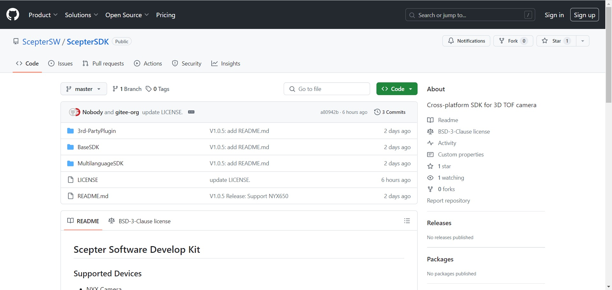

# 1. Overview

<!-- ScepterSDK 是基于 3D ToF 相机提供的软件开发包，该开发包目前适用于 Windows、Linux、ARM Linux 操作系统，为应用开发者提供一系列友好的 API 和应用示例程序。用户基于该开发包，可获取高精度的深度数据信息、灰度图像信息和彩色图像信息，方便用户开发刷脸支付、手势识别、投影触控、人脸识别、疲劳检测、三维重建、导航避障等 3D 应用。 -->

ScepterSDK is a software development kit based on 3D ToF camera, which is currently applicable to Windows, Linux and ARM Linux operating systems, and provides a series of friendly APIs and application sample programs for application developers.

Based on the development kit, users can obtain high-precision depth data information, gray image information and color image information, which is convenient for users to develop 3D applications such as face brushing payment, gesture recognition, projection touch control, face recognition, fatigue detection, 3D reconstruction, navigation ,obstacle avoidance and so on.



ScepterSDK download link：

<https://github.com/ScepterSW/ScepterSDK>

or

<https://gitee.com/ScepterSW/ScepterSDK>

<!-- 您可以通过以下两种下载方式下载 ScepterSDK 开发包： -->

You can download the Scepter SDK in the following two ways:

<!-- 方式一通过 git clone 下载到本地； -->

The first way is to download the SDK to the local through the git clone download address;

<!-- 方式二通过下载压缩包到本地。 -->

The second way is to download the compressed package to the local.

<!-- tabs:start -->

#### **Method 1**

<!-- ① 打开下载链接，点击 Code，复制链接； -->

① Open the download link, click Code, and copy the link;

```
git clone https://github.com/ScepterSW/ScepterSDK
```


<!-- ② 打开终端，输入复制代码回车，等待下载完成。 -->

② Open the terminal, enter the copy code and press Enter to wait for the download to be completed.


#### **Method 2**

<!-- 打开下载链接，点击 Code，再点击 Download ZIP，即可将 ScepterSDK 压缩包下载到本地。 -->

Open the download link, click Code, and then click Download ZIP to download the Scepter SDK compressed package to the local.

<!-- 如需在 Ubuntu 系统下使用，请确保下载后的压缩包是在 Ubuntu 系统下解压，请勿在 Windows 系统解压后复制使用。 -->

If you need to use it under Ubuntu system, please make sure that the compressed package after downloading is unzipped under Ubuntu system. Do not copy it after unzipping under Windows system.


<!-- tabs:end -->

**Introduction to the SDK Home Directory**


<!-- ScepterSDK 提供的多平台和开发语言的开发包，包含如下内容： -->

The Scepter SDK provides a development kit for multiple platforms and development languages, including the following content：

**3rd-PartyPlugin：**

- ROS：The directory contains ROS packages.

- ROS2：The directory contains the ROS2 package.

**BaseSDK：**

<!-- - Windows：目录包含个人计算机平台(x86_64) Windows PC 开发包, 使用标准编译器 VS2017。

- Ubuntu16.04：目录包含个人计算机平台(x86_64) Ubuntu16.04 开发包, 使用标准编译器 x86_64-linux-gnu(v5.4.0)。

- Ubuntu18.04：目录包含个人计算机平台(x86_64) Ubuntu18.04 开发包, 使用标准编译器 x86_64-linux-gnu(v7.5.0)。Ubuntu18.04 SDK 包与 Ubuntu20.04、Ubuntu22.04 兼容。

- AArch64：目录包含 64 位 Arm-Linux 开发包，使用标准编译器 aarch64-linux-gnu(v7.5.0)。 -->

- Windows: Directory contains the personal computer platform (x86_64) Windows PC development kit, using the standard compiler VS2017.

- Ubuntu 16.04: Directory contains the personal computer platform(x86_64)Ubuntu 16.04 development package, using the standard compiler x86_64-linux-gnu(v5.4.0).

- Ubuntu 18.04: The directory contains the Personal Computer Platform(x86_64)Ubuntu 18.04 development package, using the standard compiler x86_64-linux-gnu(v7.5.0). Ubuntu 18.04 SDK package is compatible with Ubuntu 20.04, Ubuntu 22.04.

- AArch64: Directory contains the 64-bit Arm-Linux development package, using the standard compiler aarch64-linux-gnu(v7.5.0).

**MultilanguageSDK：**

- Python: The directory contains the Python development package.

- CSharp：The directory contains the C # language development kit.

**LICENSE：**Software License Ordinance Documents.

**README.md：**Introduction to Scepter SDK and related links.
