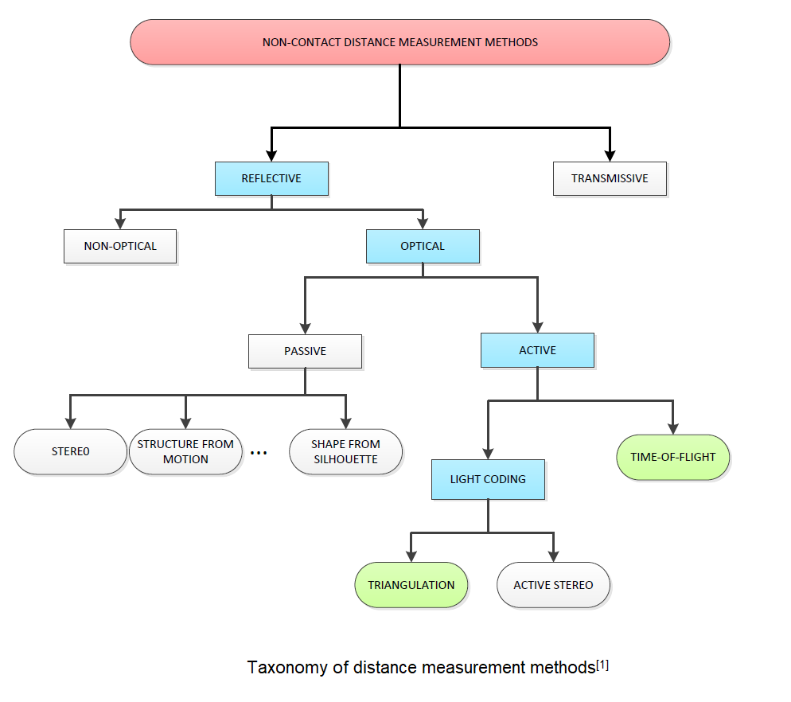
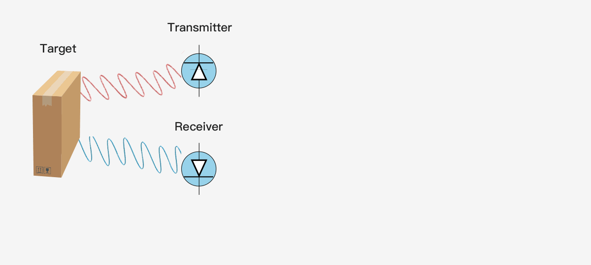
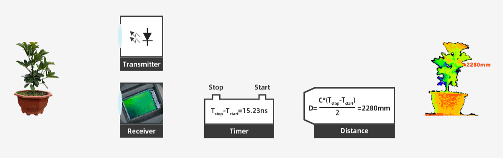

# 2. Taxonomy of Distance Measurement

Reflective optical methods are classified into two main categories: passive and active.

Passive reflective optical methods typically rely on ambient light to measure the distance between a target surface and a detector. Stereo vision is an example of a passive reflective optical method that uses two cameras to capture images of a target surface and calculate the distance between the target surface and the cameras based on the relative positions of the cameras and the target surface.

A stereo vision system consists of two cameras positioned side by side, which capture two images of the same scene from slightly different angles to generate a 3D representation of the scene based on the information captured by the two cameras. To achieve this, the stereo vision system uses algorithms to identify corresponding points in both images, and then calculates the relative depth of different objects in the scene based on the differences in their positions in the two images. This process is known as triangulation. When there are no geometric or color features in the scene, the stereo images will be uniform, and there won't be any corresponding pixels to obtain depth information from triangulation. The system would not be able to perform stereo matching or depth estimation in such a scenario. This is why it's important to have well-textured scenes or to add artificial markers or features to the scene to perform stereo vision tasks. The additional information provided by these features allows the stereo system to perform triangulation and estimate the depth information of the scene.

Active reflective optical methods, on the other hand, do not rely on ambient light, but instead use a projected light source to obtain 3D range information. ToF camera and light coding system(or called structure light system) are examples of active reflective optical methods.

A ToF(Time-of-Flight) camera is a type of active depth sensing camera that measures the time it takes for light to travel from the camera to an object and back. By measuring the time delay, the TOF camera can calculate the distance of objects from the camera, and generate a depth map.

A structure light system uses a projected pattern of light (such as a stripe or checkerboard pattern) to determine the depth of objects in a scene. The pattern is projected onto the scene and the camera captures the deformed pattern as it falls onto the objects. By analyzing the deformation of the pattern, the depth information of the objects can be reconstructed to create a 3D representation of the scene.

Talking back to Time-of-Flight technology which we has been dedicated on for years.

Time-of-Flight (TOF) technology generally refers to a family of methods for measuring the time it takes for a signal to travel from a source to a target and back. In the context of cameras, TOF cameras specifically use light to measure the time of flight, but there are other methods that use other types of signals, such as acoustic waves or electromagnetic waves. In all cases, the goal is to determine the time it takes for a signal to travel from the source to the target and back, which can then be used to calculate distance or other information.

The simplest single pixel ToF technology uses a modulated collimating laser as the transmitter and a single optoelectronic diode as the receiver, which can be used to provide the distance information of a single point. If you want to use a single pixel distance sensor to provide the depth map of the entire scene, it will generally use some scanning form. The following figure shows the principle of single pixel ToF ranging technology.

3D ToF technology provides a complete scene depth map through one-time imaging, without scanning devices. With the shrinking size of semiconductor components, the compact, cost-effective ToF depth camera has been rapidly applied and developed in the industrial and consumer electronics fields.

