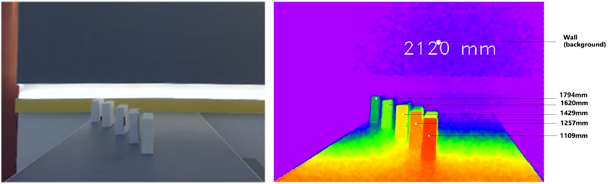

# 1. Introduction

### Let the machine have "extraordinary" vision

The world we live in is a three-dimensional space. The eye, the most important perception organ of human beings, can not only provide colorful color information for human beings, but also form a sense of distance in the brain, so that we can perceive a three-dimensional world. Since the birth of the first CCD image sensor in Bell Laboratories, in the past few decades, machine vision and digital imaging technology have made great progress, giving tremendous energy to all walks of life. People's lives, industrial automation, aerospace and other fields have begun to be widely linked with image and visual technology.

The field of machine vision has experienced the evolution process from analog to digital, from static to dynamic, and from monochrome to color. The current 3D vision technology is to improve the dimension of machine vision by presenting stereo images in front of people, which can meet the application scenarios that are difficult to achieve in the past 2D vision, such as Face ID, mobile phone, VR/AR, industrial vision and other directions, and start a new visual revolution in all walks of life!

As shown in the above figure, unlike the image taken by the left traditional color camera, the image displayed by the right stereo vision technology is composed of the distance from each pixel to the camera. In order to better present the difference in distance, different distance values are usually mapped to the color gamut space, so that users can more easily understand the meaning of depth images, as shown in the following figure:

The purpose and development direction of 3D vision technology is to obtain more accurate, more delicate and faster depth images through various methods.

