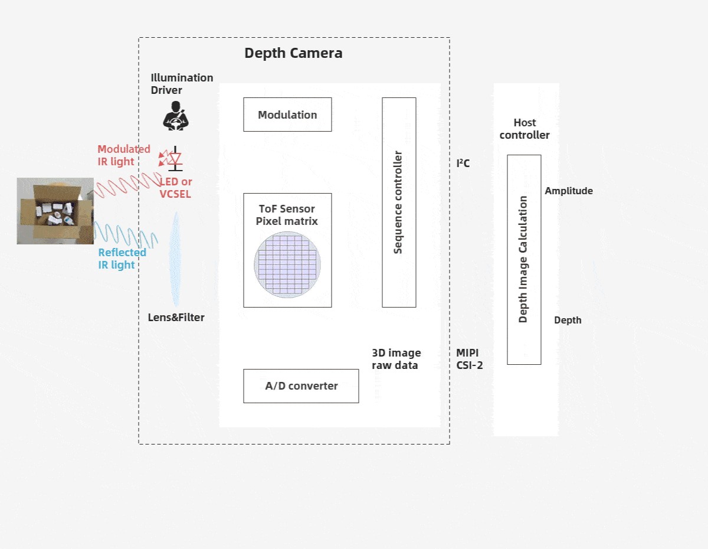

# 3. Components of a ToF Camera

The ToF camera refers to the area array non scanning 3D imaging depth information capture technology with the optical system as the receiving path. From the following figure, we can understand that the ToF depth camera is composed of an irradiation unit, an optical lens, an imaging sensor, a control unit, and a computing unit.

**Irradiation unit**

The irradiation unit needs to pulse modulate the light source before transmitting, and the modulated light pulse frequency can be as high as 100MHz. Therefore, in the process of image shooting, the light source will be turned on and off thousands of times, and each light pulse only lasts for a few nanoseconds. The exposure time parameter of the camera determines the number of pulses for each imaging.

In order to achieve accurate measurement, it is necessary to precisely control the light pulse so that it has the same duration, rise time and fall time. Because even a small deviation of 1ns can produce a distance measurement error of up to 15 cm. Such high modulation frequency and accuracy can only be achieved by using sophisticated LED or laser diode.

Generally, the infrared light source that is invisible to the human eye is used.

**Optical lens**

It is used to gather reflected light and image on the optical sensor. Unlike ordinary optical lenses, a band-pass filter is required to ensure that only light with the same wavelength as the illumination light source can enter. The purpose of this is to suppress the incoherent light source to reduce noise, and prevent the overexposure of the light sensor due to the interference of external light.

**Imaging sensor**

The imaging sensor is the core of TOF camera. The structure of this sensor is similar to that of an ordinary image sensor, but more complex than that of an image sensor. It contains two or more shutters to sample reflected light at different times. Therefore, the pixel size of TOF chip is much larger than that of ordinary image sensors, generally about 100um.

**Control unit**

The light pulse sequence triggered by the electronic control unit of the camera is precisely synchronized with the opening/closing of the electronic shutter of the chip. It reads and converts sensor charges and directs them to the analysis unit and data interface.

**Calculation unit**

The calculation unit can record accurate depth map. The depth map is usually a grayscale image, where each value represents the distance between the light reflecting surface and the camera. For better results, data calibration is usually performed.

