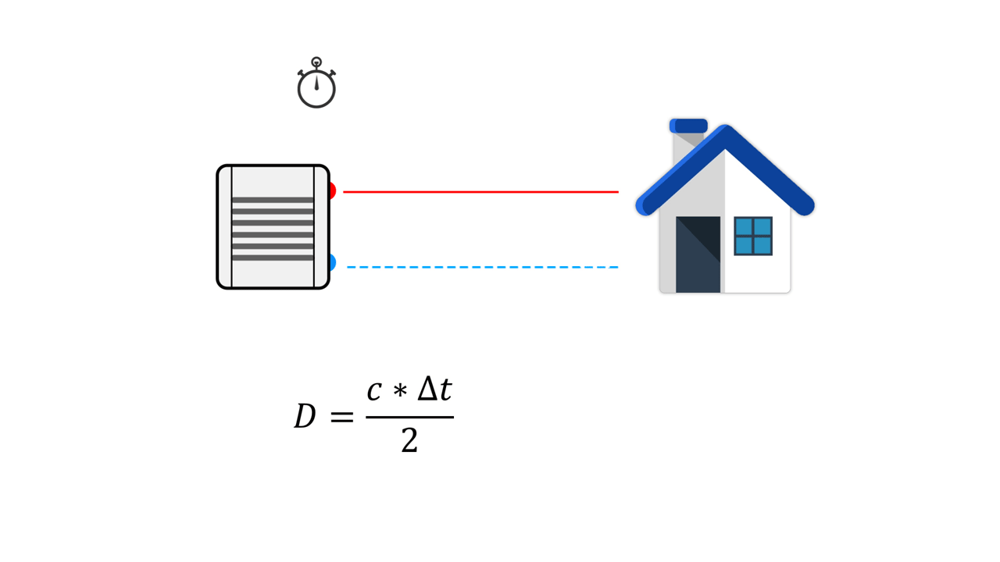
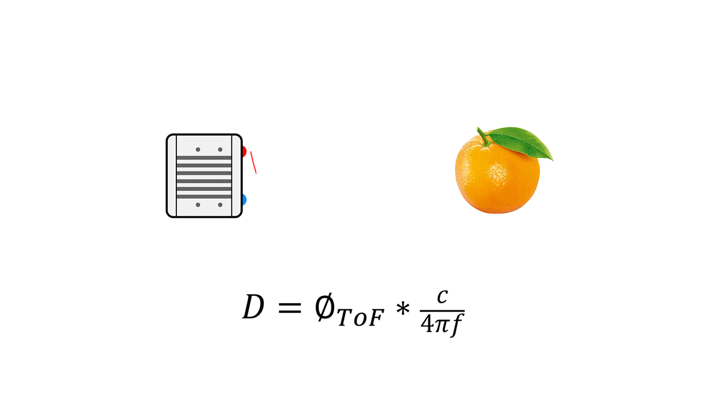
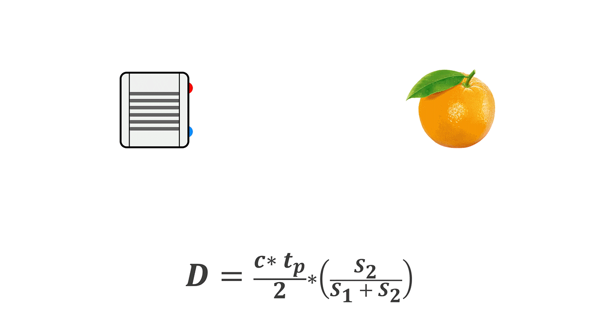

# 4. Direct ToF vs Indirect ToF

ToF 3D camera technology can be divided into iToF (indirect ToF) and dToF (direct ToF) according to the specific implementation method. IToF is further divided into Continuous Waveform ToF and Pulse Based ToF, as shown in the figure below:

## 4.1. dToF

DToF (direct time of flight), which is a direct time of flight ranging method, directly measures the time difference between the time tstart when the laser pulse is sent from the transmitting end and the time tstop when the laser pulse returns to the receiving end after being reflected by an object by means of an internal timer. In combination with the speed of light c, the distance depth data d is obtained. Compared with the method mentioned below, which indirectly measures the time difference between the transmitting signal and the receiving signal through the signal phase difference, This method of measuring time difference is more direct, so it is called direct time of flight ranging method.

The principle of direct time-of-flight ranging is direct and simple, but the technical level has high requirements for the light source at the transmitter, the image sensor at the receiver, and the circuits related to synchronization and time detection. For example, there are certain requirements for the transmitter to generate such short pulses, and the image sensor at the receiver also needs to use highly sensitive optical detection technology to detect weak optical signals, such as single photon avalanche diode (SPAD) technology.

## 4.2. CW iToF

The basic principle of CW iToF is to adjust the light into a sine wave with a fixed frequency f, and the transmitting end transmits the sine wave according to the frequency f. When collecting the returned optical energy, CW iToF will open multiple windows, sample the data collected by multiple windows, analyze the phase difference information between the transmitting and receiving within a period, and then obtain the distance information through the following formula.

The vast majority of continuous waveform ToF systems use CMOS sensors, especially the back illuminated CMOS process technology, which greatly improves the light-sensitive area, photon collection rate and ranging speed, and the response time can reach the level of ns; To realize phase unwrapping, CW ToF will apply multiple modulation frequencies - this method will be very helpful to reduce multipath errors; CW iToF is a full CMOS imaging system, which has better flexibility and faster readout speed. However, CW iToF method also has some disadvantages. Its image sensor requires four samples of correlation function at multiple modulation frequencies, plus multiple frame processing, so the complexity of signal processing will become higher, which may require additional application processors; For longer distance measurement, or when the ambient light in the scene is strong, the continuous output power requirements are high, which will affect the heating and stability.

## 4.3. Pulse iToF

The following figure is a schematic diagram of the principle of Pulse iTOF. By adjusting the light into a square wave with a fixed frequency f, the transmitting end transmits pulse signals according to the frequency f. The sensor at the receiving end consists of two electronic shutters (s1, s2). The frequency and phase of the S1 window are consistent with the transmitting pulse. When the S1 and S2 windows are opened (high electrical level), they accumulate photons reflected from the object within their respective time. By calculating the different energy value proportions of s1 and s2, The signal phase is analyzed to calculate the time difference between the transmitted signal and the received signal, and then the distance data is obtained.

Compared with CW iToF continuous wave debugging mode, Pulse iToF has simpler solution depth, lower computational load, and lower requirements for back-end processing capacity of the platform. From the principle of Pulse iTOF, Pulse iTOF emits high-intensity light pulses in a short time window, which can reduce the impact of background light signals, make it more adaptive to changes in ambient light, and better resist problems such as scene motion blur.

