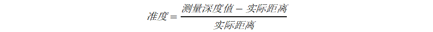

# 2.3. 深度质量测试

## 2.3.1. 介绍

我们可以使用多种指标来评估深度质量。推荐使用一个兼容所有测试的通用环境，例如一个光滑平整、哑光均匀、平行对齐深度相机的平面，测试过程中将其与相机放置在一个可控并已知的距离。安装在刚性框架或结构上的白色或浅色板是一个合适的目标。

深度数据的准度和精度（也称为时间噪声或可重复性）是判断深度相机图像质量的主要特征。

### 2.3.1.1. **准度（Accuracy）**

准度是测量深度值与实际距离（标定好的真实数据，Ground Truth）之间的平均差。它是对系统绝对误差的描述。

### 2.3.1.2. **精度（Precision）**

精度大多被定义为准度的标准差。它也被称为时间噪声或可重复性。精度测量的是特定数量帧上的深度值变动。

下图说明了两者间的关系：

|                                                                                     |
| :---------------------------------------------------------------------------------: |
|  |
|                               图 1: 精度与准度的关系                                |

## 2.3.2. 测试条件

- 目标物体：80cm\*80cm 40%平面反射率的灰色标定板，安装在与运动平台相连的杆上（参考图 2）
- 相机位置：安装在钢制夹具上（参考图 3），镜头表面与标定板表面平行。
- 相机设置：默认设置（参考图 4），相机预热 20 分钟。
- 成像环境：22°C 室温，测试期间室内光线为 200Lux，一侧使用黑色窗帘，尽量减少周围反射（参考图 2）
- 运动平台从 0.4 米移动到 4.5 米，在 0.4m、1m、1.5m、2m、2.5m、3m、3.5m、4m、4.5m 处停止。每一步测量图像中心 10×10 像素 ROI（感兴趣区域）上的深度，重复 32 次取平均数值。
- 使用我们自主开发的工具来实时测量和记录深度指标。对于绝对深度值的评估，我们使用每个像素中图像集的平均深度。标准差是根据图像集中的偏差计算的。

|                                                                   |
| :---------------------------------------------------------------: |
|       |
|             图 2: 80CM\*80CM 40% 反射率灰板&成像环境              |
|  |
|                      图 3: 相机固定在夹具上                       |
|        |
|                          图 4: 默认设置                           |

## 2.3.3. DS 系列准度测试

为了获得尽可能准确的结果，Vzense 相机在工厂进行了校准和测试，以保证可靠的准确性。Vzense DS 系列相机经过校准，测量范围为 0.4\~4.5 米。从技术上讲，相机可以测量最小 0.15 米的距离，因此如果用户有非常近的测量要求，我们也提供定制范围的产品。

### 测试结果

下面的表显示了基于上述测试条件的两组平均测量误差和准度的数据。测量误差保持在毫米甚至亚毫米级精度，准确度小于 1%。

|                                                                                               |
| :-------------------------------------------------------------------------------------------: |
|                                           |
|                                      表 1：准度测试数据                                       |
|                                           |
|                                      表 2：准度测试数据                                       |
|  |
|                                   表 3: 不同距离的测量误差                                    |
|                    |
|                                     表 4: 不同距离的准度                                      |

## 2.3.4. DS 系列精度测试

精度测量的是特定数量帧上的深度值变动，它也被称为时间噪声或可重复性。 精度测量的目的是了解深度相机的每像素 Z 精度的时间方面的相关性。它是按像素测量的，然后取 ROI 的平均值或中值。

### 测试结果

### 2.3.4.1. 精度与距离的关系

按照第 2 部分描述的测试条件，借助我们自主开发的软件工具，在图像中心测量 10×10 像素 ROI 的平均准确度，在每个位置重复 32 次，然后计算作为深度值标准差的精度数据。

|                                                                                                                                                                                   |
| :-------------------------------------------------------------------------------------------------------------------------------------------------------------------------------: |
|   |
|                                                                  表 5：不同距离的精度数据（默认曝光时间为 1MS）                                                                   |
|                                                                                          |
|                                                                  表 6：不同距离的精度趋势（默认曝光时间为 1MS）                                                                   |

### 2.3.4.2. 精度与曝光时间的关系

为了帮助用户了解影响精度的因素，在每个距离，我们测试了 1ms、2ms、3ms 和 4ms 不同曝光时间设置的精度。下面的数据表明，相机设置的曝光时间越长，只要图像不过曝，相机就可以获得越高的精度。

|                                                                                                                 |
| :-------------------------------------------------------------------------------------------------------------: |
|  |
|                                          表 7:不同曝光时间对精度的影响                                          |

