# Depth与Color图像对齐原理与使用方法

随着视觉算法的发展，结合深度数据的三维视觉应用大放异彩，在目标检测、避障、识别等典型场景中担任了重要角色。RGBD相机便成为了整个功能系统中最重要的一环：信息输入。由于深度图像与彩色图像产生于不同传感器，所以其图像产生原理、光学参数、物理位置等都不相同，因此在算法检测前，需要对不同图像进行对齐操作。对齐也有多种叫法，如配准、map、d2c等。


### 1 实现原理

图像对齐就是将彩色图像传感器与深度图像传感器，在同一曝光时刻产生的图像进行匹配与转换的过程。

具体地说，由下示意图可知，因为彩色图像传感器与深度图像传感器由于图像产生原理以及光学参数等的不同，在物理设计上不可能完全重叠。因此在采集同一场景时，相同物体在各自像素坐标系中对应的像素点并不一致。所以需要通过寻找一种空间变换关系，将一副图像映射到另一幅图像上，使得两图中的像素点数据一一对应，从而达到信息融合的目的。

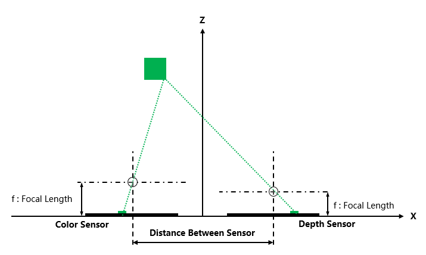

|              原始彩色图像（左）              |            右-原始深度图像（右）             |
| :------------------------------------------: | :------------------------------------------: |
| 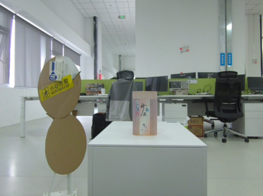 | 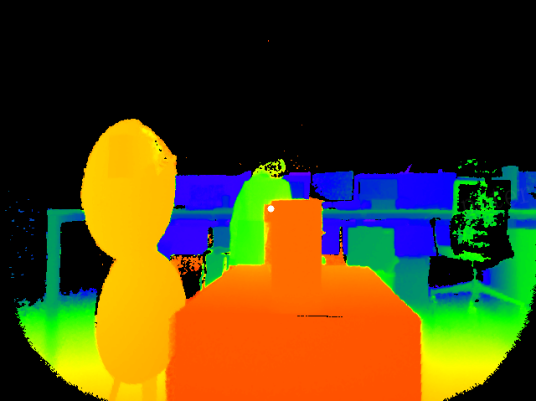 |


**各坐标系介绍**：

在上述介绍过程中，图像的对齐需要一种空间变换关系才能够进行变换与对齐计算，所以在开始之前先介绍涉及到的各自坐标系概念。


- 像素坐标系：

像素坐标系比较好理解，当得到一幅图像时，以图像左上角为(0, 0)点，以像素为单位从左往右，从上往下依次增长，直到分辨率最大值。

以下图为例，深度图像的分辨率为640*480，白色Mark点坐标为 **(94, 152)**.

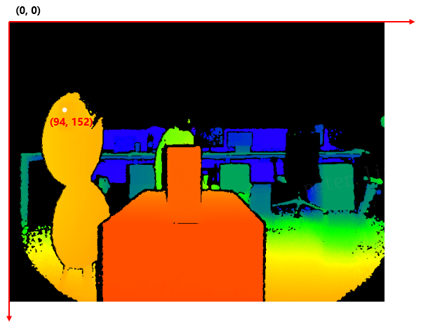


- 相机坐标系：

相机坐标系则是以小孔成像的相似三角形原理，基于光学参数进行转换后的三维坐标系，坐标系原点 (0, 0 ,0) 为光心点，也就是下图的O点。所有的深度图像像素都可以一一对应转化为对应的三维点（x,y,z）。

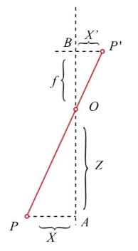

- 世界坐标系：

世界坐标系的定义较为宽泛，首先世界坐标系是三维坐标系，但基于不同应用与场景的不同，定义了不同的坐标原点。例如在自动化场景中，以机械臂底座为 (0, 0 ,0) 点，而从相机获取的数据是相机坐标系点，统一坐标系则需要通过刚体变换将相机坐标系转换为世界坐标系。


**对齐方法与公式**：

了解了对齐的基本原理与坐标系的概念之后，对齐的实现与方法就变得非常容易理解。由二维到三维的变化原理可知，基于相似三角形进行三维数据转换时，最重要的数据为光学参数以及目标实际距离。

**光学参数**：在相机的出厂标定时已经生成与计算出。

**目标实际距离**：因为使用的是深度相机，所以天然可以获取高精度距离信息。


由此，在RGBD相机中，可以经过如下步骤变可以得到对齐之后的图像：

**二维深度图像** --> **二维转换到三维的深度图像的相机坐标系** --> **刚体变换到彩色图像的相机坐标系**  --> **三维到二维的彩色图像的像素坐标系转换**


参考公式如下：

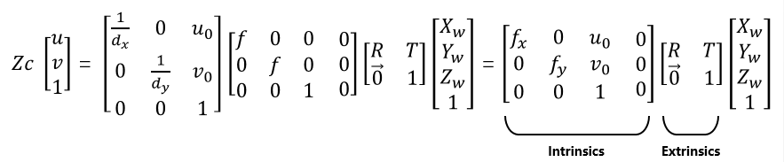


### 2 对齐类型与使用方法

由实现原理可知，对齐即通过二维到三维的转换后，将一个传感器的图像数据转换到另一个传感器的二维空间。

以深度图+彩色图为例，对齐类型分为两种：

- 深度图像对齐到彩色图像
- 彩色图像对齐到深度图像

### 2.1 深度图像对齐到彩色图像：

顾名思义，此方法是将深度图像转换为一幅与原始彩色图像参数相同的深度图像。对齐完成后的图像仍然是一幅深度图像，其每个像素数据都与原始彩色图像一一对应。

**图示：**

|                  原始深度图                  |                 对齐后深度图                 |                  原始彩色图                  |
| :------------------------------------------: | :------------------------------------------: | :------------------------------------------: |
|  | 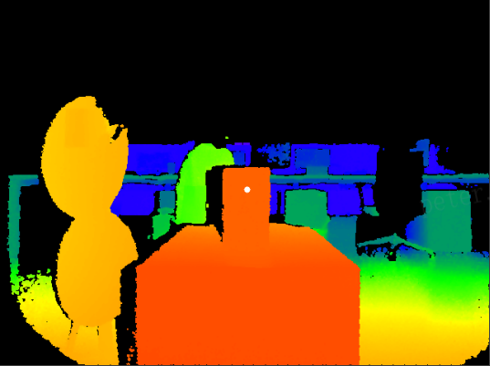 |  |

|               对齐后点云效果图               |
| :------------------------------------------: |
| 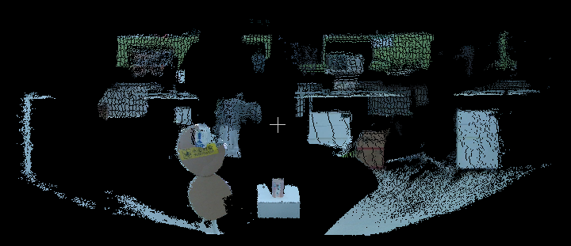 |

**使用场景：**

深度图像对齐到彩色图像的方式，是使用最广泛的一种形式。例如**目标检测**场景，在此场景下，通常算法通过彩色图像进行深度学习模型的目标检测，然后获取到彩色图像中的目标框或者分割后的点集。最终使用对齐后的深度图像获取对应点的距离值，用于三维信息的计算与定位。

**GUITool使用方法：**

在深度图像的预览界面选项中，选择DepthImgToColorSensor，以此开启深度图像到彩色图像的对齐功能。

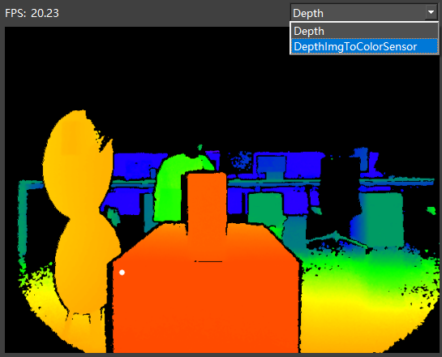

> 开启后，在深度/彩色图像中点击鼠标左键，可以看到对齐后点的信息。

**SDK相关API：**

对齐功能是默认关闭的，如果使用需要通过如下的API进行调用使能。

```c
//设置使能打开Depth图像到彩色图像的对齐
SCEPTER_C_API_EXPORT ScStatus scSetTransformDepthImgToColorSensorEnabled(ScDeviceHandle device, bool bEnabled);
//获取Depth图像到彩色图像的对齐是否已经使能
SCEPTER_C_API_EXPORT ScStatus scGetTransformDepthImgToColorSensorEnabled(ScDeviceHandle device, bool* bEnabled);
//获取图像
status = scGetFrameReady(deviceHandle, 1200, &FrameReady);
if (1 == FrameReady.transformedDepth)
{
    status = scGetFrame(deviceHandle, SC_TRANSFORM_DEPTH_IMG_TO_COLOR_SENSOR_FRAME, &frame);
}
```

**参考例程：**

BaseSDK/Windows/Samples/Base/NYX650/TransformDepthImgToColorSensorFrame


### 2.2 彩色图像对齐到深度图像：

与第一种方式相反，此方法是将彩色图像转换为一幅与原始深度图像参数相同的彩色图像。对齐完成后的图像仍然是一幅彩色图像，其每个像素数据都与原始深度图像一一对应。

**图示：**

|                  原始深度图                  |                  原始彩色图                  |                 对齐后彩色图                 |
| :------------------------------------------: | :------------------------------------------: | :------------------------------------------: |
|  |  | 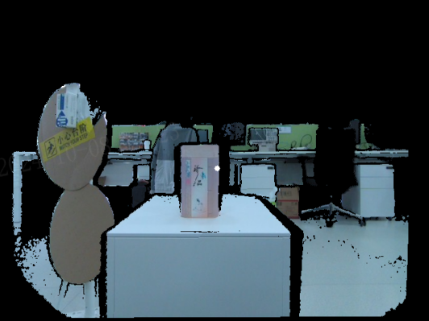 |

**使用场景：**

彩色图像对齐到深度图像的方式，应用相对较少，使用方式和流程与2.1正好相反，适合以深度图像为主进行算法检测然后再获取彩色信息的场景。例如在体积检测等场景中，算法通过深度图像计算物体体积等信息，然后通过获取对应彩色对象的位置后，在彩色图像中绘制目标框用于预览功能。

**GUITool使用方法：**

在彩色图像的预览界面选项中，选择ColorImgToDepthSensor，以此开启彩色图像到深度图像的对齐功能。

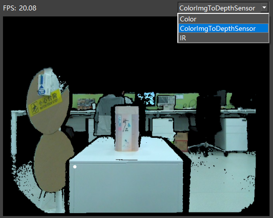


> 开启后，在深度/彩色图像中点击鼠标左键，可以看到对齐后点的信息。

**SDK相关API：**

对齐功能是默认关闭的，如果使用需要通过如下的API进行调用使能。

```c
//设置使能开关
SCEPTER_C_API_EXPORT ScStatus scSetTransformColorImgToDepthSensorEnabled(ScDeviceHandle device, bool bEnabled);
//获取对齐是否已经使能
SCEPTER_C_API_EXPORT ScStatus scGetTransformColorImgToDepthSensorEnabled(ScDeviceHandle device, bool* bEnabled);
//获取图像
status = scGetFrameReady(deviceHandle, 1200, &FrameReady);
if (1 == FrameReady.transformedColor)
{
    status = scGetFrame(deviceHandle, SC_TRANSFORM_COLOR_IMG_TO_DEPTH_SENSOR_FRAME, &frame);
}
```

**参考例程：**

BaseSDK/Windows/Samples/Base/NYX650/TransformColorImgToDepthSensorFrame


