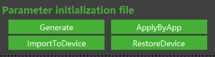

# 相机默认参数配置方法

相机在工作中，有许多可以自由调节的参数，如帧率，曝光时间，图像滤波开关等。不同的应用场景对于工作参数的需求也不同，用户可以针对自己的需求进行自由设置。为了方便客户的调试与使用，Vzense相机开发与设计了两种方法可以帮助用户预设相机的工作参数。

### **参数生效原理**

相机内部存储出厂默认参数，上电后会读取内部参数并设置生效。SDK连接相机后，由API控制是否设置其他参数，如不设置则使用相机默认参数运行。如果进行参数设置，则会动态改变相机工作参数运行，但不改变相机内部默认参数，即断电后不保存。

**可设置参数**

工作模式类：

- 总帧率
- 工作模式：主动或被动

深度图像类：

- 自动/手动曝光模式
- 曝光时间
- HDR开关

灰度图像类：

- 增益(数字)
- Gamma矫正开关与系数

彩色图像类：

- 分辨率
- 自动/手动曝光模式
- 曝光时间
- 曝光增益（模拟）

滤波器类：

- 置信度滤波开关与参数
- 时间滤波开关与参数
- 飞点滤波开关与参数
- 空间滤波开关
- 补洞滤波开关

> 不同机型功能略有差异，部分参数可能不在某机型支持，详细请参考规格书。


### 参数设置方法

默认参数设置方法分为软件设置方法与硬件设置方法。

**软件设置方法**通过SDK读取配置文件，实时设置参数值，使相机动态生效，不改变相机默认参数，需要每次上电时执行一次。

**硬件设置方法**通过工具将配置文件导入到相机中，改变相机的默认参数，断电保存，重启生效。

> 部分机型不支持硬件设置方法，具体机型是否支持，请联系FAE确认。


#### 使用步骤：

#### 1. 生成配置文件：

使用ScepterGUITool，打开相机。根据使用场景，调试相机参数。调整完成后，点击‘Generate’后，提示保存成功。配置文件保存在JsonConfig文件夹下，以 ’**相机品类_ 年_ 月_ 日_ 时_ 分_ 秒_ SN.json**' 格式命名。



> 此步骤为初次生成所需，如果已有配置文件，可跳过此步骤。

<!-- tabs:start -->

#### **软件设置方法**

#### 2. ScepterGUITool使用

将相机断电重启，使用ScepterGUITool打开相机，此时GUITool显示的相机工作参数为相机默认参数。点击‘ApplyByApp’后，选择之前生成的配置文件，提示导入成功后，当前使用的工作参数已经设置为与配置文件一致。

#### 3. 代码部署

与ScepterGUITool的功能一致，如果需要在工程代码中使用配置文件功能，可以通过如下API调用。完整的例程请参考**DeviceSetParamsByJson**中的代码实现。

```c
/**
 * @brief        Set the parameters by Json file that can be saved by ScepterGUITool.
 * @param[in]    device       The handle of the device.
 * @param[in]    pfilePath    Pointer to the path of Json file.
 * @return       ::SC_OK      If the function succeeded, or one of the error values defined by ::ScStatus.
 */
SCEPTER_C_API_EXPORT ScStatus scSetParamsByJson(ScDeviceHandle device, char* pfilePath);
```

> API会对参数进行验证，保证设置参数与配置文件一致。如果前期想通过代码进行验证，可以读取部分参数，如曝光时间。

#### **硬件设置方法**

#### 2. 配置文件导入

点击‘ImportToDevice’，选择配置文件，提示导入成功后需要重启生效。重启再次连接后，配置文件的参数自动生效使用。

#### 3. 功能验证

验证配置参数是否生效，可以特意改变某个与默认参数不同的值，如曝光时间参数。进行设置后导入，再次断电重启后，观察设置值是否与预期一致。

#### 4. 其他功能

**RestoreSettings:** 重置相机参数为出厂设置。

<!-- tabs:end -->