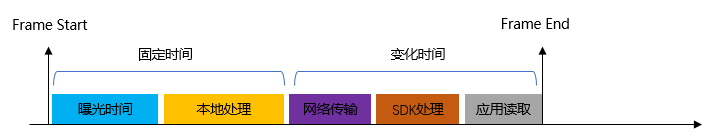

# 图像延时产生原理与测试方法

相机的工作原理，从图像产生到应用获取不是即时的，而是经过相机本地与SDK处理之后的。

在协同场景中，则需要获取图像产生的时间，以此调节与计算协同模块，达到精确的同步关系。

因此本章节内容会详细介绍相机的图像产生、处理、传输过程原理，以及使用什么样的方法进行延时测试，如何通过参数设置配置调节延时。

### **1 延时产生原理**

以工业相机为例，无论是RGB相机还是ToF相机，一帧图像从产生到传输完成可以概括为如下工作环节：

- 曝光
- 本地处理
- 通信传输
- SDK处理
- 应用获取



**曝光时间**与**本地处理时间**，在相机内部完成。因此某一个型号的相机，相机工作参数（曝光时间，图像分辨率）确定的情况下，是固定时间。

**网络传输时间**，由主机与相机配合完成，这部分时间取决于主机性能和网络带宽，除极端情况外固定平台下，此时间为固定时间。

**SDK处理时间**，SDK处理时间因为需要使用主机平台资源，因此即使是处理相同的业务，在不同平台，以及不同的负载情况下也会存在差别。

**应用读取时间**，SDK在准备完图像后，会把图像暂存在缓冲区等待应用读取。如果得不到及时读取，会使用新帧覆盖旧帧，产生丢帧。因此应用的实现逻辑和处理方式也影响最终结果。


举例，以NYX650(B22) + ScepterSDK(v1.1.4)测试数据为例，

配置参数：ToF曝光时间5ms， RGB分辨率640*480，开Depth2RGB对齐，获取对齐后Depth与RGB图像。

|       平台       | 本地处理 | 网络传输 | SDK处理 |     总延时      |
| :--------------: | :------: | :------: | :-----: | :-------------: |
|      RK3588      |   64ms   |   11ms   |  20ms   | 64+11+20 = 95ms |
| Nvidia Xavior NX |   64ms   |   10ms   |  10ms   | 64+10+10 = 84ms |

- 曝光时间为固定值，与设置相关，即Depth图像的曝光时间值。因为整个曝光时间是对场景内容的采集过程，所以通常不作为整体延时参与评估。
- 使用大分辨率情况下，如1600*1200，因为数据量巨大，所以图像处理的耗时也会大幅度上升。在项目允许的情况下，使用低分辨率图像可以大大降低延时。


### 2 延时测试方法

不同平台性能会有不同的延时数据，如何测试当前平台的延时数据尤为重要。以下内容将详细展开并示例说明Vzense相机如何进行延时数据测试。


测试步骤：

1.开启相机的NTP或PTP对时功能。详细设置方法请参考：[NTP设置方法](zh-cn/ApplicationNote/NYX650&660/NTP-client-configuration.md), [PTP设置方法](zh-cn/ApplicationNote/NYX650&660/PTP-client-configuration.md)

> 部分型号相机暂不支持NTP、PTP时钟同步。

2.修改sample代码，增加时间戳打印。

 **BaseSDK\Windows\Samples\Base\NYX650\DeviceSWTriggerMode** 示例非常接近我们的测试方法，只需要进行轻微修改即可。由于Windows与Linux的时间获取函数不同，在此我们分别进行介绍。


<!-- tabs:start -->

#### **Windows**

使用ftime函数获取换算毫秒级UNIX时间戳。

示例代码如下：

```c
#include <sys/timeb.h>

/*
省略部分代码
*/

//Starts capturing the image stream
status = scStartStream(deviceHandle);
if (status != ScStatus::SC_OK)
{
    cout << "scStartStream failed status:" << status << endl;
    return -1;
}
cout << "Software trigger test begins" << endl;
//delay for start stream ready.
this_thread::sleep_for(chrono::milliseconds(3000));

//1.software trigger.
//2.ReadNextFrame.
//3.GetFrame acoording to Ready flag and Frametype.
//4.sleep 1000/frameRate (ms)
for (int i = 0; i < frameSpace;	i++)
{
    timeb time_start, time_end;
    //call the below api to trigger one frame, then the frame will be sent
    // if do not call this function, the frame will not be sent and the below call will return timeout fail
    status = scSoftwareTriggerOnce(deviceHandle);
    ftime(&time_start); // record the start timestamp
    if (status != ScStatus::SC_OK)
    { 
        cout << "scSoftwareTriggerOnce failed status:" <<status<< endl;
        continue;
    }

    //If no image is ready within 1000ms, the function will return ScRetGetFrameReadyTimeOut
    status = scGetFrameReady(deviceHandle, 1200, &FrameReady);
    if (status != ScStatus::SC_OK)
    { 
        cout << "scGetFrameReady failed status:" << status << endl;
        //this_thread::sleep_for(chrono::seconds(1));
        continue;
    }
    //depthFrame for example.
    if (1 == FrameReady.depth) 
    {
        status = scGetFrame(deviceHandle, SC_DEPTH_FRAME, &depthFrame);
        if (depthFrame.pFrameData != NULL)
        {
            cout << "get Frame successful,status:" << status << "  "
				 << "frameTpye:" << depthFrame.frameType << "  "
				 << "frameIndex:" << depthFrame.frameIndex << endl
                
            ftime(&time_end);// record the end timestamp
			uint64_t unix_end = time_end.time * 1000 + time_end.millitm;
            uint64_t unix_start = time_start.time * 1000 + time_start.millitm;
            uint64_t unix_exposure_end = depthFrame.deviceTimestamp;
            
            cout << "one frame total time delay from trigger: " << unix_end - unix_start  << endl;
            
            if ((unix_end - unix_exposure_end) > 2000)
            {
                cout << "NTP/PTP is not work ！！！" << endl;
            }
            else
            {
                cout << "time delay from exposure end: " << unix_end - unix_exposure_end << endl;
            }
        }
    }
    this_thread::sleep_for(chrono::milliseconds(1000 / frameRate));
}


```

#### **Linux**

使用clock_gettime函数获取换算毫秒级UNIX时间戳。

示例代码如下：

```c
#include <time.h>

/*
省略部分代码
*/

//Starts capturing the image stream
status = scStartStream(deviceHandle);
if (status != ScStatus::SC_OK)
{
    cout << "scStartStream failed status:" << status << endl;
    return -1;
}
cout << "Software trigger test begins" << endl;
//delay for start stream ready.
this_thread::sleep_for(chrono::milliseconds(3000));

//1.software trigger.
//2.ReadNextFrame.
//3.GetFrame acoording to Ready flag and Frametype.
//4.sleep 1000/frameRate (ms)
for (int i = 0; i < frameSpace;	i++)
{
    timespec time_start, time_end;
    //call the below api to trigger one frame, then the frame will be sent
    // if do not call this function, the frame will not be sent and the below call will return timeout fail
    status = scSoftwareTriggerOnce(deviceHandle);
    clock_gettime(CLOCK_REALTIME, &time_start); // record the start timestamp
    if (status != ScStatus::SC_OK)
    { 
        cout << "scSoftwareTriggerOnce failed status:" <<status<< endl;
        continue;
    }

    //If no image is ready within 1000ms, the function will return ScRetGetFrameReadyTimeOut
    status = scGetFrameReady(deviceHandle, 1200, &FrameReady);
    if (status != ScStatus::SC_OK)
    { 
        cout << "scGetFrameReady failed status:" << status << endl;
        //this_thread::sleep_for(chrono::seconds(1));
        continue;
    }
    //depthFrame for example.
    if (1 == FrameReady.depth) 
    {
        status = scGetFrame(deviceHandle, SC_DEPTH_FRAME, &depthFrame);
        if (depthFrame.pFrameData != NULL)
        {
            cout << "get Frame successful,status:" << status << "  "
				 << "frameTpye:" << depthFrame.frameType << "  "
				 << "frameIndex:" << depthFrame.frameIndex << endl
                
            clock_gettime(CLOCK_REALTIME, &time_end);// record the end timestamp
			uint64_t unix_end = time_end.tv_sec * 1000 + time_end.tv_nsec/1000;
            uint64_t unix_start = time_start.tv_sec * 1000 + time_start.tv_nsec/1000;
            uint64_t unix_exposure_end = depthFrame.deviceTimestamp;
            
            cout << "one frame total time delay from trigger: " << unix_end - unix_start  << endl;
            
            if ((unix_end - unix_exposure_end) > 2000)
            {
                cout << "NTP/PTP is not work ！！！" << endl;
            }
            else
            {
                cout << "time delay from exposure end: " << unix_end - unix_exposure_end << endl;
            }
        }
    }
    this_thread::sleep_for(chrono::milliseconds(1000 / frameRate));
}
```


<!-- tabs:end -->


执行结果如下：

```c
---DeviceSWTriggerMode---
Get device count: 1
serialNumber:GN6501CBCA3310172
ip:192.168.1.101
connectStatus:1
frameRate :15
Software trigger test begins
get Frame successful,status:0  frameTpye:0  frameIndex:1
one frame total time delay from trigger: 85
time delay from exposure end: 66
get Frame successful,status:0  frameTpye:0  frameIndex:2
one frame total time delay from trigger: 83
time delay from exposure end: 64
get Frame successful,status:0  frameTpye:0  frameIndex:3
one frame total time delay from trigger: 77
time delay from exposure end: 59
get Frame successful,status:0  frameTpye:0  frameIndex:4
one frame total time delay from trigger: 77
time delay from exposure end: 59
get Frame successful,status:0  frameTpye:0  frameIndex:5
one frame total time delay from trigger: 76
time delay from exposure end: 57
get Frame successful,status:0  frameTpye:0  frameIndex:6
one frame total time delay from trigger: 80
time delay from exposure end: 60
get Frame successful,status:0  frameTpye:0  frameIndex:7
one frame total time delay from trigger: 77
time delay from exposure end: 59
get Frame successful,status:0  frameTpye:0  frameIndex:8
one frame total time delay from trigger: 77
time delay from exposure end: 58
get Frame successful,status:0  frameTpye:0  frameIndex:9
one frame total time delay from trigger: 78
time delay from exposure end: 59
get Frame successful,status:0  frameTpye:0  frameIndex:10
one frame total time delay from trigger: 79
time delay from exposure end: 61
---end---
```

通过上述方法可以多次测试并统计当前系统的延时。

以如上打印结果为例，得知此次测试的图像从曝光完成到应用获取的总时间为**60ms**左右。


### 3 延时优化

如果在测试后发现，整体延时无法满足应用需求，可以从如下几个角度进行调节优化：

**图像分辨率：**图像分辨率越大，决定了需要处理的数据量越大，所以分辨率的不同对延时影响最为巨大。建议在业务允许的情况下，选择较小的分辨率，如640*480。

**系统平台：**由第一部分介绍可知，系统平台直接影响运行效率与性能，所以尽量选择符合要求的平台，以及尽量平衡其他进程对相机SDK资源的抢占。

**点云转换：**点云转换涉及大量float运算，消耗较大，尽量减少点云转换的数量可以较大的提高效率。如只转换ROI区域点云，不做全图转换。

**滤波开关：**根据业务需求，可以关闭部分滤波开关，以减少资源占用与提高延时。

**相机型号：**Vzense相机有不同型号，不同型号相机因为原理不同，实现方式不同，也会存在延时差异。


