# HDR与WDR的实现原理与使用方法

通过相机捕捉一个场景时，因为曝光与成像原理的影响，有时无法完美呈现全部信息，比如某些场景里同时存在非常明亮和非常暗淡的部分，又比如某些场景里同时需要检测近距离与远距离的内容。

为了能更好的解决以上复杂场景的使用问题，Vzense工业相机分别实现了HDR(High-Dynamic Range)与WDR(Wide-Dynamic Range)模式。

### **1 HDR实现原理**

HDR——即高动态范围图像(High-Dynamic Range，简称HDR)，相比普通的图像，可以提供更多的动态范围和图像细节，根据不同的曝光时间的图像，利用每个曝光时间相对应最佳细节的图像来合成最终HDR图像，能够更好的反映出真实环境中的效果。

以如下场景为例：

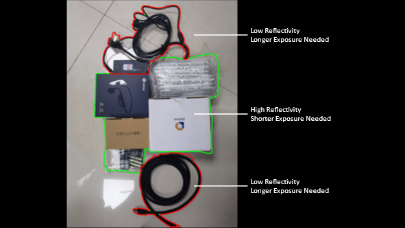

场景中既包括高反射率白色明亮物体（白色盒子），也包括低反射率的黑色暗淡物体（黑色线材）。

如果使用较低曝光时间参数58us进行拍摄，得到的深度图像如下图。可以看到黑色线材由于曝光时间过短，没有获取有效深度数值。

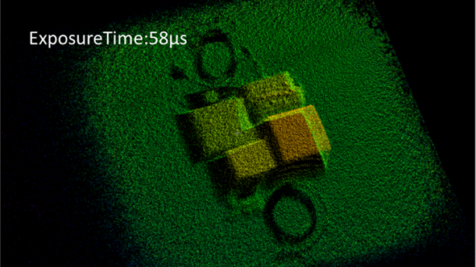

如果使用较高曝光时间参数1000us进行拍摄，得到的深度图像如下图。可以看到白色盒子由于亮度过高而过曝，导致没有有效深度数据产生。

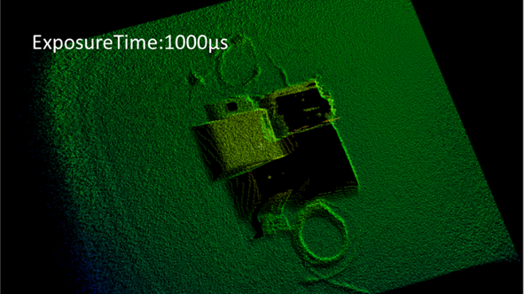

如果在一次获取时，分别获取低曝光与高曝光图像，然后再通过算法进行融合就可以生成完美的图像。

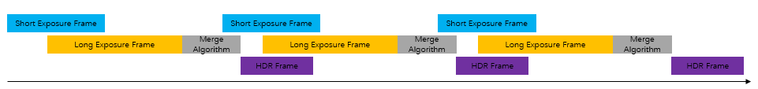

> HDR最少可由两种图像进行融合，基于场景与需求也可以有3种及以上图像融合。

融合后图像如下图：

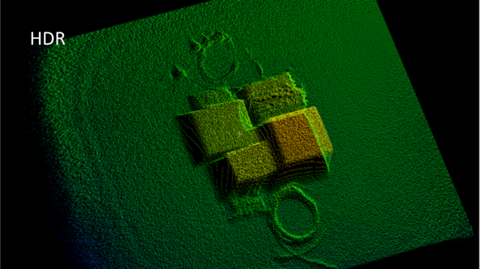


### 2 WDR实现原理

WDR——即宽动态范围图像(Wide-Dynamic Range，简称WDR)，相比普通的图像，可以提供更多的检测距离和数据细节，利用每个检测范围模式对应最佳细节的图像来合成最终WDR图像，能够更好的在既近又远的场景中展现最佳状态。

WDR与HDR的实现原理类似，区别在于HDR实现高低曝光的图像结合，而WDR实现的是远近检测范围模式的图像结合。

以如下场景举例：

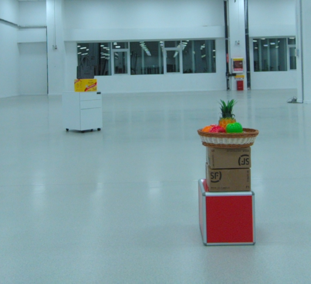

场景中既包括近距离的目标（约1.7m），也包括远距离的物体（约5.5m）。而普通模式的检测范围有限，无法同时即检测近处又检测远处。

如果使用近距离模式0-4.5m进行拍摄，得到的深度图像如下图。可以看到超过检测距离的物体由于超出测量范围，无法获取有效深度数值。

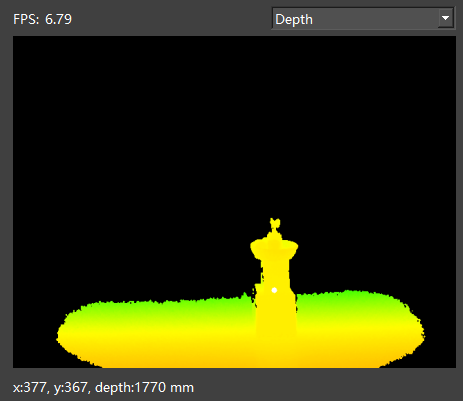

如果使用远距离模式3.5-8.0m进行拍摄，得到的深度图像如下图。可以看到近距离物体因为小于测量范围，无法产生有效深度数据。

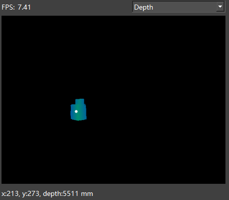

如果在一次获取时，分别获取近距离与远距离图像，然后再通过算法进行融合就可以生成完美的图像。

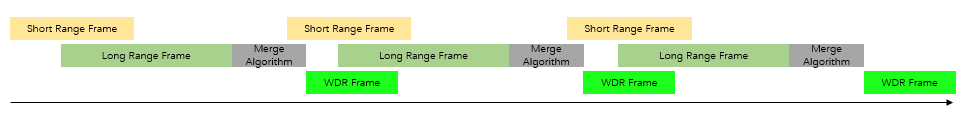

> WDR最少可由两种图像进行融合，基于场景与需求也可以有3种及以上图像融合。

融合后深度图像如下图：

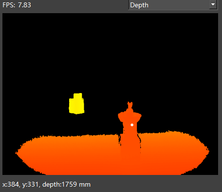

### 3 使用方法

使用HDR和WDR，可以分别通过ScepterGUITool进行直接使用与评估，也可以使用ScepterSDK的方式进行代码调用与工程集成。

<!-- tabs:start -->

#### **ScepterGUITool**

GUITool使用非常简单，在左侧Depth控制模块的最下方，有HDR和WDR的使能按钮，点击即可开启HDR或者WDR功能。开启后，即可在右侧图像栏查看融合后的图像。

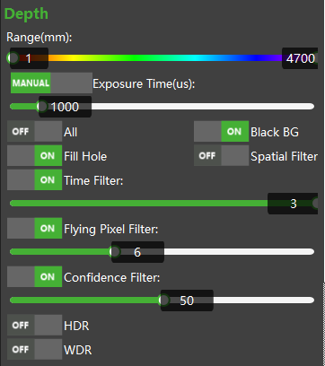

> 如果HDR或者WDR按钮无法点击，或者点击后自动关闭，则说明使用的相机不支持该功能。

HDR或WDR使能后，在按钮右侧会出现‘Settings’按钮，点击按钮后可以弹出子窗口。在子窗口中可以分别设置不同图像的曝光参数，以此可以结合使用场景进行最佳效果调节。

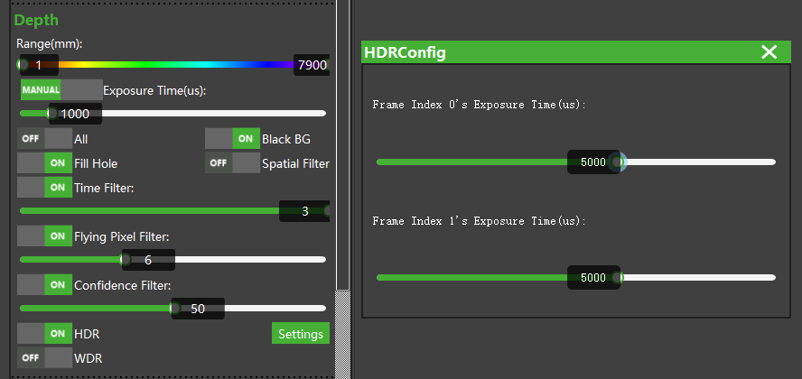

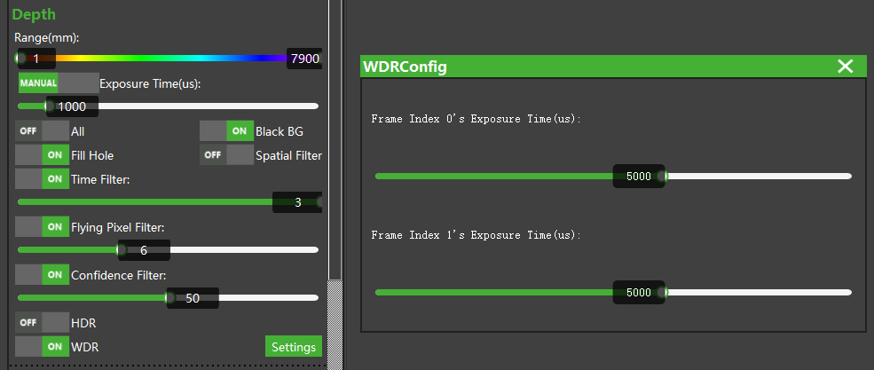

#### **ScepterSDK**

SDK的代码调用方式非常简单易用，使用如下接口即可。

**HDR：**

```c
//使能HDR
SCEPTER_C_API_EXPORT ScStatus scSetHDRModeEnabled(ScDeviceHandle device, bool bEnabled);
//获取HDR的组成frame数量
SCEPTER_C_API_EXPORT ScStatus scGetDistanceLevelCountOfHDRMode(ScDeviceHandle device, int32_t* pCount);
//设置组成HDR对应frame的曝光时间
SCEPTER_C_API_EXPORT ScStatus scSetExposureTimeOfHDR(ScDeviceHandle device, uint8_t level, int32_t exposureTime);
//获取组成HDR对应frame的曝光时间
SCEPTER_C_API_EXPORT ScStatus scGetExposureTimeOfHDR(ScDeviceHandle device, uint8_t level, int32_t* pExposureTime);
//获取组成HDR对应frame的曝光时间范围
SCEPTER_C_API_EXPORT ScStatus scGetMaxExposureTimeOfHDR(ScDeviceHandle device, uint8_t level, int32_t* pMaxExposureTime);
```


**WDR：**

```c
//使能WDR
SCEPTER_C_API_EXPORT ScStatus scSetWDRModeEnabled(ScDeviceHandle device, bool bEnabled);
//获取WDR的组成frame数量
SCEPTER_C_API_EXPORT ScStatus scGetDistanceLevelCountOfWDRMode(ScDeviceHandle device, int32_t* pCount);
//设置组成WDR对应frame的曝光时间
SCEPTER_C_API_EXPORT ScStatus scSetExposureTimeOfWDR(ScDeviceHandle device, uint8_t level, int32_t exposureTime);
//获取组成WDR对应frame的曝光时间
SCEPTER_C_API_EXPORT ScStatus scGetExposureTimeOfWDR(ScDeviceHandle device, uint8_t level, int32_t* pExposureTime);
//获取组成WDR对应frame的曝光时间范围
SCEPTER_C_API_EXPORT ScStatus scGetMaxExposureTimeOfWDR(ScDeviceHandle device, uint8_t level, int32_t* pMaxExposureTime);
```


<!-- tabs:end -->


### 4 特别注意

无论HDR模式，还是WDR模式，都需要多次曝光产生不同参数的图像再进行算法融合，因此一定会出现不同程度的动态模糊，所以推荐应用在**静态目标场景**。

