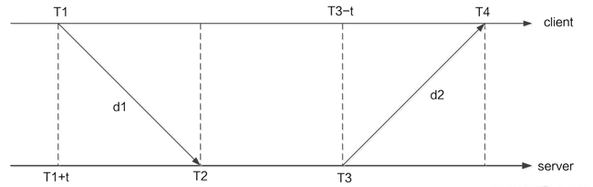
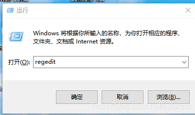
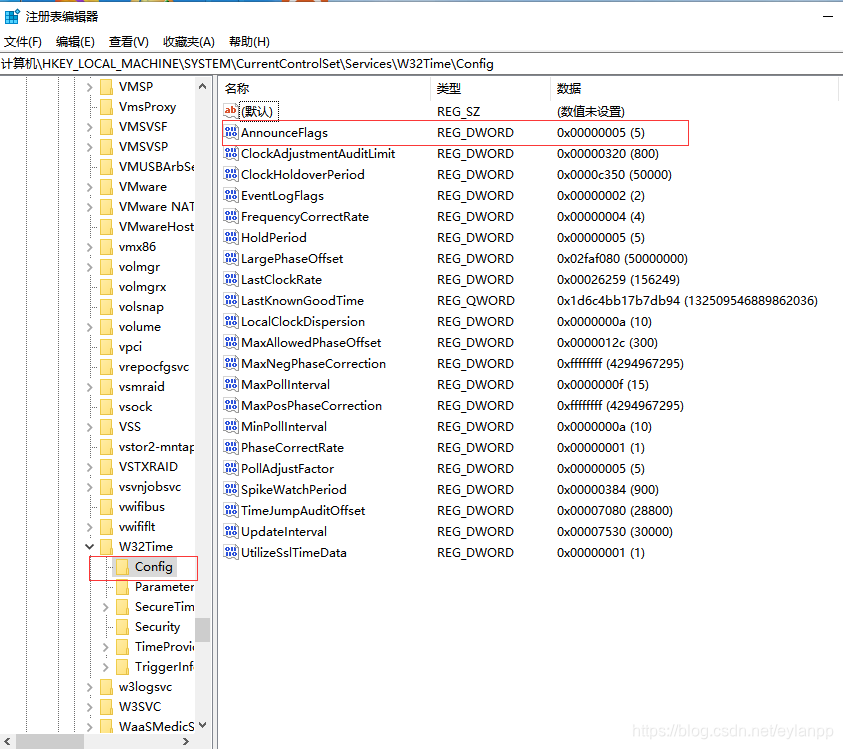
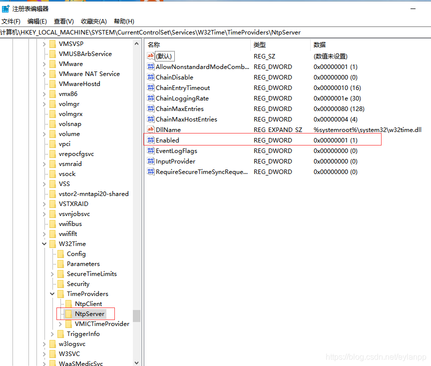
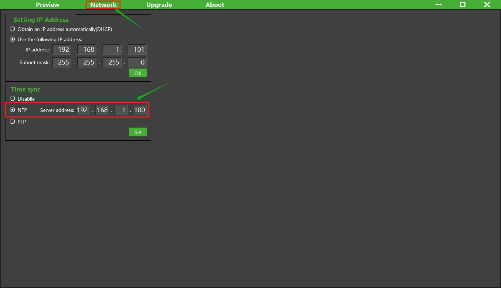

# NTP设置使用方法

在工业视觉使用场景中，为了确保不同设备之间的时间一致性与准确性，时间同步显得尤为重要。

时钟同步协议可以分为两类：基于硬件的协议和基于软件的协议。

基于硬件的协议通常依赖于专用硬件设备来确保时钟同步，例如全球定位系统(GPS)和IEEE 1588 Precision Time Protocol(PTP)。此类协议通常具有更高的精度和稳定性，因为它们可以提供高精度和高分辨率的计时器。但这类方法的成本通常比基于软件的协议更高。

基于软件的协议则是通过在计算机系统上运行的软件来实现时钟同步，例如网络时间协议(NTP)和时钟同步协议(TSP)。此类协议通常较为简单并且适用于普通的硬件设备。

## NTP简介

网络时钟协议（NTP）是一种基于UDP协议的协议，用于同步计算机系统的时钟。它是由David Mills在1985年创造的，目前已成为广泛应用于互联网的标准协议。NTP使用树形结构来实现时间同步。它分为时钟源和时钟客户端两个角色，时钟源提供时间标准，时钟客户端通过和时钟源通信来同步本地时钟，也就是最典型的C/S方式。



如上图所示，Client首先向Server发送一个NTP包，其中包含了该包离开Client的时间戳T1，当Server接收到该包时，依次填入包到达的时间戳T2、包离开的时间戳T3，然后立即把包返回给Client。Client在接收到响应包时，记录包返回的时间戳T4。Client用上述4个时间参数就能够计算出2个关键参数：NTP包的往返延迟d和Client与Server之间的时钟偏差t。Client使用时钟偏差来调整本地时钟，以使其Client和Server时间一致。

由计算原理可知，NTP其对时精度和可靠性受到网络延迟、Server性能等因素的影响，时钟同步精度有限，因此NTP也主要用于授时或者秒级的同步。

> 在工业视觉场景中，如果对同步要求不高可以使用NTP方式对时。基于原理与经验，如果是高性能局域网，并且NTP Server性能较好的情况下，NTP的同步精度不超过10ms。

## 配置方法

NTP的使用为标准的C/S方式，使用中相机做为NTP Client，所以需要局域网中存在并配置NTP Server。

### NTP Server配置

NTP Server有多种不同存在的形态，如Windows or Linux工控机，专用NTP服务器等。请根据具体情况，配置自己的Server。本文会以Windows(Win10)与Linux(Ubuntu)为例进行NTP服务器的搭建。

<!-- tabs:start -->

#### **Windows**

win+r打开运行窗口，输入regedit，点击确定。



修改第一个注册表值，目录\HKEY_LOCAL_MACHINE\SYSTEM\CurrentControlSet\Services\W32Time\Config，AnnounceFlags值改为5。



修改第二个注册表值，目录\HKEY_LOCAL_MACHINE\SYSTEM\CurrentControlSet\Services\W32Time\TimeProviders\NtpServer，Enabled值改为1。



运行Windows powershell(管理员)，并依次执行如下命令：

**net stop w32time**： 停止服务

**net start w32time**：启动服务

**w32tm /stripchart /computer:127.0.0.1**： 验证是否成功

```
> net stop w32time
Windows Time 服务正在停止.
Windows Time 服务已成功停止。

> net start w32time
Windows Time 服务正在启动 .
Windows Time 服务已经启动成功。

> w32tm /stripchart /computer:127.0.0.1
正在跟踪 127.0.0.1 [127.0.0.1:123]。
当前时间是 2024/7/2 17:57:22。
17:57:22, d:+00.0002855s o:+00.0000984s  [                           *                           ]
17:57:24, d:+00.0002224s o:+00.0000740s  [                           *                           ]
```

如果分别打印log如上，则说明设置成功。

#### **Linux**

使用命令，安装ntp工具

```shell
> sudo apt update
> sudo apt install ntp -y
```

安装完成后，运行如下命令确保安装成功。

```shell
> sntp --version
sntp 4.2.8p10@1.3728-o (1)
```

安装完成后，NTP服务默认启动，可以通过如下命令查看：

```shell
> service ntp status

● ntp.service - Network Time Service
   Loaded: loaded (/lib/systemd/system/ntp.service; enabled; vendor preset: enabled)
   Active: active (running) since Tue 2024-07-02 10:01:44 CST; 4h 31min ago
     Docs: man:ntpd(8)
 Main PID: 1975 (ntpd)
   CGroup: /system.slice/ntp.service
           └─1975 /usr/sbin/ntpd -p /var/run/ntpd.pid -g -u 116:122

Jul 02 10:01:47 firefly ntpd[1975]: Soliciting pool server 5.79.108.34
Jul 02 10:01:47 firefly ntpd[1975]: Soliciting pool server 202.118.1.81
Jul 02 10:01:48 firefly ntpd[1975]: Soliciting pool server 116.203.151.74
Jul 02 10:01:48 firefly ntpd[1975]: Soliciting pool server 78.46.102.180
Jul 02 10:01:49 firefly ntpd[1975]: Soliciting pool server 162.159.200.123
Jul 02 10:01:49 firefly ntpd[1975]: Soliciting pool server 139.199.215.251
Jul 02 10:01:49 firefly ntpd[1975]: Soliciting pool server 91.189.91.157
Jul 02 10:01:50 firefly ntpd[1975]: Soliciting pool server 2a01:4f8:c2c:477d::2
Jul 02 10:21:06 firefly ntpd[1975]: 116.203.151.74 local addr 192.168.100.105 -> <null>
Jul 02 10:21:58 firefly ntpd[1975]: 78.46.102.180 local addr 192.168.100.105 -> <null>
```

以上便完成了NTP Server的配置。

<!-- tabs:end -->

### NTP Client配置：

<!-- tabs:start -->

#### **PC Client**

NTP Server设置完成后，可以用在同一局域网中的另一台PC作为client进行简单验证。仍然以Linux为例：

安装ntpdate工具

```shell
sudo apt install ntpdate
```

为了让客户端系统通过主机名解析NTP服务器，您需要在/etc/hosts中添加NTP服务器的IP地址和主机名文件。

```
sudo vim /etc/hosts
```

在hosts文件中增加如下内容：

```
192.168.1.122   ntp-test-server #linux NTP 服务器
192.168.1.106   ntp-test-win10 # windows NTP 服务器
```

192.168.1.122：局域网中NTP Server的IP地址

ntp-test-server：服务器别名

检查客户端系统是否与 NTP 服务器时间同步，请运行以下命令。

```
> sudo ntpdate ntp-test-server
2 Jul 15:13:38 ntpdate[2603]: adjust time server 192.168.1.122 offset -0.051502 sec
> sudo ntpdate ntp-test-win10
2 Jul 17:58:08 ntpdate[2733]: adjust time server 192.168.1.106 offset 0.000001 sec
```

打印log如上说明同步成功，offset为当次同步时本地时间与服务器时间的时间差。

> 可以使用此方法连续多次验证同步时offset值，如果offset值一直偏大，则说明网络联络或者NTP Server性能欠佳。但此值并不代表NTP同步时间精度。


#### **Vzense Camera**

使用支持NTP Client的相机（具体型号是否支持NTP，请参考规格书中说明），打开ScepterGUITool，搜索并连接相机。

连接成功后，打开Network页面。



勾选NTP使能，并将NTP Server的局域网地址填入，点击Set设置成功。

> 相机支持NTP的实时设置使能，即可以立刻生效。设置成功后，相机也会记录使能此功能，下次上电开机仍然默认使用。

<!-- tabs:end -->


## 验证方法

相机设置成功后，开机默认开启NTP的同步对时功能，并且为了保证时间的持续准确性，会以5s的间隔与服务器进行同步。

如何确定相机已经与NTP服务器同步成功？可以通过打印获取图像的时间戳来检查验证。

```C
typedef struct
{
    uint32_t      frameIndex;        //!< The index of the frame.
    ScFrameType   frameType;         //!< The type of frame. See ::ScFrameType for more information.
    ScPixelFormat pixelFormat;       //!< The pixel format used by a frame. See ::ScPixelFormat for more information.
    uint8_t*      pFrameData;        //!< A buffer containing the frame’s image data.
    uint32_t      dataLen;           //!< The length of pFrame, in bytes.
    uint16_t      width;             //!< The width of the frame, in pixels.
    uint16_t      height;            //!< The height of the frame, in pixels.
    uint64_t      deviceTimestamp;   //!< The timestamp(in milliseconds) when the frame be generated on the device. Frame processing and transfer time are not included.
} ScFrame;
```

在图像获取的结构体中包含deviceTimestamp成员，其值为uint64的UNIX时间戳。

在Samples的取图例程里增加打印时间戳的代码如下：

```c
//1.ReadNextFrame.
//2.GetFrame acoording to Ready flag and Frametype.
for(int i = 0;i < frameSpace;i++)
{
	status = scGetFrameReady(deviceHandle, 1200, &FrameReady);
    if (status != ScStatus::SC_OK)
    {
    	cout << "scGetFrameReady failed status:" <<status<< endl;
    	continue;
    }
    //depthFrame for example.
    if(1 == FrameReady.depth)
    {
    	status = scGetFrame(deviceHandle, SC_DEPTH_FRAME, &depthFrame);
    	if (depthFrame.pFrameData != NULL)
        {
            cout << "get Frame successful,status:" << status << "  ";
            cout << "deviceTimestamp:" << depthFrame.deviceTimestamp <<  endl;
        }
    }
}
```

代码运行，当取图成功后会打印deviceTimestamp值。

在没有设置NTP同步时，打印log如下：

```
---FrameCaptureAndSave---
Get device count: 1
serialNumber:GN6501CBCA3310168
ip:192.168.1.102
connectStatus:1
get Frame successful,status:0  deviceTimestamp:18224
get Frame successful,status:0  deviceTimestamp:18257
get Frame successful,status:0  deviceTimestamp:18291
get Frame successful,status:0  deviceTimestamp:18324
get Frame successful,status:0  deviceTimestamp:18357
get Frame successful,status:0  deviceTimestamp:18391
get Frame successful,status:0  deviceTimestamp:18424
get Frame successful,status:0  deviceTimestamp:18457
get Frame successful,status:0  deviceTimestamp:18491
get Frame successful,status:0  deviceTimestamp:18524
get Frame successful,status:0  deviceTimestamp:18557
get Frame successful,status:0  deviceTimestamp:18591
get Frame successful,status:0  deviceTimestamp:18624
get Frame successful,status:0  deviceTimestamp:18657
get Frame successful,status:0  deviceTimestamp:18691
get Frame successful,status:0  deviceTimestamp:18724
get Frame successful,status:0  deviceTimestamp:18757
get Frame successful,status:0  deviceTimestamp:18791
get Frame successful,status:0  deviceTimestamp:18824
get Frame successful,status:0  deviceTimestamp:18857
---end---
```

设置同步NTP后，打印log如下：

```
---FrameCaptureAndSave---
Get device count: 1
serialNumber:GN6501CBCA3310168
ip:192.168.1.102
connectStatus:1
get Frame successful,status:0  deviceTimestamp:1719910682528
get Frame successful,status:0  deviceTimestamp:1719910682562
get Frame successful,status:0  deviceTimestamp:1719910682595
get Frame successful,status:0  deviceTimestamp:1719910682629
get Frame successful,status:0  deviceTimestamp:1719910682662
get Frame successful,status:0  deviceTimestamp:1719910682695
get Frame successful,status:0  deviceTimestamp:1719910682728
get Frame successful,status:0  deviceTimestamp:1719910682762
get Frame successful,status:0  deviceTimestamp:1719910682795
get Frame successful,status:0  deviceTimestamp:1719910682828
get Frame successful,status:0  deviceTimestamp:1719910682862
get Frame successful,status:0  deviceTimestamp:1719910682895
get Frame successful,status:0  deviceTimestamp:1719910682928
get Frame successful,status:0  deviceTimestamp:1719910682962
get Frame successful,status:0  deviceTimestamp:1719910682995
get Frame successful,status:0  deviceTimestamp:1719910683029
get Frame successful,status:0  deviceTimestamp:1719910683062
get Frame successful,status:0  deviceTimestamp:1719910683096
get Frame successful,status:0  deviceTimestamp:1719910683129
get Frame successful,status:0  deviceTimestamp:1719910683162
---end---
```

时间戳打印值会有明显的差异，因为相机使用的系统默认开始时间戳为0，而同步过NTP时间之后，会修改为NTP Server的系统时间。

进一步也可以通过RTC时间转换进行确认，参考代码如下：

```
#include <time.h> //引用c库函数

/*
省略部分代码
*/

if (depthFrame.pFrameData != NULL)
{
	struct tm *p;
	time_t t；
	char s[100];
    cout << "get Frame successful,status:" << status << "  ";
    t = depthFrame.deviceTimestamp/1000;
    p = gmtime(&t);
    strftime(s, sizeof(s), "%Y-%m-%d %H:%M:%S", p);
    printf("%d: %s\n", (int)t, s);
}
```

运行成功后，打印log：

```
---FrameCaptureAndSave---
Get device count: 1
serialNumber:GN6501CBCA3310168
ip:192.168.1.102
connectStatus:1
get Frame successful,status:0  1719911020: 2024-07-02 09:03:40
get Frame successful,status:0  1719911020: 2024-07-02 09:03:40
get Frame successful,status:0  1719911021: 2024-07-02 09:03:41
get Frame successful,status:0  1719911021: 2024-07-02 09:03:41
get Frame successful,status:0  1719911021: 2024-07-02 09:03:41
get Frame successful,status:0  1719911021: 2024-07-02 09:03:41
get Frame successful,status:0  1719911021: 2024-07-02 09:03:41
get Frame successful,status:0  1719911021: 2024-07-02 09:03:41
get Frame successful,status:0  1719911021: 2024-07-02 09:03:41
get Frame successful,status:0  1719911021: 2024-07-02 09:03:41
get Frame successful,status:0  1719911021: 2024-07-02 09:03:41
get Frame successful,status:0  1719911021: 2024-07-02 09:03:41
get Frame successful,status:0  1719911021: 2024-07-02 09:03:41
get Frame successful,status:0  1719911021: 2024-07-02 09:03:41
get Frame successful,status:0  1719911021: 2024-07-02 09:03:41
get Frame successful,status:0  1719911021: 2024-07-02 09:03:41
get Frame successful,status:0  1719911021: 2024-07-02 09:03:41
get Frame successful,status:0  1719911021: 2024-07-02 09:03:41
get Frame successful,status:0  1719911021: 2024-07-02 09:03:41
get Frame successful,status:0  1719911021: 2024-07-02 09:03:41
---end---
```


> - 设备中的timestamp为图像产生的时刻，不包含图像处理与网络传输的延时。
> - 设备使用的时间戳为UTC时间。

