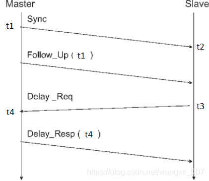
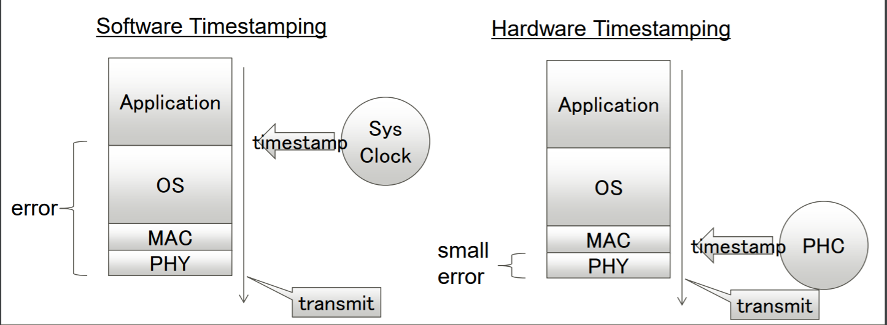
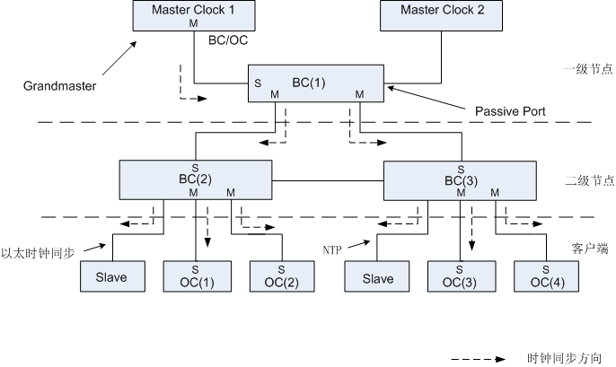
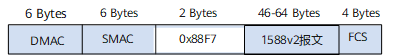
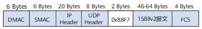
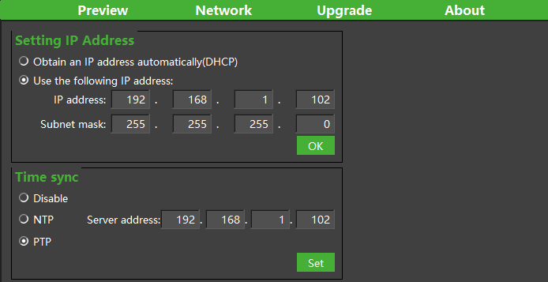

# PTP设置使用方法


### 1. PTP简介

PTP（Precision Time Protocol）起源于IEEE 1588标准，该标准最早发布于2002年。PTP的设计目标是提供高精度的时间同步，并适用于广域网和局域网环境。PTP的发展源于对传统的时间同步协议（如NTP）无法满足一些应用领域需求的需求。在工业自动化、通信以及金融交易等领域，需要更高精确度的时间同步来确保系统的协调性和准确性。

PTP利用网络中的时钟设备进行时间同步，通过在网络中传递精确的时间戳来实现同步。它采用主从架构，其中一个节点作为主时钟（Master Clock），其他节点作为从时钟（Slave Clock）。主时钟通过发送时间戳报文来同步从时钟，从时钟通过接收并处理这些报文来调整自己的时钟。随着技术的不断发展，PTP还进行了多次更新和改进，目前最流行的版本是PTPv2。PTPv2在原有基础上增加了一些新的特性和改进，进一步提高了时间同步的精度和可靠性。

#### **1.1 同步计算原理**

基于PTP架构设计上的确知性（同一链路的两端，传输延时相同），实现Master和Slave之间的同步，过程如下图：



1. Master在t1时刻发送Sync包到Slave，并本地保存t1时刻，Slave收到包后记录本地时刻t2；
2. Master然后发送Follow_Up包，将t1时刻发送给Slave； 
3. Slave在收到Follow_Up包后，给Master发送Delay_Req包，并记录自己的发送时刻t3；
4. Master收到Delay_Req包，记录接收时刻t4，并将t4值通过Delay_Resp包返回给Slave；

由以上获得的t1，t2，t3，t4值，Slave就可以计算出offset值。

公式推导如下：

```C
假设时间差为T_offset
T_master = Tslave + T_offset
假设传输延时为t_transport
t1 + t_transport = t2 + T_offset
t3 + t_transport = t4 - T_offset
t1 - t3 = t2 - t4 + 2*T_offset
T_offset = (t1 + t4 - t3 - t2)/2
```


#### **1.2 同步时钟分类**

PTP包含两种不同的时钟处理方式：硬时钟与软时钟。



软时钟使用标准以太网模块将PTP协议实现在软件中，由于时间戳信息是在应用层，所以主设备和从设备上运行的软件堆栈引入的延时波动意味着只能达到有限的精度。

硬时钟更接近物理接口，可以最大程度地减少协议栈延迟的影响，所以同步准确性更高。


**PTP硬时钟：**

使用MAC封装报文，在二层链路上传输，需要硬件支持PTP报文的收发功能。整个PTP网络需要按照主从(Master-Slave)关系组织在一起，比如交换机的角色就如下图的二级节点，需要在网络中即做Master也做Slave。因此PTP硬时钟网络需要全网络节点设备都支持，不然无法组网使用。因为全网络的硬件支持，所以同步精度很高，局域网实测可达到**700ns左右**。



**PTP软时钟：**

软时钟通过应用程序进行实现，可以使用UDP封装报文，也可以使用MAC封装报文。UDP封装通过UDP/IP协议栈组包向下发送，MAC封装跳过IP协议栈直接通过MAC发送，因此两种软件封包相比，MAC封包的精度更高。

MAC封装：



UDP封装：




软时钟的优势在于，无需特殊硬件的支持即可使用，同步精度虽然相比硬时钟低，但也可以满足大部分使用场景。实验室测试数据，在局域网可达**3us左右**。


### 2. Vzense相机PTP模式

由于硬时钟方式组网需要局域网所有设备的支持，使用成本较高，所以目前除高精度场景外，多使用软时钟方式进行同步。

在Vzense相机中，使用IEEE 1588v2标准，暂时只支持PTP软时钟方式，其他详细参数如下：

> **Delay Mechanism:** E2E
>
> **Network Transport:** UDP IPv4
>
> **Time Stamping:** Software
>
> **Role:** SlaveOnly


### 3. 配置方法

PTP的使用为主从(Master-Slave)方式，使用中相机做为PTP Slave，所以需要局域网中存在并配置PTP Master。

#### 3.1 PTP Master配置

PTP Master有多种不同存在的形态，如工控机、专用PTP主时钟服务器等，请根据具体情况，配置实际Master。本文会以Linux(Ubuntu)为例进行PTP主时钟的搭建。

> Windows桌面系统不支持PTP Master功能。

使用命令，安装ptp工具ptp4l。

```shell
> sudo apt update
> sudo apt install linuxptp -y
```

安装完成后，运行如下命令确保安装成功。

```shell
> ptp4l -v
1.8

> ptp4l -h

usage: ptp4l [options]

 Delay Mechanism

 -A        Auto, starting with E2E
 -E        E2E, delay request-response (default)
 -P        P2P, peer delay mechanism

 Network Transport

 -2        IEEE 802.3
 -4        UDP IPV4 (default)
 -6        UDP IPV6

 Time Stamping

 -H        HARDWARE (default)
 -S        SOFTWARE
 -L        LEGACY HW

 Other Options

 -f [file] read configuration from 'file'
 -i [dev]  interface device to use, for example 'eth0'
           (may be specified multiple times)
 -p [dev]  PTP hardware clock device to use, default auto
           (ignored for SOFTWARE/LEGACY HW time stamping)
 -s        slave only mode (overrides configuration file)
 -l [num]  set the logging level to 'num'
 -m        print messages to stdout
 -q        do not print messages to the syslog
 -v        prints the software version and exits
 -h        prints this message and exits
```

安装完成后，运行如下命令启动：

```shell
> sudo ptp4l -S -i eth0 -m

ptp4l[629168.570]: port 1: INITIALIZING to LISTENING on INITIALIZE
ptp4l[629168.574]: port 0: INITIALIZING to LISTENING on INITIALIZE
ptp4l[629168.576]: port 1: link up
ptp4l[629175.157]: port 1: LISTENING to MASTER on ANNOUNCE_RECEIPT_TIMEOUT_EXPIRES
ptp4l[629175.158]: selected best master clock 4e275b.fffe.06c9d6
ptp4l[629175.158]: assuming the grand master role
```

-S: Software Clock

-i : 使用的网卡（必选项），通过ifconfig查看网卡名称

-m: 前台运行（非必选），前台方便查看运行log

以上便完成了PTP Master的配置。

> 不同版本ptp4l的参数略有不同，具体请根据-h的输出参考使用。


#### 3.2 PTP Slave配置（Vzense Camera）：

使用支持PTP Slave的相机，如NYX650（具体型号是否支持PTP，请参考规格书中说明）。打开ScepterGUITool，搜索并连接相机。

连接成功后，打开Network页面。




勾选PTP使能，点击Set，软件提示设置成功or失败。

> - 相机支持PTP的实时设置使能，即可以立刻生效。设置成功后，相机也会记录使能此功能，下次上电开机仍然默认使用。
> - 如果设置失败，则请确认使用的相机型号是否支持PTP功能，如果确认支持，请联系FAE确认当前固件版本是否支持。


### 4. 验证方法

相机设置成功后，开机默认开启PTP的同步对时功能。

如何确定相机已经与PTP服务器同步成功？可以通过打印获取图像的时间戳来检查验证。

```C
typedef struct
{
    uint32_t      frameIndex;        //!< The index of the frame.
    ScFrameType   frameType;         //!< The type of frame. See ::ScFrameType for more information.
    ScPixelFormat pixelFormat;       //!< The pixel format used by a frame. See ::ScPixelFormat for more information.
    uint8_t*      pFrameData;        //!< A buffer containing the frame’s image data.
    uint32_t      dataLen;           //!< The length of pFrame, in bytes.
    uint16_t      width;             //!< The width of the frame, in pixels.
    uint16_t      height;            //!< The height of the frame, in pixels.
    uint64_t      deviceTimestamp;   //!< The timestamp(in milliseconds) when the frame be generated on the device. Frame processing and transfer time are not included.
} ScFrame;
```

在图像获取的结构体中包含deviceTimestamp成员，其值为uint64的UNIX时间戳。

在Samples的取图例程里增加打印时间戳的代码如下：

```c
//1.ReadNextFrame.
//2.GetFrame acoording to Ready flag and Frametype.
for(int i = 0;i < frameSpace;i++)
{
	status = scGetFrameReady(deviceHandle, 1200, &FrameReady);
    if (status != ScStatus::SC_OK)
    {
    	cout << "scGetFrameReady failed status:" <<status<< endl;
    	continue;
    }
    //depthFrame for example.
    if(1 == FrameReady.depth)
    {
    	status = scGetFrame(deviceHandle, SC_DEPTH_FRAME, &depthFrame);
    	if (depthFrame.pFrameData != NULL)
        {
            cout << "get Frame successful,status:" << status << "  ";
            cout << "deviceTimestamp:" << depthFrame.deviceTimestamp <<  endl;
        }
    }
}
```

代码运行，当取图成功后会打印deviceTimestamp值。

在没有设置PTP同步时，或者相机断电再上电后还没有同步成功的情况下，打印log如下：

```
---FrameCaptureAndSave---
Get device count: 1
serialNumber:GN6501CBCA3310168
ip:192.168.1.102
connectStatus:1
get Frame successful,status:0  deviceTimestamp:18224
get Frame successful,status:0  deviceTimestamp:18257
get Frame successful,status:0  deviceTimestamp:18291
get Frame successful,status:0  deviceTimestamp:18324
get Frame successful,status:0  deviceTimestamp:18357
get Frame successful,status:0  deviceTimestamp:18391
get Frame successful,status:0  deviceTimestamp:18424
get Frame successful,status:0  deviceTimestamp:18457
get Frame successful,status:0  deviceTimestamp:18491
get Frame successful,status:0  deviceTimestamp:18524
get Frame successful,status:0  deviceTimestamp:18557
get Frame successful,status:0  deviceTimestamp:18591
get Frame successful,status:0  deviceTimestamp:18624
get Frame successful,status:0  deviceTimestamp:18657
get Frame successful,status:0  deviceTimestamp:18691
get Frame successful,status:0  deviceTimestamp:18724
get Frame successful,status:0  deviceTimestamp:18757
get Frame successful,status:0  deviceTimestamp:18791
get Frame successful,status:0  deviceTimestamp:18824
get Frame successful,status:0  deviceTimestamp:18857
---end---
```

设置同步PTP后，打印log如下：

```
---FrameCaptureAndSave---
Get device count: 1
serialNumber:GN6501CBCA3310168
ip:192.168.1.102
connectStatus:1
get Frame successful,status:0  deviceTimestamp:1719910682528
get Frame successful,status:0  deviceTimestamp:1719910682562
get Frame successful,status:0  deviceTimestamp:1719910682595
get Frame successful,status:0  deviceTimestamp:1719910682629
get Frame successful,status:0  deviceTimestamp:1719910682662
get Frame successful,status:0  deviceTimestamp:1719910682695
get Frame successful,status:0  deviceTimestamp:1719910682728
get Frame successful,status:0  deviceTimestamp:1719910682762
get Frame successful,status:0  deviceTimestamp:1719910682795
get Frame successful,status:0  deviceTimestamp:1719910682828
get Frame successful,status:0  deviceTimestamp:1719910682862
get Frame successful,status:0  deviceTimestamp:1719910682895
get Frame successful,status:0  deviceTimestamp:1719910682928
get Frame successful,status:0  deviceTimestamp:1719910682962
get Frame successful,status:0  deviceTimestamp:1719910682995
get Frame successful,status:0  deviceTimestamp:1719910683029
get Frame successful,status:0  deviceTimestamp:1719910683062
get Frame successful,status:0  deviceTimestamp:1719910683096
get Frame successful,status:0  deviceTimestamp:1719910683129
get Frame successful,status:0  deviceTimestamp:1719910683162
---end---
```

时间戳打印值会有明显的差异，因为相机使用的系统默认开始时间戳为0，而同步过PTP时间之后，会修改为Master的系统时间。

进一步也可以通过RTC时间转换进行确认，参考代码如下：

```
#include <time.h> //引用c库函数

/*
省略部分代码
*/

if (depthFrame.pFrameData != NULL)
{
	struct tm *p;
	time_t t；
	char s[100];
    cout << "get Frame successful,status:" << status << "  ";
    t = depthFrame.deviceTimestamp/1000;
    p = gmtime(&t);
    strftime(s, sizeof(s), "%Y-%m-%d %H:%M:%S", p);
    printf("%d: %s\n", (int)t, s);
}
```

运行成功后，打印log：

```
---FrameCaptureAndSave---
Get device count: 1
serialNumber:GN6501CBCA3310168
ip:192.168.1.102
connectStatus:1
get Frame successful,status:0  1719911020: 2024-07-02 09:03:40
get Frame successful,status:0  1719911020: 2024-07-02 09:03:40
get Frame successful,status:0  1719911021: 2024-07-02 09:03:41
get Frame successful,status:0  1719911021: 2024-07-02 09:03:41
get Frame successful,status:0  1719911021: 2024-07-02 09:03:41
get Frame successful,status:0  1719911021: 2024-07-02 09:03:41
get Frame successful,status:0  1719911021: 2024-07-02 09:03:41
get Frame successful,status:0  1719911021: 2024-07-02 09:03:41
get Frame successful,status:0  1719911021: 2024-07-02 09:03:41
get Frame successful,status:0  1719911021: 2024-07-02 09:03:41
get Frame successful,status:0  1719911021: 2024-07-02 09:03:41
get Frame successful,status:0  1719911021: 2024-07-02 09:03:41
get Frame successful,status:0  1719911021: 2024-07-02 09:03:41
get Frame successful,status:0  1719911021: 2024-07-02 09:03:41
get Frame successful,status:0  1719911021: 2024-07-02 09:03:41
get Frame successful,status:0  1719911021: 2024-07-02 09:03:41
get Frame successful,status:0  1719911021: 2024-07-02 09:03:41
get Frame successful,status:0  1719911021: 2024-07-02 09:03:41
get Frame successful,status:0  1719911021: 2024-07-02 09:03:41
get Frame successful,status:0  1719911021: 2024-07-02 09:03:41
---end---
```


> - 设备中的timestamp为图像产生的时刻，不包含图像处理与网络传输的延时。
> - 设备使用的时间戳为UTC时间。


相机中不存在RTC模块，所以需要每次上电后重新与主时钟进行同步。相机上电启动到时间同步成功存在时间差，根据网络情况的不同会有差异（普通环境下约11s），所以如果上位机读图较早，会产生前几秒图像的时间戳并没有同步成功的现象。

