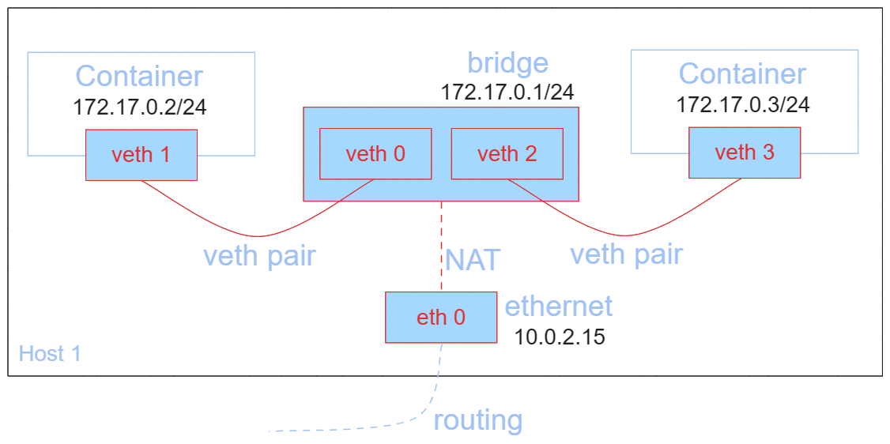
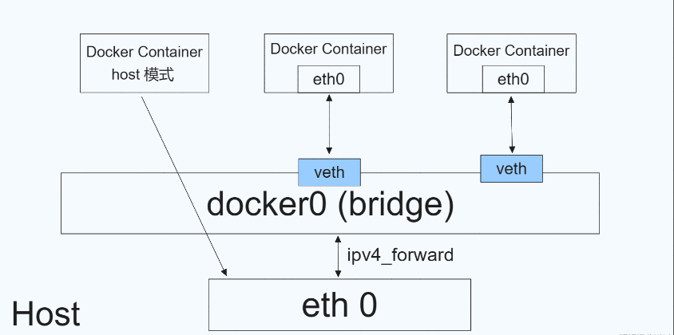

# 如何在Docker中使用ScepterSDK

Docker是一个开源的应用容器引擎，基于Go语言并遵从Apache2.0开源协议。Docker 可以让开发者打包他们的应用以及依赖包到一个轻量级、可移植的容器中，然后发布到任何流行的Linux机器上，也可以实现虚拟化。

在使用Vzense工业相机搭配Docker虚拟化环境使用时，需要特别注意配置与使用方式，如果配置不合适，会遇到能够ping通相机IP地址，但ScepterSDK无法发现与连接相机使用的情况。

下文将详细介绍Vzense工业相机的网络环境要求，Docker的网络模式，以及如何配置Docker Container，使得可以正常使用ScepterSDK与Vzense工业相机进行正常连接与使用。


### 1 ScpeterSDK & Vzense Camera网络环境要求

ScepterSDK与Vzense工业相机通过私有通信协议的方式，使用Socket进行图像与命令传输。

根据设备各项功能的不同，相机会分别使用TCP、UDP、UDP广播、HTTP等不同网络协议，如果有哪些通信方式受限，都会影响到设备的正常使用。

设备使用的网络端口号：9007，9008，9009，8080。

> 在安全要求较高的系统中，请注意开放如上端口号的使用。


### **2 Docker网络模式**

Docker网络是在Docker容器中实现网络通信和连接的重要组成部分。它提供了多种网络模式和配置选项，使得容器可以与其他容器、主机以及外部网络进行通信，在实际应用中，通过选择合适的网络类型和配置参数，可以构建高效、安全、可扩展的Docker网络解决方案。

| 网络模式  | 简介                                                         |
| :-------: | :----------------------------------------------------------- |
|  bridge   | 为每一个容器分配、设置IP，并将容器连接到一个docker0的虚拟网桥，**默认使用该模式**。 |
|   host    | 容器不使用虚拟网卡，而使用宿主机的IP与端口。                 |
|   none    | 容器有独立的Network namespace, 但并没有对其进行任何网络设置。 |
| container | 新创建的容器不会创建自己的网卡，而是和指定的容器共享。       |

**Bridge模式：**

docker默认的容器网络模式。当docker进程启动时，会在宿主机上创建一个名为docker0的虚拟网桥，主机上启动的Docker容器会连接到这个虚拟网桥上。这个虚拟网桥的工作方式类似于物理交换机，使得宿主机上的所有容器都通过虚拟网桥连接在一个二层网络中。网络连接方式如下图：



通过ifconfig可以分别查看宿主机与容器的网络信息，也可以确认上述信息。

宿主机网络信息：

```shell
docker0: flags=4163<UP,BROADCAST,RUNNING,MULTICAST>  mtu 1500
        inet 172.17.0.1  netmask 255.255.0.0  broadcast 172.17.255.255
        inet6 fe80::42:37ff:fefb:5f32  prefixlen 64  scopeid 0x20<link>
        ether 02:42:37:fb:5f:32  txqueuelen 0  (Ethernet)
        RX packets 0  bytes 0 (0.0 B)
        RX errors 0  dropped 0  overruns 0  frame 0
        TX packets 5  bytes 526 (526.0 B)
        TX errors 0  dropped 0 overruns 0  carrier 0  collisions 0
```

容器网络信息：

```shell
eth0: flags=4163<UP,BROADCAST,RUNNING,MULTICAST>  mtu 1500
        inet 172.17.0.2  netmask 255.255.0.0  broadcast 172.17.255.255
        ether 02:42:ac:11:00:02  txqueuelen 0  (Ethernet)
        RX packets 13  bytes 1182 (1.1 KB)
        RX errors 0  dropped 0  overruns 0  frame 0
        TX packets 0  bytes 0 (0.0 B)
        TX errors 0  dropped 0 overruns 0  carrier 0  collisions 0
```

处于桥接模式的容器和宿主机网络不在同一个网段，因此容器不能直接和宿主机以外的网络进行通信，而必须要经过NAT转换。同时，容器需要在宿主机上竞争端口，完成端口映射的配置后，从外部到容器内的网络访TCP流量将会通过DNAT从宿主机端口转发到容器内对应的端口上。此外，容器对于宿主机以外是不可见的，从容器发出的网络请求会通过SNAT从已对接的虚拟网桥（宿主机的docker0）上统一发出。


**Host模式：**

Docker的host网络模式是另一种网络模式，与bridge模式不同，它将容器直接融入到主机的网络栈中，使得容器直接使用主机的网络接口和IP地址。在这种模式下，容器不会获得一个独立的Network Namespace，而是和宿主机共用一个Network Namespace。因此容器内部的服务可以使用宿主机的网络地址和端口，无需进行NAT转换，网络性能较好。

使用host网络模式的一个典型场景是需要容器与宿主机共享网络资源或者容器需要快速访问宿主机网络服务的场景。




### 3 配置方法

由上述Docker的网络模式与Vzense工业相机的网络要求可知，将docker容器创建使用**host模式**是最佳使用方式。

使用host模式创建容器非常简单，只需要在 docker run命令中指定 --net=host参数即可。下面是一个示例：

```shell
$ docker run -d --net=host --name=test_container ubuntu:20.04
```

进入容器后，使用ifconfig命令查询网络环境，如果与在宿主机上看到的网络设备与地址完全一模一样，则说明host模式设置成功。


