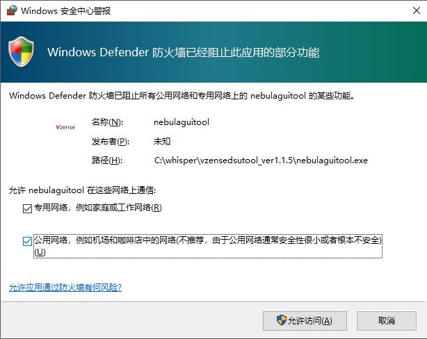
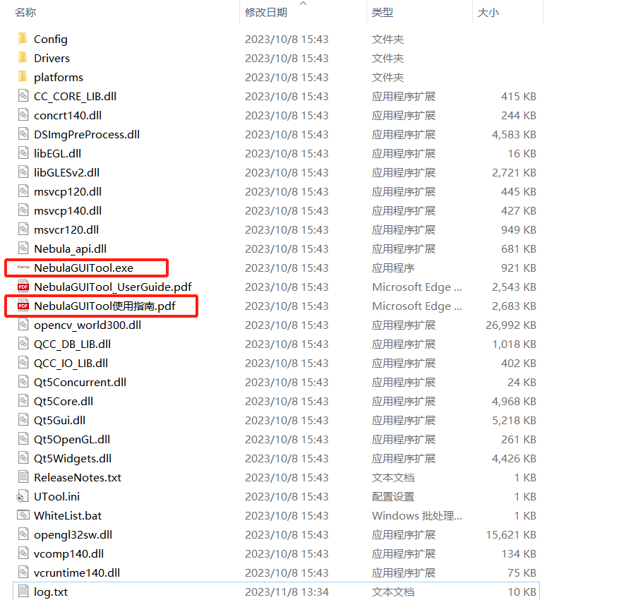
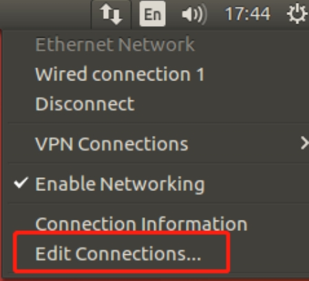
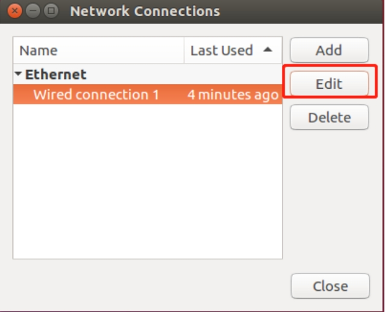
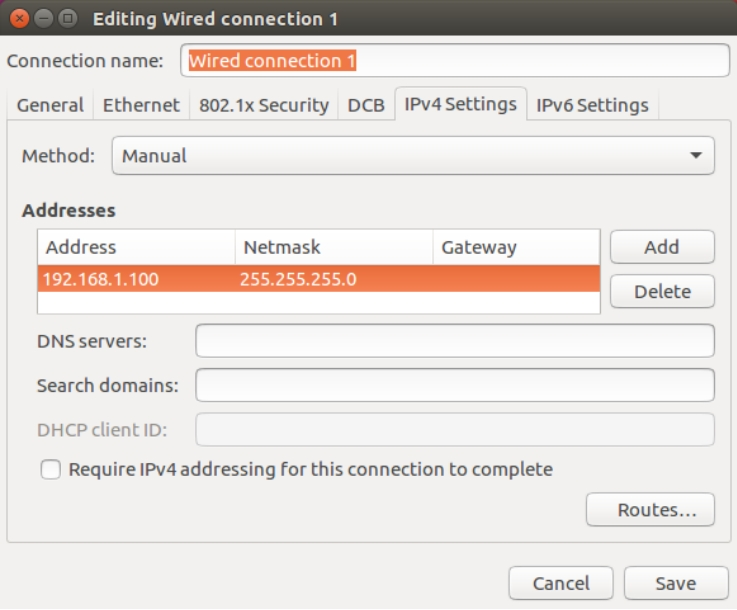
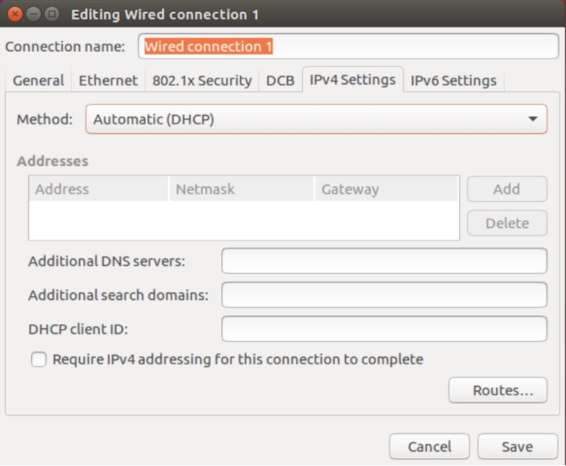
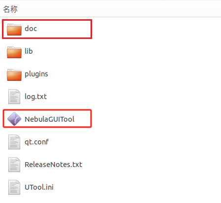

# 2. 设备连接<!-- {docsify-ignore-all} -->

<!-- tabs:start -->

#### **Windows**

## 2.1. 推荐系统配置

| **配置项** |                 **推荐配置**                  |
| :--------: | :-------------------------------------------: |
|  操作系统  | Win7 32/64 位 Win10 64 位 Win11 64 位 |
|    内存    |                    4g 以上                    |

## 2.2. 设备连接

_硬件模组安装示意图_

通过以太网线/航插网线将相机连接至主机，网线连接分为固定 IP 地址直连与 DHCP 连接两种方式。设备默认使用固定 IP 地址方式连接，如需更改 IP 地址、子网掩码、DHCP，可以使用 NebulaGUITool 进行更改。

### 2.2.1. 固定地址

固定地址连接可以设备与电脑直连，也可以配置在同一网段的交换机中使用。

直连：一端连接设备，另一端连接 PC 主机的网线接口。设备默认 IP 为 192.168.1.101，在 PC 端将“本地连接”的，子网掩码设为 255.255.255.0，IP 地址设为同一网段（如 192.168.1.100）。

### 2.2.2. DHCP

DHCP 连接方式，需要将相机连接在开启 DHCP 功能的路由器上，使用在相同局域网中的 PC 进行连接。设置相机 DHCP 的方法，请参考 NebulaGUITool 的文档。推荐将 PC 的“本地连接”设置为自动获取 IP 地址。

注意：

1、PC 端使用的网卡、路由器、交换机都要满足千兆要求。

2、在首次运行 NebulaGUITool 时，要为程序设置通过系统防火墙的权限，如下图所示。

 |

## 2.3. 目录结构

NebulaGUITool 包含 NebulaGUITool 可执行文件，用户手册文档及相关动态链接库。

#### **Linux**

## 2.1. 推荐系统配置

| **配置项** |                           **推荐配置**                           |
| :--------: | :--------------------------------------------------------------: |
|  操作系统  | Ubuntu 18.04 64 位 Ubuntu 20.04 64 位 Ubuntu 22.04 64 位 |

## 2.2. 设备连接

_硬件模组安装示意图_

网线连接分为固定地址与 DHCP 两种方式。Ethernet 产品默认使用固定地址方式，如需更改 IP 地址、子网掩码、DHCP，可以使用 NebulaGUITool 进行更改。

### 2.2.1. 固定地址

固定地址连接可以设备与电脑直连，也可以配置在同一网段的交换机中使用。

直连：一端连接设备，另一端连接 PC 主机的网线接口。设备默认 IP 为 192.168.1.101，在 PC 端将“本地连接”的，子网掩码设为 255.255.255.0，IP 地址设为同一网段（如 192.168.1.100）。

### 2.2.2. DHCP

DHCP 连接方式，需要将相机连接在开启 DHCP 功能的路由器上，使用在相同局域网中的 PC 进行连接。设置相机 DHCP 的方法，请参考 NebulaGUITool 的文档。推荐将 PC 的“本地连接”设置为自动获取 IP 地址。

注意：PC 端使用的网卡、路由器、交换机都要满足千兆要求。

## 2.3. 目录结构

NebulaGUITool 包含 NebulaGUITool 可执行文件，用户手册文档及相关动态链接库。

<!-- tabs:end -->
