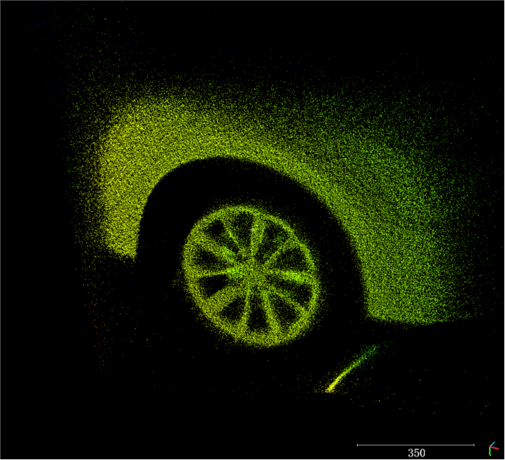

# 3. 功能介绍

## 3.1. 设备列表

设备列表用于设备的搜索与连接。本软件出于展示目的，仅支持同一时刻打开一台相机，SDK 支持多台同时工作。

### 3.1.1. 设备连接

1. 搜索设备

2. 选中设备的 SN

3. 点击 Open 打开设备，或者双击设备 SN 打开设备

### 3.1.2. 设备断开

- 点击 Close 关闭设备。

## 3.2. 显示区

显示区用于显示图像，从左到右依次为深度图视窗、IR 图视窗、彩色图视窗、点云图视窗（默认关闭）。

深度图视窗中显示数值为白点处**实时像素点**的深度值，单位为 mm，如上图该点深度值为 2038mm 。

注意：鼠标右键单击可自行选择白点位置，同时显示对应点的深度值。

## 3.3. 操作区

操作区用于控制设备的工作模式与参数，设置图像处理算法，查看设备信息等功能。

### 3.3.1. 设备控制

#### 3.3.1.1. 工作模式

ActiveMode：主动出图模式。

HardwareTriggerMode：硬触发模式，通过硬件信号触发出图，具体请参考对应产品规格书。

SoftwareTriggerMode：软触发模式，通过调用软件接口触发出图，单击按钮发送软触发指令。

开启软触发模式后，点击“Trigger”按钮可触发设备出图。

#### 3.3.1.2. 伪彩色图映射

深度图采用伪彩色图映射显示，将单通道 16 位的原始深度图在范围 ColorMap_Min 至 ColoMap_Max 的深度值线性映射到 0-255 的值域范围，再将单通道 8 位的深度图映射到伪彩色空间（即色度图）COLORMAP_RAINBOW，如下示意图：

伪彩色图映射效果如下图所示：

#### 3.3.1.3. IR 图像增益

设定 IR 图像的增益，表现为 GmmGain 值越高，IR 图像越亮。设备默认 GmmGain 值为 64。

|                                     |                                       |
| :---------------------------------: | :-----------------------------------: |
|  |  |
|           IRGmmGain 值 64           |           IRGmmGain 值 255            |

#### 3.3.1.4. RGB 图像分辨率设置

RGB 图像分辨率可根据实际列表显示进行切换，如上图示例的分辨率有三种：1600\*1200，800\*600，640\*480。

### 3.3.2. 曝光时间设置

#### 3.3.2.1. ToF 曝光时间

设定 ToF 传感器的曝光模式与时间。

Auto：ToF 传感器设置为自动曝光，设备会根据图像距离进行曝光时间调节。

Manual：ToF 传感器设置为手动曝光，通过滑条或输入框对曝光时间进行手动调节。

ToF 传感器默认使用手动曝光模式，可以设定的最大曝光时间与帧率有关。

| 帧率                    | 最大曝光时间(us) |
| :---------------------- | :--------------- |
| 5fps                    | 4000             |
| 10fps                   | 2000             |
| 15fps(HDR 模式最大支持) | 1300             |
| 25fps                   | 1000             |

HDR Mode： HDR (高动态范围)功能通过设置多个不同曝光时间的方式，将采集到的多个图像合成到一帧中，完成对整个复杂场景的成像。

|  |    |    |
| :-------------------------------- | :-------------------------------------- | :-------------------- |
| 曝光时间 58us                     | 曝光时间 1000us                         | HDR 曝光时间 1000us   |

#### 3.3.2.2. RGB 曝光时间

设定 RGB 传感器曝光模式与时间

Auto：RGB 传感器设置为自动曝光。

AETimeMax(us) ：设置自动曝光的最大曝光时间，与帧率有关。

| 帧率                    | 最大曝光时间(us) |
| :---------------------- | :--------------- |
| 5fps                    | 30000            |
| 10fps                   | 16000            |
| 15fps(HDR 模式最大支持) | 10000            |
| 20fps                   | 5000             |
| 25fps                   | 3000             |

Manual：RGB 传感器设置为手动曝光。

ExposureTime(us)：设置手动曝光的曝光时间

RGB 传感器的默认曝光模式为自动曝光。

### 3.3.3. 图像处理

#### 3.3.3.1. 图像显示

可设定在显示区显示图像内容。取消选中后，显示区将不再显示对应图像视窗。

软件默认打开 Depth 图像、IR 图像和 RGB 图像（如有）。

#### 3.3.3.2. 点云图

勾选 Point Cloud 可以设定是否显示点云，点云默认使用深度伪彩显示。

Point Cloud White：设定点云使用单色显示（白色）。

Point Cloud + RGB：设定点云填充 RGB 映射。

**点云控件操作：**

双击点云：全屏显示点云

按住鼠标左键并拖动：旋转点云

按住鼠标右键并拖动：平移点云

鼠标滚轮：缩放点云

#### 3.3.3.3. RGBD 对齐

1. DepthImgToColorSensor

设定 Depth 图像对齐到 RGB 域的功能。启用后将输出并显示 Depth 像素点对齐到 RGB 像素空间的图像，即与 RGB 像素逐一对应的 Depth 图像。

|                                                                   |                               |
| :---------------------------------------------------------------: | :---------------------------: |
|  |  |
|                        对齐后的 Depth 图像                        |         原始 RGB 图像         |

2. ColorImgToDepthSensor

设定 RGB 图像对齐到 Depth 域的功能。启用后将输出并显示 RGB 像素点对齐到 Depth 像素空间的图像，即与 Depth 像素逐一对应的 RGB 图像。

|                                   |                                                                   |
| :-------------------------------: | :---------------------------------------------------------------: |
|  |  |
|          原始 Depth 图像          |                         对齐后的 RGB 图像                         |

### 3.3.4. 保存图像

**SaveImg：**

保存一帧当前所有显示区域的图像，点击一次保存一张。如果显示区域未开启，则不会保存。

注意：保存的所有图像/点云会存储在同一文件夹，文件夹以当前时间命名，存放在 NebulaGUITool.exe 的同级目录下的 SaveImage 文件夹中。如下图目录所示：

**Record：**
连续保存当前所有显示区域图像（不支持点云连续保存）。

文件格式：

Depth 图存储格式为 16 位单通道 png 格式，数值单位 mm；

IR 图存储格式为 8 位单通道 png 格式；

RGB 图存储格式为 8 位三通道彩色图，采用 JPG 格式保存；

PointCloud 数据以 txt 格式保存，每行数据表示一个点的三维坐标(Float: X, Y, Z)，单位 mm。保存后的文件可使用 CloudCompare 工具打开。

**注意：**

NebulaGUITool 保存的深度图是 16bit 单通道 png 格式图像，每个 pixel 由 2 个字节表示。Windows 默认的图像显示工具只能显示 8bit 单通道的图像，所以看上去是黑色的。可以使用 Image J 来显示并查看像素距离值。

### 3.3.5. 滤波处理

#### 3.3.5.1. 图像滤波

1．**All**

开启/关闭所有滤波。

2．**Black BG**

Black BG：开启/关闭黑色背景，仅用于显示效果，对实际数值无影响。效果如下：

|                                             |                                           |
| :-----------------------------------------: | :---------------------------------------: |
|  |  |
|                Black BG 关闭                |               Black BG 开启               |

3．**FillHole**

FillHole：数据填补，弥补部分空洞数据，默认开启。

4．**Spatial Filter**

Spatial Filter：平滑滤波，减少平面噪声与抖动。默认关闭。

|                                                         |                                                       |
| :-----------------------------------------------------: | :---------------------------------------------------: |
|  |  |
|                   Spatial Filter 关闭                   |                  Spatial Filter 开启                  |

5．**Time Filter**

Time Filter：时间滤波，降低图像帧间抖动。默认开启，默认值 1（值越大，滤波效果越强）。

6．**Flying Pixel Filter**

Flying Pixel Filter：飞点消除滤波，消除边界的深度值飞点。默认开启，默认值 15（值越大，滤波效果越强）。

|                                                                   |                                                                          |
| :---------------------------------------------------------------: | :----------------------------------------------------------------------: |
|  |  |
|                     Flying Pixel Filter 关闭                      |                       Flying Pixel Filter 值为 15                        |

7．**Confidence Filter**

Confidence Filter：置信度滤波，消除信号质量较差点，默认开启，默认值 15（值越大，信号质量要求越高）。

|                                                                     |                                                                     |
| :-----------------------------------------------------------------: | :-----------------------------------------------------------------: |
|  |  |
|                      Confidence Filter 值为 15                      |                      Confidence Filter 值为 50                      |

### 3.3.6. 设备信息

SN：设备序列号。

FW：设备固件版本。

IP：设备当前 IP 地址。

MAC：设备 MAC 地址。

Model：设备类型。

### 3.3.7. IP 设置与固件升级

：设备 IP 设置与固件升级页面。

#### 3.3.7.1. **IP 地址更改**

点击，弹出如下页面。

Obtain an IP address automatically(DHCP): 设置设备的 IP 地址为 DHCP 模式，由局域网内的路由器分配 IP 地址，使用该模式，主机端也需要设置为 DHCP 模式.

Use the following IP address：设置设备的 IP 地址为固定地址。使用该模式，需要注意主机的 IP 地址以及子网掩码，确保主机和设备的 IP 地址在同一网段。

1．设置动态 IP：

Step1:  选择“Obtain an IP address automatically（DHCP）”。

Step2: 点击 OK 保存。

Step3: 设备自动重启后生效。

2．设置静态 IP：

Step1:  选择“Use the following IP address”。

Step2:  更改 IP 地址和子网掩码。

Step3:  点击 OK 保存。

Step4: 设备自动重启后生效。

#### 3.3.7.2. 升级固件

设备固件升级操作方法：

1.  点击，选择 NebulaGUITool 文件夹内的固件镜像，如图：

**注意：暂不支持中文路径**

2.  点击“Upgrade”按钮，等待升级开始（升级过程中设备不可断电）。

3.  升级开始后，进度条会开始增长，增长到“100%”升级完成。

4.  提示设备重启，点击确定后软件自动关闭。

#### 3.3.7.3. 信号参数配置（仅限 DS86/DS87）

信号参数配置在 Device Setting 页面，如下图所示：

硬触发相关的输入信号参数配置：

1） polarity：信号有效性检测极性。0 代表低电平有效，1 代表高电平有效。

取值范围：\[0,1]

2） width： 信号宽度有效性检测，小于宽度设置的信号不予响应。16-bit，单位为 μs。

取值范围：\[1,65535]

3） interval： 连续信号间隔有效性检测，小于间隔设置的信号不予响应。

取值范围：\[34000,65535]

输出信号参数配置：

1） polarity：输出信号极性。0 代表低电平有效，1 代表高电平有效。

取值范围：\[0,1]

2\) width：输出信号宽度。总共 16-bit，单位为 μs。

取值范围：\[1,65535]

3\) delay：输出信号延时，即收到输入信号后，延时多久再开始输出信号。

取值范围：\[0,65535]

### 3.3.8. 导出、导入参数

Export：导出通过 NebulaGUITool 设置的参数

Import：导入参数到 NebulaGUITool 中

导出的参数可以通过调用 API 函数在自编写的程序中直接使用。

## 3.4. 查看已保存图像/点云

1. 进入 NebulaGUITool 根目录下的 SaveImage 文件夹，选择想要查看的图像。
2. NebulaGUITool 保存的 Depth 和 IR 图像是 16bit 图片数据，可以使用 ImageJ 打开查看，鼠标指上去可以读出对应坐标下的深度值/IR 信号值。

   **ImageJ 下载地址：**<https://fiji.sc/>

   

   **注意：**可以使用 ImageJ 中的 LUT 菜单给图片添加伪彩色，并通过菜单 Image->Adjust->Brightness/Contrast(**Ctrl+Shift+C**)进行效果的调整。

3. NebulaGUITool 保存的点云图是.txt 格式，可使用 CloudCompare 打开查看。

   **CloudCompare 下载地址：**<https://www.cloudcompare.org/>

   

   NebulaGUITool 保存的.txt 格式点云图，从上到下行依次为 pixel 0 至最后一个 pixel，每一行的数值依次为该 pixel 的 X,Y,Z 值(RGBD 相机保存的彩色点云依次为 X,Y,Z,R,G,B 值)，说明如下：

   ​
