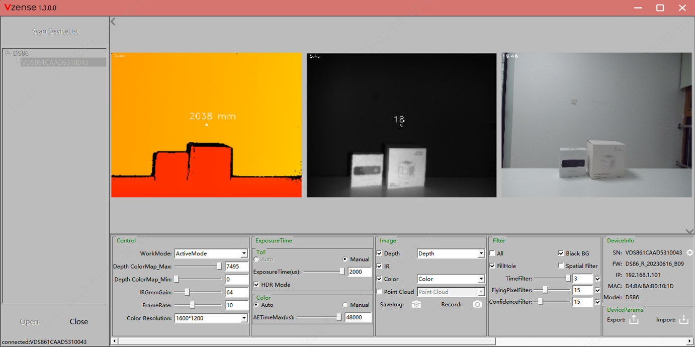

# 1. 概述

NebulaGUITool 是基于 Nebula SDK 开发的图形界面工具，提供 Depth 图像彩色映射显示、3D 点云显示、滤波参数调节、设备参数设置以及 RGB & Depth 对齐等功能，并且可以通过设置页面对设备进行 IP 地址设置与固件升级操作。

**NebulaGUITool** 下载链接：

<https://gitee.com/Vzense/NebulaGUITool>

目前 NebulaGUITool 支持的产品有：

- DS86 & DS87

- DS77 Lite/Pro

- DS77C Lite/Pro
