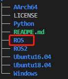
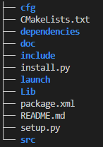
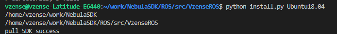
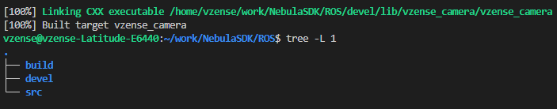
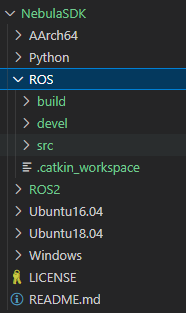
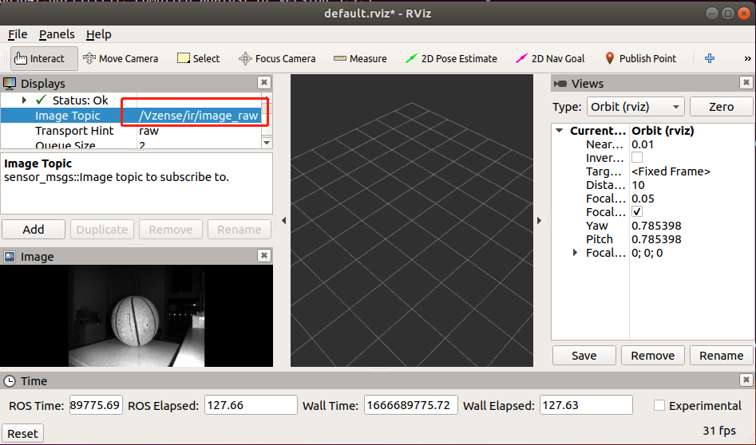
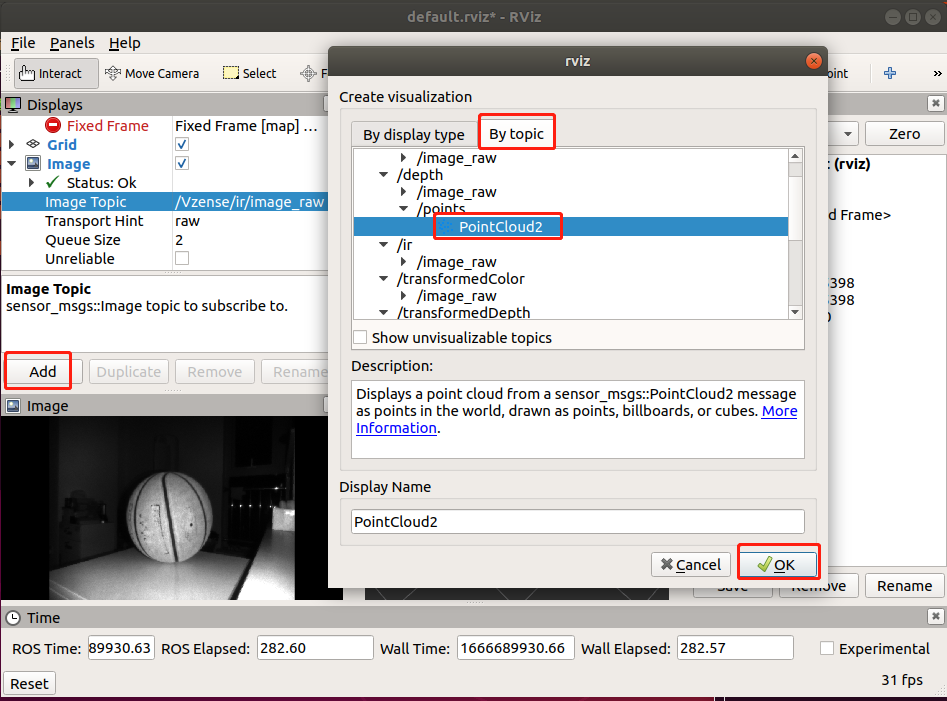
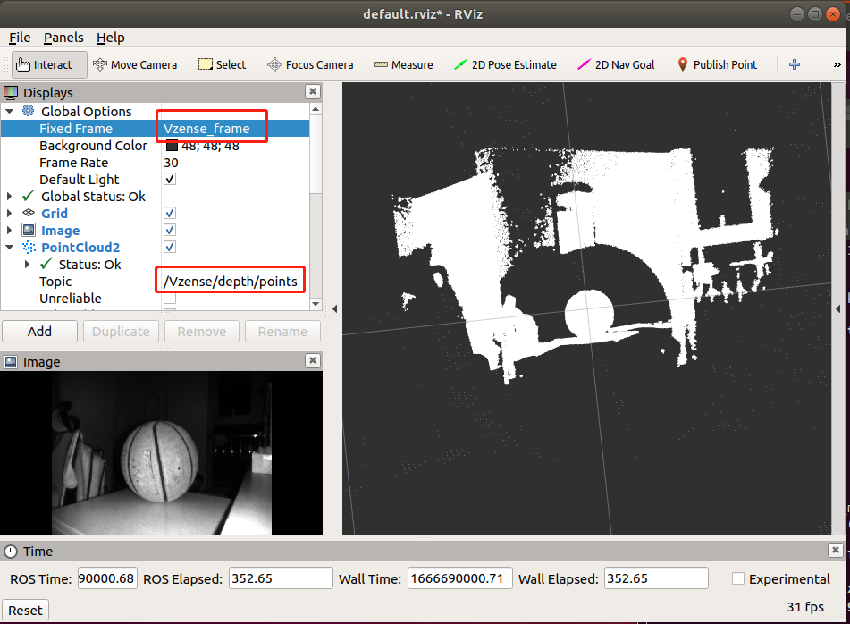
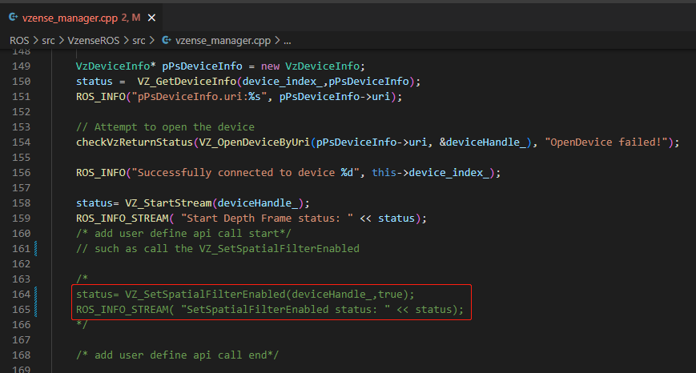

# 4.1. ROS

该 ROS 软件包可用于 NebulaSDK 的深度、IR 和 RGB 数据的采集和处理。

## 4.1.1. 环境要求

**1. 为您的操作系统安装推荐的 ROS 发行版(http://wiki.ros.org/Distributions)**

- ROS 安装页面:<http://wiki.ros.org/ROS/Installation>

- 您可以使用第三方插件*FishROS*，实现快速安装 ROS:<https://github.com/fishros/install>

**2. 已验证的版本**

| 系统        | 详情            |
| ----------- | --------------- |
| Ubuntu20.04 | Noetic Ninjemys |
| Ubuntu18.04 | Melodic Morenia |
| Ubuntu16.04 | Kinetic Kame    |
| AArch64     | Melodic         |

## 4.1.2. 安装 ROS 软件包

在 NebulaSDK 中，VzenseROS 可以用于连接单个设备，而 VzenseROS_MultiCameras 则适用于连接多个设备。

<!-- tabs:start -->

#### **ROS**

**1. 安装 NebulaSDK**

```console
git clone https://gitee.com/Vzense/NebulaSDK
```

  <div class="center">



  </div>

**2. 将 SDK 更新为 ROS 包**

```console
cd ROS/src
catkin_init_workspace
```

在运行**catkin_init_workspace**命令之后，其会在**ROS/src**文件夹下生成**CmakeLists.txt**

  <div class="center">


  </div>

```console
cd VzenseROS
```

<div class="center">



</div>

**3. install.py**: 通过命令"**python install.py (您的操作系统)**"，可以将与您操作系统匹配的**NebulaSDK**拷贝到**dependencies**文件夹中, 这里我们以**Ubuntu18.04**为例：

```console
python install.py Ubuntu18.04
```

<div class="center">



</div>

**4. 构建 VzenseROS 包**

```console
cd ../../
catkin_make -DCATKIN_WHITELIST_PACKAGES="VzenseROS"
```

<div class="center">



</div>

<div class="center">



</div>

**5. 环境设置**

```console
source devel/setup.bash
```

#### **ROS_MultiCameras**

**1. 安装 NebulaSDK**

```console
git clone https://gitee.com/Vzense/NebulaSDK
```

  <div class="center">


  </div>

**2. 将 SDK 更新为 ROS 包**

```console
cd ROS/src
catkin_init_workspace
```

在运行**catkin_init_workspace**命令之后，其会在**ROS/src**文件夹下生成**CmakeLists.txt**

  <div class="center">


  </div>

```console
cd VzenseROS_MultiCameras
```

<div class="center">


</div>

**3. install.py**: 通过命令"**python install.py (您的操作系统)**"，可以将与您操作系统匹配的**NebulaSDK**拷贝到**dependencies**文件夹中, 这里我们以**Ubuntu18.04**为例：

```console
python install.py Ubuntu18.04
```

<div class="center">


</div>

**4. 构建 VzenseROS 包**

```console
cd ../../
catkin_make -DCATKIN_WHITELIST_PACKAGES="VzenseROS_MultiCameras"
```

<div class="center">


</div>

**5. 环境设置**

```console
source devel/setup.bash
```

<!-- tabs:end -->

## 4.1.3. 使用方式

<!-- tabs:start -->

#### **ROS**

**1. 启动相机节点**

```console
roslaunch VzenseROS vzense_camera.launch
```

<div class="center">


</div>

**2. 启动 Rviz 界面**

```console
rviz
```

<div class="center">


</div>

<div class="center">



</div>

**3. 使用 RQT 动态调整配置**

```console
rosrun rqt_reconfigure rqt_reconfigure
```

<div class="center">


</div>

> **说明:**
>
> - 修改 **FrameRate** 将影响 **ToFExposureTime** 和 **RGBExposureTime** 的最大值
> - 当 **ToFExposureTime** 或 **RGBExposureTime** 设置高于最大值时，该值无效
> - **HDRMode**仅在**ToFManual**为 True 时生效
> - **ToFManual** 设置为 false 时，**HDRMode** 为 True 时无效

**4. 显示点云**

```console
roslaunch VzenseROS vzense_pointCloudxyz.launch
```

<div class="center">



</div>

<div class="center">



</div>

**5. 显示彩色点云**

```console
roslaunch VzenseROS vzense_pointCloudxyzrgb.launch
```

<div class="center">


</div>

#### **ROS_MultiCameras**

**1. 修改启动项**

**vzense_xxx.launch**支持 2 个相机。修改**camera1.lauch**和**camera2.launch**中的 ip。

<div class="center">


</div>

<div class="center">


</div>

**2. 启动相机节点**

```console
roslaunch VzenseROS_MultiCameras vzense_camera.launch
```

<div class="center">


</div>

**3. 启动 Rviz 界面**

Rviz 可以显示多个话题的界面

```console
rviz
```

<div class="center">


</div>

<div class="center">


</div>

<div class="center">


</div>

**4. 使用 RQT 动态调整配置**

```console
rosrun rqt_reconfigure rqt_reconfigure
```

<div class="center">


</div>

> **说明:**
>
> - 修改 **FrameRate** 将影响 **ToFExposureTime** 和 **RGBExposureTime** 的最大值
> - 当 **ToFExposureTime** 或 **RGBExposureTime** 设置高于最大值时，该值无效
> - **HDRMode**仅在**ToFManual**为 True 时生效
> - **ToFManual** 设置为 false 时，**HDRMode** 为 True 时无效

**5. 显示点云**

Rviz 只能显示一个话题

```console
roslaunch VzenseROS_MultiCameras vzense_pointCloudxyz.launch
```

<div class="center">


</div>

<div class="center">


</div>

<div class="center">


</div>

**6. 显示彩色点云**

Rviz 只能显示一个话题

```console
roslaunch VzenseROS_MultiCameras vzense_pointCloudxyzrgb.launch
```

<div class="center">


</div>

<!-- tabs:end -->

## 4.1.4. 发布的话题

<!-- tabs:start -->

#### **ROS**

Vzense_manager 发布由 [sensor_msgs](http://wiki.ros.org/sensor_msgs) 包定义的以下话题

- /Vzense/depth/camera_info
- /Vzense/color/image_raw
- /Vzense/depth/image_raw
- /Vzense/ir/image_raw
- /Vzense/transformedDepth/image_raw
- /Vzense/transformedColor/image_raw

#### **ROS_MultiCameras**

Vzense_manager 发布由 [sensor_msgs](http://wiki.ros.org/sensor_msgs) 包定义的以下话题

- /**nodename**/depth/camera_info
- /**nodename**/color/image_raw
- /**nodename**/depth/image_raw
- /**nodename**/ir/image_raw
- /**nodename**/transformedDepth/image_raw
- /**nodename**/transformedColor/image_raw


<!-- tabs:end -->

## 4.1.5. 编程指南

如果开发者需要设置相机参数或算法开关，请参考以下流程。
以调用**VZ_SetSpatialFilterEnabled**为例：

1. 从**dependencies/Include/VzenseNebula_api.h**查找 api

<div class="center">


</div>

2. 将代码添加到 **/src/vzense_manager.cpp**

<div class="center">



</div>

## 4.1.6. 说明

- 当使用多个网卡时，需要设置不同的 IP 网段。

<style>
.center
{
  width: auto;
  display: table;
  margin-left: auto;
  margin-right: auto;
}
</style>
