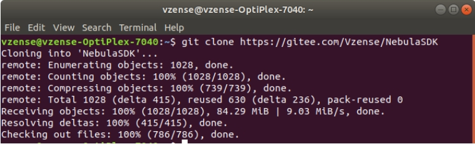
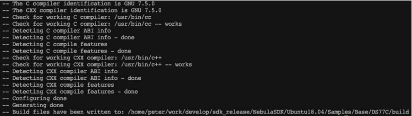
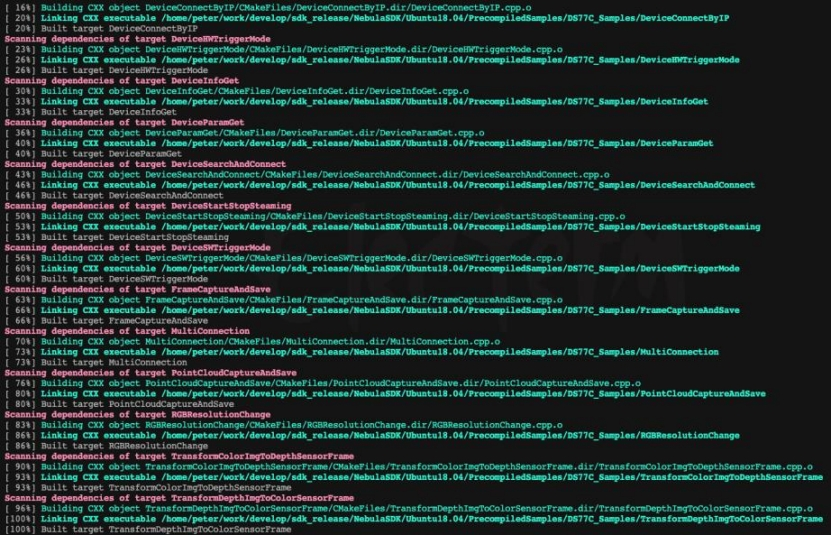
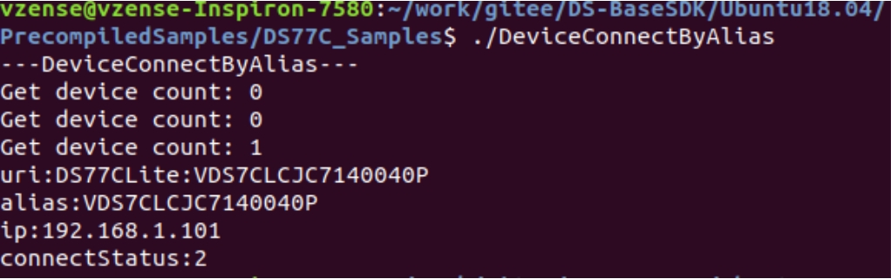
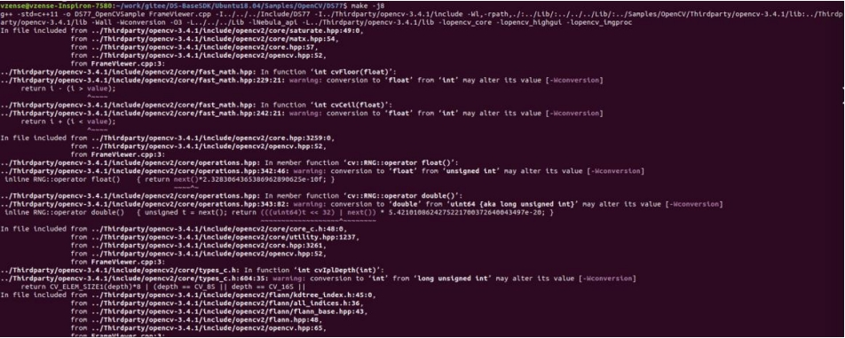
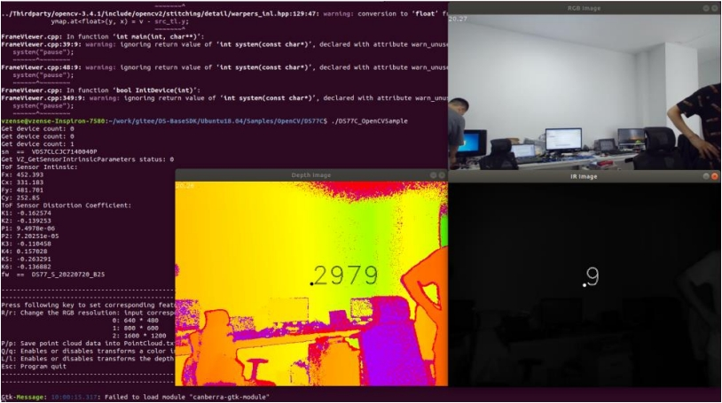

# 2.3. ArmLinux

## 2.3.1. SDK 内容

Nebula SDK 开发包提供的 Sample 用于演示 SDK 的 API 接口使用，位于 SDK 目录的 Samples 文件夹下。包含如下内容：

- Base：SDK 基础 API 调用 Sample 集合

- OpenCV：配合第三方库 OpenCV 的 Sample

## 2.3.2. 项目配置

使用 Nebula SDK 开发新的项目，需要在 CMakeList 中将 SDK 中的 Include 目录加入到包含路径，将 Lib/x64 目录加入到链接搜索路径，并链接 libNebula_api.so。具体内容可参考 Samples 中的例程配置。

## 2.3.3. 基础例程

基础例程介绍 SDK 的单个特性 API 接口的使用。为了使用户可以快速的熟悉使用，例程根据产品进行分类，如 DS86 & DS87、DS77、DS77C 等。例程包含打开图像数据流、图像获取、软/硬触发、点云转换与保存等 API 接口的使用。

1. 从 Gitee/GitHub 下载 Nebula SDK

   ```consle
    git clone https://gitee.com/Vzense/NebulaSDK
   ```

   

   **注意**：

   如果您需要将 SDK 从 Windows 设备复制到 Linux 设备，请先从 Gitee/GitHub 上下载 ZIP 文件。然后，将压缩文件复制到 Linux 设备上，再进行解压操作。

   请勿在 Windows 设备上下载并解压后，再将文件复制到 Linux 设备。

2. 根据实际产品选择对应的 sample，以 DS77C 产品编译 DeviceConnectByAlias 为例

   ```consle
   cd NebulaSDK/AArch64/Samples/Base/DS77C
   mkdir build
   cd build/
   cmake ../
   make
   ```

   
   

3. 编译完成，输出路径为 PrecompiledSamples，进入目录后运行。

   ```consle
   cd NebulaSDK/AArch64/PrecompiledSamples/DS77C_Samples/
   ./DeviceConnectByAlias
   ```

   

## 2.3.4. OpenCV 例程

OpenCV 例程用于展示如何搭配第三方库使用 Nebula SDK。例程使用 OpenCV 的图像映射功能展示彩色深度图像、IR 与 Color 图像。

1. 从 Gitee/GitHub 下载 Nebula SDK。

   ```consle
   git clone https://gitee.com/Vzense/NebulaSDK
   ```

2. 根据实际产品选择对应的 sample，以 DS77C 为例编译 OpenCV 显示例程

   ```consle
   cd NebulaSDK/AArch64/Samples/OpenCV/DS77C
   make
   ```

   

3. 运行编译成功后的 Demo

   ```consle
   ./DS77C_OpenCVSample
   ```

   

## 2.3.5. 说明

- 当使用多个网卡时，需要设置不同的 IP 网段。
