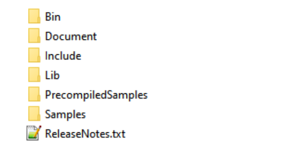
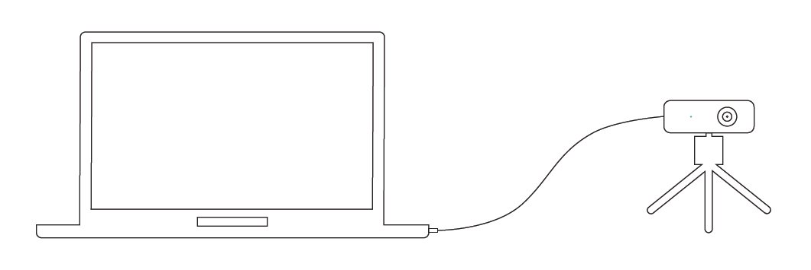
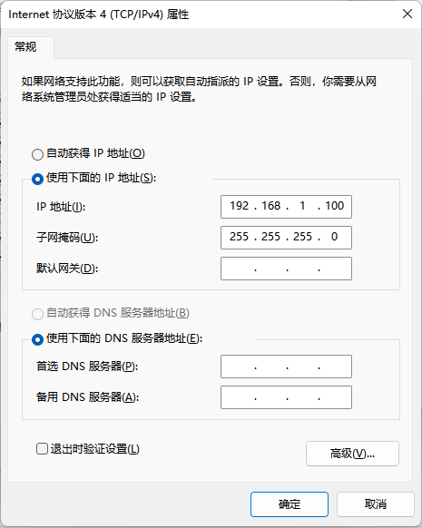
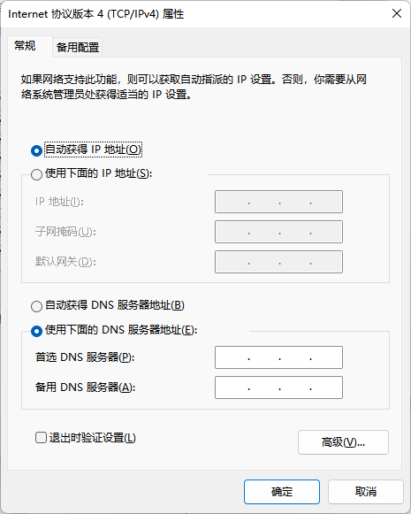
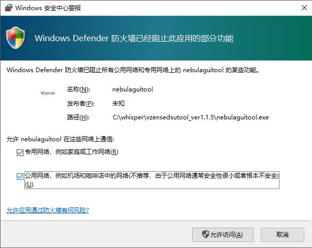

# Windows 设备连接

## 推荐系统配置

| **配置项** |                 **推荐配置**                  |
| :--------: | :-------------------------------------------: |
|  操作系统  | Win7 32/64 位 Win10 64 位 Win11 64 位 |
|    内存    |                    4g 以上                    |

## Nebula SDK 目录结构

Nebula SDK 包含 Bin，Document, Include, Lib, PrecompiledSamples, Samples 等目录。

Windows 目录结构如下图所示：

- Bin 包含 Nebula SDK 的动态链接库。
- Document 包含 Nebula SDK 的说明文档。
- Include 包含 Nebula SDK 的通用头文件。
- Lib 包含 Nebula SDK 的导出库文件。
- PrecompiledSamples 包含部分预编译实例程序，可用来预览产品的深度图像、IR 灰度图像、Color 图像。
- Samples 包含已支持产品的诸多例程：其中一部分为基础 API 调用示例；另一部分为基于 OpenCV 第三方库，进行深度图、IR 灰度图、RGB 图预览，切换等功能的示例。示例采用 VS2017 做为构建工具。

## 设备连接

_硬件模组安装示意图_

网线连接分为固定 IP 地址直连与 DHCP 连接两种方式。DS77 系列产品默认使用固定 IP 地址方式连接，如需更改 IP 地址、子网掩码、DHCP，可以使用 NebulaGUITool 进行更改。

### 固定地址

固定地址连接可以设备与电脑直连，也可以配置在同一网段的交换机中使用。

直连：一端连接设备，另一端连接 PC 主机的网线接口。设备默认 IP 为 192.168.1.101，在 PC 端将“本地连接”的，子网掩码设为 255.255.255.0，IP 地址设为同一网段（如 192.168.1.100）。

### DHCP

DHCP 连接方式，需要将相机连接在开启 DHCP 功能的路由器上，使用在相同局域网中的 PC 进行连接。设置相机 DHCP 的方法，请参考 NebulaGUITool 的文档。推荐将 PC 的“本地连接”设置为自动获取 IP 地址。

注意：

1、PC 端使用的网卡、路由器、交换机都要满足千兆要求。

2、在首次运行 NebulaGUITool 时，要为程序设置通过系统防火墙的权限，如下图所示。

