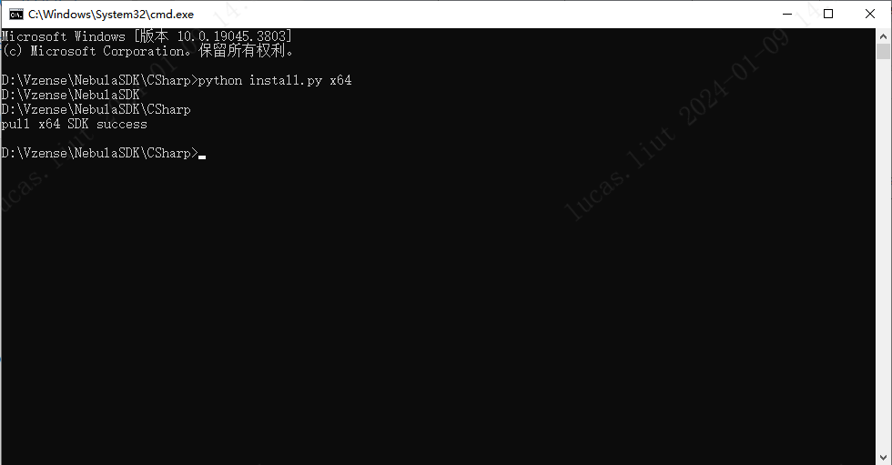
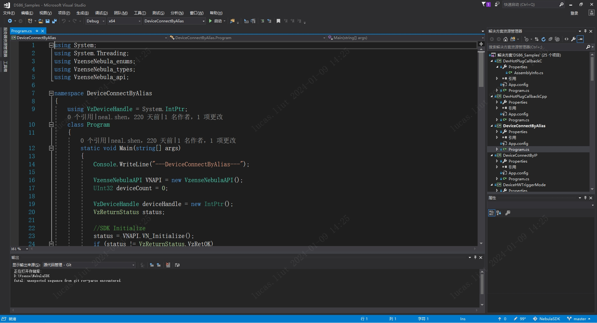
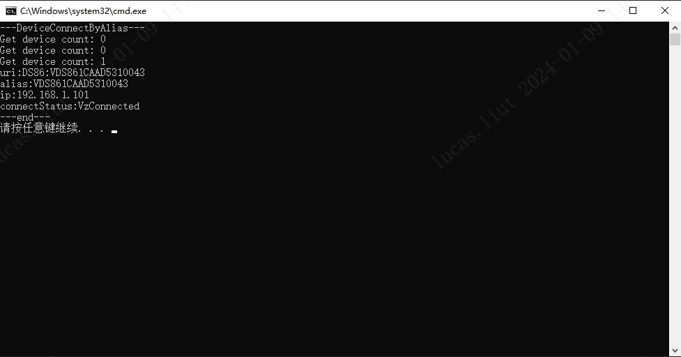

# 3.2 CSharp

## 3.2.1. SDK Sample 内容

Nebula SDK 开发包提供的 Sample 用于演示 SDK 的 API 接口使用，位于 SDK 目录的 Samples 文件夹下。包含如下内容：

- Samples：SDK 基础 API 调用 Sample 集合

## 3.2.2. 项目配置

Windows 下使用 Visual Studio 2017 开发，需要.NET Framework 为 4.6.x 版本。可按照以下步骤构建 CSharp 依赖的库环境。

**1. 安装 NebulaSDK**

```console
git clone https://gitee.com/Vzense/NebulaSDK.git
```


**2. 构建 CSharp 依赖的库环境**

项目支持**x64**和**x86**，需要将相应的文件复制到'Bin/x64'或'Bin/x86'。 以**x64**为例：

- 方法一:

  手动将**NebulaSDK/Windows/Bin/x64**中的所有文件复制到**NebulaSDK/C#/Bin/x64**

- 方法二:

  运行**NebulaSDK/C#/install.py**

  ```console
  python install.py x64
  ```

  

## 3.2.3. 基础例程

基础例程介绍 SDK 的单个特性 API 接口的使用。为了使用户可以快速的熟悉使用，例程根据产品进行分类，如 DS86 & DS87、DS77、DS77C 等。例程包含打开图像数据流、图像获取、软/硬触发、点云转换与保存等 API 接口的使用。

1. 从 Gitee/GitHub 下载 Nebula SDK

   ```consle
    git clone https://gitee.com/Vzense/NebulaSDK
   ```

   

2. 根据实际产品选择对应的 sample，以 DS86 产品编译 DeviceConnectByAlias 为例

   

3. 编译完成，调试运行。结果如下图：

   

## 3.2.4 说明

- NebulaSDK_CSharp.dll 是 NebulaSDK 的 CSharp 动态库
- 当使用多个网卡时，需要设置不同的 IP 网段。
