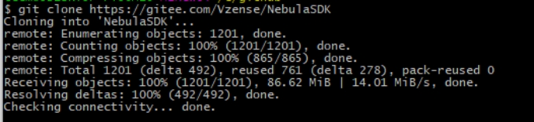
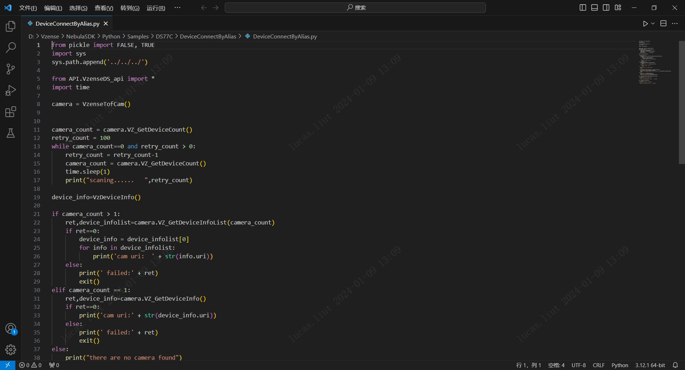
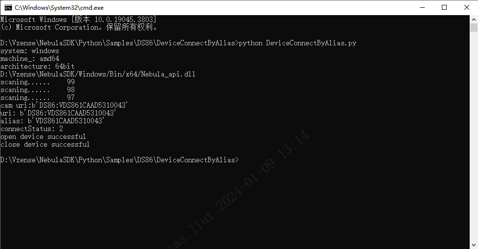
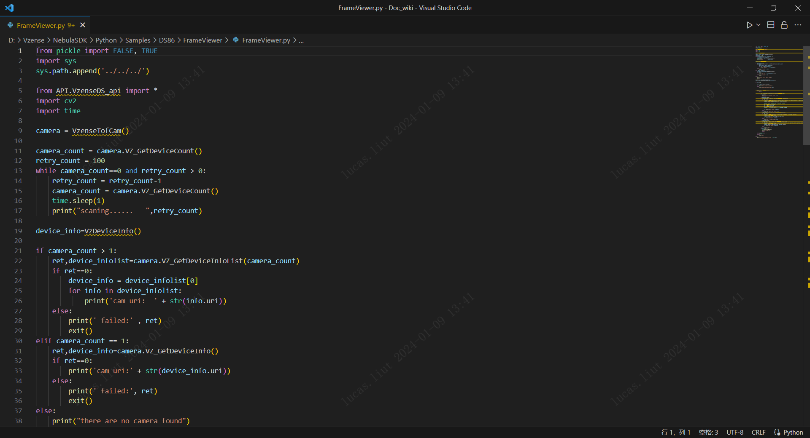
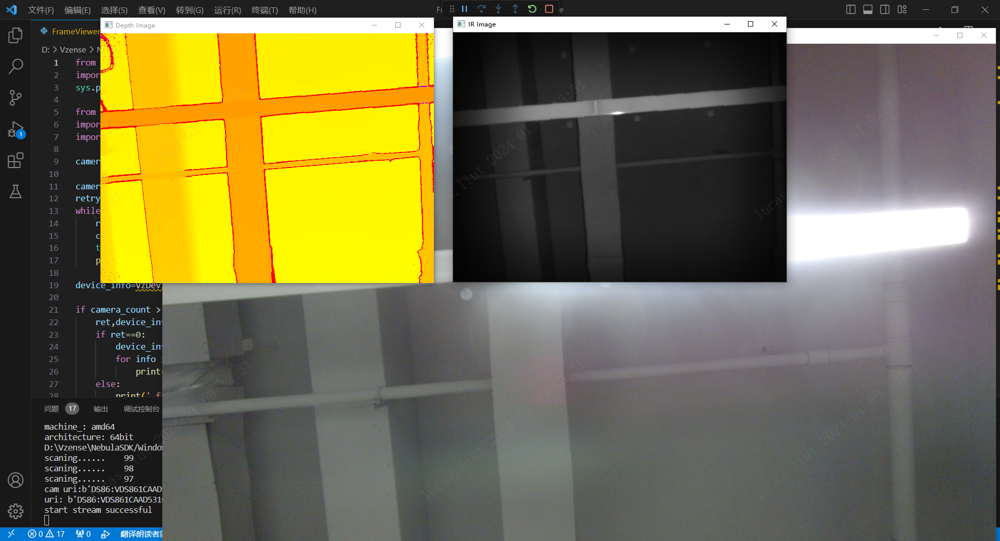

# 3.1. Python

## 3.1.1. SDK Sample 内容

Nebula SDK 开发包提供的 Sample 用于演示 SDK 的 API 接口使用，位于 SDK 目录的 Samples 文件夹下。包含如下内容：

- Samples：SDK 基础 API 调用 Sample 集合

- Samples/FrameViewer：配合第三方库 OpenCV 的 Sample

## 3.1.2. 项目配置

在运行 NebluaSDK 之前，请确保您的 Python 版本为 3.7.x 或更高版本，并已安装 ctypes、numpy 模块。

```console
pip install numpy
```

使用 Nebula SDK 开发新的项目，需要使用英文路径。针对不同的操作系统，需要同时复制 SDK 中的 Python 文件夹和对应系统的文件夹。API 文件夹中的 VzenseDS_api.py 会自动读取相机的 libNebula_api.so 或 Nebula_api.dll 库文件。

## 3.1.3. 基础例程

基础例程介绍 SDK 的单个特性 API 接口的使用。为了使用户可以快速的熟悉使用，例程根据产品进行分类，如 DS86 & DS87、DS77、DS77C 等。例程包含打开图像数据流、图像获取、软/硬触发、点云转换与保存等 API 接口的使用。

1. 从 Gitee/GitHub 下载 Nebula SDK

   ```consle
   git clone https://gitee.com/Vzense/NebulaSDK
   ```

   

2. 根据实际产品选择对应的 sample，以 DS86 产品编译 DeviceConnectByAlias 为例

   

3. 编译完成，调试运行。

   ```consle
   cd NebulaSDK\Python\Samples\DS86\DeviceConnectByAlias
   python DeviceConnectByAlias.py
   ```

   结果如下图：

   

## 3.1.4. OpenCV 例程

OpenCV 例程用于展示如何搭配第三方库使用 Nebula SDK。例程使用 OpenCV 的图像映射功能展示彩色深度图像、IR 与 Color 图像。

1. 从 Gitee/GitHub 下载 Nebula SDK。

   ```consle
   git clone https://gitee.com/Vzense/NebulaSDK
   ```

2. 安装 opencv-python 模块。

   ```console
   pip install opencv-python
   ```

3. 根据实际产品选择对应的 sample，以 DS86 为例

   

4. 运行 OpenCV 显示例程

   ```consle
   cd NebulaSDK\Python\Samples\DS86\FrameViewer
   python FrameViewer.py
   ```

   

## 3.1.5. 说明

- 当使用多个网卡时，需要设置不同的 IP 网段。
