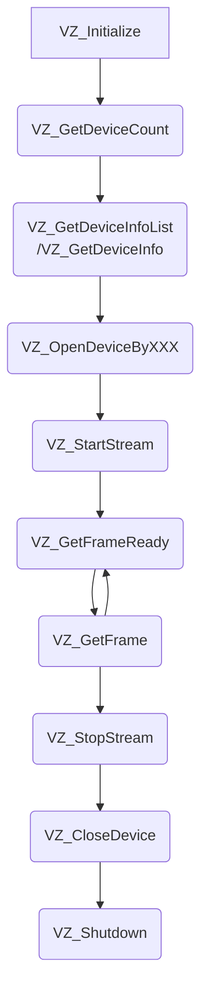

# SDK 接口介绍

## 接口调用流程



Nebula SDK 的 API 接口调用流程，请参考如下流程图：

1. VZ_Initialize 和 VZ_Shutdown

   VZ_Initialize：初始化 SDK。

   VZ_Shutdown：注销 SDK，释放 SDK 创建的所有资源。

2. VZ_GetDeviceCount、VZ_GetDeviceInfoList/VZ_GetDeviceInfo

   VZ_GetDeviceCount：获取当前连接的设备数，请确保此接口返回的设备数量大于 0，再进行后续接口的调用。

   VZ_GetDeviceInfoList / VZ_GetDeviceInfo：获取当前连接的设备信息。

3. VZ_OpenDeviceByXXX 和 VZ_CloseDevice

   VZ_OpenDeviceByXXX：打开指定的深度摄像头设备，支持使用 URI、别名、IP 地址三种方式打开相机；

   VZ_CloseDevice：关闭指定设备。

4. VZ_StartStream 和 VZ_StopStream

   VZ_StatrStream：打开指定设备图像数据流；

   VZ_StopStream：关闭指定设备图像数据流。

5. VZ_GetFrameReady 和 VZ_GetFrame

   在图像处理的主循环里，每次先调用 VZ_GetFrameReady 采集一帧图像，然后再调用 VZ_GetFrame 获取指定图像类型的一帧图像数据。

6. Set 和 Get

   SDK 提供了丰富的 Set 和 Get 类型的接口，以便设置与获取相机属性、参数和数据等各类功能，详见 API 介绍部分

## 接口介绍

### Enum 数据类型

#### 1.VzFrameType

**功能：**

图像类型。

_PS:不同型号产品对应的枚举值个数可能不同，请以具体型号文件夹下定义为准。_

**枚举值：**

- VzDepthFrame：表示深度图像类型
- VzIRFrame：表示灰度图像类型
- VzColorFrame：表示彩色图像类型
- VzTransformColorImgToDepthSensorFrame：表示映射到深度传感器空间的彩色图像类型
- VzTransformDepthImgToColorSensorFrame：表示映射到彩色传感器空间的深度图像类型
- VzConfidenceFrame：表示激光强度图像

#### 2.VzPixelFormat

**功能：**

图像数据的像素类型。

_PS:不同型号产品对应的枚举值个数可能不同，请以具体型号文件夹下定义为准。_

**枚举值：**

- VzPixelFormatDepthMM16：表示每个像素数据为 16 位的深度值，单位为毫米
- VzPixelFormatGray8：表示每个像素数据为 8 位的灰度值
- VzPixelFormatRGB888：表示每个像素数据为 24 位的 RGB 值
- VzPixelFormatBGR888：表示每个像素数据为 24 位的 BGR 值

#### 3.VzSensorType

**功能：**

传感器类型。

_PS:不同型号产品对应的枚举值个数可能不同，请以具体型号文件夹下定义为准。_

**枚举值：**

- VzToFSensor：表示深度数据传感器
- VzColorSensor：表示彩色图像传感器

#### 4.VzReturnStatus

**功能：**

接口函数的返回值。

_PS:不同型号产品对应的枚举值个数可能不同，请以 Include 中具体型号文件夹下定义为准。_

**枚举值：**

- VzRetOK：表示调用成功
- VzRetNoDeviceConnected：表示当前无设备连接
- VzRetInvalidDeviceIndex：表示传入的设备序号无效
- VzRetDevicePointerIsNull：表示传入的设备指针为空
- VzRetInvalidFrameType：表示传入的图像类型无效
- VzRetFramePointerIsNull：表示传入的图像指针为空
- VzRetNoPropertyValueGet：表示无法获取当前属性值
- VzRetNoPropertyValueSet：表示无法设置当前属性值
- VzRetPropertyPointerIsNull：表示传入的指向存储属性值的缓存指针为空
- VzRetPropertySizeNotEnough：表示传入的指向存储属性值的缓存空间不足
- VzRetInvalidDepthRange：表示传入的 depth range 无效
- VzRetGetFrameReadyTimeOut：表示获取图像时超时
- VzRetInputPointerIsNull：表示传入的指针为空
- VzRetCameraNotOpened：表示相机未打开
- VzRetInvalidCameraType：表示传入的相机类型无效
- VzRetInvalidParams：表示传入的参数无效
- VzRetCurrentVersionNotSupport：表示当前版本不支持
- VzRetUpgradeImgError：表示升级相机固件失败
- VzRetUpgradeImgPathTooLong：表示传入的相机固件路径长度太长
- VzRetUpgradeCallbackNotSet：表示未设置相机升级时的回调函数
- VzRetNoAdapterConnected：表示电源适配器未连接
- VzRetReInitialized：表示重复初始化
- VzRetNoInitialized：表示未做初始化
- VzRetCameraOpened：表示相机已经打开
- VzRetCmdError：表示命令下发失败
- VzRetCmdSyncTimeOut：表示命令发送成功，但是同步匹配失败
- VzRetIPNotMatch：表示相机 IP 与主机 IP 不在同一网段
- VzRetNotStopStream：表示未打开数据流
- VzRetOthers：表示其他错误

#### 5.VzConnectStatus

**功能：**

设备连接状态。

_PS:不同型号产品对应的枚举值个数可能不同，请以 Include 中具体型号文件夹下定义为准。_

**枚举值：**

- VzConnectUNKNOWN：表示连接状态未知
- VzUnconnected：表示设备未连接
- VzConnected：表示设备已连接
- VzOpened：表示设备已被打开
- VzUpgradeUnconnected：表示设备处于升级待连接状态
- VzUpgradeConnected：表示设备处于升级状态且已连接

#### 6.VzDeviceType

**功能：**

设备类型。

**枚举值：**

- VzDS86：表示 DS86 相机，使用 RJ45 接口，同时提供 ToF+RGB 数据。
- VzDS87：表示 DS87 相机，使用航空插头，同时提供 ToF+RGB 数据。
- VzDS77Lite：表示 DS77Lite 相机，使用 RJ45 接口，只提供 ToF 数据。
- VzDS77Pro：表示 DS77Pro 相机，使用航空插头，只提供 ToF 数据。
- VzDS77CLite：表示 DS77CLite 相机，使用 RJ45 接口，同时提供 ToF+RGB 数据。
- VzDS77CPro：表示 DS77CPro 相机，使用航空插头，同时提供 ToF+RGB 数据。

#### 7.VzWorkMode

**功能：**

设备工作状态。

**枚举值：**

- VzActiveMode：表示设备处于主动工作状态。此时使用 API 打开相机后，设备会主动上传图像数据。
- VzHardwareTriggerMode：表示设备处于被动工作状态。此时使用 API 打开相机后，设备在硬件触发的时候，才会上传图像数据。
- VzSoftwareTriggerMode：表示设备处于被动工作状态。此时使用 API 打开相机后，设备在软件触发的时候，才会上传图像数据。

#### 8.VzExposureControlMode

**功能：**

传感器的曝光模式。

**枚举值：**

- VzExposureControlMode_Auto：表示传感器使用自动曝光模式
- VzExposureControlMode_Manual：表示传感器使用手动曝光模式

### Struct 数据类型

#### 1.VzRGB888Pixel

**功能：**

彩色图像像素类型 RGB888。

_PS:不同型号产品可能不支持 RGB，如 DS77，请以 Include 中具体型号文件夹下定义为准。_

**成员：**

- uint8_t r：表示红色通道
- uint8_t g：表示绿色通道
- uint8_t b：表示蓝色通道

#### 2.VzBGR888Pixel

**功能：**

彩色图像像素类型 BGR888。

_PS:不同型号产品可能不支持 RGB，如 DS77，请以 Include 中具体型号文件夹下定义为准。_

**成员：**

- uint8_t b：表示蓝色通道
- uint8_t g：表示绿色通道
- uint8_t r：表示红色通道

#### 3.VzVector3f

**功能：**

3 维点坐标，单位为毫米。

**成员：**

- float x：表示 X 轴方向的坐标值
- float y：表示 Y 轴方向的坐标值
- float z：表示 Z 轴方向的坐标值

#### 4.VzVector2u16

**功能：**

2 维点坐标。

**成员：**

- float x：表示 X 轴方向的坐标值
- float y：表示 Y 轴方向的坐标值

#### 5.VzDepthVector3

**功能：**

深度图像的像素点表示。

**成员：**

- int depthX：表示图像坐标系下，X 轴方向的坐标值
- int depthY：表示图像坐标系下，Y 轴方向的坐标值
- VzDepthPixel depthZ：表示像素坐标（depthX，depthY）处的深度值，单位为毫米

#### 6.VzSensorIntrinsicParameters

**功能：**

传感器的镜头内参和畸变参数。内参通常用于点云的计算，畸变参数用于图像反畸变算法使用。

SDK 中已经实现深度图像到点云的转换及图像反畸变的功能，请参考例程使用相关接口。

**成员：**

- double fx：Focal length x (pixel)
- double fy：Focal length y (pixel)
- double cx：Principal point x (pixel)
- double cy：Principal point y (pixel)
- double k1：Radial distortion coefficient, 1st-order
- double k2：Radial distortion coefficient, 2nd-order
- double p1：Tangential distortion coefficient
- double p2：Tangential distortion coefficient
- double k3：Radial distortion coefficient, 3rd-order
- double k4：Radial distortion coefficient, 4st-order
- double k5：Radial distortion coefficient, 5nd-order
- double k6：Radial distortion coefficient, 6rd-order

#### 7.VzSensorExtrinsicParameters

**功能：**

相机外参 R 与 T，用于 depth 与 rgb 图像的对齐，参考公式如下:


**成员：**

- double rotation[9]：3×3 的旋转矩阵
- double translation[3]：3×1 平移矩阵

#### 8.VzFrame

**功能：**

图像信息。

**成员：**

- uint32_t frameIndex：表示图像帧索引号
- VzFrameType frameType：表示图像数据类型
- VzPixelFormat pixelFormat：表示像素类型
- uint8_t\* pFrameData：表示指向图像数据缓存的指针
- uint32_t dataLen：表示图像数据的长度，单位为字节
- float exposureTime：表示曝光时间，单位为微秒
- uint8_t depthRange：表示当前帧的深度范围，仅对深度图像有效
- uint16_t width：表示图像宽度
- uint16_t height：表示图像高度
- uint64_t deviceTimestamp：表示图像时间戳

#### 9.VzFrameReady

**功能：**

图像数据是否就绪（1 代表就绪，0 代表未就绪）。

**枚举值：**

- uint32_t depth : 1：表示深度图像数据是否就绪
- uint32_t ir : 1：表示灰度图像数据是否就绪
- uint32_t color : 1：表示彩色图像数据是否就绪
- uint32_t transformedColor : 1：表示对齐到深度传感器空间的彩色图像是否就绪
- uint32_t transformedDepth : 1：表示对齐到彩色传感器空间的深度图像是否就绪
- uint32_t confidence : 1：表示激光强度图像数据是否就绪
- uint32_t reserved : 26：：预留位

#### 10.VzDeviceInfo

**功能：**

设备信息。

**成员：**

- int SessionCount：表示设备中有几个深度传感器
- VzDeviceType devicetype：表示设备类型
- char uri[256]：表示设备的标识符
- char alias[64]：表示设备的别名
- char serialNumber[64]：表示设备的序列号
- char ip[17]：表示设备的 IP 地址
- VzConnectStatus status：表示设备连接状态

#### 11.VzConfidenceFilterParams

**功能：**

置信度滤波参数。

**成员：**

- bool enable：表示滤波是否打开，true 代表打开，false 代表关闭
- int threshold：表示滤波阈值

#### 12.VzFlyingPixelFilterParams

**功能：**

去飞点滤波参数。

**成员：**

- bool enable：表示滤波是否打开，true 代表打开，false 代表关闭
- int threshold：表示滤波阈值

#### 13.VzSpatialFilterParams

**功能：**

空间滤波参数。

**成员：**

- bool enable：表示滤波是否打开，true 代表打开，false 代表关闭
- int validCount：表示滤波计算时使用的参考点个数
- int threshold：表示滤波阈值
- int doCount：表示滤波执行几遍

#### 14.VzFillHoleFilterParams

**功能：**

补洞滤波参数。

**成员：**

- bool enable：表示滤波是否打开，true 代表打开，false 代表关闭
- int validCount：表示滤波计算时使用的参考点个数
- int threshold：表示滤波阈值
- int doCount：表示滤波执行几遍

#### 15.VzExposureTimeParams

**功能：**

传感器曝光参数

**成员：**

- VzExposureControlMode mode：表示传感器曝光类型
- int exposureTime：表示传感器曝光时间，单位微秒

### API 介绍

#### 1.VZ_Initialize

**函数原型：**

```
VzReturnStatus VZ_Initialize()
```

**函数功能：**

完成 SDK 初始化，需要在调用其他 API 之前先调用

**函数参数：**

无

**返回值：**

- VzRetOK：调用成功
- 其他值：调用失败

#### 2.VZ_Shutdown

**函数原型：**

```
VzReturnStatus VZ_Shutdown()
```

**函数功能：**

完成 SDK 注销，释放 SDK 使用过程中创建的所有资源。该接口调用之后，不应调用除 VZ_Initialize 之外的其他接口

**函数参数：**

无

**返回值：**

- VzRetOK：调用成功
- 其他值：调用失败

#### 3.VZ_GetSDKVersion

**函数原型：**

```
const char* VZ_GetSDKVersion()
```

**函数功能：**

获取 SDK 的版本号：x.x.x

**函数参数：**

无

**返回值：**

- SDK 版本号

#### 4.VZ_GetDeviceCount

**函数原型：**

```
VzReturnStatus VZ_GetDeviceCount(uint32_t* pDeviceCount)
```

**函数功能：**

获取已连接的设备数目

**函数参数：**

uint32_t\* pDeviceCount：返回已连接的设备数目

**返回值：**

- VzRetOK：调用成功
- 其他值：调用失败

#### 5.VZ_GetDeviceInfo

**函数原型：**

```
VzReturnStatus VZ_GetDeviceInfo(uint32_t deviceIndex, VzDeviceInfo*pDevicesInfo)
```

**函数功能：**

获取指定索引号的设备信息

**函数参数：**

uint32_t deviceIndex：设备索引号

VzDeviceInfo\* pDevicesInfo：返回设备信息

**返回值：**

- VzRetOK：调用成功
- 其他值：调用失败

#### 6.GetDeviceInfoList

**函数原型：**

```
VzReturnStatus VZ_GetDeviceInfoList(uint32_t deviceCount, VzDeviceInfo* pDevicesInfoList)
```

**函数功能：**

获取 deviceCount 个数的设备信息列表

**函数参数：**

uint32_t deviceCount：需要获取信息列表的设备个数

VzDeviceInfo* pDevicesInfo：返回设备信息列表，其应该指向大小为 sizeof(VzDeviceInfo)*deviceCount 大小的缓存

**返回值：**

- VzRetOK：调用成功
- 其他值：调用失败

#### 7.VZ_OpenDeviceByUri

**函数原型：**

```
VzReturnStatus VZ_OpenDeviceByUri(const char* pURI, VzDeviceHandle* pDevice)
```

**函数功能：**

使用设备标识符打开设备

**函数参数：**

const char\* pURI：设备标识符

VzDeviceHandle\* pDevice： 打开设备成功后，返回的设备句柄

**返回值：**

- VzRetOK：调用成功
- 其他值：调用失败

#### 8.VZ_OpenDeviceByAlias

**函数原型：**

```
VzReturnStatus VZ_OpenDeviceByAlias(const char* pAlias, VzDeviceHandle* pDevice)
```

**函数功能：**

使用设备别名打开设备

**函数参数：**

const char\* pAlias：设备别名

VzDeviceHandle\* pDevice： 打开设备成功后，返回的设备句柄

**返回值：**

- VzRetOK：调用成功
- 其他值：调用失败

#### 9.VZ_OpenDeviceByIP

**函数原型：**

```
VzReturnStatus VZ_OpenDeviceByIP(const char* pIP, VzDeviceHandle* pDevice)
```

**函数功能：**

使用设备 IP 地址打开设备

**函数参数：**

const char\* pIP：设备的 IP 地址

VzDeviceHandle\* pDevice： 打开设备成功后，返回的设备句柄

**返回值：**

- VzRetOK：调用成功
- 其他值：调用失败

#### 10.VZ_CloseDevice

**函数原型：**

```
VzReturnStatus VZ_CloseDevice(VzDeviceHandle* pDevice)
```

**函数功能：**

关闭设备

**函数参数：**

VzDeviceHandle\* pDevice： 要关闭设备的句柄

**返回值：**

- VzRetOK：调用成功
- 其他值：调用失败

#### 11.VZ_StartStream

**函数原型：**

```
VzReturnStatus VZ_StartStream(VzDeviceHandle device)
```

**函数功能：**

打开数据流

**函数参数：**

VzDeviceHandle device： 要关闭数据流的设备的句柄

**返回值：**

- VzRetOK：调用成功
- 其他值：调用失败

#### 12.VZ_StopStream

**函数原型：**

```
VzReturnStatus VZ_StopStream(VzDeviceHandle device)
```

**函数功能：**

关闭数据流

**函数参数：**

VzDeviceHandle device： 要关闭数据流的设备的句柄

**返回值：**

- VzRetOK：调用成功
- 其他值：调用失败

#### 13.VZ_GetFrameReady

**函数原型：**

```
VzReturnStatus VZ_GetFrameReady(VzDeviceHandle device, uint16_t waitTime, VzFrameReady* pFrameReady)
```

**函数功能：**

获取图像就绪状态。调用函数 VZ_GetFrame 前必须调用此函数，否则无法获取图像。

**函数参数：**

VzDeviceHandle device： 设备句柄

uint16_t waitTime：允许等待图像就绪的超时时间(ms)。此值与图像的帧率有关，建议值设置为 2\*1000/fps。例如当前的帧率为 20，则建议设置 waitTime 为 2 \* 1000 / 20 = 100。如果设置 waitTime 为 40，则调用函数时可能返回 VzRetGetFrameReadyTimeOut。

VzFrameReady\* pFrameReady：返回图像的就绪状态

**返回值：**

- VzRetOK：调用成功
- 其他值：调用失败

#### 14.VZ_GetFrame

**函数原型：**

```
VzReturnStatus VZ_GetFrame(VzDeviceHandle device, VzFrameType frameType, VzFrame* pVzFrame)
```

**函数功能：**

获取指定图像类型的图像数据。调用此函数前必须调用 VZ_GetFrameReady。

**函数参数：**

VzDeviceHandle device： 设备句柄

VzFrameType frameType：待获取图像的类型

VzFrame\* pVzFrame：返回的图像数据

**返回值：**

- VzRetOK：调用成功
- 其他值：调用失败

#### 15.VZ_SetWorkMode

**函数原型：**

```
VzReturnStatus VZ_SetWorkMode(VzDeviceHandle device, VzWorkMode mode)
```

**函数功能：**

设置相机的工作模式

**函数参数：**

VzDeviceHandle device： 设备句柄

VzWorkMode mode：要设置的工作模式

**返回值：**

- VzRetOK：调用成功
- 其他值：调用失败

#### 16.VZ_GetWorkMode

**函数原型：**

```
VzReturnStatus VZ_GetWorkMode(VzDeviceHandle device, VzWorkMode* pMode)
```

**函数功能：**

获取相机的工作模式

**函数参数：**

VzDeviceHandle device： 设备句柄

VzWorkMode\* pMode：获取到的设备的工作模式

**返回值：**

- VzRetOK：调用成功
- 其他值：调用失败

#### 17.VZ_SetSoftwareSlaveTrigger

**函数原型：**

```
VzReturnStatus VZ_SetSoftwareSlaveTrigger(VzDeviceHandle device)
```

**函数功能：**

执行一次软件触发，仅当相机处于 VzSoftwareTriggerMode 时有效

**函数参数：**

VzDeviceHandle device： 设备句柄

**返回值：**

- VzRetOK：调用成功
- 其他值：调用失败

#### 18.VZ_GetSensorIntrinsicParameters

**函数原型：**

```
VzReturnStatus VZ_GetSensorIntrinsicParameters(VzDeviceHandle device, VzSensorType sensorType, VzSensorIntrinsicParameters* pSensorIntrinsicParameters)
```

**函数功能：**

获取传感器镜头的内参

**函数参数：**

VzDeviceHandle device： 设备句柄

VzSensorType sensorType：传感器类型

VzSensorIntrinsicParameters\* pSensorIntrinsicParameters：返回传感器镜头的内参

**返回值：**

- VzRetOK：调用成功
- 其他值：调用失败

#### 19.VZ_GetSensorExtrinsicParameters

**函数原型：**

```
VzReturnStatus VZ_GetSensorExtrinsicParameters(VzDeviceHandle device, VzSensorExtrinsicParameters* pSensorExtrinsicParameters)
```

**函数功能：**

获取设备的外参

**函数参数：**

VzDeviceHandle device： 设备句柄

VzSensorExtrinsicParameters\* pSensorExtrinsicParameters：返回设备的外参

**返回值：**

- VzRetOK：调用成功
- 其他值：调用失败

#### 20.VZ_GetFirmwareVersion

**函数原型：**

```
VzReturnStatus VZ_GetFirmwareVersion(VzDeviceHandle device, char* pFirmwareVersion, int length)
```

**函数功能：**

获取设备的固件版本

**函数参数：**

VzDeviceHandle device： 设备句柄

char\* pFirmwareVersion：返回设备的固件版本

int length：pFirmwareVersion 指向的缓存的字节长度

**返回值：**

- VzRetOK：调用成功
- 其他值：调用失败

#### 21.VZ_GetDeviceMACAddress

**函数原型：**

```
VzReturnStatus VZ_GetDeviceMACAddress(VzDeviceHandle device, char* pMACAddress)
```

**函数功能：**

获取设备的 MAC 地址

**函数参数：**

VzDeviceHandle device： 设备句柄

char\* pMACAddress：返回设备的 MAC 地址，其默认是一个字节长度为 18，以‘\0’结尾的字符串

**返回值：**

- VzRetOK：调用成功
- 其他值：调用失败

#### 22.VZ_SetIRGMMGain

**函数原型：**

```
VzReturnStatus VZ_SetIRGMMGain(VzDeviceHandle device, uint8_t gmmgain)
```

**函数功能：**

设置 IR 图像的数字增益

**函数参数：**

VzDeviceHandle device： 设备句柄

uint8_t gmmgain：要设置给设备的 IR 增益值

**返回值：**

- VzRetOK：调用成功
- 其他值：调用失败

#### 23.VZ_GetIRGMMGain

**函数原型：**

```
VzReturnStatus VZ_GetIRGMMGain(VzDeviceHandle device, uint8_t* pGmmgain)
```

**函数功能：**

获取 IR 图像的数字增益

**函数参数：**

VzDeviceHandle device： 设备句柄

uint8_t\* pGmmgain：返回设备的 IR 增益值

**返回值：**

- VzRetOK：调用成功
- 其他值：调用失败

#### 24.VZ_SetColorPixelFormat

**函数原型：**

```
VzReturnStatus VZ_SetColorPixelFormat(VzDeviceHandle device,VzPixelFormat pixelFormat)
```

**函数功能：**

设置彩色图像的像素格式

**函数参数：**

VzDeviceHandle device： 设备句柄

VzPixelFormat pixelFormat：要设置的彩色图像的像素格式

**返回值：**

- VzRetOK：调用成功
- 其他值：调用失败

#### 25.VZ_SetColorResolution

**函数原型：**

```
VzReturnStatus VZ_SetColorResolution(VzDeviceHandle device, int w, int h)
```

**函数功能：**

设置彩色图像的分辨率

**函数参数：**

VzDeviceHandle device： 设备句柄

int w：图像的宽

int h：图像的高

**返回值：**

- VzRetOK：调用成功
- 其他值：调用失败

#### 26.VZ_GetColorResolution

**函数原型：**

```
VzReturnStatus VZ_GetColorResolution(VzDeviceHandle device, int* pW, int* pH)
```

**函数功能：**

获取彩色图像的分辨率

**函数参数：**

VzDeviceHandle device： 设备句柄

int\* pW：返回彩色图像的图像宽

int\* pH：返回彩色图像的图像高

**返回值：**

- VzRetOK：调用成功
- 其他值：调用失败

#### 27.VZ_SetFrameRate

**函数原型：**

```
VzReturnStatus VZ_SetFrameRate(VzDeviceHandle device, int value)
```

**函数功能：**

设置设备的图像帧率，同时对深度和彩色图像生效。此接口是同步接口，耗时较长，大约需要 500ms

**函数参数：**

VzDeviceHandle device： 设备句柄

int value：要设置的目标帧率

**返回值：**

- VzRetOK：调用成功
- 其他值：调用失败

#### 28.VZ_GetFrameRate

**函数原型：**

```
VzReturnStatus VZ_GetFrameRate(VzDeviceHandle device, int* pValue)
```

**函数功能：**

获取设备的图像帧率

**函数参数：**

VzDeviceHandle device： 设备句柄

int\* pValue：返回设备的图像帧率

**返回值：**

- VzRetOK：调用成功
- 其他值：调用失败

#### 29.VZ_SetExposureControlMode

**函数原型：**

```
VzReturnStatus VZ_SetExposureControlMode(VzDeviceHandle device, VzSensorType sensorType, VzExposureControlMode controlMode)
```

**函数功能：**

设置传感器的曝光模式

**函数参数：**

VzDeviceHandle device： 设备句柄

VzSensorType sensorType：要设置曝光模式的传感器类型

VzExposureControlMode controlMode：要设置的曝光模式

**返回值：**

- VzRetOK：调用成功
- 其他值：调用失败

#### 30.VZ_GetExposureControlMode

**函数原型：**

```
VzReturnStatus VZ_GetExposureControlMode(VzDeviceHandle device, VzSensorType sensorType, VzExposureControlMode* pControlMode)
```

**函数功能：**

获取传感器的曝光模式

**函数参数：**

VzDeviceHandle device： 设备句柄

VzSensorType sensorType：要获取曝光模式的传感器类型

VzExposureControlMode controlMode：返回传感器的曝光模式

**返回值：**

- VzRetOK：调用成功
- 其他值：调用失败

#### 31.VZ_SetExposureTime

**函数原型：**

```
VzReturnStatus VZ_SetExposureTime(VzDeviceHandle device, VzSensorType sensorType, VzExposureTimeParams exposureTime)
```

**函数功能：**

设置传感器的曝光时间

深度传感器，只支持在手动曝光模式下，设置曝光时间

彩色传感器，支持在自动曝光模式下，设置最大曝光时间；支持在手动曝光模式下，设置曝光时间

**函数参数：**

VzDeviceHandle device： 设备句柄

VzSensorType sensorType：要获取曝光时间的传感器类型

VzExposureTimeParams exposureTime：要设置的曝光时间参数

**返回值：**

- VzRetOK：调用成功
- 其他值：调用失败

#### 32.VZ_GetExposureTime

**函数原型：**

```
VzReturnStatus VZ_GetExposureTime(VzDeviceHandle device, VzSensorType sensorType, VzExposureTimeParams* pExposureTime)
```

**函数功能：**

获取传感器的曝光时间

深度传感器，支持在手动曝光模式下，获取曝光时间；支持获取最大曝光时间

彩色传感器，支持在手动曝光模式下，获取曝光时间；支持获取最大曝光时间

**函数参数：**

VzDeviceHandle device： 设备句柄

VzSensorType sensorType：要获取曝光时间的传感器类型

VzExposureTimeParams\* pExposureTime：返回获取的曝光时间参数

**返回值：**

- VzRetOK：调用成功
- 其他值：调用失败

#### 33.VZ_SetTimeFilterEnabled

**函数原型：**

```
VzReturnStatus VZ_SetTimeFilterEnabled(VzDeviceHandle device, bool bEnabled)
```

**函数功能：**

设置深度图像的时域滤波开关

**函数参数：**

VzDeviceHandle device： 设备句柄

bool bEnabled：true 表示滤波打开，false 表示滤波关闭

**返回值：**

- VzRetOK：调用成功
- 其他值：调用失败

#### 34.VZ_GetTimeFilterEnabled

**函数原型：**

```
VzReturnStatus VZ_GetTimeFilterEnabled(VzDeviceHandle device, bool *pEnabled)
```

**函数功能：**

获取深度图像的时域滤波开关状态

**函数参数：**

VzDeviceHandle device： 设备句柄

bool \*pEnabled：返回滤波开关状态

**返回值：**

- VzRetOK：调用成功
- 其他值：调用失败

#### 35.VZ_SetConfidenceFilterParams

**函数原型：**

```
VzReturnStatus VZ_SetConfidenceFilterParams(VzDeviceHandle device,VzConfidenceFilterParams params)
```

**函数功能：**

设置深度图像的置信度滤波参数

**函数参数：**

VzDeviceHandle device： 设备句柄

bool \*pEnabled：返回滤波开关状态

**返回值：**

- VzRetOK：调用成功
- 其他值：调用失败

#### 36.VZ_GetConfidenceFilterParams

**函数原型：**

```
VzReturnStatus VZ_GetConfidenceFilterParams(VzDeviceHandle device, VzConfidenceFilterParams *pParams)
```

**函数功能：**

获取深度图像的置信度滤波参数

**函数参数：**

VzDeviceHandle device： 设备句柄

bool \*pEnabled：返回滤波开关状态

**返回值：**

- VzRetOK：调用成功
- 其他值：调用失败

#### 37.VZ_SetFlyingPixelFilterParam

**函数原型：**

```
VzReturnStatus VZ_SetFlyingPixelFilterParams(VzDeviceHandle device, const VzFlyingPixelFilterParams params)
```

**函数功能：**

设置深度图像的去飞点滤波参数

**函数参数：**

VzDeviceHandle device： 设备句柄

const VzFlyingPixelFilterParams params：滤波参数

**返回值：**

- VzRetOK：调用成功
- 其他值：调用失败

#### 38.VZ_GetFlyingPixelFilterParams

**函数原型：**

```
VzReturnStatus VZ_GetFlyingPixelFilterParams(VzDeviceHandle device, VzFlyingPixelFilterParams* params)
```

**函数功能：**

获取深度图像的去飞点滤波参数

**函数参数：**

VzDeviceHandle device： 设备句柄

VzFlyingPixelFilterParams\* params：滤波参数

**返回值：**

- VzRetOK：调用成功
- 其他值：调用失败

#### 39.VZ_SetFillHoleFilterParam

**函数原型：**

```
VzReturnStatus VZ_SetFillHoleFilterParams(VzDeviceHandle device, const VzFillHoleFilterParams params)
```

**函数功能：**

设置深度图像的补洞滤波参数

**函数参数：**

VzDeviceHandle device： 设备句柄

const VzFillHoleFilterParams params：滤波参数

**返回值：**

- VzRetOK：调用成功
- 其他值：调用失败

#### 40.VZ_GetFillHoleFilterParams

**函数原型：**

```
VzReturnStatus VZ_GetFillHoleFilterParams(VzDeviceHandle device, VzFillHoleFilterParams* params)
```

**函数功能：**

获取深度图像的补洞滤波参数

**函数参数：**

VzDeviceHandle device： 设备句柄

VzFillHoleFilterParams\* params：获取的滤波参数

**返回值：**

- VzRetOK：调用成功
- 其他值：调用失败

#### 41.VZ_SetSpatialFilterParams

**函数原型：**

```
VzReturnStatus VZ_SetSpatialFilterParams(VzDeviceHandle device, const VzSpatialFilterParams params)
```

**函数功能：**

设置深度图像的空间滤波参数

**函数参数：**

VzDeviceHandle device： 设备句柄

const VzSpatialFilterParams params：滤波参数

**返回值：**

- VzRetOK：调用成功
- 其他值：调用失败

#### 42.VZ_GetSpatialFilterParams

**函数原型：**

```
VzReturnStatus VZ_GetSpatialFilterParams(VzDeviceHandle device, VzSpatialFilterParams* params)
```

**函数功能：**

设置深度图像的空间滤波参数

**函数参数：**

VzDeviceHandle device： 设备句柄

VzSpatialFilterParams\* params：获取的滤波参数

**返回值：**

- VzRetOK：调用成功
- 其他值：调用失败

#### 43.VZ_SetTransformColorImgToDepthSensorEnabled

**函数原型：**

```
VzReturnStatus VZ_SetTransformColorImgToDepthSensorEnabled(VzDeviceHandle device, bool bEnabled)
```

**函数功能：**

设置彩色图像对齐到深度相机空间的开关，只有带彩色传感器的设备才支持此操作。如果打开开关，则调用 VZ_GetFrameReady 时，VzFrameReady.transformedColor 的值为 1，然后调用 VZ_GetFrame 可以得到 VzTransformColorImgToDepthSensorFrame 类型的彩色图像，其大小与深度图像大小相同。

**函数参数：**

VzDeviceHandle device：设备句柄

bool bEnabled：true 打开对齐，false 关闭对齐

**返回值：**

- VzRetOK：调用成功
- 其他值：调用失败

#### 44.VZ_GetTransformColorImgToDepthSensorEnabled

**函数原型：**

```
VzReturnStatus VZ_GetTransformColorImgToDepthSensorEnabled(VzDeviceHandle device, bool *bEnabled)
```

**函数功能：**

获取彩色图像对齐到深度相机空间的开关状态

**函数参数：**

VzDeviceHandle device： 设备句柄

bool \*bEnabled：返回开关状态

**返回值：**

- VzRetOK：调用成功
- 其他值：调用失败

#### 45.VZ_SetTransformDepthImgToColorSensorEnabled

**函数原型：**

```
VzReturnStatus VZ_SetTransformDepthImgToColorSensorEnabled(VzDeviceHandle device, bool bEnabled)
```

**函数功能：**

设置深度图像对齐到彩色相机空间的开关，只有带彩色传感器的设备才支持此操作。如果打开开关，则调用 VZ_GetFrameReady 时，VzFrameReady.transformedDepth 的值为 1，然后调用 VZ_GetFrame 可以得到 VzTransformDepthImgToColorSensorFrame 类型的深度图像，其大小与彩色图像大小相同。

**函数参数：**

VzDeviceHandle device： 设备句柄

bool bEnabled：true 打开对齐，false 关闭对齐

**返回值：**

- VzRetOK：调用成功
- 其他值：调用失败

#### 46.VZ_GetTransformDepthImgToColorSensorEnabled

**函数原型：**

```
VzReturnStatus VZ_GetTransformDepthImgToColorSensorEnabled(VzDeviceHandle device, bool *bEnabled)
```

**函数功能：**

获取深度图像对齐到彩色相机空间的开关状态

**函数参数：**

VzDeviceHandle device： 设备句柄

bool \*bEnabled：返回开关状态

**返回值：**

- VzRetOK：调用成功
- 其他值：调用失败

#### 47.VZ_TransformedDepthPointToColorPoint

**函数原型：**

```
VzReturnStatus VZ_TransformedDepthPointToColorPoint(const VzDeviceHandle device, const VzDepthVector3 depthPoint, const VzVector2u16 colorSize, VzVector2u16* pPointInColor)
```

**函数功能：**

对齐深度图像上的点到彩色图像空间，可以在彩色图像上获得与传入的深度图像坐标点相对应的点的坐标

**函数参数：**

VzDeviceHandle device： 设备句柄

const VzDepthVector3 depthPoint：深度图像的坐标点

const VzVector2u16 colorSize：彩色图像尺寸

VzVector2u16\* pPointInColor：获得的与深度图像的坐标点对应的彩色图像坐标点

**返回值：**

- VzRetOK：调用成功
- 其他值：调用失败

#### 48.VZ_ConvertDepthToPointCloud

**函数原型：**

```
VzReturnStatus VZ_ConvertDepthToPointCloud(VzDeviceHandle device, VzDepthVector3* pDepthVector, VzVector3f* pWorldVector, int32_t pointCount, VzSensorIntrinsicParameters* pSensorParam)
```

**函数功能：**

把传入的深度图像坐标点集合转换为世界坐标系点集合。世界坐标原点在深度传感器镜头中心，Z 轴垂直与设备前盖板，其正方向从设备指向远方；X 轴从深度镜头指向激光器，其正方向从设备指向远方；Y 轴垂直与设备指向地面，其正方向从设备指向远方。

**函数参数：**

VzDeviceHandle device： 设备句柄

VzDepthVector3\* pDepthVector：深度图像的坐标点的集合

VzVector3f\* pWorldVector：转换后点云的坐标点的集合

int32_t pointCount：坐标点的数目

VzSensorIntrinsicParameters\* pSensorParam：传感器内参

**返回值：**

- VzRetOK：调用成功
- 其他值：调用失败

#### 49.VZ_ConvertDepthFrameToPointCloudVector

**函数原型：**

```
VzReturnStatus VZ_ConvertDepthFrameToPointCloudVector(VzDeviceHandle device, const VzFrame* pDepthFrame, VzVector3f* pWorldVector)
```

**函数功能：**

把传入的深度图像转换为世界坐标系点集合，转换后的世界坐标系点集合的大小为 VzFrame.width \* VzFrame.height，支持 VzDepthFrame 和 VzTransformDepthImgToColorSensorFrame 图像

**函数参数：**

VzDeviceHandle device： 设备句柄

const VzFrame\* pDepthFrame：深度图像

VzVector3f\* pWorldVector：转换后点云的坐标点的集合

**返回值：**

- VzRetOK：调用成功
- 其他值：调用失败

#### 50.VZ_SetHotPlugStatusCallback

**函数原型：**

```
VzReturnStatus VZ_SetHotPlugStatusCallback(PtrHotPlugStatusCallback pCallback, const void* pUserData)
```

**函数功能：**

设置设备热拔插状态回调函数

**函数参数：**

PtrHotPlugStatusCallback pCallback： 回调函数

const void\* pUserData：用户数据，可以为空

**返回值：**

- VzRetOK：调用成功
- 其他值：调用失败
