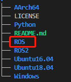
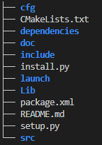
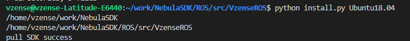
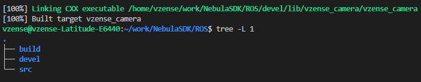
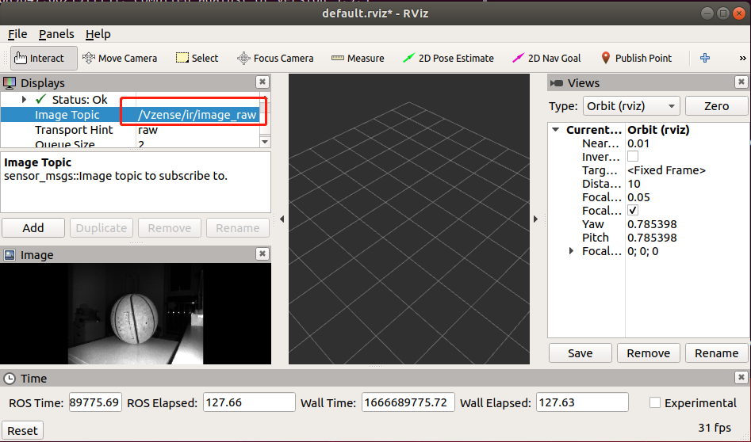
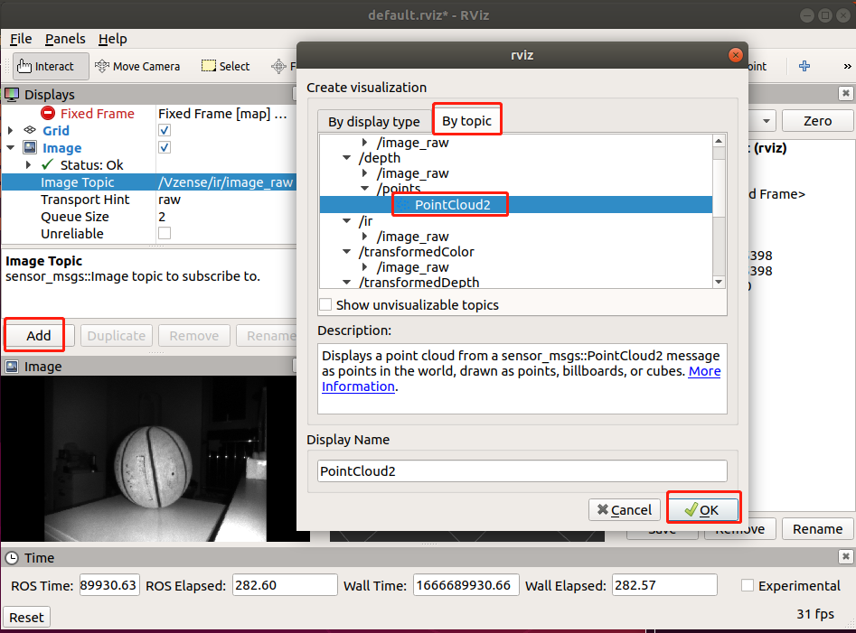
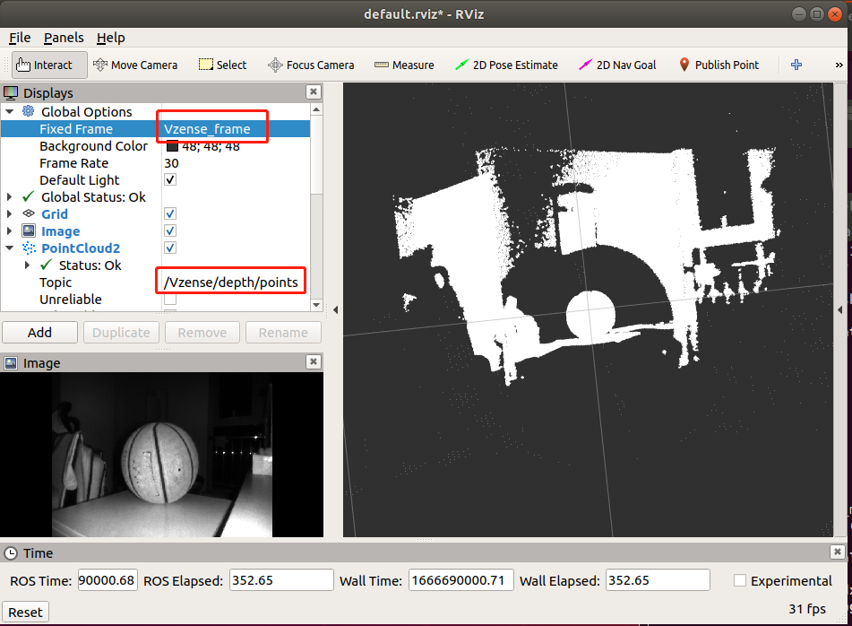
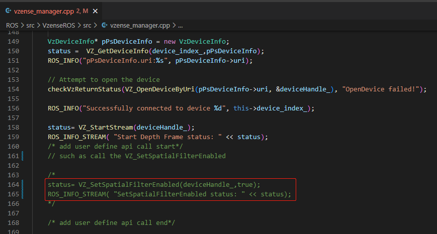

# ROS

## 概述

该 ROS 软件包可用于 NebulaSDK 的深度、IR 和 RGB 数据的采集和处理。

## 安装

- **为您的操作系统安装推荐的 [ROS 发行版](http://wiki.ros.org/Distributions)**

  - [ROS 安装页面](http://wiki.ros.org/ROS/Installation)

- **已验证的版本**
  |系统|详情|
  |---|---|
  |Ubuntu20.04|Noetic Ninjemys|
  |Ubuntu18.04|Melodic Morenia|
  |Ubuntu16.04|Kinetic Kame|
  |AArch64|Melodic|

- **安装 Vzense ROS 软件包**

  - [安装 NebulaSDK](https://gitee.com/Vzense/NebulaSDK)

    ```console
    git clone https://gitee.com/Vzense/NebulaSDK
    ```

    <div class="center">

    

    </div>

  - **将 SDK 更新为 ROS 包**

    ```console
    cd ROS/src
    catkin_init_workspace
    ```

    在运行**catkin_init_workspace**命令之后，其会在**ROS/src**文件夹下生成**CmakeLists.txt**

    <div class="center">

    

    </div>

    ```console
    cd VzenseROS
    ```

    <div class="center">

    

    </div>

- **install.py**: 通过命令"**python install.py (您的操作系统)**"，可以将与您操作系统匹配的**NebulaSDK**拷贝到**dependencies**文件夹中, 这里我们以**Ubuntu18.04**为例：

```console
python install.py Ubuntu18.04
```

<div class="center">



</div>

- **构建 VzenseROS 包**

```console
cd ../../
catkin_make -DCATKIN_WHITELIST_PACKAGES="VzenseROS"
```

<div class="center">



</div>

<div class="center">


</div>

- **环境设置**

```console
source devel/setup.bash
```

## 使用方式

- **启动相机节点**

  ```console
  roslaunch VzenseROS vzense_camera.launch
  ```

 <div class="center">


 </div>

- **启动 Rviz 界面**

```console
rviz
```

<div class="center">


</div>

<div class="center">



</div>

- **使用 RQT 动态调整配置**

```console
rosrun rqt_reconfigure rqt_reconfigure
```

<div class="center">


</div>

> **说明:**
>
> - 修改 **FrameRate** 将影响 **ToFExposureTime** 和 **RGBExposureTime** 的最大值
> - 当 **ToFExposureTime** 或 **RGBExposureTime** 设置高于最大值时，该值无效
> - **HDRMode**仅在**ToFManual**为 True 时生效
> - **ToFManual** 设置为 false 时，**HDRMode** 为 True 时无效

- **显示点云**

  ```console
  roslaunch VzenseROS vzense_pointCloudxyz.launch
  ```

<div class="center">



</div>

<div class="center">



</div>

- **显示彩色点云**

  ```console
  roslaunch VzenseROS vzense_pointCloudxyzrgb.launch
  ```

<div class="center">


</div>

## 发布的话题

Vzense_manager 发布由 [sensor_msgs](http://wiki.ros.org/sensor_msgs) 包定义的以下话题

- /Vzense/depth/camera_info
- /Vzense/color/image_raw
- /Vzense/depth/image_raw
- /Vzense/ir/image_raw
- /Vzense/transformedDepth/image_raw
- /Vzense/transformedColor/image_raw

## 编程指南

如果开发者需要设置相机参数或算法开关，请参考以下流程。
以调用**VZ_SetSpatialFilterEnabled**为例：

- 从**dependencies/Include/VzenseNebula_api.h**查找 api

<div class="center">


</div>

- 将代码添加到 **/src/vzense_manager.cpp**

<div class="center">



</div>

## 说明

- 当使用多个网卡时，需要设置不同的 IP 网段。

<style>
.center
{
  width: auto;
  display: table;
  margin-left: auto;
  margin-right: auto;
}
</style>
