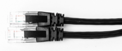

# 配件列表

## DS86 配件列表

| 编号         | 描述                            | 参考图                                |
| :----------- | :------------------------------ | :------------------------------------ |
| 814000600027 | 网线（网口转网口）- 3 米        |  |
| 814000300031 | 多功能线（航空头转 8 芯）- 2 米 |  |

## DS87 配件列表

| 编号         | 描述                                                                                                                                                               | 参考图                                   |
| :----------- | :----------------------------------------------------------------------------------------------------------------------------------------------------------------- | :--------------------------------------- |
| 814000304025 | 网线（航空头转网口）- 3 米（如需加长配件，可自行购买推荐链接：[点此购买](https://detail.tmall.com/item.htm?abbucket=10&id=672591664076&ns=1&skuId=5016380930404)） |     |
| 814000300031 | 多功能线（航空头转 8 芯）- 2 米                                                                                                                                    | 　  |

## DS77C Pro/DS77 Pro 配件列表

| 编号         | 描述                                                                                                                                                               | 参考图                                   |
| :----------- | :----------------------------------------------------------------------------------------------------------------------------------------------------------------- | :--------------------------------------- |
| 814000304025 | 网线（航空头转网口）- 3 米（如需加长配件，可自行购买推荐链接：[点此购买](https://detail.tmall.com/item.htm?abbucket=10&id=672591664076&ns=1&skuId=5016380930404)） |     |
| 814000304026 | 多功能线（航空头转 8 芯）- 2 米                                                                                                                                    | 　  |

## DS77C Lite/DS77 Lite 配件列表

| 编号         | 描述                                     | 参考图                                  |
| :----------- | :--------------------------------------- | :-------------------------------------- |
| 814000600027 | 网线（网口转网口）- 3 米                 |    |
| 814000300019 | 电源线（DC 12V\~24V） - 2 米             | 　 |
| 814000300014 | 6 芯线(非必须使用，RS485, EXT IO) - 1 米 |    |

## 推荐的 PoE+供电器

| 供应商  | 型号        |
| :------ | :---------- |
| H3C     | EWPAM2NPoE+ |
| TP LINK | TL-PoE+170S |
