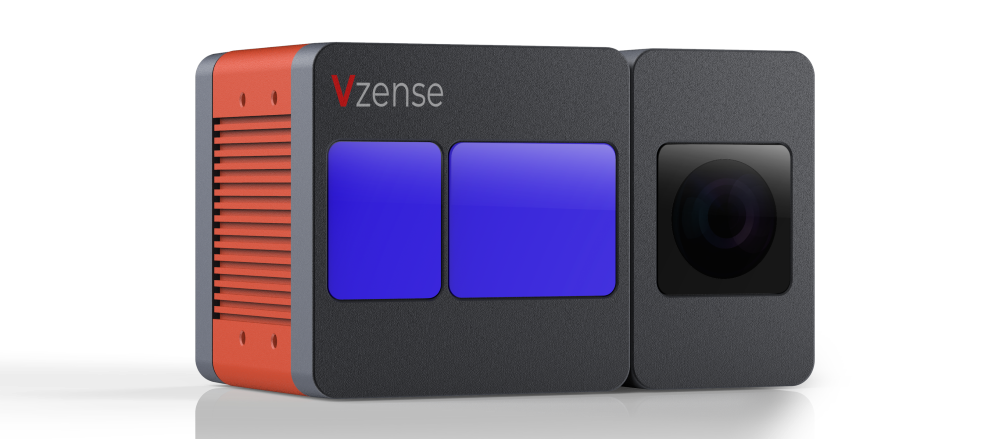
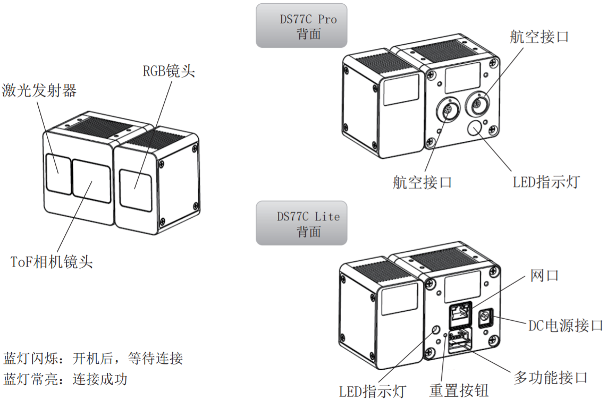
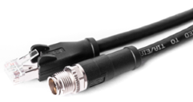
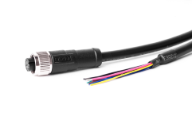
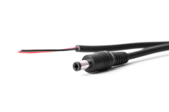
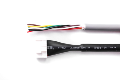

# 3. DS77C 系列



> 工业级高精度高稳定性索尼 ToF + RGB 相机



## 3.1. 规格参数

| 型号                    | DS77C PRO                              | DS77C LITE                           |
| :---------------------- | :------------------------------------- | :----------------------------------- |
| 接口示意图              |       |  |
| 编号                    | 608000200024                           | 608000200025                         |
| 传感器                  | Sony DepthSense ToF CMOS               |                                      |
| 激光发射器              | 940nm VCSEL \* 2                       |                                      |
| ToF 分辨率/帧率         | 640\*480, Max.25fps                    |                                      |
| ToF HDR 模式            | 支持最高 15fps                         |                                      |
| 视场角 FOV              | 70°(H)\*50°(V)                         |                                      |
| RGB 传感器规格          | 1600\*1200, 全局曝光, 77°(H)\*55°(V)   |                                      |
| 数据输出格式            | 16bit (Depth) + 8bit (IR) + JPEG (RGB) |                                      |
| 通信协议                | 以太网(1000M)\&RS485                   |                                      |
| 物理接口                | **M12 航空插头 x 2**                   | **RJ45**                             |
| 供电及功耗              | **PoE+ or 12V\~24V (DC)**              | **12V\~24V (DC)**                    |
| 精度误差                | <1%\*                                  |                                      |
| 检测距离                | 0.15m to 5m\*                          |                                      |
| 工作温度                | -20°C to +50°C                         |                                      |
| 操作系统与平台          | Windows/Linux/Arm Linux/ROS1/ROS2      |                                      |
| 开发语言与 Wrapper 支持 | C/C++/Python                           |                                      |
| IP 防护等级             | **IP67**                               | **IP42**                             |
| 认证和测试              | CE, FCC, FDA                           |                                      |

## 3.2. ToF FOV

#### 70°(H)\*50°(V)


```md
可覆盖宽度=𝑡𝑎𝑛⁡(𝐻𝐹𝑂𝑉/2)∗ 距离 ∗2

可覆盖高度=𝑡𝑎𝑛⁡(𝑉𝐹𝑂𝑉/2)∗ 距离 ∗2
```

在不同 FoV 配置下，相机距离物体 1, 2, 3, 4 米的情况下，可覆盖的视野范围理论计算：

| 距离(米) | 可覆盖宽度(米) | 可覆盖高度(米) |
| :------- | :------------- | :------------- |
| 1        | _1.4_          | _0.93_         |
| _2_      | _2.8_          | _1.86_         |
| _3_      | _4.2_          | _2.8_          |
| _4_      | _5.6_          | _3.73_         |

您也可以通过点击下面的链接，自己计算可覆盖范围：[覆盖距离计算](https://www.kdocs.cn/l/cvmbEWjsQuJx?from=docs&reqtype=kdocs&t=1672037944674)

## 3.3. 结构尺寸

### 3.3.1. DS77C Pro 结构尺寸


### 3.3.2. DS77C Lite 结构尺寸


## 3.4. 配件列表

### 3.4.1. DS77C Pro 配件列表

| 编号         | 描述                                                                                                                                                               | 参考图                                |
| :----------- | :----------------------------------------------------------------------------------------------------------------------------------------------------------------- | :------------------------------------ |
| 814000304025 | 网线（航空头转网口）- 3 米（如需加长配件，可自行购买推荐链接：[点此购买](https://detail.tmall.com/item.htm?abbucket=10&id=672591664076&ns=1&skuId=5016380930404)） |  |
| 814000304026 | 多功能线（航空头转 8 芯）- 2 米                                                                                                                                    |  |

### 3.4.2. DS77C Lite 配件列表

| 编号         | 描述                                     | 参考图                                |
| :----------- | :--------------------------------------- | :------------------------------------ |
| 814000600027 | 网线（网口转网口）- 3 米                 |  |
| 814000300019 | 电源线（DC 12V\~24V） - 2 米             |  |
| 814000300014 | 6 芯线(非必须使用，RS485, EXT IO) - 1 米 |  |
