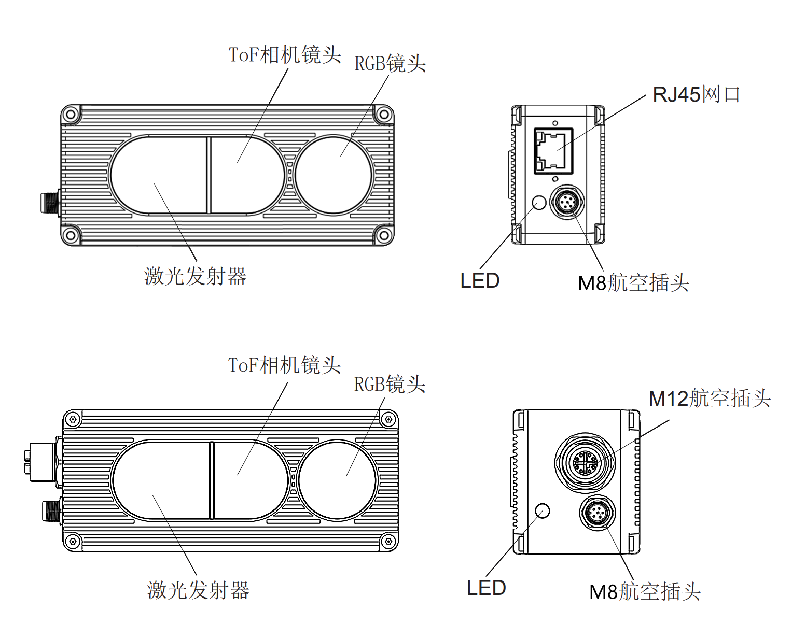

# 1. NYX650/660

工业级高帧率宽动态范围新唐 ToF + RGB 相机

## 1.1. 规格参数

| 型号                    | NYX650                                 | NYX660                    |
| :---------------------- | :------------------------------------- | :------------------------ |
| 接口示意图              |               |  |
| 编号                    | NYX650                                 | NYX660                    |
| 传感器                  | Nuvoton DepthSense ToF CMOS            |                           |
| 激光发射器              | 940nm VCSEL \* 2                       |                           |
| ToF 分辨率/帧率         | 640\*480, Max.30fps                    |                           |
| 视场角 FOV              | 70°(H)\*50°(V)                         |                           |
| RGB 传感器规格          | 1600\*1200, 全局曝光, 70°(H)\*50°(V)   |                           |
| 数据输出格式            | 16bit (Depth) + 8bit (IR) + JPEG (RGB) |                           |
| 通信协议                | 以太网(1000M)                          |                           |
| 物理接口                | **RJ45**                               | **航空插头 x 2**          |
| 供电及功耗              | **12V\~24V (DC)**                      | **PoE+ or 12V\~24V (DC)** |
| 精度误差                | <2%\*                                  |                           |
| 检测距离                | 0.3m to 4.5m\*                         |                           |
| 工作温度                | -20°C to +50°C                         |                           |
| 操作系统与平台          | Windows/Linux/Arm Linux/ROS            |                           |
| 开发语言                | C/C++/C#/Python                        |                           |
| IP 防护等级             | **IP42**                               | **IP67**                  |
| 认证和测试              | CE, FCC, FDA                           |                           |

> 精度误差与检测距离随被测物体表面反射率的不同会有差异

## 1.2. ToF FOV

### 70°(H)\*50°(V)

可覆盖宽度=𝑡𝑎𝑛⁡(𝐻𝐹𝑂𝑉/2)∗ 距离 ∗2

可覆盖高度=𝑡𝑎𝑛⁡(𝑉𝐹𝑂𝑉/2)∗ 距离 ∗2

在不同 FoV 配置下，相机距离物体 1, 2, 3, 4 米的情况下，可覆盖的视野范围理论计算：

| 距离(米) | 可覆盖宽度(米) | 可覆盖高度(米) |
| :------: | :------------: | :------------: |
|    1     |      1.53      |      1.06      |
|    2     |      3.07      |      2.13      |
|    3     |      4.60      |      3.19      |
|    4     |      6.13      |      4.25      |

您也可以通过点击下面的链接，自己计算可覆盖范围：[覆盖距离计算](https://kdocs.cn/l/cscE8i366L3C)

## 1.3. 结构尺寸

### 1.3.1. NYX650 结构尺寸

### 1.3.2. NYX660 结构尺寸

## 1.4. 配件列表

### 1.4.1. NYX650 配件列表

| 编号         | 参考图                                | 描述                            |
| :----------- | :------------------------------------ | :------------------------------ |
| 314000309438 |  | 网线（网口转网口）- 3 米        |
| 314000309436 |  | 多功能线（航空头转 6 芯）- 2 米 |

### 1.4.2. NYX660 配件列表

| 编号         | 参考图                                | 描述                                                                                                                                                                    |
| :----------- | :------------------------------------ | :---------------------------------------------------------------------------------------------------------------------------------------------------------------------- |
| 314000309437 |  | 网线（航空头转网口）- 3 米 （如需加长配件，可自行购买推荐链接：[点此购买](https://detail.tmall.com/item.htm?abbucket=10&id=672591664076&ns=1&skuId=5016380930404)） |
| 314000309436 |  | 多功能线（航空头转 6 芯）- 2 米                                                                                                                                         |
