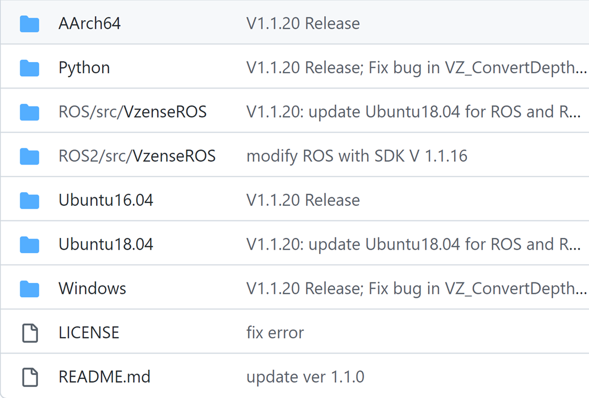
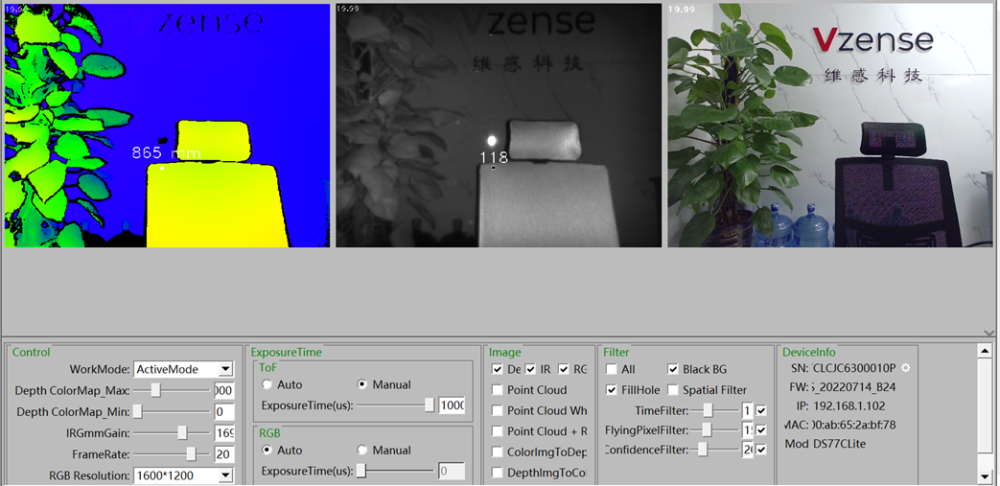

# SDK 支持

## NebulaSDK 支持

|                                                         |                                                                                                                                                                                                                                                                                                                                            |
| :------------------------------------------------------ | :----------------------------------------------------------------------------------------------------------------------------------------------------------------------------------------------------------------------------------------------------------------------------------------------------------------------------------------- |
| [NebulaGUITool](https://gitee.com/Vzense/NebulaGUITool) | NebulaGUITool 是基于 NebulaSDK 开发的图形界面工具，提供 Depth 图像彩色映射显示、3D 点云显示、滤波参数调节、设备参数设置以及 RGB & Depth 对齐等功能。                                                                                                                                                                                       |
| 操作系统与平台                                          | 支持不同操作系统和平台，例如 Windows、Ubuntu16/18/20、Arm Linux。                                                                                                                                                                                                                                                                          |
| Wrappers                                                | [Python](https://gitee.com/Vzense/NebulaSDK/tree/master/Python) API,以及以下第三方的集成: [ROS1](https://gitee.com/Vzense/NebulaSDK/tree/master/ROS/src/VzenseROS), [ROS2](https://gitee.com/Vzense/NebulaSDK/tree/master/ROS2/src/VzenseROS) ，[C#](https://gitee.com/Vzense/NebulaSDK/tree/master/CSharp)等。(Halcon，GenICam)即将推出。 |
| 代码示例                                                | 代码示例包含 SDK 支持的操作系统、平台和 wrappers。这些示例演示了如何轻松地使用 SDK，将访问相机的代码片段嵌入到您的应用程序中。                                                                                                                                                                                                             |

SDK 仍在不断完善中，添加新功能，以扩展您项目的需求， 点击 [NebulaSDK](https://gitee.com/Vzense/NebulaSDK) 查看详情或下载。

## NebulaSDK 内容一览

## NebulaGUITool

