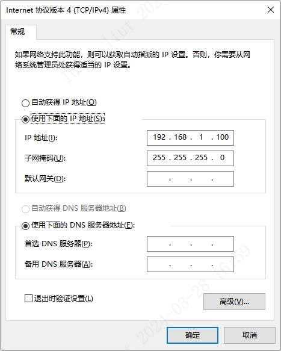
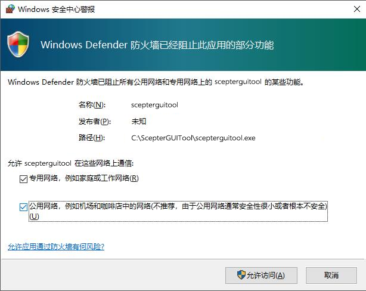
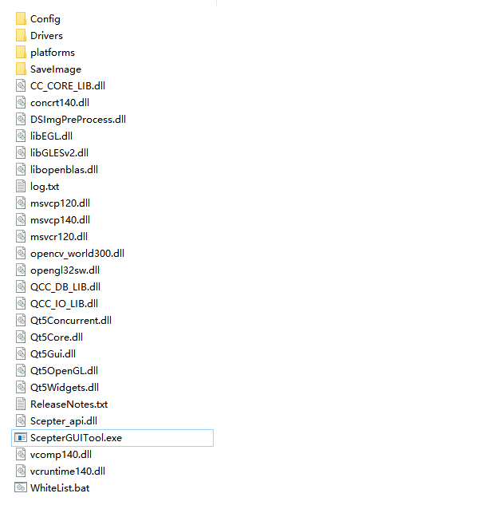
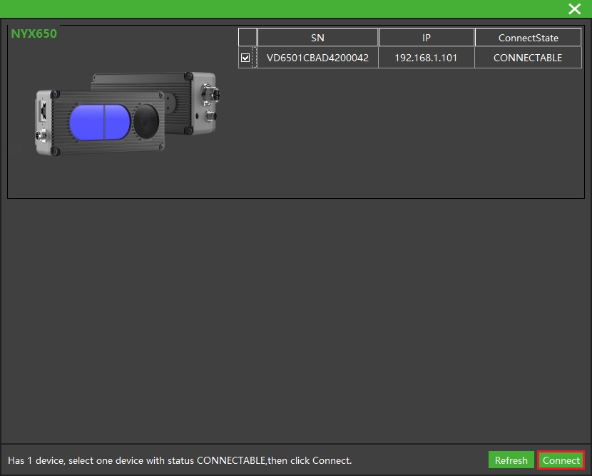
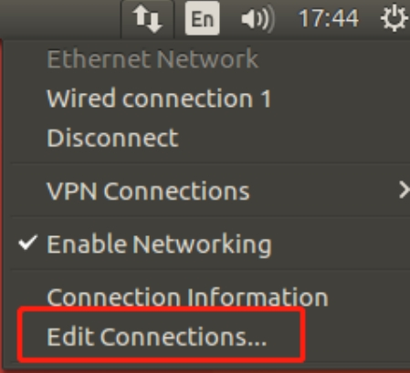
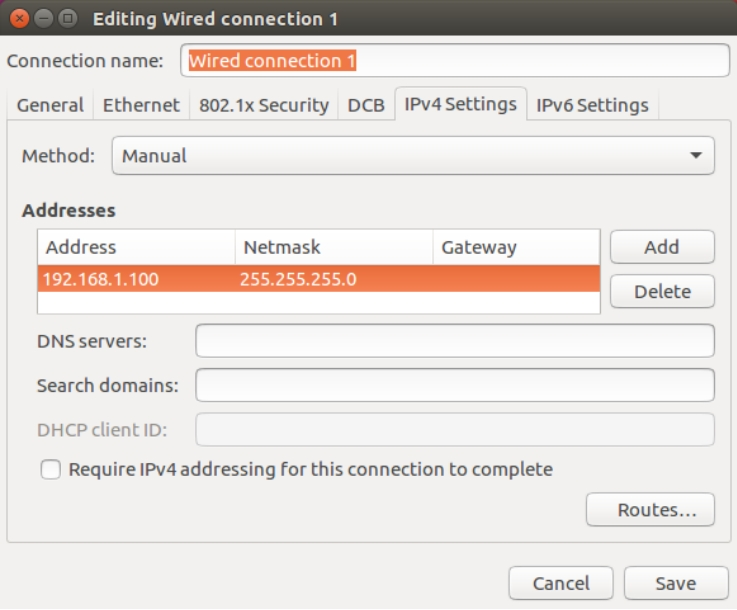

# 快速开始

<!-- tabs:start -->

#### **Windows**

1. 通过电源线或多功能线给相机提供 12~24V 电源（典型值：12V 3A），

   **DS87/DS77 Pro/DS77C Pro** 支持 PoE+供电模式，推荐使用以下 PoE+供电器：

   | 供应商  | 型号        |
   | :------ | :---------- |
   | H3C     | EWPAM2NPoE+ |
   | TP LINK | TL-PoE+170S |

2. 通过以太网线/航插网线将相机连接至主机。

   
   _硬件模组安装示意图_

3. 设置主机 IP 地址与相机在同一网段，设备默认 IP 为 **192.168.1.101**。

   设置 Windows 端的**本地连接**，子网掩码设为 255.255.255.0，

   IP 地址设为同一网段（如 192.168.1.100）。

   

   **注意：**

   1、PC 端使用的网卡、路由器、交换机都要满足**千兆**要求。

   2、在首次运行 NebulaGUITool 时，要为程序设置通过系统防火墙的权限，如下图所示。

   

4. 用户可通过下述链接下载 **NebulaGUITool**：

   <https://gitee.com/Vzense/NebulaGUITool>

   NebulaGUITool 包含 NebulaGUITool 可执行文件，用户手册文档及相关动态链接库。

   

5. 双击 NebulaGUITool 可执行文件，运行 NebulaGUITool，按照以下步骤连接设备：

   ① 搜索设备

   ② 选中设备的 SN

   ③ 点击 Open 打开设备，或者双击设备 SN 打开设备

   

6. 按照 NebulaGUITool 使用指南，开始探索相机。

#### **Ubuntu**

1. 通过电源线或多功能线给相机提供 12~24V 电源（典型值：12V 3A），

   **DS87/DS77 Pro/DS77C Pro** 支持 PoE+供电模式，推荐使用以下 PoE+供电器：

   | 供应商  | 型号        |
   | :------ | :---------- |
   | H3C     | EWPAM2NPoE+ |
   | TP LINK | TL-PoE+170S |

2. 通过以太网线/航插网线将相机连接至主机。

   
   _硬件模组安装示意图_

3. 设置 Linux 端的**本地连接**，子网掩码设为 255.255.255.0，IP 地址设为同一网段（如 192.168.1.100）。

   
   
   

   **注意：**

   PC 端使用的网卡、路由器、交换机都要满足**千兆**要求。

4. 用户可通过下述链接下载 **NebulaGUITool**，

   NebulaGUITool 支持 Ubuntu18.04(x86/x64) 及以上操作系统：

   <https://gitee.com/Vzense/NebulaGUITool>

   NebulaGUITool 包含 NebulaGUITool 可执行文件，用户手册文档及相关动态链接库。

   

5. 双击 NebulaGUITool 可执行文件，运行 NebulaGUITool，按照以下步骤连接设备：

   ① 搜索设备

   ② 选中设备的 SN

   ③ 点击 Open 打开设备，或者双击设备 SN 打开设备

   

6. 按照 NebulaGUITool 使用指南，开始探索相机。

<!-- tabs:end -->
